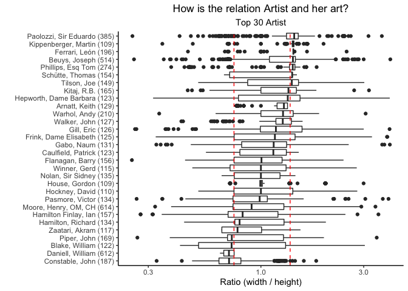

Art Collection
================

``` r
library(tidyverse)
library(tidytext)
library(tidymodels)
library(scales)
library(widyr)
library(janitor)
library(lubridate)
library(textrecipes)
library(tidylo)
library(ggrepel)
library(vip)
theme_set(theme_classic())
```

``` r
artwork <- readr::read_csv('https://raw.githubusercontent.com/rfordatascience/tidytuesday/master/data/2021/2021-01-12/artwork.csv')
artwork <- artwork %>%
    clean_names()
```

## Exploratory Data Analysis

``` r
artwork %>%
  group_by(artist) %>%
  count(sort = TRUE) %>%
  ungroup() %>%
  top_n(10) %>%
  mutate(artist = fct_reorder(artist,n)) %>%
  ggplot(aes(n,artist))+
  geom_col(alpha=.6)+
  labs(title = 'The most frequent Artist in Dataset',
       x = 'Total',
       y = '')+
  theme(plot.title = element_text(hjust = 0.5))
```

<!-- --> \*
Not is usual this \# of observation in one artist!! I need explore more
to decide how to eliminate noise!!

``` r
artwork %>%
  filter(!is.na(year),
         !is.na(medium)) %>%
  separate(medium,c('Principal_Medium','medium2'), 
           sep = " on ",
           fill = 'right',
           extra = 'merge') %>%
  group_by(Principal_Medium) %>%
  count(sort = TRUE) %>%
  ungroup() %>%
  top_n(30) %>%
  mutate(Principal_Medium = fct_reorder(Principal_Medium,n)) %>%
  ggplot(aes(n,Principal_Medium))+
  geom_errorbarh(aes(xmin=0,xmax=n),
                 height=0, 
                 alpha=0.4,
                 linetype='dashed') +
  geom_point(aes(size=n), alpha=.7)+
  labs(title = 'Top 30 to Princial  tools in medium',
       x = '# of pieces',
       y = '',
       size = '# of Freq')+
  theme(plot.title = element_text(hjust = .5))
```

<!-- -->

``` r
artwork %>%
  filter(!is.na(year),
         !is.na(medium)) %>%
  separate(medium,c('Principal_Medium','medium2'), 
           sep = " on ",
           fill = 'right',
           extra = 'merge') %>%
  group_by(artist,Principal_Medium) %>%
  count(sort = TRUE) %>%
  ungroup() %>%
  top_n(10)
```

    ## # A tibble: 11 × 3
    ##    artist                         Principal_Medium             n
    ##    <chr>                          <chr>                    <int>
    ##  1 Turner, Joseph Mallord William Graphite                 24600
    ##  2 Turner, Joseph Mallord William Watercolour               1319
    ##  3 Turner, Joseph Mallord William Graphite and watercolour  1053
    ##  4 Turner, Joseph Mallord William Chalk and graphite         592
    ##  5 Turner, Joseph Mallord William Engraving                  581
    ##  6 Turner, Joseph Mallord William Line engraving             568
    ##  7 Turner, Joseph Mallord William Pen and ink                563
    ##  8 Turner, Joseph Mallord William Gouache and watercolour    465
    ##  9 Beuys, Joseph                  Print                      378
    ## 10 Daniell, William               Aquatint                   306
    ## 11 Daniell, William               Copper plate               306

Well Joseph Mallord William is a multifaceted artist!! and for this I
think that is necessary filter her name!

``` r
artwork %>%
  filter(artist != 'Turner, Joseph Mallord William',
         !is.na(year),
         !is.na(medium)) %>%
  separate(medium,c('Principal_Medium','medium2'), 
           sep = " on ",
           fill = 'right',
           extra = 'merge') %>%
  group_by(Principal_Medium) %>%
  count(sort = TRUE) %>%
  ungroup() %>%
  top_n(30) %>%
  mutate(Principal_Medium = fct_reorder(Principal_Medium,n)) %>%
  ggplot(aes(n,Principal_Medium))+
  geom_errorbarh(aes(xmin=0,xmax=n),
                 height=0, 
                 alpha=0.4,
                 linetype='dashed') +
  geom_point(aes(size=n), alpha=.7)+
  labs(title = 'Top 30 to Princial  tools in medium',
       subtitle = 'Without Mr Turner',
       x = '# of pieces',
       y = '',
       size = '# of Freq')+
  theme(plot.title = element_text(hjust = .5),
        plot.subtitle = element_text(hjust = .5))
```

<!-- --> Well,
now it is more reasonable!!!

But … How is conversion rate between mediums by years??

``` r
artwork %>%
  filter(artist != 'Turner, Joseph Mallord William',
         !is.na(year),
         !is.na(medium)) %>%
  ggplot(aes(year)) +
  geom_histogram()
```

<!-- -->

Well this data is inbalanced, maybe I can work until 1850 ??

``` r
artwork %>%
  filter(artist != 'Turner, Joseph Mallord William',
         !is.na(year),
         !is.na(medium),
         year>=1850) %>%
  ggplot(aes(year)) +
  geom_histogram()
```

<!-- --> It is
most robust this distribution!!!

``` r
artwork %>%
  filter(artist != 'Turner, Joseph Mallord William',
         !is.na(year),
         !is.na(medium),
         year>=1850) %>%
  separate(medium,c('Principal_Medium','medium2'), 
           sep = " on ",
           fill = 'right',
           extra = 'merge') %>%
  group_by(Principal_Medium, century = (year %/%100)*100) %>%
  count(sort = TRUE) %>%
  group_by(century) %>%
  top_n(15,n) %>%
  group_by(century) %>%
  mutate(pct =  round(n/sum(n),2)) %>%
  ggplot(aes(century,Principal_Medium,  fill = pct))+
  geom_tile()+
  geom_text(aes(label=paste0(round(pct*100,1),"%")))+
  scale_fill_gradient2(high = 'red', labels=percent)
```

<!-- -->

Some changes in this graph makes me suspect on relation between artist
and medium

``` r
artwork %>%
  filter(artist != 'Turner, Joseph Mallord William',
         !is.na(year),
         !is.na(medium),
         year>=1850,
         fct_lump(artist, 20) != "Other") %>%
  mutate(medium = fct_lump(medium, 8),
         medium = str_remove(medium, ' on.*| and.*')) %>%
  count(artist, medium, sort = TRUE) %>%
  mutate(artist = fct_reorder(artist, n, sum)) %>%
  ggplot(aes(n, artist, fill = medium)) +
  geom_col()
```

<!-- --> And
now …

``` r
artwork %>%
  filter(artist != 'Turner, Joseph Mallord William',
         !is.na(year),
         !is.na(medium),
         year>=1850) %>%
  separate(medium,c('Principal_Medium','medium2'), 
           sep = " on ",
           fill = 'right',
           extra = 'merge') %>%
   filter(fct_lump(Principal_Medium, 10) != "Other") %>%
  group_by(Decade=(year %/% 10)*10,Principal_Medium = fct_lump(Principal_Medium,10)) %>%
  count() %>%
  ggplot(aes(Decade,n,fill=Principal_Medium)) +
  geom_area()
```

<!-- --> The
origins of modern art by material are in 1910 (maybe!) with the
lithograph boom

``` r
artwork %>%
  filter(artist != 'Turner, Joseph Mallord William',
         !is.na(year),
         !is.na(medium),
         year>=1850) %>%
  filter(fct_lump(medium, 10) != "Other") %>%
  mutate(medium =  str_remove(medium,' on.*| and.*')) %>%
  group_by(Decade=(year %/% 10)*10,medium) %>%
  count() %>%
  group_by(Decade) %>%
  mutate(pct = n/sum(n)) %>%
  ungroup() %>%
  mutate(medium = fct_reorder(medium,n,sum)) %>%
  ggplot(aes(Decade,pct,fill=medium)) +
  geom_area()+
  scale_y_continuous(labels = percent) 
```

<!-- -->

``` r
artwork<- artwork %>%
    filter(artist != 'Turner, Joseph Mallord William',
           artist_role =='artist',
           !is.na(year),
           !is.na(medium),
           year>=1800,
           units=='mm') 

artwork %>%
  filter(units=='mm',
         !is.na(height),
         !is.na(width)) %>%
  mutate(area =  (height / 1000) * (width/1000),
         ratio = width/height) %>%
  group_by(Decade =  (year %/%10)*10) %>%
  summarize(median_ratio = median(ratio),
            median_area = median(area),
            n = n()) %>%
  ggplot(aes(Decade,median_ratio))+
  geom_line()+
  geom_smooth(method = 'loess')+
  geom_point(aes(size=n))+
  labs(title = 'Ratio trend by decade',
       subtitle = 'Loess regression')+
    theme(plot.title = element_text(hjust = .5),
        plot.subtitle = element_text(hjust = .5))
```

<!-- -->

``` r
Decade_area<-artwork %>%
  filter(units=='mm',
         !is.na(height),
         !is.na(width)) %>%
  mutate(area =  (height / 1000) * (width/1000),
         ratio = width/height,
         Decade = (year %/% 10)*10) %>%
  select(Decade,area) %>%
  mutate(area =  log10(area))

cor.test(Decade_area$Decade,Decade_area$area)
```

    ## 
    ##  Pearson's product-moment correlation
    ## 
    ## data:  Decade_area$Decade and Decade_area$area
    ## t = 35.934, df = 21831, p-value < 2.2e-16
    ## alternative hypothesis: true correlation is not equal to 0
    ## 95 percent confidence interval:
    ##  0.2237512 0.2487993
    ## sample estimates:
    ##       cor 
    ## 0.2363145

Well, is a weak correlation !! but with the p-value I sense that
staggered correlation

``` r
artwork %>%
  filter(units=='mm',
         !is.na(height),
         !is.na(width)) %>%
  mutate(area =  (height / 1000) * (width/1000),
         ratio = width/height,
         Decade = (year %/% 10)*10)%>%
  ggplot(aes(Decade,area,group=Decade,fill=factor(Decade),color=factor(Decade)))+
  geom_boxplot(alpha=0.4,show.legend = FALSE)+
  geom_point(alpha=.2, show.legend = FALSE)+
  scale_y_log10(label=comma)
```

<!-- -->

Yes!!! beginning of 2000 the trends to size art is most bigger!!! but is
similar to 1890. P-value never fails.

``` r
Decade_ratio<-artwork %>%
  filter(units=='mm',
         !is.na(height),
         !is.na(width)) %>%
  mutate(area =  (height / 1000) * (width/1000),
         ratio = width/height,
         Decade = (year %/% 10)*10) %>%
  select(Decade,ratio) 

cor.test(Decade_ratio$Decade,Decade_ratio$ratio)
```

    ## 
    ##  Pearson's product-moment correlation
    ## 
    ## data:  Decade_ratio$Decade and Decade_ratio$ratio
    ## t = 3.4486, df = 21831, p-value = 0.0005645
    ## alternative hypothesis: true correlation is not equal to 0
    ## 95 percent confidence interval:
    ##  0.01007268 0.03658753
    ## sample estimates:
    ##        cor 
    ## 0.02333421

This correlation should not be perceived !!!

``` r
library(glue)
artwork %>%
  filter(units=='mm',
         !is.na(height),
         !is.na(width)) %>%
  mutate(area =  (height / 1000) * (width/1000),
         ratio = width/height,
         P25 = quantile(ratio)[2],
         P75 = quantile(ratio)[4]) %>%
  extract(medium, "medium_on", " on (.*)", remove = FALSE) %>%
  filter(fct_lump(artist, 30) != "Other") %>%
  add_count(artist) %>%
  mutate(artist = glue("{ artist } ({ n })")) %>%
  mutate(artist = fct_reorder(artist, ratio)) %>%
  ggplot(aes(ratio, artist)) +
  geom_boxplot() +
    geom_vline(xintercept = c(0.7497949,1.366834),
             linetype = "dashed", 
             color = "red")+
  scale_x_log10(limits = c(.25, 4)) +
  labs(x = "Ratio (width / height)",
       y = "",
       title = "How is the relation Artist and her art?",
       subtitle = "Top 30 Artist")+
    theme(plot.title = element_text(hjust = .5),
        plot.subtitle = element_text(hjust = .5))
```

<!-- -->

## Build a Model

Goal: Understand the relation between medium and decade (changes)

``` r
 artwork %>%
  filter(units=='mm',
         !is.na(medium),
         !is.na(year)) %>%
  mutate(Decade = (year %/% 10)*10) %>%
  ungroup() %>%
  select(-year) %>%
  select(c(Decade,medium)) %>%
  unnest_tokens(word,medium) %>%
  count(word,sort = T) %>%
  anti_join(stop_words) %>%
  filter(n > 600)  %>%
  mutate(word=str_to_title(word),
         word = reorder(word, n)) %>%
  ggplot(aes(n, word)) +
  geom_col() +
  labs(y = NULL,
       title = 'Most frecuent words in Medium')
```

<!-- -->

``` r
 medium_log_odds<-artwork %>%
  filter(units=='mm',
         !is.na(medium),
         !is.na(year)) %>%
  mutate(Decade = (year %/% 10)*10) %>%
  ungroup() %>%
  select(-year) %>%
  select(c(Decade,medium)) %>%
  group_by(Decade) %>%
  unnest_tokens(word,medium) %>%
  count(word,sort = T) %>%
  anti_join(stop_words) %>%
  filter(!str_detect(word,'[0-9]'))%>%
  ungroup() %>%
  bind_log_odds(Decade,word,n) %>%
  arrange(desc(log_odds_weighted))

medium_log_odds %>%
  head() %>%
  knitr::kable(format = 'markdown')
```

| Decade | word        |    n | log\_odds\_weighted |
|-------:|:------------|-----:|--------------------:|
|   1970 | screenprint | 1779 |            66.55976 |
|   1800 | paper       |  213 |            60.19808 |
|   1960 | screenprint |  860 |            54.63731 |
|   1840 | paper       |  111 |            54.03509 |
|   2010 | screenprint |   12 |            53.94602 |
|   1870 | paper       |   79 |            53.31066 |

These are the highest log odds medium, this mediums more likely tyo come
from each decade!!!

``` r
medium_log_odds %>%
  group_by(Decade) %>%
    top_n(10, log_odds_weighted) %>%
    ungroup ()%>%
    mutate(decade = as.factor(Decade),
           word = reorder_within(word, log_odds_weighted,Decade)) %>%
    ggplot(aes(word, log_odds_weighted, fill = factor(Decade))) +
    geom_col(show.legend = FALSE) +
    scale_x_reordered()+
    facet_wrap(~Decade, scales = "free_y") +
    coord_flip() +
    scale_y_continuous(expand = c(0,0))
```

<!-- -->

``` r
medium_log_odds %>%
    filter(Decade == "1850") %>%
    top_n(30, n) %>%
    ggplot(aes(n, log_odds_weighted, label = word)) +
    geom_hline(yintercept = 0, lty = 2, 
               color = "gray50", alpha = 0.5, size = 1.2) +
    geom_text_repel() +
    geom_point() +
    scale_x_log10() +
    labs(x = "# of Mediums",
         y = "Log odds ratio, weighted by uninformative Dirichlet prior",
         title = "What are the medium tools most specific to the 1850?")
```

<!-- -->

``` r
medium_log_odds %>%
    filter(Decade == "2000") %>%
    top_n(30, n) %>%
    ggplot(aes(n, log_odds_weighted, label = word)) +
    geom_hline(yintercept = 0, lty = 2, 
               color = "gray50", alpha = 0.5, size = 1.2) +
    geom_text_repel() +
    geom_point() +
    scale_x_log10() +
    labs(x = "# of Mediums",
         y = "Log odds ratio, weighted by uninformative Dirichlet prior",
         title = "What are the medium tools most specific to the 2000?")
```

<!-- -->

``` r
tate_df  <- artwork %>%
  filter(units=='mm',
         !is.na(medium),
         !is.na(year),
         year>=1800) %>%
  mutate(Decade = (year %/% 10)*10) %>%
  mutate(medium = str_remove(medium,' on.*| and.*')) %>%
  ungroup() %>%
  select(-year) %>%
  select(c(Decade,medium)) %>%
  arrange(Decade)

set.seed(123)
tate_split <- initial_split(tate_df, strata = Decade)
tate_train <- training(tate_split)
tate_test <- testing(tate_split)
set.seed(456)
tate_folds <- vfold_cv(tate_train, strata = Decade)
tate_recipe <- recipe(Decade ~ medium, data = tate_train) %>%
    step_tokenize(medium) %>%
    step_stopwords(medium) %>%
    step_tokenfilter(medium, max_tokens = 400) %>%
    step_tfidf(medium)

sparse_bp <- hardhat::default_recipe_blueprint(composition = "dgCMatrix")

lasso_reg <- linear_reg(penalty = tune(),mixture = 1) %>%
  set_engine('glmnet')

tate_wf <- workflow() %>%
  add_recipe(tate_recipe,blueprint = sparse_bp) %>%
  add_model(lasso_reg)
```

``` r
doParallel::registerDoParallel()
lambda_grid <- grid_regular(penalty(range = c(-6,0)),levels = 30)

tate_lasso <- tune_grid(
  tate_wf,
  resamples = tate_folds,
  grid = lambda_grid
)

autoplot(tate_lasso)
```

<!-- -->

The R^2 is weak

``` r
show_best(tate_lasso, "rsq")
```

    ## # A tibble: 5 × 7
    ##   penalty .metric .estimator  mean     n std_err .config              
    ##     <dbl> <chr>   <chr>      <dbl> <int>   <dbl> <chr>                
    ## 1  0.149  rsq     standard   0.511    10 0.00554 Preprocessor1_Model26
    ## 2  0.240  rsq     standard   0.510    10 0.00559 Preprocessor1_Model27
    ## 3  0.0924 rsq     standard   0.510    10 0.00561 Preprocessor1_Model25
    ## 4  0.0574 rsq     standard   0.509    10 0.00553 Preprocessor1_Model24
    ## 5  0.386  rsq     standard   0.509    10 0.00583 Preprocessor1_Model28

With this exercise maybe can help find one reason for this output with a
classic method: heteroscedasticity!!

``` r
best_rsq <- select_best(tate_lasso, "rsq")

final_lasso <- finalize_workflow(tate_wf, best_rsq)
tate_final <- last_fit(final_lasso, tate_split)
collect_predictions(tate_final) %>%
  ggplot(aes(Decade, .pred)) +
  geom_abline(lty = 2, color = "gray50", size = 1.2) +
  geom_point(size = 1.5, alpha = 0.3) +
  coord_fixed()
```

<!-- -->

Woow we have differents distributions (probs)

``` r
mix <- collect_predictions(tate_final) %>%
  bind_cols(tate_test %>% select(medium)) %>%
  filter(abs(Decade - .pred) > 100)

mix %>%
  ggplot(aes(Decade,.pred)) +
  geom_abline(lty = 2, color = "gray50", size = 1.2) +
  geom_point(size = 1.5, alpha = 0.3) 
```

<!-- -->

Yes is heteroscedasticity

``` r
augment(tate_final) %>%
  ggplot(aes(.pred, .resid)) +
  geom_hline(yintercept = 0, lty = 2, color = "gray50", size = 1.2) +
  geom_point(size = 1.5, alpha = 0.3) +
  geom_smooth(color = "black")
```

<!-- -->
