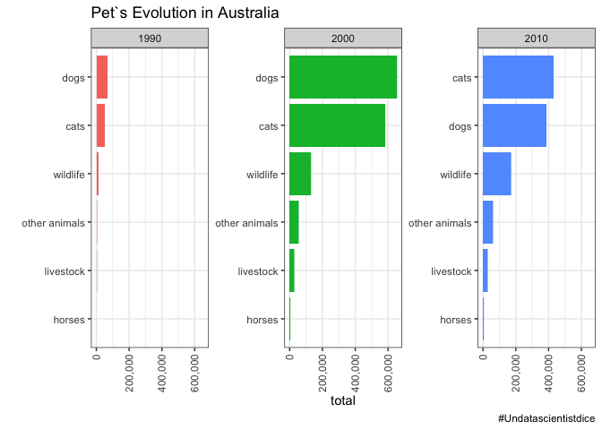
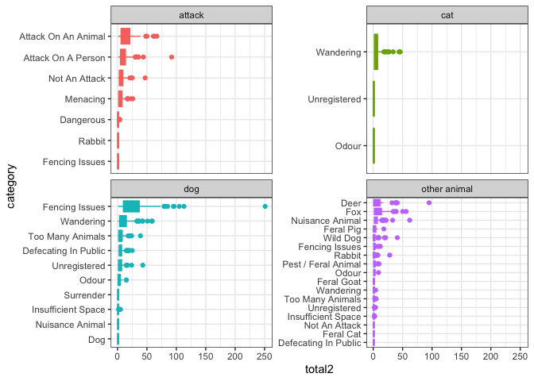

Australian Pets
================

``` r
animal_outcomes <- readr::read_csv('https://raw.githubusercontent.com/rfordatascience/tidytuesday/master/data/2020/2020-07-21/animal_outcomes.csv')
animal_complaints <- readr::read_csv('https://raw.githubusercontent.com/rfordatascience/tidytuesday/master/data/2020/2020-07-21/animal_complaints.csv')
brisbane_complaints <- readr::read_csv('https://raw.githubusercontent.com/rfordatascience/tidytuesday/master/data/2020/2020-07-21/brisbane_complaints.csv')
```

``` r
animal_by_zone<-animal_outcomes%>%
  gather(key='key',value='value',-animal_type,-outcome,-year)%>%
  filter(key!='Total')%>%
  filter(value>0)%>%
  rename(zone=key)%>%
  mutate(zone=factor(zone))%>%
  mutate(animal_type=tolower(animal_type))

animal_summarized<-animal_by_zone%>%
  mutate(decade=10 * year %/% 10)%>%
  group_by(decade,animal_type,outcome,zone)%>%
  summarize(total=sum(value))
```

    ## `summarise()` regrouping output by 'decade', 'animal_type', 'outcome' (override with `.groups` argument)

``` r
animal_summarized%>%
  filter(total>5)%>%
  ungroup()%>%
  mutate(decade=factor(decade),
         animal_type=reorder_within(animal_type,total,decade))%>%
  ggplot(aes(total,animal_type,fill=decade))+
  geom_col(show.legend = FALSE)+
  scale_y_reordered()+
  facet_wrap(~decade,scales = 'free_y')+
  scale_x_continuous(labels = scales::comma)+
  theme(axis.text.x = element_text(angle = 90, vjust = 0.5, hjust=1))+
  labs(title = 'Pet`s Evolution in Australia',
       y='',
       caption = '#Undatascientistdice')
```

<!-- -->

``` r
animal_com_sum<-animal_complaints%>%
  mutate(`Complaint Type`=as.factor(`Complaint Type`))%>%
  mutate(`Date Received`=paste(`Date Received`,1))%>%
  rename(date=(`Date Received`))%>%
  mutate(date=myd(date))%>%
  mutate(year=year(date))%>%
  mutate(decade=10* year %/% 10)%>%
  group_by(`Animal Type`,`Complaint Type`,Suburb,decade)%>%
  count(sort = TRUE)%>%
  rename(animal_type=`Animal Type`,
         total1=n,
         suburb=Suburb)%>%
  mutate(suburb=tolower(suburb))

animal_com_sum
```

    ## # A tibble: 960 x 5
    ## # Groups:   animal_type, Complaint Type, suburb, decade [960]
    ##    animal_type `Complaint Type`  suburb      decade total1
    ##    <chr>       <fct>             <chr>        <dbl>  <int>
    ##  1 dog         Wandering         unallocated   2010   3452
    ##  2 dog         Private Impound   aitkenvale    2010   1014
    ##  3 dog         Noise             kirwan        2010   1010
    ##  4 dog         Private Impound   douglas       2010    927
    ##  5 dog         Private Impound   kirwan        2010    773
    ##  6 dog         Private Impound   kelso         2010    671
    ##  7 dog         Noise             kelso         2010    609
    ##  8 dog         Enclosure         kelso         2010    578
    ##  9 dog         Private Impound   deeragun      2010    554
    ## 10 dog         Aggressive Animal kelso         2010    468
    ## # … with 950 more rows

``` r
brisbane_summarized<-brisbane_complaints%>%
  mutate(suburb=tolower(suburb),
         animal_type=tolower(animal_type))%>%
  mutate(years=gsub(".*?\\b(201[1-9])\\b.*", "\\1", date_range))%>%
  mutate(years=as.numeric(years))%>%
  mutate(decade = 10 * years %/% 10)%>%
  group_by(decade,animal_type,category,suburb)%>%
  summarize(total2=n(),
            total2=sum(total2))%>%
  na.omit()%>%
  ungroup()
```

    ## Warning: Problem with `mutate()` input `years`.
    ## x NAs introduced by coercion
    ## ℹ Input `years` is `as.numeric(years)`.

    ## Warning in mask$eval_all_mutate(dots[[i]]): NAs introduced by coercion

    ## `summarise()` regrouping output by 'decade', 'animal_type', 'category' (override with `.groups` argument)

``` r
brisbane_summarized
```

    ## # A tibble: 2,763 x 5
    ##    decade animal_type category           suburb       total2
    ##     <dbl> <chr>       <chr>              <chr>         <int>
    ##  1   2010 attack      Attack On A Person acacia ridge     36
    ##  2   2010 attack      Attack On A Person albion            1
    ##  3   2010 attack      Attack On A Person alderley         12
    ##  4   2010 attack      Attack On A Person algester         13
    ##  5   2010 attack      Attack On A Person annerley         11
    ##  6   2010 attack      Attack On A Person anstead           7
    ##  7   2010 attack      Attack On A Person ascot             5
    ##  8   2010 attack      Attack On A Person ashgrove         22
    ##  9   2010 attack      Attack On A Person aspley           30
    ## 10   2010 attack      Attack On A Person auchenflower      5
    ## # … with 2,753 more rows

``` r
brisbane_summarized%>%
  mutate(animal_type=factor(animal_type),
         category=reorder_within(category,total2,animal_type))%>%
  ggplot(aes(total2,category,color=animal_type,fill=animal_type))+
  geom_boxplot()+
  scale_y_reordered()+
  facet_wrap(~animal_type,scales='free_y')+
  guides(fill=FALSE,color=FALSE)
```

<!-- -->
