Beer Festival
================

``` r
library(tidyverse)
library(tidymodels)
library(tidytuesdayR)
library(ggrepel)
library(tidytext)
library(glue)
library(tidylo)
library(broom)
theme_set(theme_classic())
```

``` r
tuesdata <- tidytuesdayR::tt_load('2020-10-20')
```

    ## 
    ##  Downloading file 1 of 1: `beer_awards.csv`

``` r
beer_awards <- tuesdata$beer_awards%>%
  mutate(state=str_to_upper(state))%>%
  mutate(medal=fct_relevel(medal,c("Bronze","Silver")))
```

## Exploratory Data Analysis

``` r
beer_awards%>%
  count(medal,beer_name, sort = TRUE)%>%
  group_by(medal)%>%
  top_n(10)%>%
  ggplot(aes(beer_name,n,fill=medal))+
  geom_tile()+
  coord_flip()+
  labs(y='Top of total beers',
       x='Beers',
       title = 'Top Heatmap Beers')
```

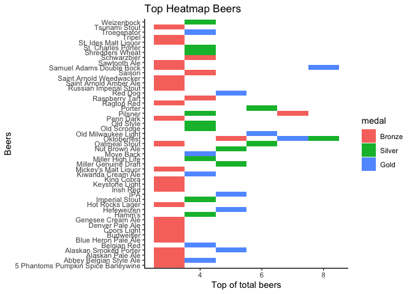<!-- -->

``` r
beer_awards%>%
  group_by(medal,brewery)%>%
  summarize(total=n())%>%
  arrange(desc(total))%>%
  top_n(10)%>%
  ungroup()%>%
  ggplot(aes(brewery,total, color=medal))+
  geom_line(group=1, show.legend = FALSE)+
  geom_point(aes(size=total, fill=medal))+
  geom_text_repel(aes(label=brewery), show.legend = FALSE)+
  coord_flip()+
  theme(axis.title.y=element_blank(),
        axis.text.y=element_blank(),
        axis.ticks.y=element_blank())
```

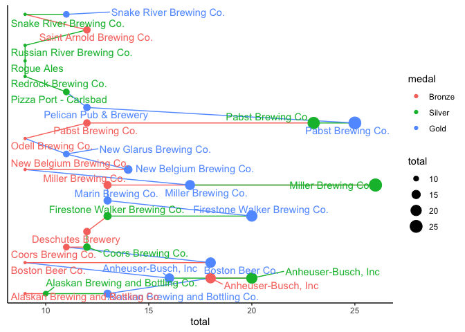<!-- -->

``` r
beer_awards%>%
  count(medal,year)%>%
  ggplot(aes(year,n,fill=medal))+
  geom_bar(stat = 'identity', position = position_dodge())+
  facet_wrap(~medal, scales = 'free')+
  guides(fill=FALSE)
```

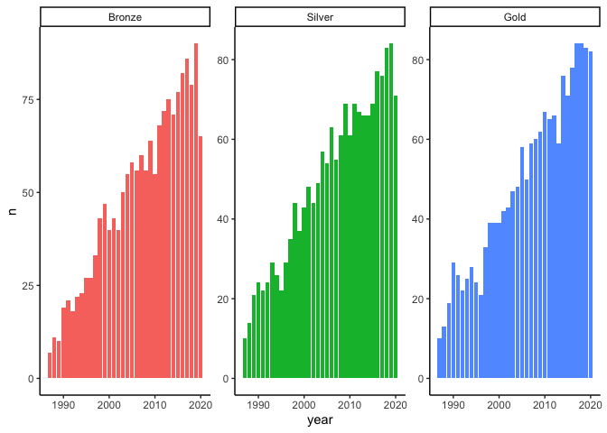<!-- -->

``` r
beer_awards%>%
  count(state,category,sort = TRUE)%>%
  group_by(state)%>%
  top_n(5,category)%>%
  ungroup()%>%
  mutate(category=factor(category),
         state=reorder_within(state,n,category))%>%
  ggplot(aes(n,state,color=category))+
  geom_point(show.legend = FALSE)+
  facet_wrap(~category, scales = 'free')+
  scale_y_reordered()
```

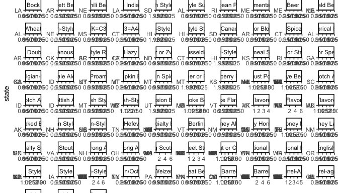<!-- -->

``` r
beer_awards%>%
  count(category,brewery, sort = TRUE)%>%
  ungroup()%>%
  head(10)%>%
  mutate(category=fct_reorder(category,n))%>%
  ggplot(aes(n,category, color=brewery))+
  geom_errorbar(aes(xmin=0,xmax=n), width=0, show.legend = FALSE)+
  geom_point(aes(size=n))+
  guides(size=FALSE)+
  labs(x='Total',
       y= 'Category',
       title = 'Top 10 of  Relation Category Beers and Brewery')
```

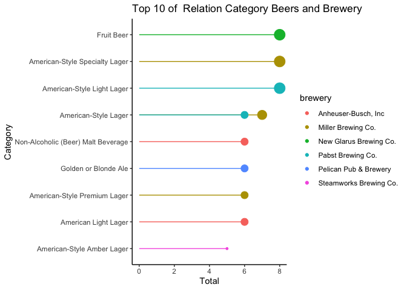<!-- -->

## What are the most - awarded beers

``` r
beers_counts<-beer_awards%>%
  count(beer_name,brewery,medal, city, state)
  
  
beers_counts %>%
  mutate(beer_name = glue("{ beer_name } ({ brewery})"))%>%
  filter(fct_lump(beer_name,12,w = n)!="Other")%>%
  mutate(beer_name=fct_reorder(beer_name,n,sum))%>%
  ggplot(aes(n, beer_name, fill=medal))+
  geom_col()+
  labs(x= '# of awards',
       y='',
       title = 'Which beers hace won the most awards?')
```

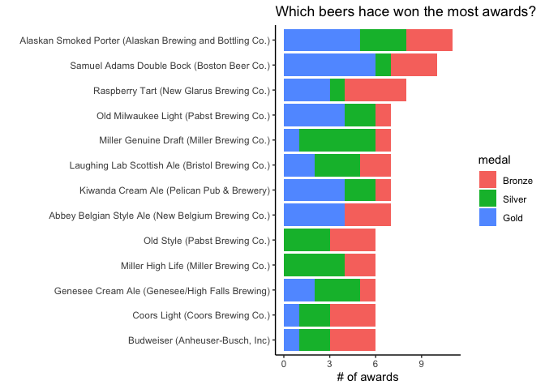<!-- -->

``` r
by_brewery<-beer_awards%>%
  group_by(brewery)%>%
  summarize(n_medals =  n(),
            n_beers= n_distinct(beer_name),
            n_gold=sum(medal=='Gold'),
            weigthed_medals = sum(as.integer(medal)))%>%
  arrange(desc(n_medals))


# beer_awards%>%
#   count(brewery,medal)%>%
#   ungroup()%>%
#   filter(fct_lump(brewery,16,w = n)!='Other')%>%
#   mutate(brewery=fct_reorder(brewery,n, sum))%>%
#   ggplot(aes(n,brewery,fill=medal))+
#   geom_col()+
#   labs(title = 'Which breweries have won the most awards?',
#        fill='',
#        y='')
```

``` r
beer_awards%>%
  group_by(medal, brewery)%>%
  summarize(total=n())%>%
  ungroup()%>%
  group_by(brewery)%>%
  mutate(perc=round(total/sum(total),2))%>%
  ungroup()%>%
  filter(fct_lump(brewery,16,w = total)!='Other')%>%
  mutate(brewery=fct_reorder(brewery,total, sum))%>%
  ggplot(aes(total,brewery,fill=medal))+
  geom_col()+
  geom_text(aes(label=paste0(perc*100,"%")),position = position_stack(vjus=.5))+
  labs(title = 'Which breweries have won the most awards?',
       fill='',
       y='')
```

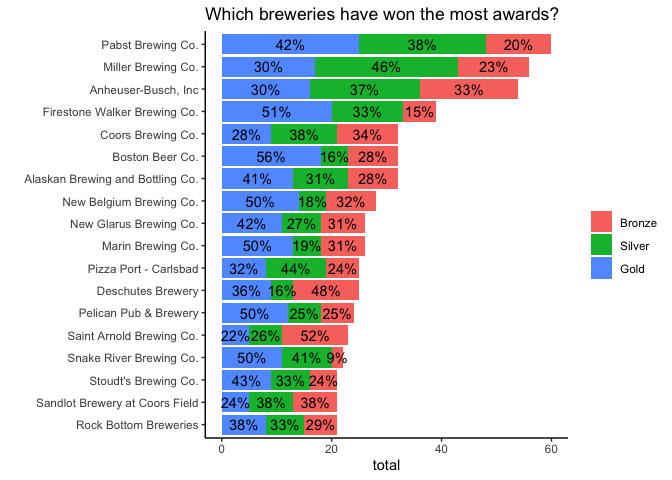<!-- -->

``` r
beer_awards%>%
  group_by(state, medal)%>%
  summarize(total=n())%>%
  ungroup()%>%
  group_by(medal)%>%
  mutate(perc=round(total/sum(total),2))%>%
  ungroup()%>%
  filter(fct_lump(state,16,w = total)!='Other')%>%
  mutate(state=fct_reorder(state,total, sum))%>%
  ggplot(aes(total,state,fill=medal))+
  geom_col()+
  labs(title = 'Which states have won the most awards?',
       fill='',
       y='')
```

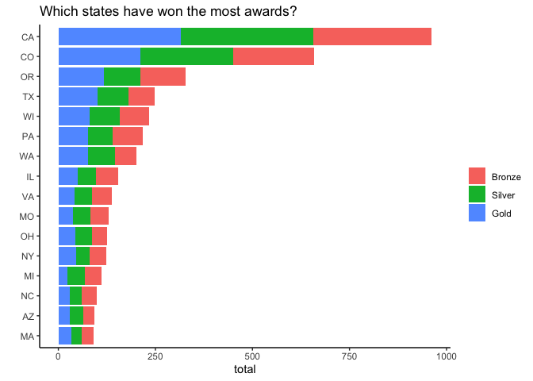<!-- -->

## State Representative per type of beers

``` r
beer_awards%>%
  mutate(state=state.name[match(state,state.abb)])%>%
  filter(fct_lump(state,9)!='Other',
         fct_lump(category,9)!='Other')%>%
  count(state,category)%>%
  complete(state,category, fill= list(n=0))%>%
  bind_log_odds(state,category,n)%>%
  mutate(category=reorder_within(category,log_odds_weighted,state))%>%
  ggplot(aes(log_odds_weighted,category, fill=log_odds_weighted>0))+
  geom_col()+
  geom_vline(xintercept = 0, color='black',linetype = "dashed")+
  facet_wrap(~state, scales='free_y')+
  scale_y_reordered()+
  guides(fill=FALSE)+
  labs(title = 'What types of beer are over - under represrnted in each state?')
```

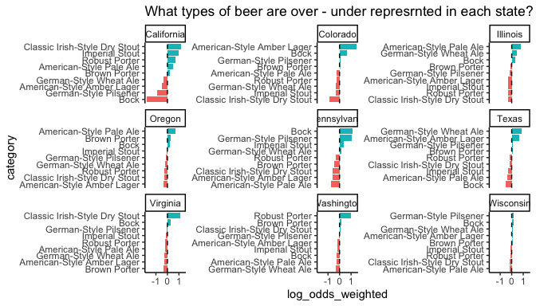<!-- -->

## Build a many models

``` r
by_year_state <- beer_awards %>%
  add_count(year, name = "year_total") %>%
  mutate(state = fct_lump(state, 10)) %>%
  count(year, state, year_total,category, sort = TRUE) %>%
  mutate(pct_year = n / year_total)%>%
  filter(state!='Other')%>%
  mutate(state=state.name[match(state,state.abb)])

top_categories<-by_year_state%>%
  count(category, sort = TRUE)%>%
  head(5)


by_year_state%>%
  filter(category %in% top_categories$category)%>%
  ggplot(aes(year,n,color=category))+
  geom_line(alpha=.7, size=1)+
  geom_point()+
  facet_wrap(~state)+
  scale_x_continuous(guide = guide_axis(angle = 90)) 
```

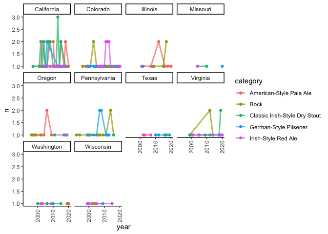<!-- -->

``` r
slopes<-by_year_state %>%
  group_by(state) %>%
  summarize(model = list(glm(cbind(n, year_total - n) ~ year, family = "binomial"))) %>%
  mutate(tidied = map(model, tidy, conf.int = TRUE))%>%
  unnest(tidied) %>%
  filter(term == "year") %>%
  mutate(p.value = p.adjust(p.value))
slopes
```

    ## # A tibble: 10 x 9
    ##    state    model term  estimate std.error statistic  p.value conf.low conf.high
    ##    <chr>    <lis> <chr>    <dbl>     <dbl>     <dbl>    <dbl>    <dbl>     <dbl>
    ##  1 Califor… <glm> year   -0.0476   0.00382    -12.5  1.22e-34  -0.0551  -0.0401 
    ##  2 Colorado <glm> year   -0.0439   0.00517     -8.50 1.72e-16  -0.0540  -0.0337 
    ##  3 Illinois <glm> year   -0.0432   0.0109      -3.97 1.45e- 4  -0.0642  -0.0215 
    ##  4 Missouri <glm> year   -0.0581   0.0103      -5.62 7.80e- 8  -0.0783  -0.0377 
    ##  5 Oregon   <glm> year   -0.0442   0.00728     -6.07 7.87e- 9  -0.0583  -0.0297 
    ##  6 Pennsyl… <glm> year   -0.0490   0.00840     -5.84 2.60e- 8  -0.0655  -0.0325 
    ##  7 Texas    <glm> year   -0.0501   0.00705     -7.10 8.57e-12  -0.0639  -0.0362 
    ##  8 Virginia <glm> year   -0.0347   0.0129      -2.68 7.42e- 3  -0.0595  -0.00870
    ##  9 Washing… <glm> year   -0.0427   0.00844     -5.05 1.30e- 6  -0.0591  -0.0260 
    ## 10 Wiscons… <glm> year   -0.0616   0.00815     -7.56 3.33e-13  -0.0776  -0.0456

``` r
library(ggrepel)
slopes %>%
  ggplot(aes(estimate, p.value, label = state)) +
  geom_vline(
    xintercept = 0, lty = 2,
    size = 1.5, alpha = 0.7, color = "gray50"
  ) +
  geom_point(aes(color = state), alpha = 0.8, size = 2.5, show.legend = FALSE) +
  scale_y_log10()+
  geom_text_repel(size = 3)
```

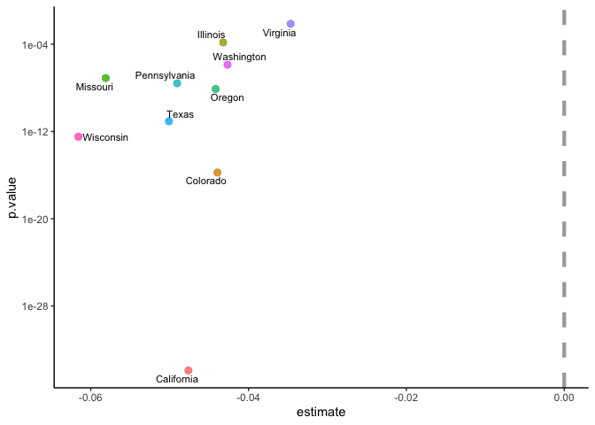<!-- -->

## P-value Relation per category

``` r
slopes<-by_year_state %>%
  filter(category %in% top_categories$category)%>%
  group_by(state,category) %>%
  summarize(model = list(glm(cbind(n, year_total - n) ~ year, family = "binomial"))) %>%
  mutate(tidied = map(model, tidy, conf.int = TRUE))%>%
  unnest(tidied) %>%
  filter(term == "year") %>%
  mutate(p.value = p.adjust(p.value))
slopes
```

    ## # A tibble: 41 x 10
    ## # Groups:   state [10]
    ##    state category model term  estimate std.error statistic p.value conf.low
    ##    <chr> <chr>    <lis> <chr>    <dbl>     <dbl>     <dbl>   <dbl>    <dbl>
    ##  1 Cali… America… <glm> year   -0.0264    0.0390    -0.677       1   -0.104
    ##  2 Cali… Bock     <glm> year   -0.0367    0.177     -0.207       1   -0.441
    ##  3 Cali… Classic… <glm> year   -0.0338    0.0345    -0.982       1   -0.102
    ##  4 Cali… German-… <glm> year   -0.0521    0.0706    -0.738       1   -0.196
    ##  5 Cali… Irish-S… <glm> year   -0.0327    0.0701    -0.466       1   -0.169
    ##  6 Colo… America… <glm> year   -0.0324    0.0496    -0.654       1   -0.129
    ##  7 Colo… Bock     <glm> year   -0.0506    0.0415    -1.22        1   -0.133
    ##  8 Colo… Classic… <glm> year   -0.0368    0.0917    -0.402       1   -0.210
    ##  9 Colo… German-… <glm> year   -0.0362    0.0503    -0.720       1   -0.140
    ## 10 Colo… Irish-S… <glm> year   -0.0203    0.0490    -0.414       1   -0.115
    ## # … with 31 more rows, and 1 more variable: conf.high <dbl>

``` r
slopes %>%
  ggplot(aes(estimate, p.value, label = state)) +
  geom_vline(
    xintercept = 0, lty = 2,
    size = 1.5, alpha = 0.7, color = "gray50"
  ) +
  geom_point(aes(color = state), alpha = 0.8, size = 2.5, show.legend = FALSE) +
  scale_y_log10()+ 
  facet_wrap(~category) +
  geom_text_repel(size = 3)+
  labs(title = 'Category Beers -Wons  Competition',
       subtitle = 'per Years')
```

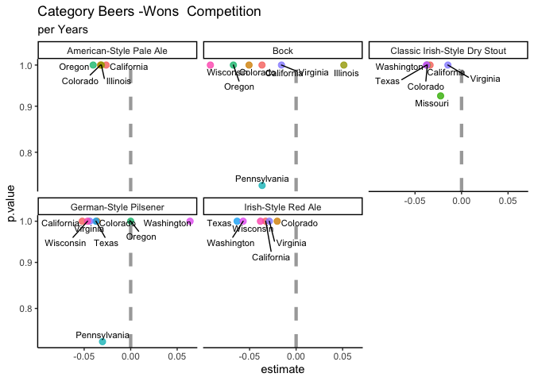<!-- -->

  - The most state are on negative side , with decreasing yields
    (participation);
  - States lower in the plots have smaller p-values; we are more certain
    those are real relationships.

<!-- end list -->

``` r
by_year_state <- beer_awards %>%
  add_count(year, name = "year_total") %>%
  mutate(state = fct_lump(state, 9)) %>%
  count(year, state, year_total, sort = TRUE) %>%
  mutate(pct_year = n / year_total)


by_year_state %>%
  filter(state != "Other") %>%
  mutate(state = state.name[match(state, state.abb)]) %>%
  group_by(state) %>%
  summarize(model = list(glm(cbind(n, year_total - n) ~ year, family = "binomial"))) %>%
  mutate(tidied = map(model, tidy, conf.int = TRUE)) %>%
  unnest(tidied) %>%
  filter(term == "year") %>%
  mutate(p.value = format.pval(p.value),
         state = fct_reorder(state, estimate)) %>%
  ggplot(aes(estimate, state, color=state)) +
  geom_point(aes(size=estimate), show.legend = FALSE) +
  geom_vline(xintercept = 0, lty = 2) +
  geom_errorbarh(aes(xmin = 0, xmax = estimate), height = .1) +
  labs(x = "Estimated slope",
       title = "Which states become more or less frequent medal winners?",
       y = "")+
  guides(color=F)
```

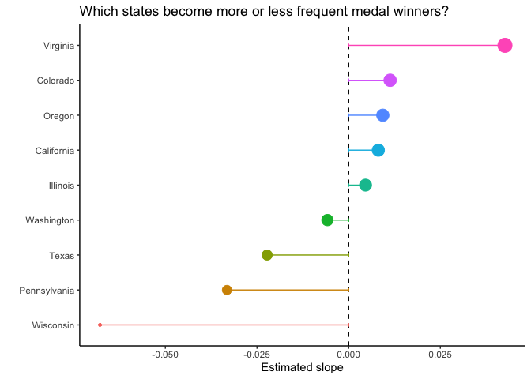<!-- -->
