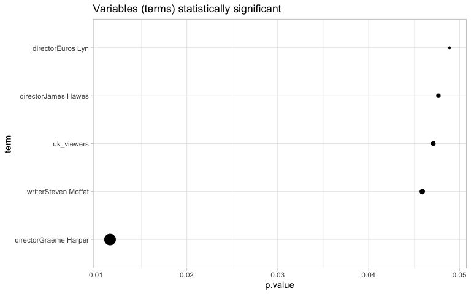

Doctor Who
================

``` r
library(tidyverse)
library(scales)
library(tidytuesdayR)
library(lubridate)
library(forcats)
library(widyr)
library(tidytext)
library(broom)
theme_set(theme_light())
```

``` r
tt <- tt_load("2021-11-23")
```

    ## 
    ##  Downloading file 1 of 4: `writers.csv`
    ##  Downloading file 2 of 4: `directors.csv`
    ##  Downloading file 3 of 4: `episodes.csv`
    ##  Downloading file 4 of 4: `imdb.csv`

\#\# Join Data

``` r
episodes <- tt$episodes %>%
  left_join(tt$directors, by='story_number') %>%
  left_join(tt$writers, by='story_number') %>%
  mutate(episode_title=fct_reorder(episode_title,first_aired)) %>%
  mutate(episode = paste0(season_number, ".", coalesce(as.character(episode_number), "X"), " ", episode_title)) %>%
  filter(!is.na(season_number))
```

\#\# Exploratory Data Analysis

``` r
episodes %>%
  group_by(season_number,type) %>%
  count(sort = TRUE) %>%
  group_by(season_number) %>%
  mutate(pct=round(n/sum(n)*100)) %>%
  ungroup() %>%
  ggplot(aes(pct,as.factor(season_number),fill=type))+
  geom_col(position = position_fill(reverse = TRUE))+
  scale_x_continuous(labels = percent)+
  labs(title = '% of Episode type in all Seasons',
       y='Season',
       x='',
       fill = 'Episode Type')
```

<!-- -->

``` r
episodes%>%
  group_by(season_number) %>%
  summarize(avg_rating = round(mean(rating))) %>%
  mutate(diff_avg_rating = avg_rating - lag(avg_rating))%>%
  ungroup()%>%
  ggplot(aes(factor(season_number),diff_avg_rating,fill=diff_avg_rating>0))+
  geom_hline(yintercept = 0, color='gray')+
  geom_col(show.legend = FALSE)+
  labs(title = 'Rating variation by season',
       y = 'Variation points',
       x = 'Season')
```

<!-- -->

The main findings until here are:

-   From season 4º, The Doctor Who pose a decay!!
-   Unit season 4º, the special espisodes has a stable frequency.

## Relation Between Rating and Directors

``` r
episodes%>%
  filter(season_number<=4) %>%
  group_by(season_number,director) %>%
  summarize(n=n(),
            uk_viewers= mean(uk_viewers),
            rating = round(mean(rating))) %>%
  ggplot(aes(season_number,
             rating,color=director))+
  geom_line()+
  geom_point(aes(size=uk_viewers))+
  labs(title = 'Relation between Episodes Numbers by Directors and Rating',
       subtitle = 'Until 4º season',
       y='Rating',
       x='Season')
```

<!-- -->

Is not clear the evidence of influence between Directors and Rating,
maybe with cluster analysis it easier.

``` r
episodes %>%
  widely_svd(director, season_number, rating)%>%
  filter(between(dimension, 3, 5)) %>%
  mutate(dimension = paste0('PCA ',dimension)) %>%
  mutate(director = reorder_within(director, value, dimension))%>%
  ungroup() %>%
  ggplot(aes(value, director)) +
  geom_col() +
  scale_y_reordered() +
  scale_x_continuous(labels=percent)+
  labs(title = 'Directors influence on the rating')+
  facet_wrap(~ dimension, scales = "free")
```

<!-- -->

In three PCA is possible understand the effect between directors and
rating but not is the whole story.

``` r
episodes %>%
  widely_svd(director, writer, rating)%>%
  filter(between(dimension, 2, 5)) %>%
  mutate(dimension = paste0('PCA ',dimension)) %>%
  mutate(director = reorder_within(director, value, dimension))%>%
  ungroup() %>%
  ggplot(aes(value, director)) +
  geom_col() +
  scale_y_reordered() +
  scale_x_continuous(labels=percent)+
  labs(title = 'Directors and writers  influence on the rating',
       x='',
       y='')+
  facet_wrap(~ dimension, scales = "free")
```

<!-- -->

Now this story is most complex!!

-   The full relation where *y* is rating are explained with Directors
    and Writers
-   In PCA 3 is possible observe the best relations!

``` r
episodes %>%
  ggplot(aes(first_aired,rating))+
  geom_smooth()+
  geom_line(alpha=.8, size=1.2, linetype='twodash',color='gray')+
  geom_point(aes(size=uk_viewers))+
  labs(title = 'Rating Trend')
```

<!-- -->

``` r
episodes %>%
  filter(!is.na(rating))%>%
  group_by(director=fct_lump(director,10)) %>%
  summarize(n=n(),
            avg_rating = mean(rating,na.rm= TRUE),
            avg_viewers = mean(uk_viewers, na.rm = TRUE),
            t_test = list(broom::tidy(t.test(rating[!is.na(rating)])))) %>%
  unnest(t_test) %>%
  mutate(director=fct_reorder(director,avg_rating)) %>%
  ggplot(aes(avg_rating,director)) + 
  geom_point(aes(size=avg_rating)) +
  geom_errorbarh(aes(xmin = conf.low,
                    xmax = conf.high),alpha=.3)
```

<!-- -->

With the last graph is possible understand the influence for directors
in the ratings. Now

``` r
episodes %>%
  filter(season_number<11) %>%
  filter(!is.na(rating),
         !is.na(uk_viewers),
         !is.na(director)) %>%
  group_by(season_number) %>%
  summarize(linear_model = list(lm(rating~uk_viewers+director))) %>%
  mutate(tidied = map(linear_model,tidy,conf.int = TRUE)) %>%
  unnest(tidied) %>%
  filter(term!='(Intercept)') %>%
  ggplot(aes(estimate,term))+
  geom_point()
```

<!-- -->

``` r
episodes %>%
  filter(season_number<11) %>%
  filter(!is.na(rating),
         !is.na(uk_viewers),
         !is.na(writer)) %>%
  group_by(season_number) %>%
  summarize(linear_model = list(lm(rating~uk_viewers+writer+director))) %>%
  mutate(tidied = map(linear_model,tidy,conf.int = TRUE)) %>%
  unnest(tidied) %>%
  filter(term!='(Intercept)',
         p.value<=0.05) %>%
  mutate(term=fct_reorder(term,p.value)) %>%
  ggplot(aes(p.value,term))+
  geom_point(aes(size=abs(p.value*100)),show.legend = FALSE)+
  scale_size(trans = 'reverse')+
  labs(title = 'Variables (terms) statistically significant')
```

<!-- -->
