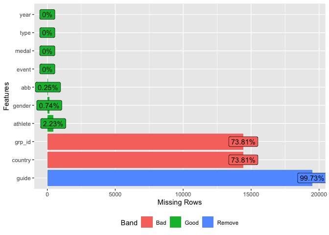
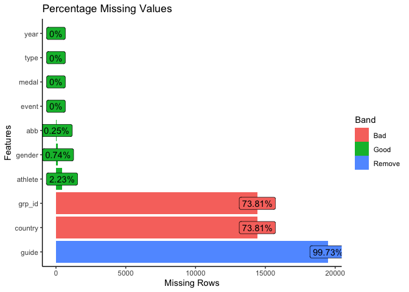
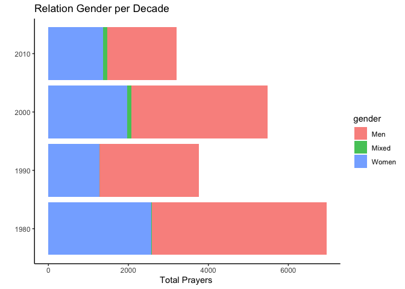
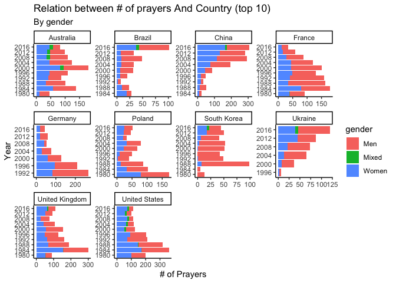
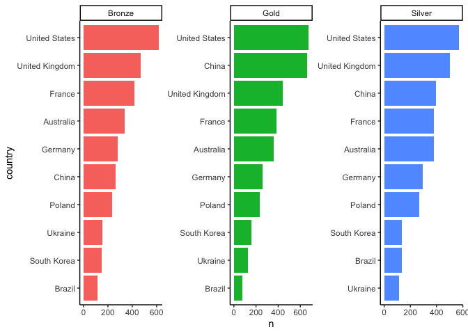
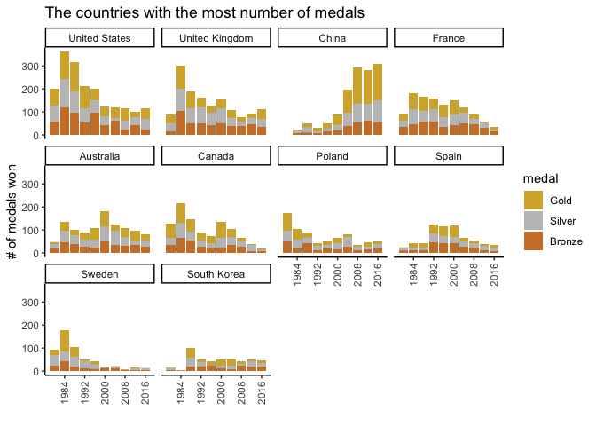

Paralympic Games
================

``` r
library(tidyverse)
```

    ## ── Attaching packages ─────────────────────────────────────── tidyverse 1.3.1 ──

    ## ✓ ggplot2 3.3.5     ✓ purrr   0.3.4
    ## ✓ tibble  3.1.3     ✓ dplyr   1.0.7
    ## ✓ tidyr   1.1.3     ✓ stringr 1.4.0
    ## ✓ readr   2.0.0     ✓ forcats 0.5.1

    ## ── Conflicts ────────────────────────────────────────── tidyverse_conflicts() ──
    ## x dplyr::filter() masks stats::filter()
    ## x dplyr::lag()    masks stats::lag()

``` r
library(tidymodels)
```

    ## Registered S3 method overwritten by 'tune':
    ##   method                   from   
    ##   required_pkgs.model_spec parsnip

    ## ── Attaching packages ────────────────────────────────────── tidymodels 0.1.3 ──

    ## ✓ broom        0.7.9      ✓ rsample      0.1.0 
    ## ✓ dials        0.0.9      ✓ tune         0.1.6 
    ## ✓ infer        0.5.4      ✓ workflows    0.2.3 
    ## ✓ modeldata    0.1.1      ✓ workflowsets 0.1.0 
    ## ✓ parsnip      0.1.7      ✓ yardstick    0.0.8 
    ## ✓ recipes      0.1.16

    ## ── Conflicts ───────────────────────────────────────── tidymodels_conflicts() ──
    ## x scales::discard() masks purrr::discard()
    ## x dplyr::filter()   masks stats::filter()
    ## x recipes::fixed()  masks stringr::fixed()
    ## x dplyr::lag()      masks stats::lag()
    ## x yardstick::spec() masks readr::spec()
    ## x recipes::step()   masks stats::step()
    ## • Use tidymodels_prefer() to resolve common conflicts.

``` r
library(tidymetrics)
```

    ## 
    ## Attaching package: 'tidymetrics'

    ## The following object is masked from 'package:stats':
    ## 
    ##     filter

``` r
library(DataExplorer)
library(countrycode)
library(widyr)
library(tidytext)
theme_set(theme_classic())
```

``` r
tuesdata <- tidytuesdayR::tt_load('2021-08-03')
```

    ## --- Compiling #TidyTuesday Information for 2021-08-03 ----

    ## --- There is 1 file available ---

    ## --- Starting Download ---

    ## 
    ##  Downloading file 1 of 1: `athletes.csv`

    ## --- Download complete ---

``` r
tuesdata <- tidytuesdayR::tt_load(2021, week = 32)
```

    ## --- Compiling #TidyTuesday Information for 2021-08-03 ----

    ## --- There is 1 file available ---

    ## --- Starting Download ---

    ## 
    ##  Downloading file 1 of 1: `athletes.csv`

    ## --- Download complete ---

``` r
athletes <- tuesdata$athletes
```

### EDA

``` r
missing_values<-DataExplorer::plot_missing(athletes)+
  labs(title = 'Percentage Missing Values')+
  theme_classic()
```

<!-- -->

``` r
missing_values
```

<!-- -->

``` r
athletes<-athletes%>%
  select(-c(grp_id,guide))%>%
  filter(!is.na(gender))

athletes
```

    ## # A tibble: 19,403 × 8
    ##    gender event                   medal  athlete      abb   country type    year
    ##    <chr>  <chr>                   <chr>  <chr>        <chr> <chr>   <chr>  <dbl>
    ##  1 Men    Double FITA Round Ampu… Gold   LARSEN Finn  DEN   <NA>    Arche…  1980
    ##  2 Men    Double FITA Round Ampu… Silver BRENNE Manf… FRG   <NA>    Arche…  1980
    ##  3 Men    Double FITA Round Ampu… Bronze SATO Masao   JPN   <NA>    Arche…  1980
    ##  4 Men    Double FITA Round Para… Gold   GEISS H.     FRG   <NA>    Arche…  1980
    ##  5 Men    Double FITA Round Para… Silver GRUN Guy     BEL   <NA>    Arche…  1980
    ##  6 Men    Double FITA Round Para… Bronze BUCHANAN J.  GBR   <NA>    Arche…  1980
    ##  7 Men    Double FITA Round Tetr… Gold   PARKER T.    CAN   <NA>    Arche…  1980
    ##  8 Men    Double FITA Round Tetr… Silver STEBEKK Odd… NOR   <NA>    Arche…  1980
    ##  9 Men    Double FITA Round Tetr… Bronze LAFONT G.    FRA   <NA>    Arche…  1980
    ## 10 Men    Double FITA Round Novi… Gold   CHAVEZ Alfr… MEX   <NA>    Arche…  1980
    ## # … with 19,393 more rows

``` r
athletes%>%
  group_by(gender = factor(gender),
           decade = (year %/%10)*10)%>%
  count(sort =  TRUE)%>%
  arrange(decade)%>%
  mutate(decade = as.factor(decade))%>%
  ggplot(aes(n,decade,fill =  gender))+
  geom_col(alpha = .8)+
  labs(title = 'Relation Gender per Decade',
       y = '',
       x = 'Total Prayers ')
```

<!-- -->

``` r
# feature engineering 
athletes<-athletes %>% 
  filter(!is.na(abb),
         abb !='-')%>%
  mutate(decade = (year %/%10) * 10)%>%
  mutate(country = countrycode(abb, origin= 'ioc', destination = 'country.name'),
         country = ifelse(abb=='FRG','West Germany',country),
         country = ifelse(abb=='URS','Soviet Union',country),
         country = ifelse(abb=='SCG','Serbia and Montenegro',country),
         country = ifelse(abb=='FRO','Faroe Islands',country),
         country = ifelse(abb=='YUG','Yugoslavia',country),
         country = ifelse(abb=='EUN','Unified Team',country),
         country = ifelse(abb=='BIR','Burma',country),
         country = ifelse(abb=='GDR','East Germany',country),
         country = ifelse(abb=='TCH','Czechoslovakia',country),
         country = ifelse(abb=='FRG','West Germany',country),
         country = ifelse(abb=='IPP','Independent Paralympic Participants',country)
         )
```

``` r
athletes_summary<-athletes%>%
  group_by(country = factor(country), year,gender)%>%
  summarize(n = n())%>%
  group_by(year,gender)%>%
  mutate(total_medals = sum(n),
            medals_share = 100* n/total_medals)%>%
  ungroup()
```

    ## `summarise()` has grouped output by 'country', 'year'. You can override using the `.groups` argument.

``` r
#country_focus<-
country_focus<-athletes_summary%>%
  filter(year == max(year))%>%
  group_by(country,year)%>%
  summarize(total = sum(n))%>%
  arrange(desc(total))%>%
  ungroup()%>%
  head(10)%>%
  select(country)
```

    ## `summarise()` has grouped output by 'country'. You can override using the `.groups` argument.

``` r
athletes_summary%>%
  filter(country %in% country_focus$country)%>%
  mutate(gender =  factor(gender),
         year = factor(year))%>%
  ggplot(aes(n,year, fill = gender))+
  geom_col()+
  facet_wrap(~country, scales = 'free')+
  labs(title = 'Relation between # of prayers And Country (top 10)',
       subtitle = 'By gender',
       y = 'Year',
       x = '# of Prayers')
```

<!-- -->

``` r
athletes%>%
  filter(country %in% country_focus$country)%>%
  group_by(country,medal)%>%
  count(sort=T)%>%
  ungroup()%>%
  mutate(medal = factor(medal),
         country = reorder_within(country,n,medal))%>%
  ggplot(aes(n,country, fill = medal))+
  geom_col(show.legend = FALSE)+
  scale_y_reordered()+
  facet_wrap(~medal, scales = 'free')
```

<!-- -->

``` r
athletes%>%
  filter(country %in% country_focus$country)%>%
  group_by(country,medal,)%>%
  count(sort=T)%>%
  ungroup()%>%
  mutate(medal = factor(medal),
         country = reorder_within(country,n,medal))%>%
  ggplot(aes(n,country, fill = medal))+
  geom_col(show.legend = FALSE)+
  scale_y_reordered()+
  facet_wrap(~medal, scales = 'free')
```

<!-- -->

``` r
library(ggflags)
library(forcats)
library(png)
library(cowplot)

iso_want<-athletes%>%
  mutate(iso=countrycode(abb, 'iso3c', 'country.name'))%>%
   mutate(continent=countrycode(abb, 'iso3c', 'continent'))%>%
  filter(!is.na(abb))%>%
  filter(!is.na(iso))%>%
  select(year,medal,iso)%>%
  group_by(iso)%>%
  summarise(total_medals=n())%>%
  arrange(-total_medals)%>%
  slice(1:10)%>%
  mutate(rank=row_number(),
         iso = fct_reorder(iso, rank))%>%
  ungroup()%>%
  select(iso,rank)


athletes%>%
  left_join(iso_want,by=c("country"="iso"))%>%
  filter(!is.na(rank))%>%
  mutate(country = fct_reorder(country, rank),
         medal = factor(medal, levels = c("Gold","Silver","Bronze")))%>%
  select(gender,year,medal,country)%>%
  group_by(gender,year,medal,country)%>%
  summarise(number_of_medals=n())%>%
  ggplot()+
  geom_bar(aes(x=year,y=number_of_medals,fill=medal),position="stack", stat="identity")+
  facet_wrap(~country)+
  scale_x_continuous(breaks = athletes %>%filter(year %% 8 == 0)%>%pull(year)%>%unique()) +
  scale_y_continuous(name = "# of medals won") +
  scale_fill_manual(values=c("Gold"="#D4AF37","Silver"="#C0C0C0","Bronze"="#CD7F32"))+
  xlab("")+
  ylab("# of medals")+
  labs(title = 'The countries with the most number of medals')+
  theme(axis.text.x = element_text(angle = 90, vjust = 0.5, hjust=1))
```

<!-- -->
