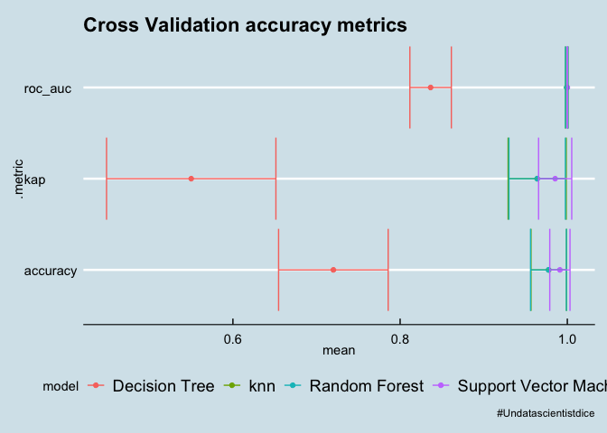
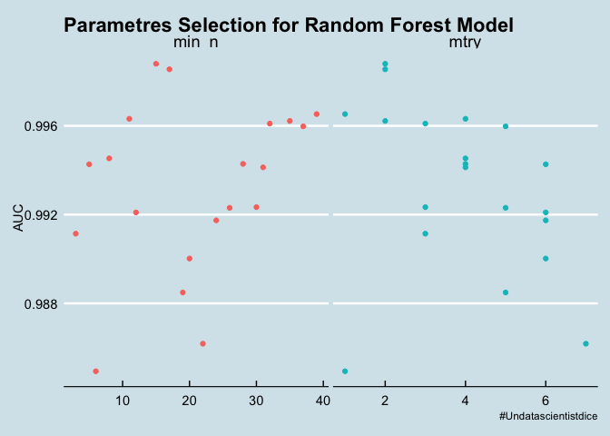
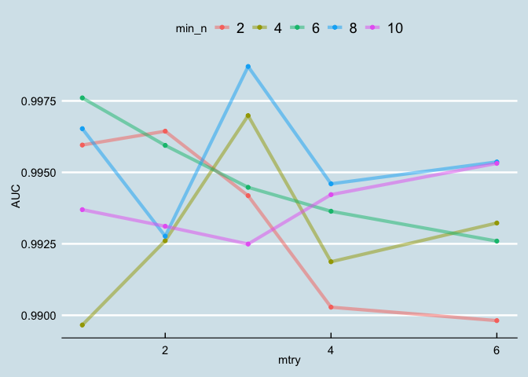
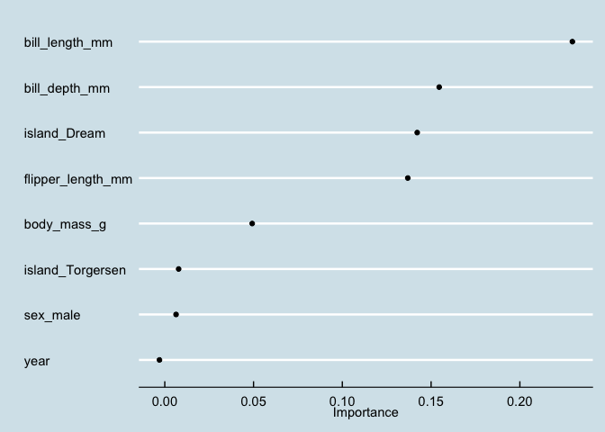

Tidytuesday \# 31
================

## Load Dataset

    ## 
    ##  Downloading file 1 of 2: `penguins.csv`
    ##  Downloading file 2 of 2: `penguins_raw.csv`

    ## 
    ##  Downloading file 1 of 2: `penguins.csv`
    ##  Downloading file 2 of 2: `penguins_raw.csv`

## Explore Dataset

``` r
penguins
```

    ## # A tibble: 344 x 8
    ##    species island bill_length_mm bill_depth_mm flipper_length_… body_mass_g
    ##    <chr>   <chr>           <dbl>         <dbl>            <dbl>       <dbl>
    ##  1 Adelie  Torge…           39.1          18.7              181        3750
    ##  2 Adelie  Torge…           39.5          17.4              186        3800
    ##  3 Adelie  Torge…           40.3          18                195        3250
    ##  4 Adelie  Torge…           NA            NA                 NA          NA
    ##  5 Adelie  Torge…           36.7          19.3              193        3450
    ##  6 Adelie  Torge…           39.3          20.6              190        3650
    ##  7 Adelie  Torge…           38.9          17.8              181        3625
    ##  8 Adelie  Torge…           39.2          19.6              195        4675
    ##  9 Adelie  Torge…           34.1          18.1              193        3475
    ## 10 Adelie  Torge…           42            20.2              190        4250
    ## # … with 334 more rows, and 2 more variables: sex <chr>, year <dbl>

``` r
penguins%>%
  skim()
```

|                                                  |            |
| :----------------------------------------------- | :--------- |
| Name                                             | Piped data |
| Number of rows                                   | 344        |
| Number of columns                                | 8          |
| \_\_\_\_\_\_\_\_\_\_\_\_\_\_\_\_\_\_\_\_\_\_\_   |            |
| Column type frequency:                           |            |
| character                                        | 3          |
| numeric                                          | 5          |
| \_\_\_\_\_\_\_\_\_\_\_\_\_\_\_\_\_\_\_\_\_\_\_\_ |            |
| Group variables                                  | None       |

Data summary

**Variable type:
character**

| skim\_variable | n\_missing | complete\_rate | min | max | empty | n\_unique | whitespace |
| :------------- | ---------: | -------------: | --: | --: | ----: | --------: | ---------: |
| species        |          0 |           1.00 |   6 |   9 |     0 |         3 |          0 |
| island         |          0 |           1.00 |   5 |   9 |     0 |         3 |          0 |
| sex            |         11 |           0.97 |   4 |   6 |     0 |         2 |          0 |

**Variable type:
numeric**

| skim\_variable      | n\_missing | complete\_rate |    mean |     sd |     p0 |     p25 |     p50 |    p75 |   p100 | hist  |
| :------------------ | ---------: | -------------: | ------: | -----: | -----: | ------: | ------: | -----: | -----: | :---- |
| bill\_length\_mm    |          2 |           0.99 |   43.92 |   5.46 |   32.1 |   39.23 |   44.45 |   48.5 |   59.6 | ▃▇▇▆▁ |
| bill\_depth\_mm     |          2 |           0.99 |   17.15 |   1.97 |   13.1 |   15.60 |   17.30 |   18.7 |   21.5 | ▅▅▇▇▂ |
| flipper\_length\_mm |          2 |           0.99 |  200.92 |  14.06 |  172.0 |  190.00 |  197.00 |  213.0 |  231.0 | ▂▇▃▅▂ |
| body\_mass\_g       |          2 |           0.99 | 4201.75 | 801.95 | 2700.0 | 3550.00 | 4050.00 | 4750.0 | 6300.0 | ▃▇▆▃▂ |
| year                |          0 |           1.00 | 2008.03 |   0.82 | 2007.0 | 2007.00 | 2008.00 | 2009.0 | 2009.0 | ▇▁▇▁▇ |

<!-- -->

``` r
penguins_pivot<-penguins%>%
  pivot_longer(cols = bill_length_mm:body_mass_g,
               names_to='metric',
               values_to='value')

penguins_pivot%>%
  ggplot(aes(value,fill=species))+
  geom_histogram(bins=20)+
  facet_wrap(~metric, scales='free_x')
```

<!-- -->

``` r
penguins_pivot%>%
  ggplot(aes(species,value,fill=species,color=species))+
  geom_boxplot(bins=20)+
  facet_wrap(~metric, scales='free_y')
```

    ## Warning: Ignoring unknown parameters: bins

    ## Warning: Removed 8 rows containing non-finite values (stat_boxplot).

<!-- -->

``` r
penguins%>%
  ggplot(aes(island,fill=species))+
  geom_bar()
```

<!-- -->

## Machine Learning Models

``` r
set.seed(1234)
split<-penguins%>%
  mutate(species=factor(species))%>%
  na.omit()%>%
  initial_split()

training(split)->training_data
splits<-training_data%>%
  vfold_cv(v = 17)

models<-rand_forest(mode = 'classification')%>%
  set_engine('ranger')%>%
  fit_resamples(species~ ., 
                resamples =splits,
                metrics = metric_set(accuracy,kap,roc_auc))
```

    ## x Fold03: model (predictions): Error: Can't subset columns that don't exist.
    ## x Col...

    ## x Fold12: model (predictions): Error: Can't subset columns that don't exist.
    ## x Col...

``` r
knn_model<-nearest_neighbor('classification',
                 neighbors = 10,
                 )%>%
  set_engine('kknn')%>%
  fit_resamples(species~ ., 
                resamples =splits,
                metrics = metric_set(accuracy,kap,roc_auc))
```

    ## x Fold03: model (predictions): Error: Can't subset columns that don't exist.
    ## x Col...

    ## x Fold12: model (predictions): Error: Can't subset columns that don't exist.
    ## x Col...

``` r
svm_model<-parsnip::svm_rbf(mode = 'classification')%>%
  set_engine('kernlab')%>%
   fit_resamples(species~ ., 
                resamples =splits,
                metrics = metric_set(accuracy,kap,roc_auc))
```

    ## x Fold03: model (predictions): Error: Can't subset columns that don't exist.
    ## x Col...
    ## x Fold12: model (predictions): Error: Can't subset columns that don't exist.
    ## x Col...

``` r
tree_model<-parsnip::decision_tree('classification',tree_depth = 10)%>%
  set_engine('rpart')%>%
  fit_resamples(species~ bill_length_mm, 
                resamples =splits,
                metrics = metric_set(accuracy,kap,roc_auc))

bind_rows(
  collect_metrics(knn_model)%>%
    mutate(model='knn'),
  collect_metrics(models)%>%
    mutate(model='Random Forest'),
  collect_metrics(svm_model)%>%
    mutate(model='Support Vector Machine'),
  collect_metrics(tree_model)%>%
    mutate(model='Decision Tree')
)%>%
  ggplot(aes(mean,.metric, color=model))+
  geom_point()+
  geom_errorbar(aes(xmin= mean -2 * std_err,
                    xmax= mean +2 * std_err))+
  labs(title = 'Cross Validation accuracy metrics',
       caption = caption)+
  theme(legend.position="bottom")
```

<!-- -->

## Prueba de los modelos en predicciones

### Support Vector Machine Multiclass

``` r
## Overfiting 
svm_model_train<-parsnip::svm_rbf(mode = 'classification')%>%
  set_engine('kernlab')%>%
   fit(species~ ., 
                data=training(split),
                metrics = metric_set(accuracy,kap,roc_auc))

pred<-testing(split)%>%
  predict(svm_model_train,new_data = .)%>%
  bind_cols(testing(split))
metrics(pred,species,estimate = .pred_class)
```

    ## # A tibble: 2 x 3
    ##   .metric  .estimator .estimate
    ##   <chr>    <chr>          <dbl>
    ## 1 accuracy multiclass         1
    ## 2 kap      multiclass         1

``` r
bind_cols(obs=testing(split)$species,
          predict(svm_model_train,new_data = testing(split)))%>%
  conf_mat(obs, .pred_class)
```

    ##            Truth
    ## Prediction  Adelie Chinstrap Gentoo
    ##   Adelie        41         0      0
    ##   Chinstrap      0        15      0
    ##   Gentoo         0         0     27

### KNN

``` r
## Overfiting 
knn_model_train<-nearest_neighbor('classification',
                 neighbors = 3,
                 )%>%
  set_engine('kknn')%>%
  fit(species~ ., 
                data =training(split),
                metrics = metric_set(accuracy,kap,roc_auc))

pred<-testing(split)%>%
  predict(knn_model_train,new_data = .)%>%
  bind_cols(testing(split))
metrics(pred,species,estimate = .pred_class)
```

    ## # A tibble: 2 x 3
    ##   .metric  .estimator .estimate
    ##   <chr>    <chr>          <dbl>
    ## 1 accuracy multiclass         1
    ## 2 kap      multiclass         1

``` r
bind_cols(obs=testing(split)$species,
          predict(knn_model_train,new_data = testing(split)))%>%
  conf_mat(obs, .pred_class)
```

    ##            Truth
    ## Prediction  Adelie Chinstrap Gentoo
    ##   Adelie        41         0      0
    ##   Chinstrap      0        15      0
    ##   Gentoo         0         0     27

### Random Forest

``` r
rf_model<-rand_forest(mode = 'classification',trees = 4)%>%
  set_engine('ranger')%>%
  fit(species~ ., 
                data =training(split),
                metrics = metric_set(accuracy,kap,roc_auc))

pred<-testing(split)%>%
  predict(rf_model,new_data = .)%>%
  bind_cols(testing(split))

metrics(pred,species,estimate = .pred_class)
```

    ## # A tibble: 2 x 3
    ##   .metric  .estimator .estimate
    ##   <chr>    <chr>          <dbl>
    ## 1 accuracy multiclass         1
    ## 2 kap      multiclass         1

``` r
bind_cols(obs=testing(split)$species,
          predict(rf_model,new_data = testing(split)))%>%
  conf_mat(obs, .pred_class)
```

    ##            Truth
    ## Prediction  Adelie Chinstrap Gentoo
    ##   Adelie        41         0      0
    ##   Chinstrap      0        15      0
    ##   Gentoo         0         0     27

### Decision tree

``` r
tree_model_train<-parsnip::decision_tree('classification',tree_depth = 10)%>%
  set_engine('rpart')%>%
  fit(species~ ., 
                data =training(split),
                metrics = metric_set(accuracy,kap,roc_auc))

pred<-testing(split)%>%
  predict(tree_model_train,new_data = .)%>%
  bind_cols(testing(split))
metrics(pred,species,estimate = .pred_class)
```

    ## # A tibble: 2 x 3
    ##   .metric  .estimator .estimate
    ##   <chr>    <chr>          <dbl>
    ## 1 accuracy multiclass     0.976
    ## 2 kap      multiclass     0.961

``` r
bind_cols(obs=testing(split)$species,
          predict(tree_model_train,new_data = testing(split)))%>%
  conf_mat(obs, .pred_class)
```

    ##            Truth
    ## Prediction  Adelie Chinstrap Gentoo
    ##   Adelie        40         1      0
    ##   Chinstrap      1        14      0
    ##   Gentoo         0         0     27

## Random Forest Model for production

``` r
rf_spec <- rand_forest(
  mtry = tune(),
  trees = 10,
  min_n = tune()
) %>%
  set_mode("classification") %>%
  set_engine("ranger")

rf_rec <- recipe(species ~ ., data = training(split))%>%
  update_role(bill_depth_mm, new_role = "ID") %>%
  step_dummy(all_nominal(), -all_outcomes()) %>%
  step_downsample(species)
```

    ## Warning: `step_downsample()` is deprecated as of recipes 0.1.13.
    ## Please use `themis::step_downsample()` instead.
    ## This warning is displayed once every 8 hours.
    ## Call `lifecycle::last_warnings()` to see where this warning was generated.

``` r
rf_folds <- vfold_cv(training(split))
rf_wf<-workflow() %>%
  add_recipe(rf_rec) %>%
  add_model(rf_spec)


doParallel::registerDoParallel()

set.seed(345)
tune_res <- tune_grid(
  rf_wf,
  resamples = rf_folds,
  grid = 20
)
```

    ## i Creating pre-processing data to finalize unknown parameter: mtry

<!-- -->

``` r
set.seed(123456)
rf_grid <- grid_regular(
  mtry(range = c(1,6)),
  min_n(range = c(2, 10)),
  levels = 5
)


regular_res<-tune_grid(
  rf_wf,
  resamples = rf_folds,
  grid = rf_grid
)


regular_res %>%
  collect_metrics() %>%
  filter(.metric == "roc_auc") %>%
  mutate(min_n = factor(min_n)) %>%
  ggplot(aes(mtry, mean, color = min_n)) +
  geom_line(alpha = 0.5, size = 1.5) +
  geom_point() +
  labs(y = "AUC")
```

<!-- -->

    ## 
    ## Attaching package: 'vip'

    ## The following object is masked from 'package:utils':
    ## 
    ##     vi

<!-- -->

``` r
final_wf <- workflow() %>%
  add_recipe(rf_rec) %>%
  add_model(final_rf)

final_wf
```

    ## ══ Workflow ══════════════════
    ## Preprocessor: Recipe
    ## Model: rand_forest()
    ## 
    ## ── Preprocessor ──────────────
    ## 2 Recipe Steps
    ## 
    ## ● step_dummy()
    ## ● step_downsample()
    ## 
    ## ── Model ─────────────────────
    ## Random Forest Model Specification (classification)
    ## 
    ## Main Arguments:
    ##   mtry = 3
    ##   trees = 10
    ##   min_n = 8
    ## 
    ## Computational engine: ranger
