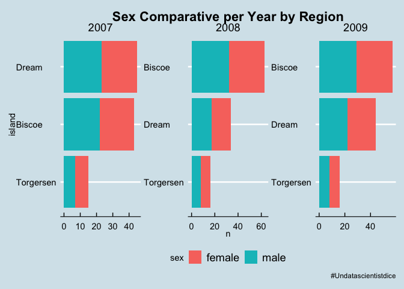

Tidytuesday \# 31
================

## Load Dataset

    ## 
    ##  Downloading file 1 of 2: `penguins.csv`
    ##  Downloading file 2 of 2: `penguins_raw.csv`

    ## 
    ##  Downloading file 1 of 2: `penguins.csv`
    ##  Downloading file 2 of 2: `penguins_raw.csv`

## Explore Dataset

``` r
penguins
```

    ## # A tibble: 344 x 8
    ##    species island bill_length_mm bill_depth_mm flipper_length_… body_mass_g
    ##    <chr>   <chr>           <dbl>         <dbl>            <dbl>       <dbl>
    ##  1 Adelie  Torge…           39.1          18.7              181        3750
    ##  2 Adelie  Torge…           39.5          17.4              186        3800
    ##  3 Adelie  Torge…           40.3          18                195        3250
    ##  4 Adelie  Torge…           NA            NA                 NA          NA
    ##  5 Adelie  Torge…           36.7          19.3              193        3450
    ##  6 Adelie  Torge…           39.3          20.6              190        3650
    ##  7 Adelie  Torge…           38.9          17.8              181        3625
    ##  8 Adelie  Torge…           39.2          19.6              195        4675
    ##  9 Adelie  Torge…           34.1          18.1              193        3475
    ## 10 Adelie  Torge…           42            20.2              190        4250
    ## # … with 334 more rows, and 2 more variables: sex <chr>, year <dbl>

``` r
penguins%>%
  skim()
```

|                                                  |            |
| :----------------------------------------------- | :--------- |
| Name                                             | Piped data |
| Number of rows                                   | 344        |
| Number of columns                                | 8          |
| \_\_\_\_\_\_\_\_\_\_\_\_\_\_\_\_\_\_\_\_\_\_\_   |            |
| Column type frequency:                           |            |
| character                                        | 3          |
| numeric                                          | 5          |
| \_\_\_\_\_\_\_\_\_\_\_\_\_\_\_\_\_\_\_\_\_\_\_\_ |            |
| Group variables                                  | None       |

Data summary

**Variable type:
character**

| skim\_variable | n\_missing | complete\_rate | min | max | empty | n\_unique | whitespace |
| :------------- | ---------: | -------------: | --: | --: | ----: | --------: | ---------: |
| species        |          0 |           1.00 |   6 |   9 |     0 |         3 |          0 |
| island         |          0 |           1.00 |   5 |   9 |     0 |         3 |          0 |
| sex            |         11 |           0.97 |   4 |   6 |     0 |         2 |          0 |

**Variable type:
numeric**

| skim\_variable      | n\_missing | complete\_rate |    mean |     sd |     p0 |     p25 |     p50 |    p75 |   p100 | hist  |
| :------------------ | ---------: | -------------: | ------: | -----: | -----: | ------: | ------: | -----: | -----: | :---- |
| bill\_length\_mm    |          2 |           0.99 |   43.92 |   5.46 |   32.1 |   39.23 |   44.45 |   48.5 |   59.6 | ▃▇▇▆▁ |
| bill\_depth\_mm     |          2 |           0.99 |   17.15 |   1.97 |   13.1 |   15.60 |   17.30 |   18.7 |   21.5 | ▅▅▇▇▂ |
| flipper\_length\_mm |          2 |           0.99 |  200.92 |  14.06 |  172.0 |  190.00 |  197.00 |  213.0 |  231.0 | ▂▇▃▅▂ |
| body\_mass\_g       |          2 |           0.99 | 4201.75 | 801.95 | 2700.0 | 3550.00 | 4050.00 | 4750.0 | 6300.0 | ▃▇▆▃▂ |
| year                |          0 |           1.00 | 2008.03 |   0.82 | 2007.0 | 2007.00 | 2008.00 | 2009.0 | 2009.0 | ▇▁▇▁▇ |

<!-- -->

``` r
penguins_pivot<-penguins%>%
  pivot_longer(cols = bill_length_mm:body_mass_g,
               names_to='metric',
               values_to='value')

penguins_pivot%>%
  ggplot(aes(value,fill=species))+
  geom_histogram(bins=20)+
  facet_wrap(~metric, scales='free_x')
```

<!-- -->

``` r
penguins_pivot%>%
  ggplot(aes(species,value,fill=species,color=species))+
  geom_boxplot(bins=20)+
  facet_wrap(~metric, scales='free_y')
```

<!-- -->

``` r
penguins%>%
  ggplot(aes(island,fill=species))+
  geom_bar()
```

<!-- -->

## Machine Learning Models

``` r
set.seed(123)
penguins<-penguins%>%
  mutate_if(is.character, factor)
split<-initial_split(na.omit(penguins),strata = species)
train_set<-training(split)
test_set<-testing(split)
```

``` r
penguins_rec<-recipe(species ~ . , data = train_set)%>%
  step_downsample(species) %>%
  step_zv(all_numeric())%>%
  prep()
```

    ## Warning: `step_downsample()` is deprecated as of recipes 0.1.13.
    ## Please use `themis::step_downsample()` instead.
    ## This warning is displayed once every 8 hours.
    ## Call `lifecycle::last_warnings()` to see where this warning was generated.

``` r
penguins_rec%>%
  juice()
```

    ## # A tibble: 153 x 8
    ##    island bill_length_mm bill_depth_mm flipper_length_… body_mass_g sex    year
    ##    <fct>           <dbl>         <dbl>            <dbl>       <dbl> <fct> <dbl>
    ##  1 Torge…           34.6          17.2              189        3200 fema…  2008
    ##  2 Torge…           41.1          17.6              182        3200 fema…  2007
    ##  3 Dream            37.3          17.8              191        3350 fema…  2008
    ##  4 Torge…           36.6          17.8              185        3700 fema…  2007
    ##  5 Dream            39.6          18.1              186        4450 male   2008
    ##  6 Torge…           36.2          16.1              187        3550 fema…  2008
    ##  7 Biscoe           39            17.5              186        3550 fema…  2008
    ##  8 Dream            44.1          19.7              196        4400 male   2007
    ##  9 Torge…           38.6          17                188        2900 fema…  2009
    ## 10 Biscoe           40.6          18.8              193        3800 male   2008
    ## # … with 143 more rows, and 1 more variable: species <fct>

``` r
penguins_folds <- vfold_cv(train_set)
rf_model<-rand_forest(mode = 'classification')%>%
  set_engine('ranger')%>%
  fit_resamples(species~bill_length_mm + island + bill_depth_mm + flipper_length_mm + body_mass_g, 
                resamples =penguins_folds,
                control = control_resamples(save_pred = TRUE),
                metrics = metric_set(accuracy,kap,roc_auc))

knn_model<-nearest_neighbor('classification',
                 neighbors = 10,
                 )%>%
  set_engine('kknn')%>%
  fit_resamples(species~bill_length_mm + island + bill_depth_mm + flipper_length_mm + body_mass_g, 
                resamples =penguins_folds,
                control = control_resamples(save_pred = TRUE),
                metrics = metric_set(accuracy,kap,roc_auc))


svm_model<-parsnip::svm_rbf(mode = 'classification')%>%
  set_engine('kernlab')%>%
   fit_resamples(species~bill_length_mm + island + bill_depth_mm + flipper_length_mm + body_mass_g, 
                resamples =penguins_folds,
                control = control_resamples(save_pred = TRUE),
                metrics = metric_set(accuracy,kap,roc_auc))
tree_model<-parsnip::decision_tree('classification',tree_depth = 10)%>%
  set_engine('rpart')%>%
  fit_resamples(species~bill_length_mm + island + bill_depth_mm + flipper_length_mm + body_mass_g, 
                resamples =penguins_folds,
                control = control_resamples(save_pred = TRUE),
                metrics = metric_set(accuracy,kap,roc_auc))
```

## Evaluate Models

``` r
bind_rows(
  collect_metrics(knn_model)%>%
    mutate(model='knn'),
  collect_metrics(tree_model)%>%
    mutate(model='Decision Tree'),
  collect_metrics(rf_model)%>%
    mutate(model='Random Forest'),
  collect_metrics(svm_model)%>%
    mutate(model='Support Vector Machine')
)%>%
  ggplot(aes(mean,.metric, color=model))+
  geom_point()+
  geom_errorbar(aes(xmin= mean -2 * std_err,
                    xmax= mean +2 * std_err))+
  facet_wrap(~model)+
  guides(color=FALSE)+
  labs(title = 'Cross Validation accuracy metrics',
       caption = caption)+
  theme(legend.position="bottom")+
  theme(plot.title = element_text(hjust = 0.5))
```

<!-- -->

``` r
knn_model %>%
  unnest(.predictions) %>%
  mutate(model = "kknn")%>%
  bind_rows(rf_model %>%
  unnest(.predictions) %>%
  mutate(model = "Random Forest"),
  tree_model %>%
  unnest(.predictions) %>%
  mutate(model = "Decision Tree"),
  svm_model %>%
  unnest(.predictions) %>%
  mutate(model = "SVM"))%>%
  group_by(model) %>%
  roc_curve(species, .pred_Chinstrap,.pred_Adelie,.pred_Gentoo) %>%
  ggplot(aes(x = 1 - specificity, y = sensitivity, color = model)) +
  geom_line(size = 1.5) +
  geom_abline(
    lty = 2, alpha = 0.5,
    color = "gray50",
    size = 1.2
  )+
  facet_wrap(~model)+
  guides(color=FALSE)
```

<!-- -->

``` r
tree_model_train<-parsnip::decision_tree('classification',tree_depth = 10)%>%
  set_engine('rpart')%>%
  fit(species~ ., 
                data =train_set,
                metrics = metric_set(accuracy,kap,roc_auc))

pred<-test_set%>%
  predict(tree_model_train,new_data = .)%>%
  bind_cols(testing(split))
metrics(pred,species,estimate = .pred_class)
```

    ## # A tibble: 2 x 3
    ##   .metric  .estimator .estimate
    ##   <chr>    <chr>          <dbl>
    ## 1 accuracy multiclass     0.890
    ## 2 kap      multiclass     0.827

``` r
bind_cols(obs=testing(split)$species,
          predict(tree_model_train,new_data = testing(split)))%>%
  conf_mat(obs, .pred_class)
```

    ##            Truth
    ## Prediction  Adelie Chinstrap Gentoo
    ##   Adelie        33         3      0
    ##   Chinstrap      2        12      1
    ##   Gentoo         1         2     28

### Final Model

``` r
set.seed(456)
penguins_folds <- vfold_cv(train_set)

decision_tree(mode = 'classification',min_n = tune(),cost_complexity = 1)%>%
  set_engine('rpart')
```

    ## Decision Tree Model Specification (classification)
    ## 
    ## Main Arguments:
    ##   cost_complexity = 1
    ##   min_n = tune()
    ## 
    ## Computational engine: rpart

``` r
tree_models<-decision_tree(mode = 'classification',
                         min_n = tune(),
                         cost_complexity = 0.1)%>%
  set_engine('rpart')

penguins_wf<-workflow()%>%
  add_recipe(penguins_rec)%>%
  add_model(tree_models)
```

``` r
doParallel::registerDoParallel()

set.seed(345)
tune_res <- tune_grid(
  penguins_wf,
  resamples = penguins_folds,
  grid = 20
)

tune_res
```

    ## # Tuning results
    ## # 10-fold cross-validation 
    ## # A tibble: 10 x 4
    ##    splits           id     .metrics          .notes          
    ##    <list>           <chr>  <list>            <list>          
    ##  1 <split [225/26]> Fold01 <tibble [38 × 5]> <tibble [0 × 1]>
    ##  2 <split [226/25]> Fold02 <tibble [38 × 5]> <tibble [0 × 1]>
    ##  3 <split [226/25]> Fold03 <tibble [38 × 5]> <tibble [0 × 1]>
    ##  4 <split [226/25]> Fold04 <tibble [38 × 5]> <tibble [0 × 1]>
    ##  5 <split [226/25]> Fold05 <tibble [38 × 5]> <tibble [0 × 1]>
    ##  6 <split [226/25]> Fold06 <tibble [38 × 5]> <tibble [0 × 1]>
    ##  7 <split [226/25]> Fold07 <tibble [38 × 5]> <tibble [0 × 1]>
    ##  8 <split [226/25]> Fold08 <tibble [38 × 5]> <tibble [0 × 1]>
    ##  9 <split [226/25]> Fold09 <tibble [38 × 5]> <tibble [0 × 1]>
    ## 10 <split [226/25]> Fold10 <tibble [38 × 5]> <tibble [0 × 1]>

``` r
rf_grid <- grid_regular(
  min_n(range = c(2, 8)),
  levels = 5
)
set.seed(456)
regular_res <- tune_grid(
  penguins_wf,
  resamples = penguins_folds,
  grid = rf_grid
)
```

``` r
regular_res
```

    ## # Tuning results
    ## # 10-fold cross-validation 
    ## # A tibble: 10 x 4
    ##    splits           id     .metrics          .notes          
    ##    <list>           <chr>  <list>            <list>          
    ##  1 <split [225/26]> Fold01 <tibble [10 × 5]> <tibble [0 × 1]>
    ##  2 <split [226/25]> Fold02 <tibble [10 × 5]> <tibble [0 × 1]>
    ##  3 <split [226/25]> Fold03 <tibble [10 × 5]> <tibble [0 × 1]>
    ##  4 <split [226/25]> Fold04 <tibble [10 × 5]> <tibble [0 × 1]>
    ##  5 <split [226/25]> Fold05 <tibble [10 × 5]> <tibble [0 × 1]>
    ##  6 <split [226/25]> Fold06 <tibble [10 × 5]> <tibble [0 × 1]>
    ##  7 <split [226/25]> Fold07 <tibble [10 × 5]> <tibble [0 × 1]>
    ##  8 <split [226/25]> Fold08 <tibble [10 × 5]> <tibble [0 × 1]>
    ##  9 <split [226/25]> Fold09 <tibble [10 × 5]> <tibble [0 × 1]>
    ## 10 <split [226/25]> Fold10 <tibble [10 × 5]> <tibble [0 × 1]>

``` r
best_auc <- select_best(regular_res, "roc_auc")
final_rf <- finalize_model(
  tree_models,
  best_auc
)
```

``` r
final_wf <- workflow() %>%
  add_recipe(penguins_rec) %>%
  add_model(final_rf)

final_res <- final_wf %>%
  last_fit(split)

final_res %>%
  collect_metrics()
```

    ## # A tibble: 2 x 3
    ##   .metric  .estimator .estimate
    ##   <chr>    <chr>          <dbl>
    ## 1 accuracy multiclass     0.890
    ## 2 roc_auc  hand_till      0.895
