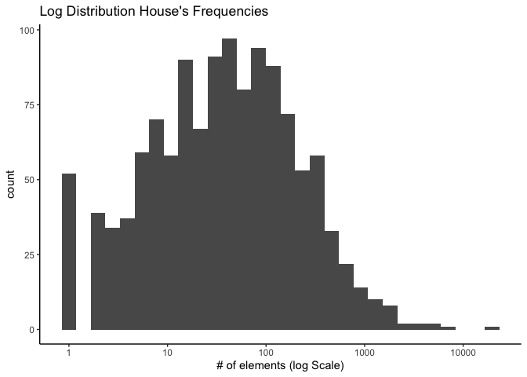
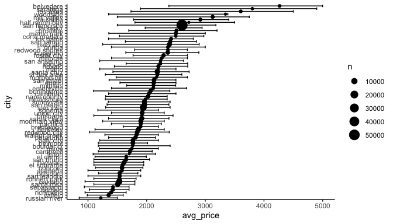
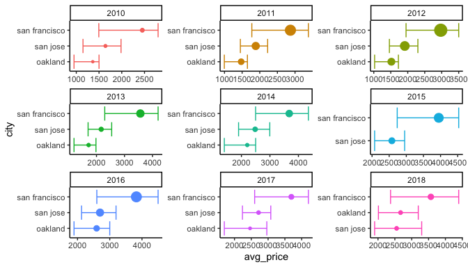
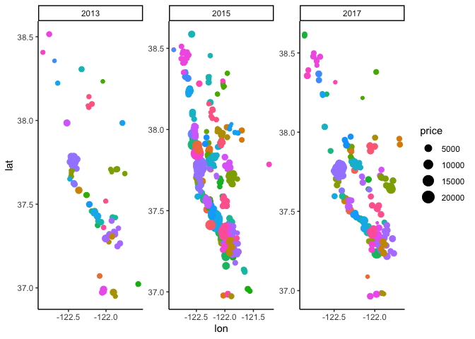
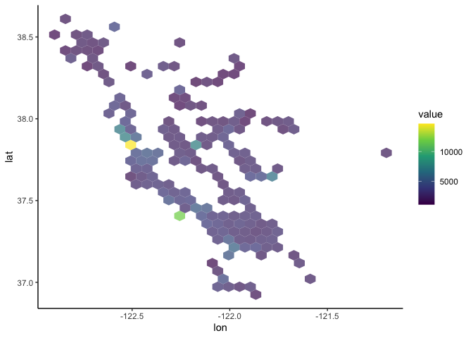
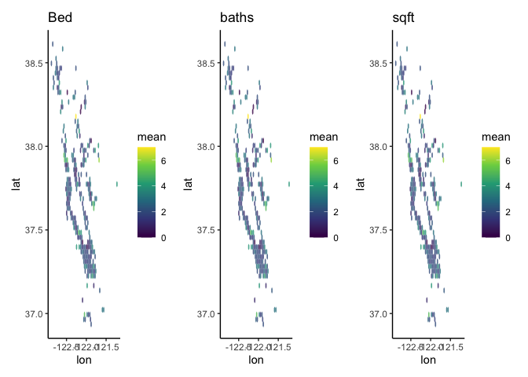
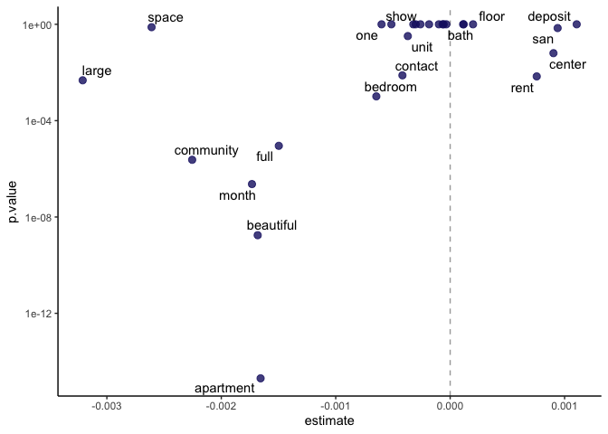
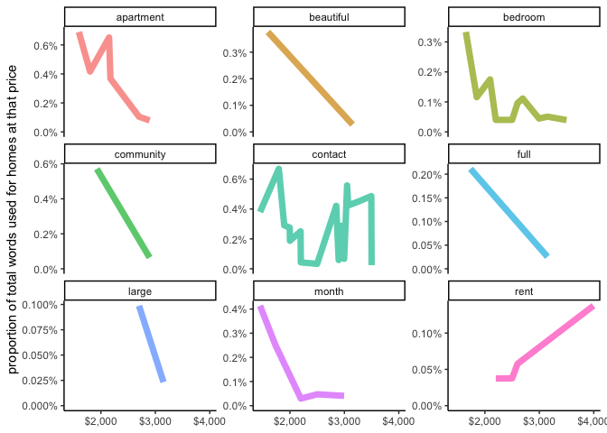
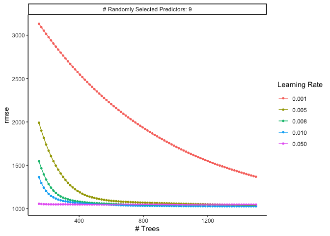
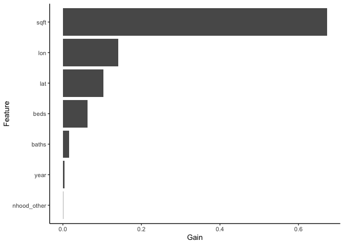

SF Rents
================

## EDA

<!-- -->

<!-- -->

<!-- -->

## Desing model

<!-- -->

<!-- -->

<!-- -->

<!-- -->

<!-- -->

<!-- -->

    ## # A tibble: 455 × 9
    ##     mtry trees learn_rate .metric .estimator  mean     n std_err .config        
    ##    <dbl> <dbl>      <dbl> <chr>   <chr>      <dbl> <int>   <dbl> <chr>          
    ##  1     9  1365       0.01 rmse    standard   1028.     5    83.0 Preprocessor1_…
    ##  2     9  1380       0.01 rmse    standard   1028.     5    83.0 Preprocessor1_…
    ##  3     9  1335       0.01 rmse    standard   1028.     5    83.0 Preprocessor1_…
    ##  4     9  1350       0.01 rmse    standard   1028.     5    82.9 Preprocessor1_…
    ##  5     9  1320       0.01 rmse    standard   1028.     5    83.0 Preprocessor1_…
    ##  6     9  1395       0.01 rmse    standard   1028.     5    83.0 Preprocessor1_…
    ##  7     9  1410       0.01 rmse    standard   1028.     5    83.0 Preprocessor1_…
    ##  8     9  1305       0.01 rmse    standard   1028.     5    82.9 Preprocessor1_…
    ##  9     9  1425       0.01 rmse    standard   1028.     5    83.0 Preprocessor1_…
    ## 10     9  1440       0.01 rmse    standard   1028.     5    83.0 Preprocessor1_…
    ## # … with 445 more rows

    ## # A tibble: 1 × 3
    ##   .metric .estimator .estimate
    ##   <chr>   <chr>          <dbl>
    ## 1 rmse    standard        928.

<!-- -->
