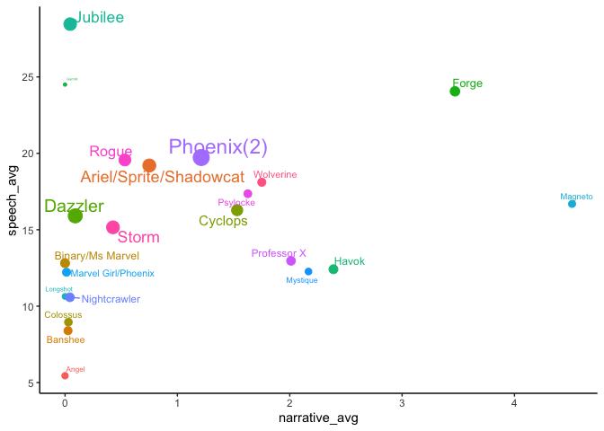
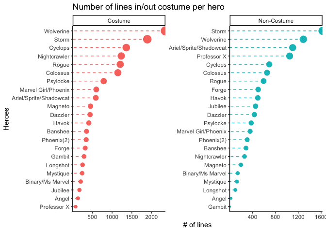
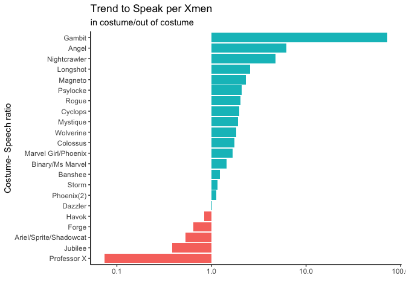
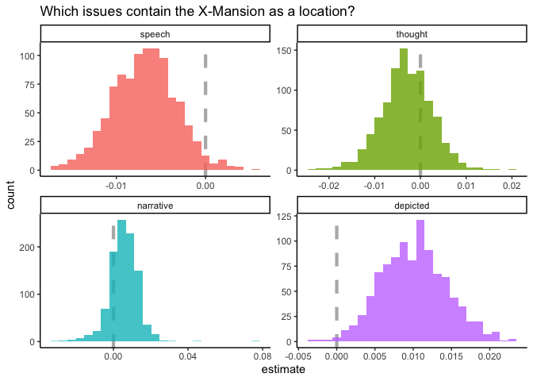
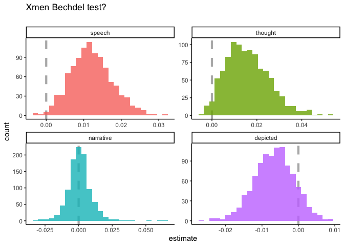

Xmen and Bechdel test Tidytuesday\#27
================

    ## 
    ##  Downloading file 1 of 7: `character_visualization.csv`
    ##  Downloading file 2 of 7: `characters.csv`
    ##  Downloading file 3 of 7: `comic_bechdel.csv`
    ##  Downloading file 4 of 7: `covers.csv`
    ##  Downloading file 5 of 7: `issue_collaborators.csv`
    ##  Downloading file 6 of 7: `locations.csv`
    ##  Downloading file 7 of 7: `xmen_bechdel.csv`

## Exploratory Data Analysis

``` r
skim(character_visualization)
```

|                                                  |                          |
| :----------------------------------------------- | :----------------------- |
| Name                                             | character\_visualization |
| Number of rows                                   | 9800                     |
| Number of columns                                | 7                        |
| \_\_\_\_\_\_\_\_\_\_\_\_\_\_\_\_\_\_\_\_\_\_\_   |                          |
| Column type frequency:                           |                          |
| character                                        | 2                        |
| numeric                                          | 5                        |
| \_\_\_\_\_\_\_\_\_\_\_\_\_\_\_\_\_\_\_\_\_\_\_\_ |                          |
| Group variables                                  | None                     |

Data summary

**Variable type:
character**

| skim\_variable | n\_missing | complete\_rate | min | max | empty | n\_unique | whitespace |
| :------------- | ---------: | -------------: | --: | --: | ----: | --------: | ---------: |
| costume        |          0 |              1 |   7 |  11 |     0 |         2 |          0 |
| character      |          0 |              1 |  16 |  42 |     0 |        25 |          0 |

**Variable type:
numeric**

| skim\_variable | n\_missing | complete\_rate |   mean |    sd | p0 |    p25 |   p50 |    p75 | p100 | hist  |
| :------------- | ---------: | -------------: | -----: | ----: | -: | -----: | ----: | -----: | ---: | :---- |
| issue          |          0 |              1 | 194.50 | 56.58 | 97 | 145.75 | 194.5 | 243.25 |  292 | ▇▇▇▇▇ |
| speech         |          0 |              1 |   2.68 |  9.23 |  0 |   0.00 |   0.0 |   0.00 |  133 | ▇▁▁▁▁ |
| thought        |          0 |              1 |   0.83 |  5.09 |  0 |   0.00 |   0.0 |   0.00 |  115 | ▇▁▁▁▁ |
| narrative      |          0 |              1 |   0.91 |  6.97 |  0 |   0.00 |   0.0 |   0.00 |  161 | ▇▁▁▁▁ |
| depicted       |          0 |              1 |   2.79 |  8.39 |  0 |   0.00 |   0.0 |   0.00 |  143 | ▇▁▁▁▁ |

``` r
character_visualization%>%
  head()
```

    ## # A tibble: 6 x 7
    ##   issue costume character                      speech thought narrative depicted
    ##   <dbl> <chr>   <chr>                           <dbl>   <dbl>     <dbl>    <dbl>
    ## 1    97 Costume Editor narration                    0       0         0        0
    ## 2    97 Costume Omnipresent narration               0       0         0        0
    ## 3    97 Costume Professor X = Charles Xavier …      0       0         0        0
    ## 4    97 Costume Wolverine = Logan                   7       0         0       10
    ## 5    97 Costume Cyclops = Scott Summers            24       3         0       23
    ## 6    97 Costume Marvel Girl/Phoenix = Jean Gr…      0       0         0        0

``` r
character_visualization<-character_visualization%>%
  separate(character,c('Hero','Secret_identity'),sep=' = ',fill='right')%>%
  filter(!is.na(Secret_identity))

by_character<-character_visualization%>%
  group_by(Hero)%>%
  summarize(across(speech:depicted,
                   list(total=sum,
                        issues=~sum(.>0),
                        avg = ~mean(.[depicted>0]))))  

by_character%>%
  group_by(Hero)%>%
  summarize(Speech_thought_ratio=speech_total/thought_total)%>%
  ggplot(aes(fct_reorder(Hero,Speech_thought_ratio),Speech_thought_ratio))+
  geom_errorbar(aes(ymin=0,ymax=Speech_thought_ratio), height = 0)+
  geom_point(aes(size=Speech_thought_ratio,color=Speech_thought_ratio))+
  coord_flip()+
  guides(color=FALSE,size=FALSE)+
  labs(x='',
       title = 'Relation between Speech and thought per Hero')
```

<!-- -->

``` r
by_character%>%
  ggplot(aes(speech_avg,thought_avg))+
  geom_line()+
  geom_smooth()+
  geom_point(aes(color=Hero,size=narrative_total))+
  geom_text_repel(aes(label=Hero))+
  expand_limits(x=5)+
  guides(color=FALSE, 
         size=FALSE)+
  labs(x='Speech Average',
       y= 'Thought Average',
       title = 'Average Participation per Hero',
       subtitle = 'for relation between thought and speech')+
  theme(plot.title = element_text(hjust = 0.5, color='blue'))+
  theme(plot.subtitle = element_text(hjust = 0.5, color='blue'))
```

<!-- -->

``` r
by_character%>%
  ggplot(aes(narrative_avg,
             speech_avg,
             color=Hero,
             size=thought_avg))+
  geom_point()+
  geom_text_repel(aes(label=Hero))+
  guides(color=FALSE,
         size=FALSE)
```

<!-- -->

``` r
by_character%>%
  mutate(speech_ratio=speech_avg/thought_avg)%>%
  ggplot(aes(depicted_issues,
             speech_ratio,
             color=Hero,
             size=speech_ratio))+
  geom_point()+
  geom_text_repel(aes(label=Hero))+
  scale_y_log10()+
  guides(color=FALSE,
         size=FALSE)+
  labs(x= 'Number of issues depicted',
       y='Relation Speech to tought',
       title = 'Xmen Speech to Thought ratio')+
  theme(plot.title = element_text(hjust = 0.5, color='blue'))
```

<!-- -->

``` r
by_character_costume<-character_visualization%>%
  group_by(Hero,costume)%>%
  summarize(across(speech:depicted,
                   list(total=sum,
                        issues=~sum(.>0),
                        avg = ~mean(.[depicted>0]))))%>%
  ungroup()%>%
  mutate(speech_thought_ratio = speech_avg / thought_avg)

by_character_costume%>%
  mutate(costume=factor(costume),
         Hero=reorder_within(Hero,speech_total,costume))%>%
  ggplot(aes(speech_total,
             Hero,
             color=costume))+
  geom_errorbarh(aes(xmin=1,xmax=speech_total),height = 0,linetype = "dashed")+
  geom_point(aes(size=speech_total))+
  facet_wrap(~costume,scales = 'free')+
  guides(color=FALSE,
         size=FALSE)+
  scale_y_reordered() +
  scale_x_continuous(expand = c(0,0))+
  labs(title ='Number of lines in/out costume per hero',
       x='# of lines',
       y='Heroes')
```

<!-- -->

``` r
costume_ratios<-by_character_costume%>%
  filter(speech_avg>0)%>%
  group_by(Hero)%>%
  summarize(costumes_ratio= speech_total[1]/speech_total[2])%>%
  inner_join(by_character, by = "Hero")

costume_ratios%>%
  mutate(Hero=fct_reorder(Hero,costumes_ratio))%>%
  ggplot(aes(costumes_ratio,Hero))+
  geom_col(aes(fill=costumes_ratio>1))+
  scale_x_log10()+
  guides(fill=FALSE)+
  labs(x='',
       y='Costume- Speech ratio',
       title = 'Trend to Speak per Xmen',
       subtitle = 'in costume/out of costume')
```

<!-- -->

## Issues by Location

``` r
per_issue <- character_visualization %>%
  group_by(issue) %>%
  summarise(across(speech:depicted, sum)) %>%
  ungroup()

locations%>%
  group_by(location=fct_lump(location,4))%>%
  summarize(total=n())%>%
  arrange(desc(total))%>%
  filter(location!='Other')
```

    ## # A tibble: 5 x 2
    ##   location                        total
    ##   <fct>                           <int>
    ## 1 X-Mansion                         100
    ## 2 Danger Room                        27
    ## 3 Space                              19
    ## 4 Muir Island, Scotland              14
    ## 5 Unspecified region in Australia    14

## Model

``` r
set.seed(2020)
X_mansion <- locations %>%
  group_by(issue) %>%
  summarise(mansion = "X-Mansion" %in% location)%>%
  inner_join(per_issue)


boots<-bootstraps(X_mansion, times=1000,apparent = TRUE)
models <- boots %>%
  mutate(
    model = map(
      splits,
      ~ glm(mansion ~ speech + thought + narrative + depicted,
        family = "binomial", data = analysis(.)
      )
    ),
    coef_info = map(model, tidy)
  )


boot_coefs <- models %>%
  unnest(coef_info)

boot_coefs %>%
  filter(term != "(Intercept)") %>%
  mutate(term = fct_inorder(term)) %>%
  ggplot(aes(estimate, fill = term)) +
  geom_vline(
    xintercept = 0, color = "gray50",
    alpha = 0.6, lty = 2, size = 1.5
  ) +
  geom_histogram(alpha = 0.8, bins = 25, show.legend = FALSE) +
  facet_wrap(~term, scales = "free") +
  labs(
    title = "Which issues contain the X-Mansion as a location?"
  )
```

<!-- -->

## Bechdel test

``` r
bechdel<- per_issue %>%
  inner_join(xmen_bechdel) %>%
  mutate(pass_bechdel = if_else(pass_bechdel == "yes", TRUE, FALSE))%>%
  select(-notes)
```

``` r
set.seed(2020)
bechdel_joined <- per_issue %>%
  inner_join(xmen_bechdel) %>%
  mutate(pass_bechdel = if_else(pass_bechdel == "yes", TRUE, FALSE))
```

    ## Joining, by = "issue"

``` r
boots <- bootstraps(bechdel_joined, times = 1000, apparent = TRUE)
boot_models <- boots %>%
  mutate(
    model = map(
      splits,
      ~ glm(pass_bechdel ~ speech + thought + narrative + depicted,
        family = "binomial", data = analysis(.)
      )
    ),
    coef_info = map(model, tidy)
  )

boot_coefs <- boot_models %>%
  unnest(coef_info)

boot_coefs %>%
  filter(term != "(Intercept)") %>%
  mutate(term = fct_inorder(term)) %>%
  ggplot(aes(estimate, fill = term)) +
  geom_vline(
    xintercept = 0, color = "gray50",
    alpha = 0.6, lty = 2, size = 1.5
  ) +
  geom_histogram(alpha = 0.8, bins = 25, show.legend = FALSE) +
  facet_wrap(~term, scales = "free") +
  labs(
    title = "Xmen Bechdel test?",
    subtitle = '')
```

<!-- -->

  - Depicted term is less likey to pass the Bechdel test
  - Speech and thought terms are more likely to pass the Bechdel Test.
