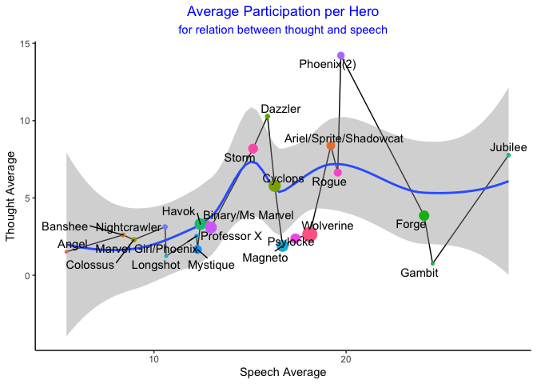

Xmen and Bechdel test Tidytuesday\#27
================

    ## --- Compiling #TidyTuesday Information for 2020-06-30 ----

    ## --- There are 7 files available ---

    ## --- Starting Download ---

    ## 
    ##  Downloading file 1 of 7: `character_visualization.csv`
    ##  Downloading file 2 of 7: `characters.csv`
    ##  Downloading file 3 of 7: `comic_bechdel.csv`
    ##  Downloading file 4 of 7: `covers.csv`
    ##  Downloading file 5 of 7: `issue_collaborators.csv`
    ##  Downloading file 6 of 7: `locations.csv`
    ##  Downloading file 7 of 7: `xmen_bechdel.csv`

    ## --- Download complete ---

## Exploratory Data Analysis

``` r
skim(character_visualization)
```

|                                                  |                          |
| :----------------------------------------------- | :----------------------- |
| Name                                             | character\_visualization |
| Number of rows                                   | 9800                     |
| Number of columns                                | 7                        |
| \_\_\_\_\_\_\_\_\_\_\_\_\_\_\_\_\_\_\_\_\_\_\_   |                          |
| Column type frequency:                           |                          |
| character                                        | 2                        |
| numeric                                          | 5                        |
| \_\_\_\_\_\_\_\_\_\_\_\_\_\_\_\_\_\_\_\_\_\_\_\_ |                          |
| Group variables                                  | None                     |

Data summary

**Variable type:
character**

| skim\_variable | n\_missing | complete\_rate | min | max | empty | n\_unique | whitespace |
| :------------- | ---------: | -------------: | --: | --: | ----: | --------: | ---------: |
| costume        |          0 |              1 |   7 |  11 |     0 |         2 |          0 |
| character      |          0 |              1 |  16 |  42 |     0 |        25 |          0 |

**Variable type:
numeric**

| skim\_variable | n\_missing | complete\_rate |   mean |    sd | p0 |    p25 |   p50 |    p75 | p100 | hist  |
| :------------- | ---------: | -------------: | -----: | ----: | -: | -----: | ----: | -----: | ---: | :---- |
| issue          |          0 |              1 | 194.50 | 56.58 | 97 | 145.75 | 194.5 | 243.25 |  292 | ▇▇▇▇▇ |
| speech         |          0 |              1 |   2.68 |  9.23 |  0 |   0.00 |   0.0 |   0.00 |  133 | ▇▁▁▁▁ |
| thought        |          0 |              1 |   0.83 |  5.09 |  0 |   0.00 |   0.0 |   0.00 |  115 | ▇▁▁▁▁ |
| narrative      |          0 |              1 |   0.91 |  6.97 |  0 |   0.00 |   0.0 |   0.00 |  161 | ▇▁▁▁▁ |
| depicted       |          0 |              1 |   2.79 |  8.39 |  0 |   0.00 |   0.0 |   0.00 |  143 | ▇▁▁▁▁ |

``` r
character_visualization%>%
  head()
```

    ## # A tibble: 6 x 7
    ##   issue costume character                      speech thought narrative depicted
    ##   <dbl> <chr>   <chr>                           <dbl>   <dbl>     <dbl>    <dbl>
    ## 1    97 Costume Editor narration                    0       0         0        0
    ## 2    97 Costume Omnipresent narration               0       0         0        0
    ## 3    97 Costume Professor X = Charles Xavier …      0       0         0        0
    ## 4    97 Costume Wolverine = Logan                   7       0         0       10
    ## 5    97 Costume Cyclops = Scott Summers            24       3         0       23
    ## 6    97 Costume Marvel Girl/Phoenix = Jean Gr…      0       0         0        0

``` r
character_visualization<-character_visualization%>%
  separate(character,c('Hero','Secret_identity'),sep=' = ',fill='right')%>%
  filter(!is.na(Secret_identity))

by_character<-character_visualization%>%
  group_by(Hero)%>%
  summarize(across(speech:depicted,
                   list(total=sum,
                        issues=~sum(.>0),
                        avg = ~mean(.[depicted>0]))))  

by_character%>%
  group_by(Hero)%>%
  summarize(Speech_thought_ratio=speech_total/thought_total)%>%
  ggplot(aes(fct_reorder(Hero,Speech_thought_ratio),Speech_thought_ratio))+
  geom_errorbar(aes(ymin=0,ymax=Speech_thought_ratio), height = 0)+
  geom_point(aes(size=Speech_thought_ratio,color=Speech_thought_ratio))+
  coord_flip()+
  guides(color=FALSE,size=FALSE)+
  labs(x='',
       title = 'Relation between Speech and thought per Hero')
```

<!-- -->

``` r
by_character%>%
  ggplot(aes(speech_avg,thought_avg))+
  geom_line()+
  geom_smooth()+
  geom_point(aes(color=Hero,size=narrative_total))+
  geom_text_repel(aes(label=Hero))+
  expand_limits(x=5)+
  guides(color=FALSE, 
         size=FALSE)+
  labs(x='Speech Average',
       y= 'Thought Average',
       title = 'Average Participation per Hero',
       subtitle = 'for relation between thought and speech')+
  theme(plot.title = element_text(hjust = 0.5, color='blue'))+
  theme(plot.subtitle = element_text(hjust = 0.5, color='blue'))
```

<!-- -->

tal
