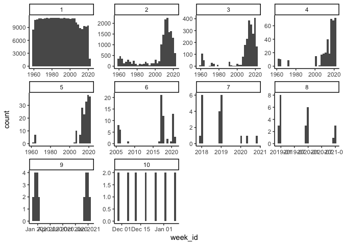
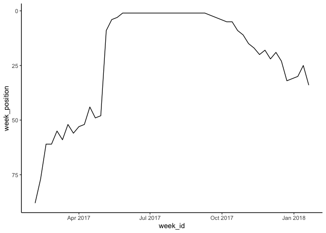
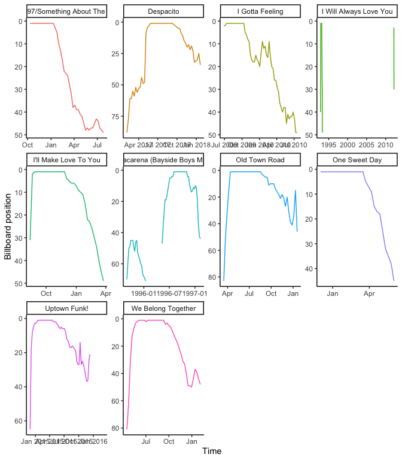
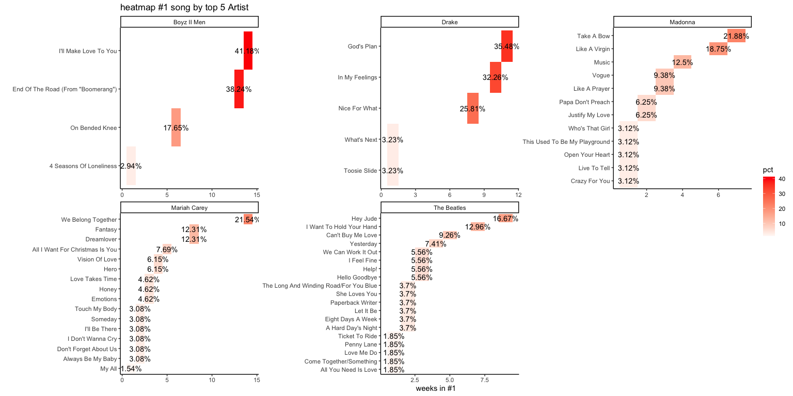
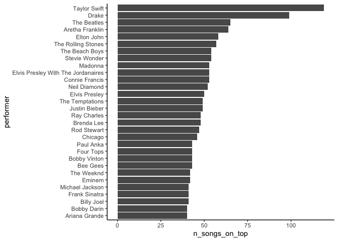
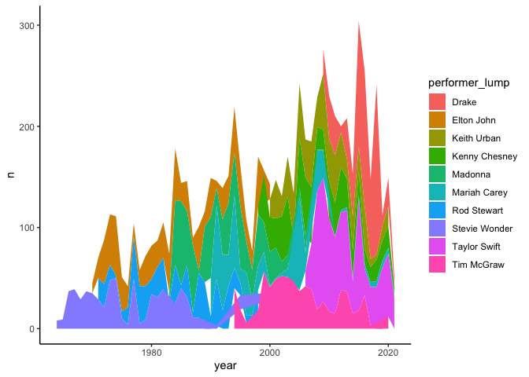

Untitled
================

``` r
library(tidyverse)
```

    ## ── Attaching packages ─────────────────────────────────────── tidyverse 1.3.1 ──

    ## ✓ ggplot2 3.3.5     ✓ purrr   0.3.4
    ## ✓ tibble  3.1.3     ✓ dplyr   1.0.7
    ## ✓ tidyr   1.1.3     ✓ stringr 1.4.0
    ## ✓ readr   2.0.0     ✓ forcats 0.5.1

    ## ── Conflicts ────────────────────────────────────────── tidyverse_conflicts() ──
    ## x dplyr::filter() masks stats::filter()
    ## x dplyr::lag()    masks stats::lag()

``` r
library(tidymodels)
```

    ## Registered S3 method overwritten by 'tune':
    ##   method                   from   
    ##   required_pkgs.model_spec parsnip

    ## ── Attaching packages ────────────────────────────────────── tidymodels 0.1.3 ──

    ## ✓ broom        0.7.9      ✓ rsample      0.1.0 
    ## ✓ dials        0.0.9      ✓ tune         0.1.6 
    ## ✓ infer        0.5.4      ✓ workflows    0.2.3 
    ## ✓ modeldata    0.1.1      ✓ workflowsets 0.1.0 
    ## ✓ parsnip      0.1.7      ✓ yardstick    0.0.8 
    ## ✓ recipes      0.1.16

    ## ── Conflicts ───────────────────────────────────────── tidymodels_conflicts() ──
    ## x scales::discard() masks purrr::discard()
    ## x dplyr::filter()   masks stats::filter()
    ## x recipes::fixed()  masks stringr::fixed()
    ## x dplyr::lag()      masks stats::lag()
    ## x yardstick::spec() masks readr::spec()
    ## x recipes::step()   masks stats::step()
    ## • Use tidymodels_prefer() to resolve common conflicts.

``` r
library(tidytext)
library(lubridate)
```

    ## 
    ## Attaching package: 'lubridate'

    ## The following objects are masked from 'package:base':
    ## 
    ##     date, intersect, setdiff, union

``` r
theme_set(theme_classic())

## Data ---
billboard <- readr::read_csv('https://raw.githubusercontent.com/rfordatascience/tidytuesday/master/data/2021/2021-09-14/billboard.csv')
```

    ## Rows: 327895 Columns: 10

    ## ── Column specification ────────────────────────────────────────────────────────
    ## Delimiter: ","
    ## chr (5): url, week_id, song, performer, song_id
    ## dbl (5): week_position, instance, previous_week_position, peak_position, wee...

    ## 
    ## ℹ Use `spec()` to retrieve the full column specification for this data.
    ## ℹ Specify the column types or set `show_col_types = FALSE` to quiet this message.

## Feature Engineering

``` r
billboard<-billboard%>%
  mutate(week_id=mdy(week_id),
         performer= factor(performer))

billboard %>%
  ggplot(aes(week_id))+
  geom_histogram()+
  facet_wrap(~instance,scales = 'free')
```

    ## `stat_bin()` using `bins = 30`. Pick better value with `binwidth`.

<!-- -->

``` r
billboard%>%
    mutate(performer=str_remove(performer,'(?<=[\\s])\\s*|^\\s+|\\s+$'),
           performer=str_remove(performer,'[[:punct:]]'))%>%
  group_by(performer,week_position)%>%
  count(sort = TRUE)
```

    ## # A tibble: 187,084 × 3
    ## # Groups:   performer, week_position [187,084]
    ##    performer       week_position     n
    ##    <chr>                   <dbl> <int>
    ##  1 Mariah Carey                1    65
    ##  2 The Beatles                 1    54
    ##  3 Madonna                     2    41
    ##  4 Mariah Carey                2    39
    ##  5 Boyz II Men                 1    34
    ##  6 Madonna                     1    32
    ##  7 The Beatles                 2    32
    ##  8 Drake                       1    31
    ##  9 Whitney Houston             1    31
    ## 10 Michael Jackson             1    30
    ## # … with 187,074 more rows

``` r
## Clean performer names
billboard<-billboard%>%
    mutate(performer=str_remove(performer,'(?<=[\\s])\\s*|^\\s+|\\s+$'),
           performer=str_remove(performer,'[[:punct:]]'))
```

``` r
billboard<-billboard%>%
    mutate(Decade= (year(week_id) %/%10)*10)
```

## A Little EDA

``` r
billboard%>%
  filter(week_position==1)%>%
  group_by(performer,song)%>%
  count(sort=T)
```

    ## # A tibble: 1,124 × 3
    ## # Groups:   performer, song [1,124]
    ##    performer                                        song                       n
    ##    <chr>                                            <chr>                  <int>
    ##  1 Lil Nas X Featuring Billy Ray Cyrus              Old Town Road             19
    ##  2 Luis Fonsi  Daddy Yankee Featuring Justin Bieber Despacito                 16
    ##  3 Mariah Carey  Boyz II Men                        One Sweet Day             16
    ##  4 Boyz II Men                                      I'll Make Love To You     14
    ##  5 Elton John                                       Candle In The Wind 19…    14
    ##  6 Los Del Rio                                      Macarena (Bayside Boy…    14
    ##  7 Mariah Carey                                     We Belong Together        14
    ##  8 Mark Ronson Featuring Bruno Mars                 Uptown Funk!              14
    ##  9 The Black Eyed Peas                              I Gotta Feeling           14
    ## 10 Whitney Houston                                  I Will Always Love You    14
    ## # … with 1,114 more rows

``` r
billboard%>%
  filter(song=='Despacito')%>%
  ggplot(aes(week_id,week_position))+
  geom_line()+
  scale_y_reverse()
```

<!-- -->

``` r
top<-billboard%>%
  filter(week_position==1)%>%
  group_by(performer,song,song_id)%>%
  count(sort=T)

billboard%>%
  semi_join(head(top,10),
            by='song_id')%>%
  ggplot(aes(week_id,week_position,group = instance,color=song))+
  geom_line(show.legend = FALSE)+
  scale_y_reverse()+
  facet_wrap(~song,scales = 'free')+
  labs(x = 'Time',
       y = 'Billboard position')
```

<!-- -->

## The most \#1 Artist

``` r
top5_performer<-billboard%>%
  group_by(performer)%>%
  summarize(total_weeks = n(),
            total_weks_n_1 =  sum(week_position==1),
            n_songs = n_distinct(song))%>%
  filter(total_weks_n_1>0)%>%
  arrange(desc(total_weks_n_1))%>%
  select(performer)%>%
  head(5)
```

``` r
billboard%>%
  filter(performer %in% top5_performer$performer) %>%
  #filter(performer=='Adele')%>%
  group_by(performer,song)%>%
  summarize(total_weks_n_1 =  sum(week_position==1))%>%
  group_by(performer)%>%
  mutate(pct = round(total_weks_n_1/sum(total_weks_n_1)*100,2))%>%
  filter(total_weks_n_1>0) %>%
  mutate(song=reorder_within(song,pct,performer))%>%
  ggplot(aes(total_weks_n_1,song,fill=pct))+
  geom_tile()+
  scale_y_reordered()+
  scale_fill_gradient2(low = 'pink',high = 'red')+
  geom_text(aes(label=paste0(pct,'%')))+
  labs(title = 'heatmap #1 song by top 5 Artist',
       x = 'weeks in #1',
       y = '') +
  facet_wrap(~performer,scales = 'free')
```

    ## `summarise()` has grouped output by 'performer'. You can override using the `.groups` argument.

<!-- -->

``` r
by_performer<-billboard%>%
  group_by(performer)%>%
  summarize(total_weeks = n(),
            total_weeks_n_1 = sum(week_position==1),
            n_songs_on_top = n_distinct(song),
            n_songs_on_n_1 = n_distinct(song[week_position==1]))%>%
  arrange(desc(n_songs_on_n_1))%>%
  filter(total_weeks_n_1>0)

by_performer%>%
  arrange(desc(n_songs_on_top))%>%
  head(30) %>%
  mutate(performer=fct_reorder(performer,n_songs_on_top)) %>%
  ggplot(aes(n_songs_on_top,performer))+
  geom_col()
```

<!-- -->

``` r
billboard%>%
  mutate(performer_lump = fct_lump(performer,10),
         year = year(week_id))%>%
  filter(performer_lump!='Other')%>%
  count(performer_lump,
        year) %>%
  ggplot(aes(year,n,fill=performer_lump))+
  geom_area()
```

<!-- -->
