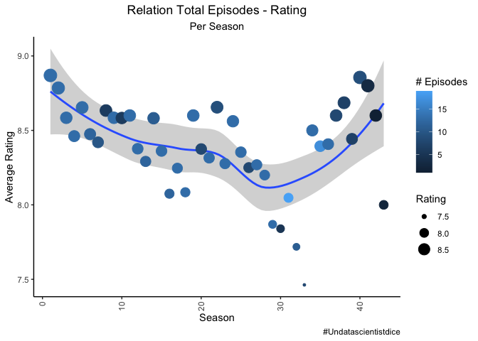
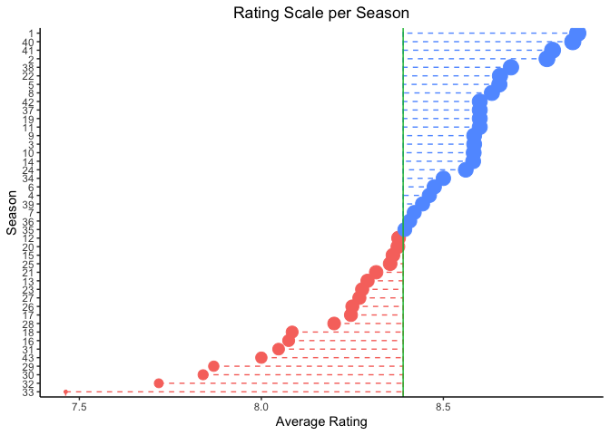
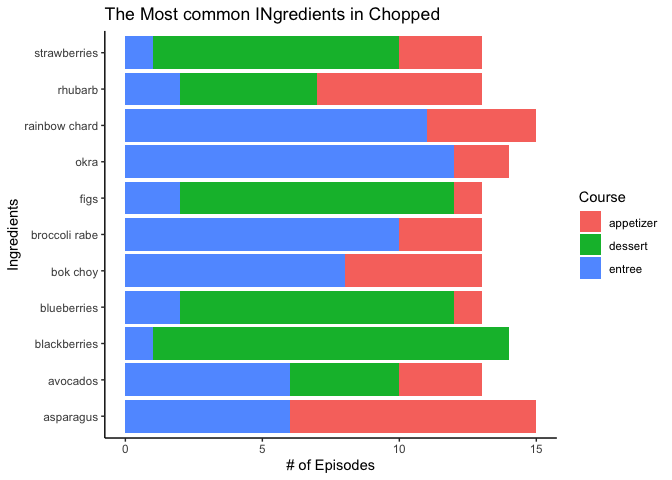
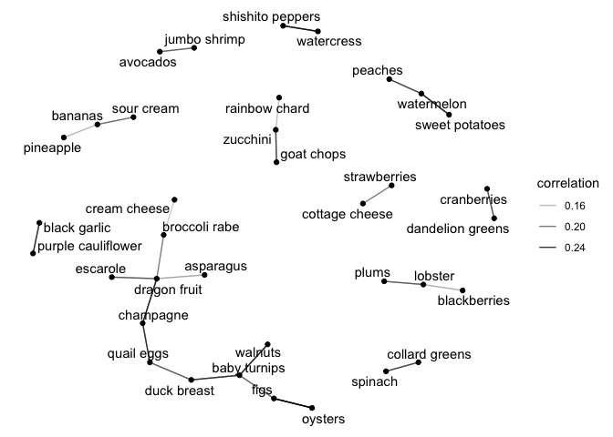
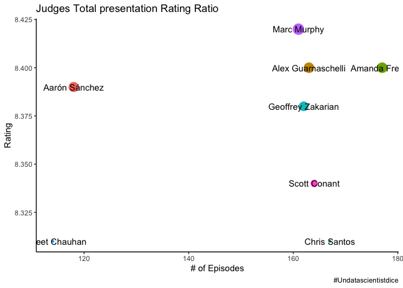
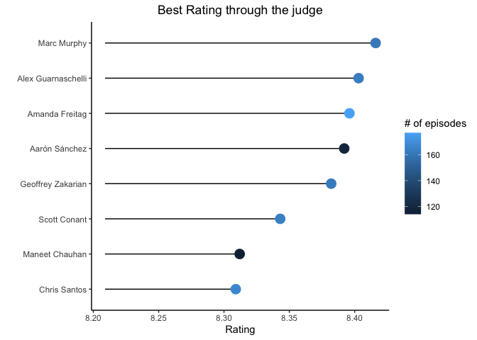
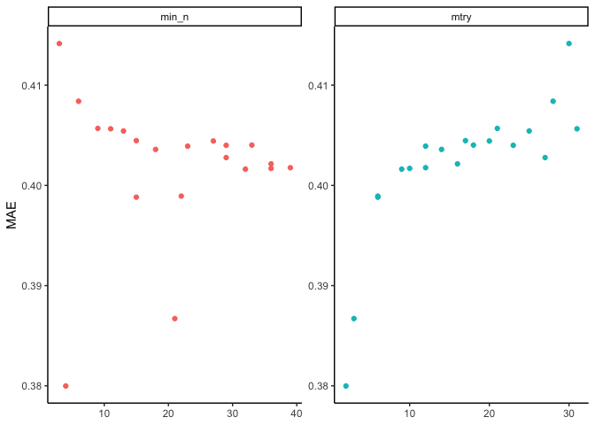
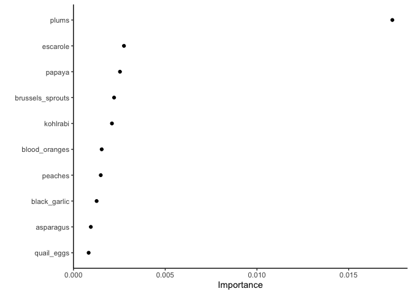

TidyTuesday \#35
================

## libraries

``` r
library(tidyverse)
library(tidymodels)
library(ggthemes)
library(tidytuesdayR)
library(skimr)
theme_set(theme_classic())
library(scales)
library(lubridate)
library(widyr)
library(ggraph)
library(tidygraph)
library(vip)
cap='#Undatascientistdice'
```

## Load Dataset

``` r
tuesdata <- tidytuesdayR::tt_load(2020, week = 35)
```

    ## 
    ##  Downloading file 1 of 1: `chopped.tsv`

``` r
chopped<-tuesdata$chopped
```

## EDA

In this part I Explore the data set, I love begin with `skim`\[1\]
function for denoted a broad overview of a frame.

``` r
chopped%>%
  skim()
```

|                                                  |            |
| :----------------------------------------------- | :--------- |
| Name                                             | Piped data |
| Number of rows                                   | 569        |
| Number of columns                                | 21         |
| \_\_\_\_\_\_\_\_\_\_\_\_\_\_\_\_\_\_\_\_\_\_\_   |            |
| Column type frequency:                           |            |
| character                                        | 17         |
| numeric                                          | 4          |
| \_\_\_\_\_\_\_\_\_\_\_\_\_\_\_\_\_\_\_\_\_\_\_\_ |            |
| Group variables                                  | None       |

Data summary

**Variable type:
character**

| skim\_variable    | n\_missing | complete\_rate | min | max | empty | n\_unique | whitespace |
| :---------------- | ---------: | -------------: | --: | --: | ----: | --------: | ---------: |
| episode\_name     |          0 |           1.00 |   6 |  77 |     0 |       568 |          0 |
| episode\_notes    |        113 |           0.80 |  12 | 830 |     0 |       455 |          0 |
| air\_date         |          0 |           1.00 |  11 |  18 |     0 |       564 |          0 |
| judge1            |          1 |           1.00 |   9 |  18 |     0 |        37 |          0 |
| judge2            |          1 |           1.00 |   9 |  18 |     0 |        27 |          0 |
| judge3            |          1 |           1.00 |   6 |  19 |     0 |        95 |          0 |
| appetizer         |          1 |           1.00 |  18 | 135 |     0 |       568 |          0 |
| entree            |          1 |           1.00 |  34 | 126 |     0 |       568 |          0 |
| dessert           |          1 |           1.00 |  28 | 117 |     0 |       568 |          0 |
| contestant1       |          1 |           1.00 |   6 |  45 |     0 |       566 |          0 |
| contestant1\_info |         13 |           0.98 |   2 | 114 |     0 |       502 |          0 |
| contestant2       |          1 |           1.00 |   7 |  48 |     0 |       561 |          0 |
| contestant2\_info |         14 |           0.98 |   2 | 119 |     0 |       510 |          0 |
| contestant3       |          1 |           1.00 |   6 |  53 |     0 |       556 |          0 |
| contestant3\_info |         14 |           0.98 |   2 | 120 |     0 |       505 |          0 |
| contestant4       |          1 |           1.00 |   8 |  45 |     0 |       507 |          0 |
| contestant4\_info |         14 |           0.98 |   2 | 140 |     0 |       494 |          0 |

**Variable type:
numeric**

| skim\_variable  | n\_missing | complete\_rate |   mean |     sd |  p0 |   p25 |   p50 |   p75 |  p100 | hist  |
| :-------------- | ---------: | -------------: | -----: | -----: | --: | ----: | ----: | ----: | ----: | :---- |
| season          |          0 |           1.00 |  23.12 |  12.96 | 1.0 |  12.0 |  23.0 |  35.0 |  45.0 | ▇▇▇▇▇ |
| season\_episode |          0 |           1.00 |   7.02 |   3.98 | 1.0 |   4.0 |   7.0 |  10.0 |  20.0 | ▇▇▇▂▁ |
| series\_episode |          0 |           1.00 | 284.85 | 164.16 | 1.0 | 143.0 | 285.0 | 427.0 | 567.0 | ▇▇▇▇▇ |
| episode\_rating |        105 |           0.82 |   8.38 |   0.48 | 5.5 |   8.2 |   8.5 |   8.7 |   9.2 | ▁▁▂▅▇ |

Is very interesting the part of `episode_rating`

``` r
chopped%>%
  mutate(season=factor(season))%>%
  filter(!is.na(episode_rating))%>%
  ggplot(aes(series_episode,episode_rating,fill=season))+
  geom_col(show.legend = FALSE)+
  facet_wrap(~season,scales = 'free')+
  labs(title = 'Rating Distribution per season',
       y='Rating',
       x='Episode',
       caption = cap)+
  theme(plot.title = element_text(hjust = .5))
```

<!-- -->

``` r
chopped<-chopped%>%
  mutate(air_date=mdy(air_date))
chopped%>%
  filter(!is.na(episode_rating))%>%
  group_by(season)%>%
  summarize(total_episodes=n(),
            average_rating=mean(episode_rating))%>%
  ggplot(aes(season,average_rating,color=total_episodes))+
  geom_smooth()+
  geom_point(aes(size=average_rating))+
  theme(axis.text.x = element_text(angle = 90, vjust = 0.5, hjust=1))+
  labs(title = 'Relation Total Episodes - Rating',
       subtitle = 'Per Season',
       x='Season',
       y='Average Rating',
       caption = cap,
       size= 'Rating',
       color= '# Episodes')+
  theme(plot.title = element_text(hjust = .5))+
  theme(plot.subtitle = element_text(hjust = .5))
```

<!-- -->

Well, is evident the relation (inverse) between \# of episodes and
Rating.

``` r
chopped%>%
  filter(!is.na(episode_rating))%>%
  group_by(season)%>%
  summarize(average_rating=mean(episode_rating))%>%
  ggplot(aes(reorder(season,average_rating),average_rating,color=average_rating>mean(average_rating)))+
  geom_errorbar(aes(ymin=mean(average_rating),ymax=average_rating), height = 0,linetype = "dashed")+
  geom_point(aes(size=average_rating),show.legend = FALSE)+
  geom_hline(aes(yintercept = mean(average_rating),color='green'),show.legend = FALSE)+
  coord_flip()+
  guides(color=FALSE)+
  labs(title = 'Rating Scale per Season',
       x='Season',
       y='Average Rating')+
  theme(plot.title = element_text(hjust = .5))
```

    ## `summarise()` ungrouping output (override with `.groups` argument)

    ## Warning: Ignoring unknown parameters: height

<!-- -->

Now with `pivot_longer`\[2\] I try increasing the \# of row and reduce
\# of columns for understand this segment `appetizer:dessert`

``` r
Ingredients<-chopped%>%
  select(season,season_episode, series_episode,episode_name,episode_rating,appetizer:dessert)%>%
  pivot_longer(cols = c(appetizer:dessert),
               names_to='Course',
               values_to='Ingredients')%>%
  separate_rows(Ingredients,sep=', ')
```

``` r
Ingredients%>%
  count(Course,Ingredients,sort = TRUE)%>%
  filter(fct_lump(Ingredients,10,w = n)!='Other')%>%
  ggplot(aes(n,Ingredients,fill=Course))+
  geom_col()+
  labs(title = 'The Most common INgredients in Chopped',
       x='# of Episodes')
```

<!-- -->

``` r
correlations<-Ingredients%>%
  add_count(Ingredients)%>%
  filter(n>=8)%>%
  pairwise_cor(Ingredients,series_episode, sort=TRUE)
```

    ## Warning: `tbl_df()` is deprecated as of dplyr 1.0.0.
    ## Please use `tibble::as_tibble()` instead.
    ## This warning is displayed once every 8 hours.
    ## Call `lifecycle::last_warnings()` to see where this warning was generated.

``` r
correlations%>%
  head(50)%>%
  ggraph(layout = 'fr')+
  geom_edge_link(aes(edge_alpha=correlation))+
  geom_node_point()+
  geom_node_text(aes(label=name),repel = TRUE)
```

<!-- -->

Now I wanna know the realtion between Rating and Judges\!

``` r
Judges<-chopped%>%
  select(season,episode_rating,judge1:judge3)%>%
  pivot_longer(cols = c(judge1:judge3),
               names_to='Judges',
               values_to='Judges_Names')

Judges%>%
  distinct()%>%
  mutate(Judges_Names=gsub('Amanda Freita','Amanda Freitag',Judges_Names),
         Judges_Names=gsub('Amanda Freitagg','Amanda Freitag',Judges_Names),
         Judges_Names=gsub('Chris Santo','Chris Santos',Judges_Names),
         Judges_Names=gsub('Chris Santoss','Chris Santos',Judges_Names),
         Judges_Names=gsub('Jody William','Jody Williams',Judges_Names),
         Judges_Names=gsub('Jody Williamss','Jody Williams',Judges_Names),
         Judges_Names=gsub('Aarón Sanchez','Aarón Sánchez',Judges_Names))%>%
  group_by(Judges_Names)%>%
  summarize(total=n(),
            avg_rating=round(mean(episode_rating,na.rm = TRUE),digits = 2))%>%
  filter(!is.nan(avg_rating))%>%
  filter(total>100)%>%
  #mutate(Judges_Names=fct_reorder(Judges_Names,total))%>%
  ggplot(aes(total,avg_rating))+
  geom_point(aes(size=avg_rating,color=Judges_Names),show.legend = FALSE)+
  geom_text(aes(label=Judges_Names),check_overlap = TRUE)+
  guides(color=FALSE)+
  labs(title = 'Judges Total presentation Rating Ratio',
       y='Rating',
       x= '# of Episodes',
       caption = cap)
```

    ## `summarise()` ungrouping output (override with `.groups` argument)

<!-- -->

In this case, **Aarón Sánchez** is the favorite Judge and create Better
ratio rating in relation with the number of Episodes.

``` r
Judges<-Judges%>%
  distinct()%>%
  mutate(Judges_Names=gsub('Amanda Freita','Amanda Freitag',Judges_Names),
         Judges_Names=gsub('Amanda Freitagg','Amanda Freitag',Judges_Names),
         Judges_Names=gsub('Chris Santo','Chris Santos',Judges_Names),
         Judges_Names=gsub('Chris Santoss','Chris Santos',Judges_Names),
         Judges_Names=gsub('Jody William','Jody Williams',Judges_Names),
         Judges_Names=gsub('Jody Williamss','Jody Williams',Judges_Names),
         Judges_Names=gsub('Aarón Sanchez','Aarón Sánchez',Judges_Names))%>%
  group_by(Judges_Names)%>%
  summarize(total=n(),
            avg_rating=round(mean(episode_rating,na.rm = TRUE),digits = 3))%>%
  filter(!is.nan(avg_rating))%>%
  ungroup()%>%
  filter(total>100)%>%
  arrange(desc(avg_rating))
```

    ## `summarise()` ungrouping output (override with `.groups` argument)

``` r
Judges%>%
  mutate(Judges_Names=fct_reorder(Judges_Names,avg_rating))%>%
  ggplot(aes(avg_rating,Judges_Names))+
  geom_errorbarh(aes(xmin=min(avg_rating-0.1),xmax=avg_rating),height = 0)+
  geom_point(aes(size=mean(avg_rating),color=total),show.legend = TRUE)+
  labs(title = 'Best Rating through the judge',
       x='Rating',
       y='',
       color= '# of episodes')+
  guides(size=FALSE)+
  theme(plot.title = element_text(hjust = .5))
```

<!-- -->

## Build Model

``` r
ingredients_filtered <- Ingredients %>%
  add_count(Ingredients) %>%
  filter(n >= 10)

ingredient_correlations <- ingredients_filtered %>%
  pairwise_cor(Ingredients, series_episode, sort = TRUE)

ingredients_wide <- ingredients_filtered %>%
  select(season, series_episode, episode_rating, Ingredients) %>%
  mutate(value = 1) %>%
  pivot_wider(names_from = Ingredients,
              values_from = value,
              values_fill = list(value = 0)) %>%
  select(-series_episode) %>%
  janitor::clean_names()
```

``` r
set.seed(2020)
split_data<-ingredients_wide%>%
  select(-season)%>%
  filter(!is.na(episode_rating))%>%
  na.omit()%>%
  initial_split()
training_set<-training(split_data)
testing_set<-testing(split_data)

## CV 
rating_folds<-vfold_cv(training_set,v = 10)

## Create recipe 

choppen_recipe<-recipe(episode_rating~.,data=training_set)

## Engine

tune_spec <- rand_forest(
  mtry = tune(),
  trees = 1000,
  min_n = tune()
) %>%
  set_mode("regression") %>%
  set_engine("ranger")
  
tune_wf <- workflow() %>%
  add_recipe(choppen_recipe) %>%
  add_model(tune_spec)

tune_res2<- tune_grid(
  tune_wf,
  resamples = rating_folds,
  metrics = metric_set(mae,rmse),
  grid = 20
)
```

    ## i Creating pre-processing data to finalize unknown parameter: mtry

## Evaluate Model

``` r
tune_res2%>%
  collect_metrics()%>%
  filter(.metric=='mae')%>%
  select(mean,min_n,mtry)%>%
  pivot_longer(min_n:mtry,
    values_to = "value",
    names_to = "parameter"
  ) %>%
  ggplot(aes(value, mean, color = parameter)) +
  geom_point(show.legend = FALSE) +
  facet_wrap(~parameter, scales = "free") +
  labs(x = NULL, y = "MAE")
```

<!-- -->

``` r
rf_grid <- grid_regular(
  mtry(range = c(10, 30)),
  min_n(range = c(10, 30)),
  levels = 5
)

set.seed(2020)
regular_res <- tune_grid(
  tune_wf,
  resamples = rating_folds,
  grid = rf_grid
)


best_model<-select_best(regular_res,'rmse')

final_rf<-finalize_model(tune_spec,best_model)

final_wf <- workflow() %>%
  add_recipe(choppen_recipe) %>%
  add_model(final_rf)

final_res <- final_wf %>%
  last_fit(split_data)

final_res %>%
  collect_metrics()
```

    ## # A tibble: 2 x 3
    ##   .metric .estimator .estimate
    ##   <chr>   <chr>          <dbl>
    ## 1 rmse    standard      0.532 
    ## 2 rsq     standard      0.0198

With this model , the `rmse` is 0.66, but the mean adj is 0.99.

``` r
final_res %>%
  collect_predictions()%>%
  mutate(relation=.pred/episode_rating)%>%
  summarize(accuracy=mean(relation))
```

    ## # A tibble: 1 x 1
    ##   accuracy
    ##      <dbl>
    ## 1     1.00

And something more: variable importante\!\!\!

``` r
final_rf %>%
  set_engine("ranger", importance = "permutation") %>%
  fit(episode_rating ~ .,
    data = juice(prep(choppen_recipe))) %>%
  vip(geom = "point")
```

<!-- -->

1.  <https://www.rdocumentation.org/packages/skimr/versions/1.0.2/topics/skim>

2.  <https://tidyr.tidyverse.org/reference/pivot_longer.html>
