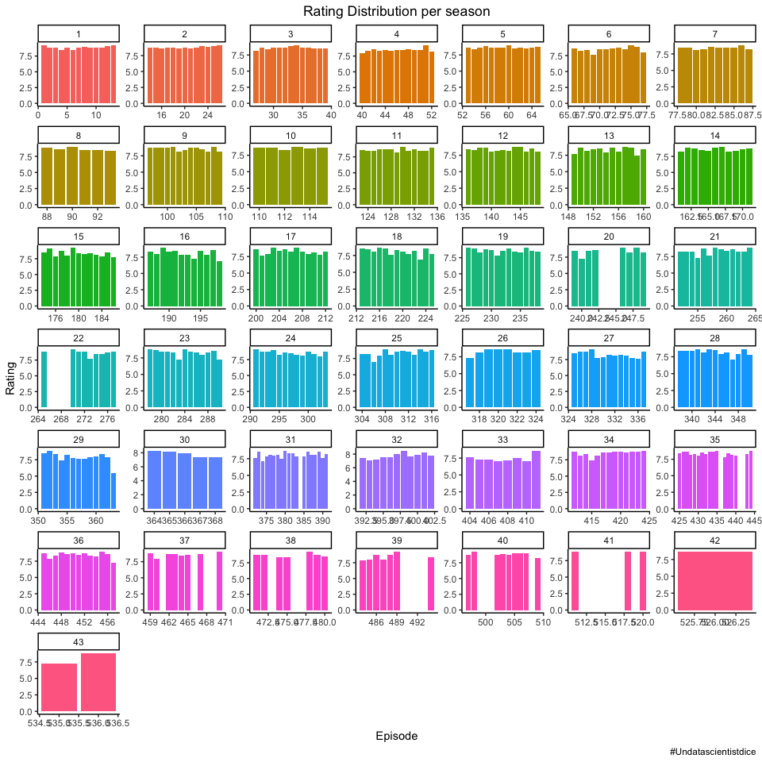

TidyTuesday \#35
================

## libraries

``` r
library(tidyverse)
library(tidymodels)
library(ggthemes)
library(tidytuesdayR)
library(skimr)
theme_set(theme_classic())
library(scales)
library(lubridate)
cap='#Undatascientistdice'
```

## Load Dataset

``` r
tuesdata <- tidytuesdayR::tt_load(2020, week = 35)
```

    ## 
    ##  Downloading file 1 of 1: `chopped.tsv`

``` r
chopped<-tuesdata$chopped
```

## EDA

In this part I Explore the data set, I love begin with `skim`\[1\]
function for denoted a broad overview of a frame.

``` r
chopped%>%
  skim()
```

|                                                  |            |
| :----------------------------------------------- | :--------- |
| Name                                             | Piped data |
| Number of rows                                   | 569        |
| Number of columns                                | 21         |
| \_\_\_\_\_\_\_\_\_\_\_\_\_\_\_\_\_\_\_\_\_\_\_   |            |
| Column type frequency:                           |            |
| character                                        | 17         |
| numeric                                          | 4          |
| \_\_\_\_\_\_\_\_\_\_\_\_\_\_\_\_\_\_\_\_\_\_\_\_ |            |
| Group variables                                  | None       |

Data summary

**Variable type:
character**

| skim\_variable    | n\_missing | complete\_rate | min | max | empty | n\_unique | whitespace |
| :---------------- | ---------: | -------------: | --: | --: | ----: | --------: | ---------: |
| episode\_name     |          0 |           1.00 |   6 |  77 |     0 |       568 |          0 |
| episode\_notes    |        113 |           0.80 |  12 | 830 |     0 |       455 |          0 |
| air\_date         |          0 |           1.00 |  11 |  18 |     0 |       564 |          0 |
| judge1            |          1 |           1.00 |   9 |  18 |     0 |        37 |          0 |
| judge2            |          1 |           1.00 |   9 |  18 |     0 |        27 |          0 |
| judge3            |          1 |           1.00 |   6 |  19 |     0 |        95 |          0 |
| appetizer         |          1 |           1.00 |  18 | 135 |     0 |       568 |          0 |
| entree            |          1 |           1.00 |  34 | 126 |     0 |       568 |          0 |
| dessert           |          1 |           1.00 |  28 | 117 |     0 |       568 |          0 |
| contestant1       |          1 |           1.00 |   6 |  45 |     0 |       566 |          0 |
| contestant1\_info |         13 |           0.98 |   2 | 114 |     0 |       502 |          0 |
| contestant2       |          1 |           1.00 |   7 |  48 |     0 |       561 |          0 |
| contestant2\_info |         14 |           0.98 |   2 | 119 |     0 |       510 |          0 |
| contestant3       |          1 |           1.00 |   6 |  53 |     0 |       556 |          0 |
| contestant3\_info |         14 |           0.98 |   2 | 120 |     0 |       505 |          0 |
| contestant4       |          1 |           1.00 |   8 |  45 |     0 |       507 |          0 |
| contestant4\_info |         14 |           0.98 |   2 | 140 |     0 |       494 |          0 |

**Variable type:
numeric**

| skim\_variable  | n\_missing | complete\_rate |   mean |     sd |  p0 |   p25 |   p50 |   p75 |  p100 | hist  |
| :-------------- | ---------: | -------------: | -----: | -----: | --: | ----: | ----: | ----: | ----: | :---- |
| season          |          0 |           1.00 |  23.12 |  12.96 | 1.0 |  12.0 |  23.0 |  35.0 |  45.0 | ▇▇▇▇▇ |
| season\_episode |          0 |           1.00 |   7.02 |   3.98 | 1.0 |   4.0 |   7.0 |  10.0 |  20.0 | ▇▇▇▂▁ |
| series\_episode |          0 |           1.00 | 284.85 | 164.16 | 1.0 | 143.0 | 285.0 | 427.0 | 567.0 | ▇▇▇▇▇ |
| episode\_rating |        105 |           0.82 |   8.38 |   0.48 | 5.5 |   8.2 |   8.5 |   8.7 |   9.2 | ▁▁▂▅▇ |

Is very interesting the part of `episode_rating`

``` r
chopped%>%
  mutate(season=factor(season))%>%
  filter(!is.na(episode_rating))%>%
  ggplot(aes(series_episode,episode_rating,fill=season))+
  geom_col(show.legend = FALSE)+
  facet_wrap(~season,scales = 'free')+
  labs(title = 'Rating Distribution per season',
       y='Rating',
       x='Episode',
       caption = cap)+
  theme(plot.title = element_text(hjust = .5))
```

<!-- -->

``` r
chopped<-chopped%>%
  mutate(air_date=mdy(air_date))
```

1.  <https://www.rdocumentation.org/packages/skimr/versions/1.0.2/topics/skim>
