Coffe Rating tidytuesday \#28
================

## Explorartory Data Analysis

    ## 
    ##  Downloading file 1 of 1: `coffee_ratings.csv`

    ## # A tibble: 6 x 43
    ##   total_cup_points species owner country_of_orig… farm_name lot_number mill 
    ##              <dbl> <chr>   <chr> <chr>            <chr>     <chr>      <chr>
    ## 1             90.6 Arabica meta… Ethiopia         "metad p… <NA>       meta…
    ## 2             89.9 Arabica meta… Ethiopia         "metad p… <NA>       meta…
    ## 3             89.8 Arabica grou… Guatemala        "san mar… <NA>       <NA> 
    ## 4             89   Arabica yidn… Ethiopia         "yidneka… <NA>       wole…
    ## 5             88.8 Arabica meta… Ethiopia         "metad p… <NA>       meta…
    ## 6             88.8 Arabica ji-a… Brazil            <NA>     <NA>       <NA> 
    ## # … with 36 more variables: ico_number <chr>, company <chr>, altitude <chr>,
    ## #   region <chr>, producer <chr>, number_of_bags <dbl>, bag_weight <chr>,
    ## #   in_country_partner <chr>, harvest_year <chr>, grading_date <chr>,
    ## #   owner_1 <chr>, variety <chr>, processing_method <chr>, aroma <dbl>,
    ## #   flavor <dbl>, aftertaste <dbl>, acidity <dbl>, body <dbl>, balance <dbl>,
    ## #   uniformity <dbl>, clean_cup <dbl>, sweetness <dbl>, cupper_points <dbl>,
    ## #   moisture <dbl>, category_one_defects <dbl>, quakers <dbl>, color <chr>,
    ## #   category_two_defects <dbl>, expiration <chr>, certification_body <chr>,
    ## #   certification_address <chr>, certification_contact <chr>,
    ## #   unit_of_measurement <chr>, altitude_low_meters <dbl>,
    ## #   altitude_high_meters <dbl>, altitude_mean_meters <dbl>

``` r
coffee_ratings%>%
  count(species,sort = TRUE)
```

    ## # A tibble: 2 x 2
    ##   species     n
    ##   <chr>   <int>
    ## 1 Arabica  1311
    ## 2 Robusta    28

``` r
coffee_ratings%>%
  count(country_of_origin,sort = TRUE)
```

    ## # A tibble: 37 x 2
    ##    country_of_origin                n
    ##    <chr>                        <int>
    ##  1 Mexico                         236
    ##  2 Colombia                       183
    ##  3 Guatemala                      181
    ##  4 Brazil                         132
    ##  5 Taiwan                          75
    ##  6 United States (Hawaii)          73
    ##  7 Honduras                        53
    ##  8 Costa Rica                      51
    ##  9 Ethiopia                        44
    ## 10 Tanzania, United Republic Of    40
    ## # … with 27 more rows

``` r
coffee_ratings%>%
  filter(!is.na(country_of_origin))%>%
  group_by(country_of_origin,species)%>%
  summarize(total=n())%>%
  arrange(desc(total))%>%
  ungroup()%>%
  ggplot(aes(fct_reorder(country_of_origin,total),total,fill=species))+
  geom_col(show.legend = TRUE)+
  coord_flip()+
  labs(x='',
       y='Total',
       title = 'Relation Between Contry and Coffe-Type',
       caption = '#Undatascientistdice')
```

    ## `summarise()` regrouping output by 'country_of_origin' (override with `.groups` argument)

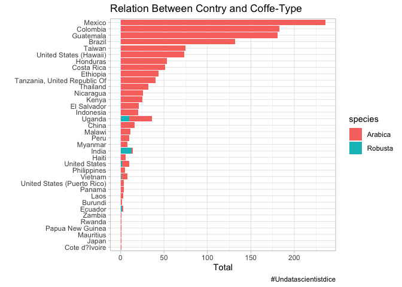<!-- -->

``` r
coffee_ratings%>%
  filter(!is.na(country_of_origin))%>%
  group_by(country_of_origin)%>%
  summarize(avg_points=mean(total_cup_points))%>%
  arrange(desc(avg_points))%>%
  mutate(country_of_origin=fct_reorder(country_of_origin,avg_points))%>%
  ggplot(aes(avg_points,country_of_origin,color=avg_points>mean(coffee_ratings$total_cup_points)))+
  geom_errorbarh(aes(xmin=mean(coffee_ratings$total_cup_points),xmax=avg_points),height = 0)+
  geom_vline(xintercept = mean(coffee_ratings$total_cup_points),linetype='dashed')+
  geom_point()+
  labs(y='',
       x='Avegare Rating',
       title = 'Average Rating Coffe per Contry',
       caption = '#Undatascientistdice')+
  guides(color=FALSE,
         size=FALSE)+
  theme(plot.title = element_text(hjust = 0.5))
```

    ## `summarise()` ungrouping output (override with `.groups` argument)

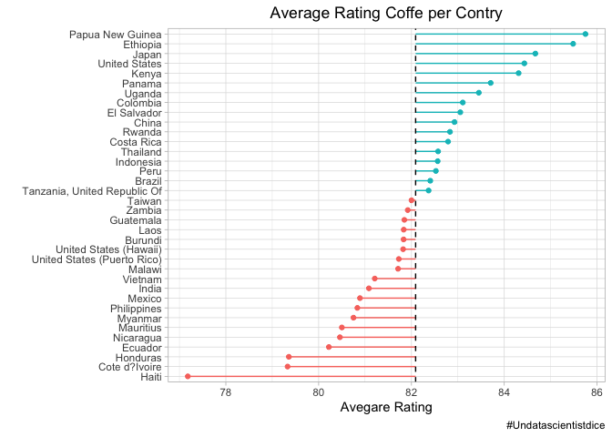<!-- -->

``` r
coffee_ratings%>%
  filter(!is.na(country_of_origin))%>%
  ggplot(aes(fct_reorder(country_of_origin,total_cup_points),total_cup_points,fill=country_of_origin))+
  geom_boxplot(outlier.colour = 'red')+
  coord_flip()+
  labs(x='country',
       y='Rating Scale Ratio')+
  guides(fill=FALSE)
```

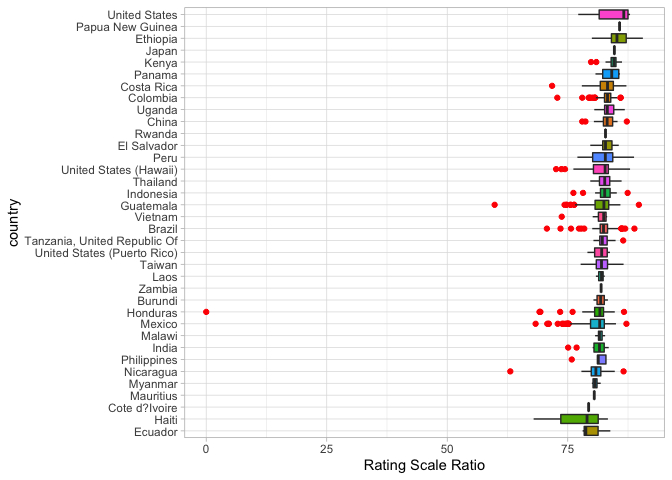<!-- -->

> Is necessary do an anomaly detection analysis

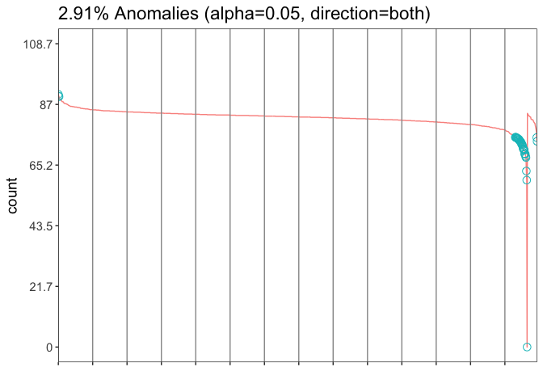<!-- -->

``` r
coffee_ratings%>%
  filter(!is.na(country_of_origin))%>%
  filter(!total_cup_points %in% coffe_anom$anoms$anoms)%>%
  mutate(country_of_origin=fct_reorder(country_of_origin,total_cup_points))%>%
  ggplot(aes(total_cup_points,country_of_origin,fill=country_of_origin))+
  geom_boxplot()+
  guides(fill=FALSE)+
  labs(x='Rating without anomalies',
       y='Country',
       title = 'Relation Between Country - Total Cup Points')
```

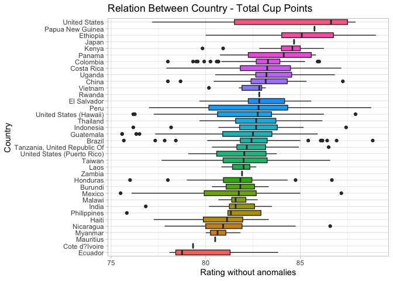<!-- -->

``` r
coffee_wa<-coffee_ratings%>%
  filter(!is.na(country_of_origin))%>%
  filter(!total_cup_points %in% coffe_anom$anoms$anoms)
coffee_wa%>%
  ggplot(aes(total_cup_points,fill=species))+
  geom_histogram()+
  facet_wrap(~species,scales = 'free')+
  guides(fill=FALSE)
```

    ## `stat_bin()` using `bins = 30`. Pick better value with `binwidth`.

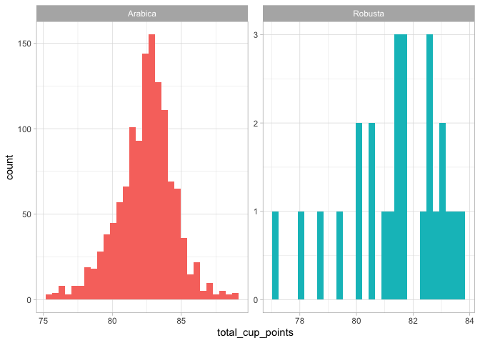<!-- -->

``` r
coffee_wa%>%
  ggplot(aes(total_cup_points,fill=species))+
  geom_histogram()+
  facet_wrap(~country_of_origin,scales = 'free_y')+
  guides(fill=FALSE)
```

    ## `stat_bin()` using `bins = 30`. Pick better value with `binwidth`.

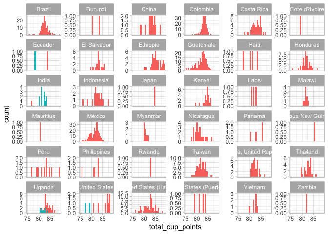<!-- -->

``` r
coffee_cross<-coffee_wa%>%
  group_by(country_of_origin)%>%
  summarize(across(c(total_cup_points,aroma:moisture), list(
    avg =mean,
    total =sum,
    median =median
  )))
```

    ## `summarise()` ungrouping output (override with `.groups` argument)

``` r
coffee_cross%>%
  arrange(desc(total_cup_points_avg))%>%
  mutate(country_of_origin=fct_reorder(country_of_origin,aroma_total))%>%
  ggplot(aes(aroma_total,country_of_origin,fill=total_cup_points_avg))+
  geom_col()+
  labs(fill='Average Rating',
       y='Country')
```

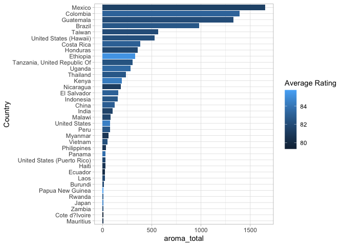<!-- -->

With this Graph, I Understan that `Aroma` not is a faithfil factor for
coffe quality. I love this input\!\! 😃

### Explore some correlation

``` r
coffee_correlation<-coffee_wa%>%
  select(total_cup_points,where(is.numeric))%>%
  select(-c(category_one_defects,quakers,altitude_low_meters,altitude_high_meters,altitude_mean_meters))%>%
  scale()%>%
  cor()

coffee_correlation
```

    ##                      total_cup_points number_of_bags        aroma      flavor
    ## total_cup_points           1.00000000    0.068377037  0.707173329  0.84283012
    ## number_of_bags             0.06837704    1.000000000  0.006270336  0.01780773
    ## aroma                      0.70717333    0.006270336  1.000000000  0.71082693
    ## flavor                     0.84283012    0.017807734  0.710826932  1.00000000
    ## aftertaste                 0.82947466    0.018842179  0.654165389  0.83488733
    ## acidity                    0.73460174    0.058322399  0.575408131  0.72816324
    ## body                       0.66222019    0.069785466  0.500007785  0.60486845
    ## balance                    0.76158853    0.066290326  0.555434551  0.67731611
    ## uniformity                 0.37355220    0.098903362  0.036798411  0.09459581
    ## clean_cup                  0.31970141    0.028479352  0.023416480  0.05594161
    ## sweetness                  0.19198319    0.030834951 -0.069757655 -0.06040863
    ## cupper_points              0.74860530    0.011705928  0.551669761  0.70144716
    ## moisture                  -0.14190284   -0.058733413 -0.136872626 -0.14694069
    ## category_two_defects      -0.20496421    0.016716267 -0.144651459 -0.18511107
    ##                       aftertaste     acidity        body     balance
    ## total_cup_points      0.82947466  0.73460174  0.66222019  0.76158853
    ## number_of_bags        0.01884218  0.05832240  0.06978547  0.06629033
    ## aroma                 0.65416539  0.57540813  0.50000779  0.55543455
    ## flavor                0.83488733  0.72816324  0.60486845  0.67731611
    ## aftertaste            1.00000000  0.69354125  0.60975963  0.70904843
    ## acidity               0.69354125  1.00000000  0.54564117  0.60321289
    ## body                  0.60975963  0.54564117  1.00000000  0.64310959
    ## balance               0.70904843  0.60321289  0.64310959  1.00000000
    ## uniformity            0.08925125  0.05629091 -0.01280404  0.07506076
    ## clean_cup             0.05362732 -0.01767874 -0.04661199  0.02674269
    ## sweetness            -0.07702010 -0.06642433 -0.05995229 -0.06139572
    ## cupper_points         0.69304523  0.57979439  0.48827899  0.59987036
    ## moisture             -0.18782985 -0.13229370 -0.15894220 -0.21535428
    ## category_two_defects -0.20403852 -0.13404728 -0.08462831 -0.16364200
    ##                       uniformity   clean_cup   sweetness cupper_points
    ## total_cup_points      0.37355220  0.31970141  0.19198319    0.74860530
    ## number_of_bags        0.09890336  0.02847935  0.03083495    0.01170593
    ## aroma                 0.03679841  0.02341648 -0.06975766    0.55166976
    ## flavor                0.09459581  0.05594161 -0.06040863    0.70144716
    ## aftertaste            0.08925125  0.05362732 -0.07702010    0.69304523
    ## acidity               0.05629091 -0.01767874 -0.06642433    0.57979439
    ## body                 -0.01280404 -0.04661199 -0.05995229    0.48827899
    ## balance               0.07506076  0.02674269 -0.06139572    0.59987036
    ## uniformity            1.00000000  0.47249243  0.16800145    0.07320533
    ## clean_cup             0.47249243  1.00000000  0.16968694    0.05048813
    ## sweetness             0.16800145  0.16968694  1.00000000   -0.08432852
    ## cupper_points         0.07320533  0.05048813 -0.08432852    1.00000000
    ## moisture              0.04496621  0.06992361  0.10615104   -0.18157643
    ## category_two_defects -0.11156168 -0.05565244  0.00425513   -0.17428579
    ##                         moisture category_two_defects
    ## total_cup_points     -0.14190284          -0.20496421
    ## number_of_bags       -0.05873341           0.01671627
    ## aroma                -0.13687263          -0.14465146
    ## flavor               -0.14694069          -0.18511107
    ## aftertaste           -0.18782985          -0.20403852
    ## acidity              -0.13229370          -0.13404728
    ## body                 -0.15894220          -0.08462831
    ## balance              -0.21535428          -0.16364200
    ## uniformity            0.04496621          -0.11156168
    ## clean_cup             0.06992361          -0.05565244
    ## sweetness             0.10615104           0.00425513
    ## cupper_points        -0.18157643          -0.17428579
    ## moisture              1.00000000           0.12673672
    ## category_two_defects  0.12673672           1.00000000

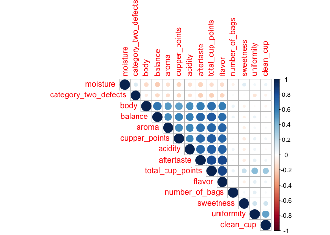<!-- -->

With this correlation I think that I can develped some Feature Engineer.
But First I need Undertad other insights😃

``` r
coffee_cross%>%
  ggplot(aes(flavor_avg,total_cup_points_avg))+
  geom_jitter(alpha=1/3)+
  geom_text_repel(aes(label=country_of_origin))
```

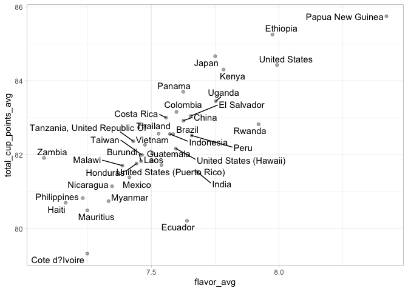<!-- -->

``` r
coffee_cross%>%
  ggplot(aes(flavor_total,total_cup_points_avg))+
  geom_jitter(alpha=1/3)+
  geom_text_repel(aes(label=country_of_origin))+
  labs(x='Flavor',
       y='Avg Rating of Preference',
       title = 'Relation Between Rating and Flavor')
```

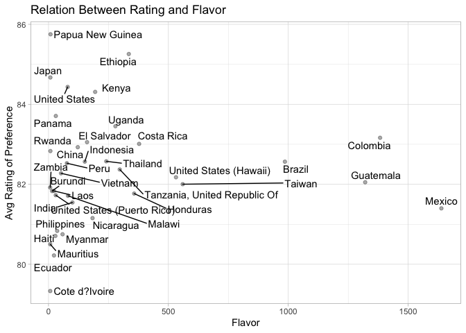<!-- -->

I think that with `Aroma` can I develop a deeper analysis.

``` r
coffee_cross%>%
  ggplot(aes(aroma_avg,flavor_avg))+
  geom_point(aes(size=total_cup_points_total,color=country_of_origin))+
  geom_text_repel(aes(label=country_of_origin))+
  labs(size='Total Rating',
       x='Average Aroma',
       y='Average Flavor',
       title = 'Taste structure for coffee',
       caption= '#Undatascientistdice')+
  guides(color=FALSE)
```

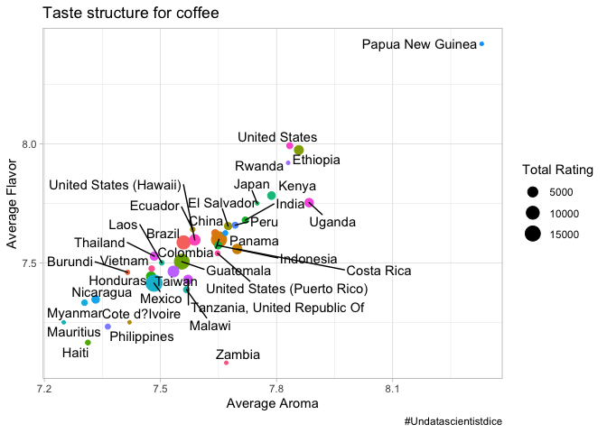<!-- -->

This is interesting, a high rate of flavor or aroma it’s not decisive to
be better cataloged.

``` r
coffee_cross%>%
  ggplot(aes(aroma_avg,aftertaste_avg))+
  geom_point(aes(size=total_cup_points_total,color=country_of_origin))+
  geom_text_repel(aes(label=country_of_origin))+
  labs(size='Total Rating',
       x='Average Aroma',
       y='Average Aftertaste',
       title = "Taste structure for coffee",
       caption= '#Undatascientistdice')+
  guides(color=FALSE)
```

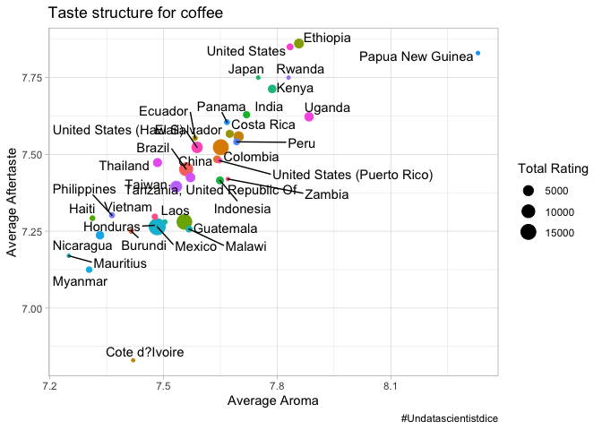<!-- -->

This is incredible insigths\!\! `Aftertaste grade` is the most importat
for create new levels in the `rating`.

## Feature Engineering

``` r
coffee_wa$harvest_year<-as.numeric(coffee_wa$harvest_year)
```

    ## Warning: NAs introduced by coercion

``` r
coffee_wa<-coffee_wa%>%
  mutate(harvest_year=gsub("[^0-9.-]+","",harvest_year),
         expiration=lubridate::mdy(expiration))

numerical_features<-coffee_wa%>%
  select(total_cup_points,where(is.numeric))%>%
  select(-c(altitude_low_meters,altitude_high_meters,altitude_mean_meters))%>%
  lm(total_cup_points~ ., data = .)%>%
  tidy()%>%
  filter(p.value<=.05)%>%
  select(term)
categorical_features<-  
coffee_wa%>%
  select(total_cup_points,where(is.character))%>%
  select(-c(lot_number,ico_number,altitude,certification_address,certification_contact,unit_of_measurement))%>%
  lm(total_cup_points~ ., data = .)%>%
  tidy()%>%
  filter(p.value<=.05)%>%
  select(term)%>%
  mutate(new_term=str_replace_all(term,('owner'),''),
         new_term=str_replace_all(new_term,('country_of_origin'),''),
         new_term=str_replace_all(new_term,('farm_name'),''),
         new_term=str_replace_all(new_term,('mill'),''),
         new_term=str_replace_all(new_term,('region'),''),
         new_term=str_replace_all(new_term,('producer'),''),
         new_term=str_replace_all(new_term,('grading_date'),''))%>%
  select(new_term)
  

categorical_features
```

    ## # A tibble: 16 x 1
    ##    new_term                     
    ##    <chr>                        
    ##  1 (Intercept)                  
    ##  2 asefa dukamo keroma          
    ##  3 diamond enterprise plc       
    ##  4 metad plc                    
    ##  5 seid damtew coffee planataion
    ##  6 agua de la mariposa          
    ##  7 echo coffee                  
    ##  8 finca el gavilancillo        
    ##  9 valparaiso                   
    ## 10 cafe altura de san ramon     
    ## 11 bag_weight67 kg              
    ## 12 April 11th, 2014             
    ## 13 April 29th, 2013             
    ## 14 July 17th, 2012              
    ## 15 July 8th, 2015               
    ## 16 May 13th, 2014

``` r
model_for_country<-coffee_wa%>%
  select(total_cup_points,country_of_origin,any_of(numerical_features$term))%>%
  group_by(country_of_origin)%>%
  summarize(models=list(lm(total_cup_points~aroma+flavor+aftertaste+acidity+body+balance+uniformity+clean_cup+sweetness+cupper_points)))%>%
  mutate(tidied=map(models,tidy))%>%
  unnest(tidied)%>%
  filter(p.value<=0.05)
```

    ## `summarise()` ungrouping output (override with `.groups` argument)

``` r
coffee_glance<-coffee_wa%>%
  select(total_cup_points,country_of_origin,any_of(numerical_features$term))%>%
  group_by(country_of_origin)%>%
  summarize(models=list(lm(total_cup_points~aroma+flavor+aftertaste+acidity+body+balance+uniformity+clean_cup+sweetness+cupper_points)))%>%
  mutate(glanced=map(models,broom::glance))%>%
  unnest(glanced)%>%
  filter(!is.na(r.squared),
         !is.na(adj.r.squared))
```

    ## `summarise()` ungrouping output (override with `.groups` argument)

``` r
bad_fit<-coffee_glance%>%
  filter(r.squared<0.25)

coffee_wa%>%
  semi_join(bad_fit,by='country_of_origin')%>%
  ggplot(aes(aroma,total_cup_points,color=factor(country_of_origin)))+
  geom_line(group=1)+
  labs(title = 'Poor Accuracy for Predictions')
```

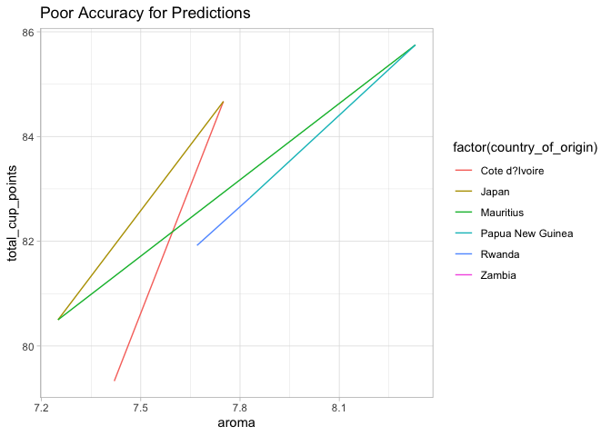<!-- -->

## Build a model

``` r
coffee_wa%>%
  anti_join(bad_fit,by='country_of_origin')%>%
  ggplot(aes(aroma,total_cup_points,color=factor(country_of_origin)))+
  geom_line(group=1)+
  labs(title = 'Good Accuracy Levels for predictions',
       subtitle = 'Under Feature')+
  facet_wrap(~country_of_origin)+
  guides(color=FALSE)
```

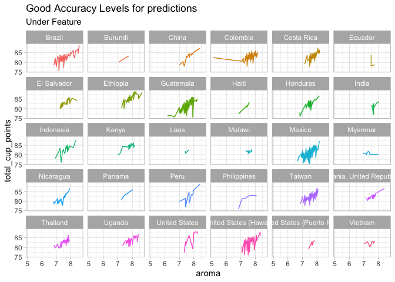<!-- -->

### Models

For create this model is necessary understand the residuals behavior .

``` r
coffee_wa%>%
  select(total_cup_points,country_of_origin,any_of(numerical_features$term))%>%
  group_by(country_of_origin)%>%
  summarize(models=list(lm(total_cup_points~aroma+flavor+aftertaste+acidity+body+balance+uniformity+clean_cup+sweetness+cupper_points)))%>%
  mutate(augmented=map(models,broom::augment))%>%
  unnest(augmented)%>%
  ggplot(aes(total_cup_points,.resid,color=country_of_origin))+
  geom_point(alpha=1/3)+
  geom_smooth()+
  facet_wrap(~country_of_origin,scales = 'fixed')+
  guides(color=FALSE)
```

    ## `summarise()` ungrouping output (override with `.groups` argument)

    ## `geom_smooth()` using method = 'loess' and formula 'y ~ x'

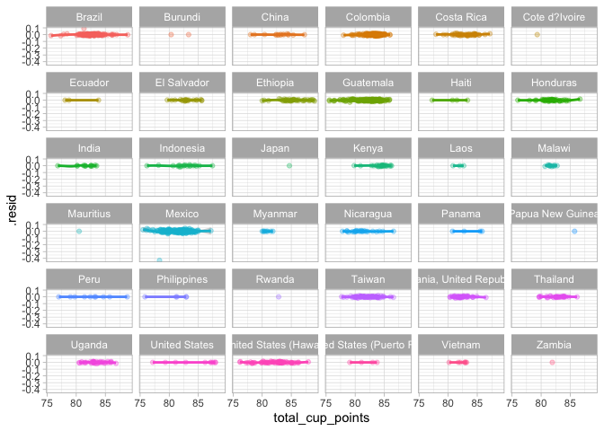<!-- -->

``` r
bad_counties<-c('Vietnam','Zambia','Rwanda','Papua New Guinea','Japan','Mauritius','Cote d?lvoire')
```

``` r
data_for_model<-coffee_wa%>%
  filter(!country_of_origin %in% bad_counties)%>%
  group_by(country_of_origin)%>%
  select(total_cup_points,any_of(numerical_features$term))
```

    ## Adding missing grouping variables: `country_of_origin`

``` r
pca_recipe <- recipe(total_cup_points~., data = data_for_model)
pca_trans <- pca_recipe %>%
  step_center(all_numeric()) %>%
  step_scale(all_numeric()) %>%
  step_pca(all_numeric())

pca_estimates <- prep(pca_trans)
sdev <- pca_estimates$steps[[3]]$res$sdev
percent_variation <- sdev^2 / sum(sdev^2)
var_df <- data.frame(PC=paste0("PC",1:length(sdev)),
                     var_explained=percent_variation,
                     stringsAsFactors = FALSE)
```

``` r
var_df %>%
  mutate(PC = fct_inorder(PC)) %>%
  ggplot(aes(x=PC,y=var_explained))+geom_col()
```

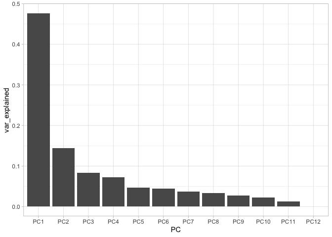<!-- -->

``` r
juice(pca_estimates) %>%
  ggplot(aes(PC1, PC2)) +
  geom_point(aes(color = country_of_origin), alpha = 0.7, size = 2)+
  labs(title="PCA from Coffee Models")
```

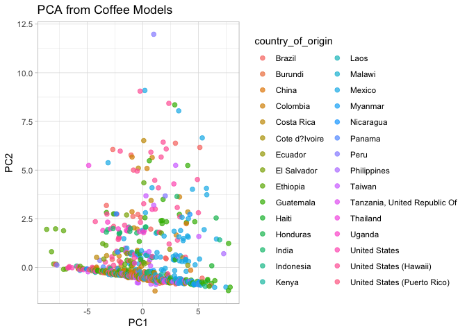<!-- -->

``` r
coffee_rec <- recipe(total_cup_points ~ ., data = data_for_model) %>%
  update_role(country_of_origin,new_role = "id")%>%
  step_normalize(all_predictors()) %>%
  step_pca(all_predictors())

coffee_prep <- prep(coffee_rec)

coffee_prep
```

    ## Data Recipe
    ## 
    ## Inputs:
    ## 
    ##       role #variables
    ##         id          1
    ##    outcome          1
    ##  predictor         11
    ## 
    ## Training data contained 1287 data points and no missing data.
    ## 
    ## Operations:
    ## 
    ## Centering and scaling for aroma, flavor, aftertaste, acidity, ... [trained]
    ## PCA extraction with aroma, flavor, aftertaste, acidity, ... [trained]

``` r
tidied_pca <- tidy(coffee_prep, 2)

tidied_pca %>%
  mutate(component = fct_inorder(component)) %>%
  ggplot(aes(value, terms, fill = terms)) +
  geom_col(show.legend = FALSE) +
  facet_wrap(~component) +
  labs(y = NULL)
```

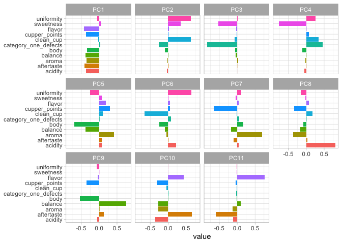<!-- -->

``` r
tidied_pca %>%
  filter(component %in% c("PC1", "PC2", "PC3", "PC4","PC5","PC6")) %>%
  group_by(component) %>%
  top_n(6, abs(value)) %>%
  ungroup() %>%
  mutate(terms = reorder_within(terms, abs(value), component)) %>%
  ggplot(aes(abs(value), terms, fill = value > 0)) +
  geom_col() +
  facet_wrap(~component, scales = "free_y") +
  scale_y_reordered() +
  labs(
    x = "Absolute value of contribution",
    y = NULL, fill = "Positive?"
  )
```

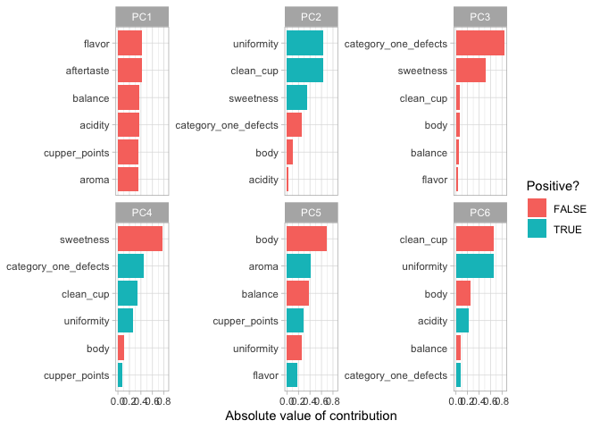<!-- -->

``` r
juice(coffee_prep) %>%
  filter(!country_of_origin %in% bad_counties)%>%
  count(country_of_origin,sort = TRUE)%>%
  filter(n>10)->filter_data
juice(coffee_prep) %>%
  filter(country_of_origin %in% filter_data$country_of_origin)%>%
  lm(total_cup_points~.,data=.)%>%
  augment()%>%
  mutate(reiduals=total_cup_points-.resid)%>%
  ggplot(aes(total_cup_points,reiduals,color=country_of_origin))+
  geom_point(alpha=1/3)+
  geom_smooth()+
  facet_wrap(~country_of_origin,scales = 'fixed')
```

    ## `geom_smooth()` using method = 'loess' and formula 'y ~ x'

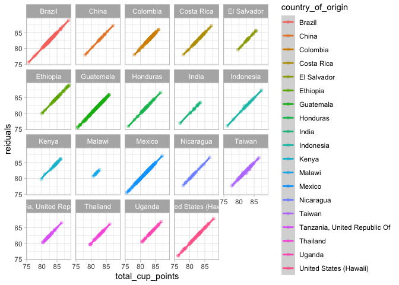<!-- -->
