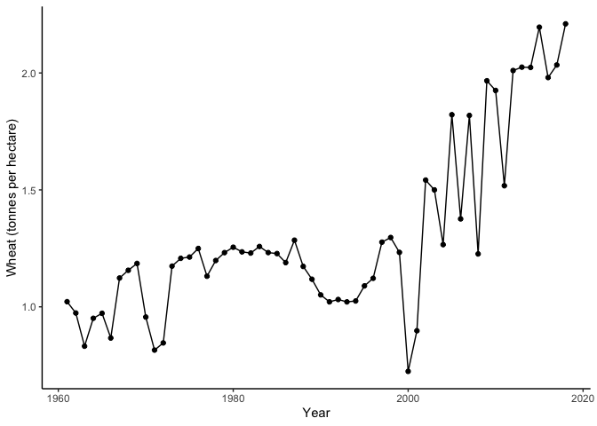
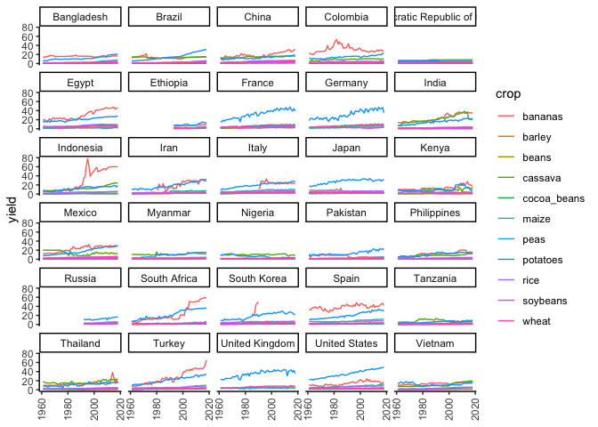
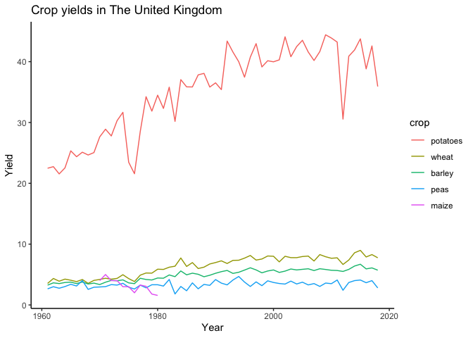
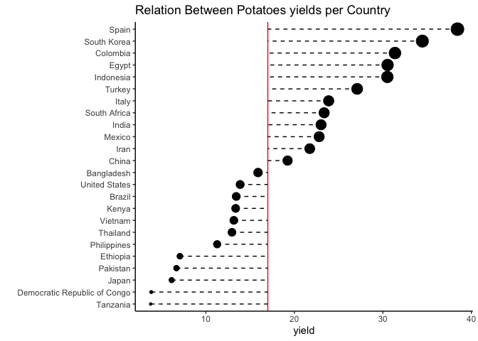
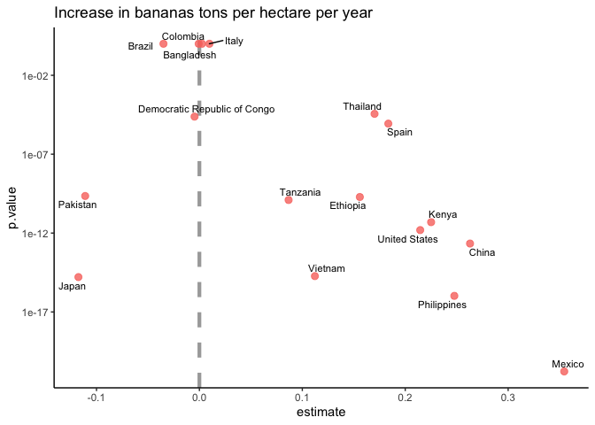

Crop yields
================

``` r
library(tidyverse)
library(tidymodels)
library(tidytext)
library(tidymetrics)
library(scales)
library(ggrepel)
theme_set(theme_classic())
```

## Explore Dataset

``` r
key_crop_yields <- read_csv("https://raw.githubusercontent.com/rfordatascience/tidytuesday/master/data/2020/2020-09-01/key_crop_yields.csv")
land_use <- read_csv("https://raw.githubusercontent.com/rfordatascience/tidytuesday/master/data/2020/2020-09-01/land_use_vs_yield_change_in_cereal_production.csv")
```

``` r
top_countries<-key_crop_yields%>%
  count(Entity)%>%
  filter(n==58)
```

``` r
key_crop_yields%>%
  filter(Entity=='Afghanistan')%>%
  ggplot(aes(Year,`Wheat (tonnes per hectare)`))+
  geom_point()+
  geom_line()
```

<!-- -->

``` r
pivot_crop<-key_crop_yields%>%
  janitor::clean_names()%>%
  select(-code)%>%
  pivot_longer(cols = wheat_tonnes_per_hectare:bananas_tonnes_per_hectare,
               names_to='crop',
               values_to='yield',values_drop_na=TRUE)

top_countries <- land_use %>%
  janitor::clean_names() %>%
  filter(!is.na(code), entity != "World") %>%
  group_by(entity) %>%
  filter(year == max(year)) %>%
  ungroup() %>%
  slice_max(total_population_gapminder, n = 30) %>%
  pull(entity)

pivot_crop<-pivot_crop%>%
  filter(entity %in% top_countries)%>%
  mutate(crop = str_remove(crop, "_tonnes_per_hectare"))
```

``` r
pivot_crop%>%
  ggplot(aes(year,yield,color=crop))+
  geom_line()+
  facet_wrap(~entity,ncol = 5)+
  scale_x_continuous(guide = guide_axis(angle = 90)) +
  labs(x = NULL, y = "yield")
```

<!-- -->

``` r
pivot_crop%>%
  filter(entity=='United Kingdom')%>%
  mutate(crop=fct_reorder(crop,-yield))%>%
  ggplot(aes(year,yield,color=crop))+
  geom_line()+
  labs(x='Year',
       y='Yield',
       title = 'Crop yields in The United Kingdom')
```

<!-- -->

``` r
q<-pivot_crop%>%
  filter(crop=='potatoes')%>%
  group_by(entity)%>%
  summarize(avg_yield_potatoes=mean(yield))%>%
  arrange(desc(avg_yield_potatoes))
```

    ## `summarise()` ungrouping output (override with `.groups` argument)

``` r
mean(q$avg_yield_potatoes)
```

    ## [1] 16.919

``` r
pivot_crop%>%
  filter(crop=='potatoes')%>%
  group_by(entity)%>%
  summarize(avg_yield_potatoes=mean(yield))%>%
  arrange(desc(avg_yield_potatoes))%>%
  ggplot(aes(reorder(entity,avg_yield_potatoes),avg_yield_potatoes))+
  geom_hline(yintercept = 17,color='red')+
  geom_errorbar(aes(ymin=17,ymax=avg_yield_potatoes),linetype = "dashed",width=0)+
  geom_point(aes(size=avg_yield_potatoes),show.legend = FALSE)+
  coord_flip()+
  labs(x='',
       y='yield',
       title = 'Relation Between Potatoes yields per Country')
```

    ## `summarise()` ungrouping output (override with `.groups` argument)

<!-- -->

## Models

``` r
tidy_lm <- pivot_crop %>%
  nest(yields = c(year, yield)) %>%
  mutate(model = map(yields, ~ lm(yield ~ year, data = .x)))

slopes <- tidy_lm %>%
  mutate(coefs = map(model, tidy)) %>%
  unnest(coefs) %>%
  filter(term == "year") %>%
  mutate(p.value = p.adjust(p.value))%>%
  ungroup()
```

``` r
slopes%>%
  arrange(desc(estimate))
```

    ## # A tibble: 270 x 9
    ##    entity    crop   yields     model term  estimate std.error statistic  p.value
    ##    <chr>     <chr>  <list>     <lis> <chr>    <dbl>     <dbl>     <dbl>    <dbl>
    ##  1 South Ko… banan… <tibble [… <lm>  year     6.56    1.53         4.28 3.84e- 1
    ##  2 Indonesia banan… <tibble [… <lm>  year     1.27    0.0797      15.9  3.50e-20
    ##  3 South Af… banan… <tibble [… <lm>  year     0.947   0.0698      13.6  3.91e-17
    ##  4 Turkey    banan… <tibble [… <lm>  year     0.839   0.0359      23.4  3.28e-28
    ##  5 Egypt     banan… <tibble [… <lm>  year     0.583   0.0308      18.9  1.10e-23
    ##  6 South Af… potat… <tibble [… <lm>  year     0.566   0.0204      27.8  4.78e-32
    ##  7 Iran      banan… <tibble [… <lm>  year     0.561   0.0664       8.45 3.21e- 8
    ##  8 France    potat… <tibble [… <lm>  year     0.522   0.0233      22.5  2.55e-27
    ##  9 Germany   potat… <tibble [… <lm>  year     0.504   0.0309      16.3  1.13e-20
    ## 10 United S… potat… <tibble [… <lm>  year     0.497   0.00795     62.6  4.34e-51
    ## # … with 260 more rows

``` r
slopes %>%
  filter(crop=='bananas')%>%
  filter(estimate<0.4)%>%
  ggplot(aes(estimate, p.value, label = entity)) +
  geom_vline(
    xintercept = 0, lty = 2,
    size = 1.5, alpha = 0.7, color = "gray50"
  )+
   geom_point(aes(color = crop), alpha = 0.8, size = 2.5, show.legend = FALSE) +
  scale_y_log10() +
  #facet_wrap(~crop) +
  geom_text_repel(size = 3,force = TRUE) +
  theme(strip.text = element_text(size = 12)) +
  labs(title  = "Increase in bananas tons per hectare per year")
```

<!-- -->
