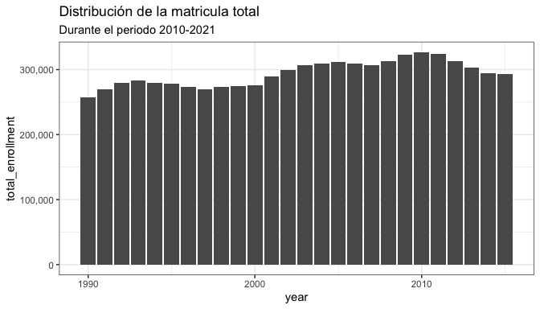
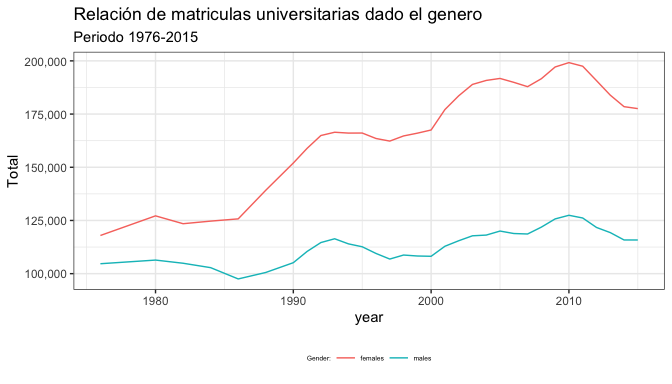
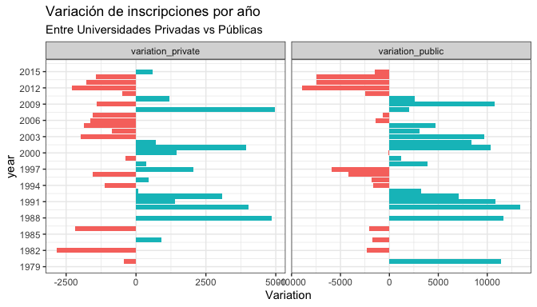
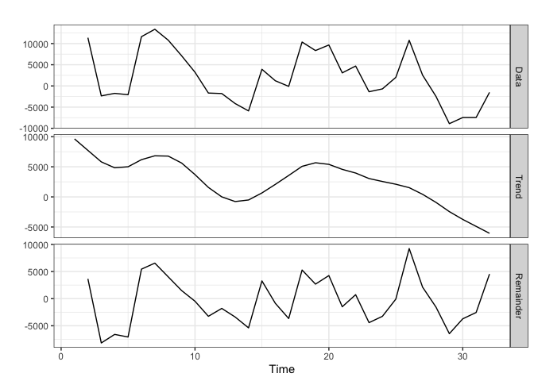
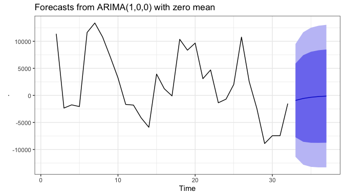
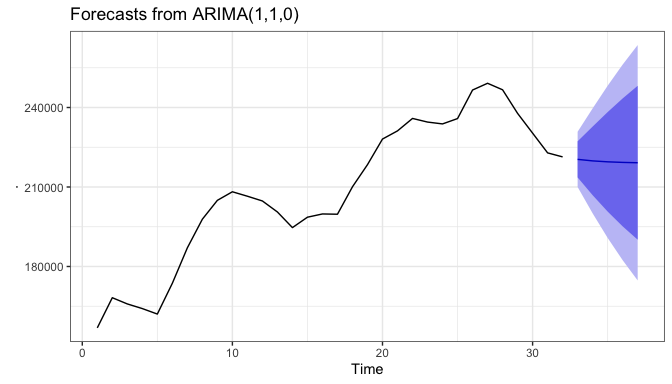
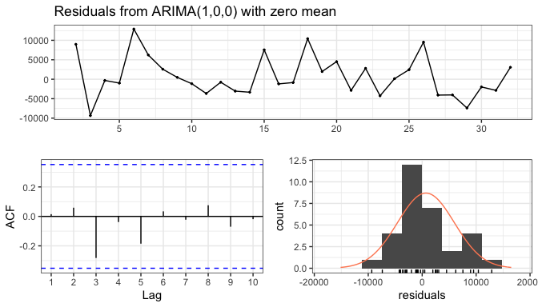
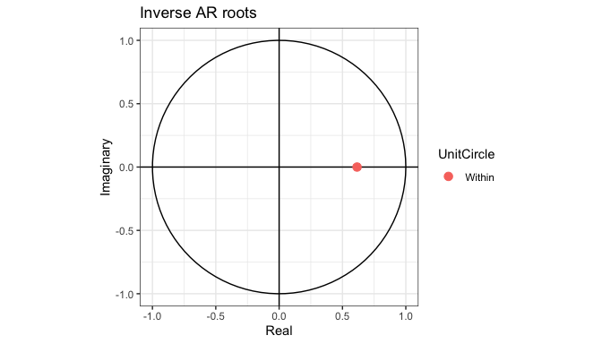
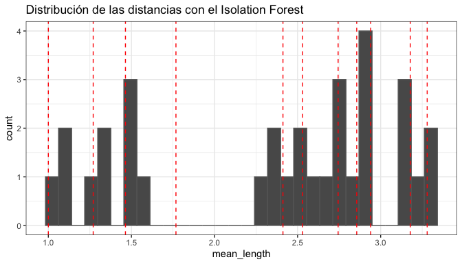
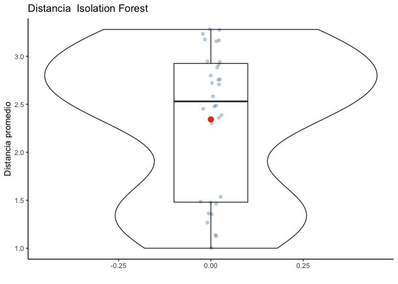

THE HBCU FUNDATION
================

``` r
library(tidyverse)
library(tidymodels)
library(widyr)
library(janitor)
library(tidytext)
library(ggthemes)
library(knitr)
library(scales)
theme_set(theme_wsj())
library(modeldata)
library(forecast)
library(broom)
library(AnomalyDetection)
library(h2o) 
library(solitude)
library(isofor)
```

``` r
hbcu_all <- readr::read_csv('https://raw.githubusercontent.com/rfordatascience/tidytuesday/master/data/2021/2021-02-02/hbcu_all.csv')
```

En este nuevo tidytuesday el reto esta en organizar y entender los datos
matriculas universitarias (asistencia financiera) entre 1976 y 2015.

## Análisis Exploratorio de Datos

Los datos vienen dados de la siguiente manera

``` r
hbcu_all%>%
  head()%>%
  kable(format = 'markdown')
```

| Year | Total enrollment |  Males | Females | 4-year | 2-year | Total - Public | 4-year - Public | 2-year - Public | Total - Private | 4-year - Private | 2-year - Private |
|-----:|-----------------:|-------:|--------:|-------:|-------:|---------------:|----------------:|----------------:|----------------:|-----------------:|-----------------:|
| 1976 |           222613 | 104669 |  117944 | 206676 |  15937 |         156836 |          143528 |           13308 |           65777 |            63148 |             2629 |
| 1980 |           233557 | 106387 |  127170 | 218009 |  15548 |         168217 |          155085 |           13132 |           65340 |            62924 |             2416 |
| 1982 |           228371 | 104897 |  123474 | 212017 |  16354 |         165871 |          151472 |           14399 |           62500 |            60545 |             1955 |
| 1984 |           227519 | 102823 |  124696 | 212844 |  14675 |         164116 |          151289 |           12827 |           63403 |            61555 |             1848 |
| 1986 |           223275 |  97523 |  125752 | 207231 |  16044 |         162048 |          147631 |           14417 |           61227 |            59600 |             1627 |
| 1988 |           239755 | 100561 |  139194 | 223250 |  16505 |         173672 |          158606 |           15066 |           66083 |            64644 |             1439 |

Lo primero es organizar un poco los datos para poder entender a que
procedimiento anexar a los datos

``` r
hbcu_all<-hbcu_all%>%
  arrange(Year)
hbcu_all%>%
  head()
```

    ## # A tibble: 6 x 12
    ##    Year `Total enrollme…  Males Females `4-year` `2-year` `Total - Public`
    ##   <dbl>            <dbl>  <dbl>   <dbl>    <dbl>    <dbl>            <dbl>
    ## 1  1976           222613 104669  117944   206676    15937           156836
    ## 2  1980           233557 106387  127170   218009    15548           168217
    ## 3  1982           228371 104897  123474   212017    16354           165871
    ## 4  1984           227519 102823  124696   212844    14675           164116
    ## 5  1986           223275  97523  125752   207231    16044           162048
    ## 6  1988           239755 100561  139194   223250    16505           173672
    ## # … with 5 more variables: `4-year - Public` <dbl>, `2-year - Public` <dbl>,
    ## #   `Total - Private` <dbl>, `4-year - Private` <dbl>, `2-year - Private` <dbl>

Una vez ordenado los datos se estudia la distribución de los datos

``` r
hbcu_all%>%
  clean_names()%>%
  ggplot(aes(year,total_enrollment))+
  geom_col()+
  scale_y_continuous(labels = comma)
```

<!-- -->

Parece que para estudiar mejor este tipo de distribución tocará truncar
los datos (por el momento) en el rango 1990-2015, pero antes haré una
pequeña limpieza en los nombres

``` r
hbcu_all%>%
  clean_names()%>%
  names()->names_df
names_df%>%
  str_remove_all("x")->names_2

names(hbcu_all)<-names_2
hbcu_all%>%
  head()%>%
  kable(format = 'markdown')
```

| year | total\_enrollment |  males | females | 4\_year | 2\_year | total\_public | 4\_year\_public | 2\_year\_public | total\_private | 4\_year\_private | 2\_year\_private |
|-----:|------------------:|-------:|--------:|--------:|--------:|--------------:|----------------:|----------------:|---------------:|-----------------:|-----------------:|
| 1976 |            222613 | 104669 |  117944 |  206676 |   15937 |        156836 |          143528 |           13308 |          65777 |            63148 |             2629 |
| 1980 |            233557 | 106387 |  127170 |  218009 |   15548 |        168217 |          155085 |           13132 |          65340 |            62924 |             2416 |
| 1982 |            228371 | 104897 |  123474 |  212017 |   16354 |        165871 |          151472 |           14399 |          62500 |            60545 |             1955 |
| 1984 |            227519 | 102823 |  124696 |  212844 |   14675 |        164116 |          151289 |           12827 |          63403 |            61555 |             1848 |
| 1986 |            223275 |  97523 |  125752 |  207231 |   16044 |        162048 |          147631 |           14417 |          61227 |            59600 |             1627 |
| 1988 |            239755 | 100561 |  139194 |  223250 |   16505 |        173672 |          158606 |           15066 |          66083 |            64644 |             1439 |

``` r
hbcu_all%>%
  filter(year>=1990)%>%
  ggplot(aes(year,total_enrollment))+
  geom_col()+
  scale_y_continuous(labels = comma)+
  labs(title = "Distribución de la matricula total",
       subtitle = "Durante el periodo 2010-2021")
```

<!-- -->

El comportamiento de los datos se ve estable, pero voy a mejorar esta
métrica a través de un pivot a ver si así obtengo mayor información en
los datos.

``` r
hbcu_all%>%
  select(year,males,females)%>%
  pivot_longer(!year,names_to = "gender",values_to = 'Total')%>%
  ggplot(aes(year,Total,color=gender))+
  geom_line()+
  scale_y_continuous(labels = comma)+
  theme(legend.position="bottom",
        legend.title   = element_text(size=5),
        legend.text = element_text(size=5))+
  labs(title = 'Relación de matriculas universitarias dado el genero',
       subtitle = 'Periodo 1976-2015',
       color = 'Gender:')
```

<!-- -->
Parece ser que se amplia la distancia entre hombres y mujeres de raza
que estudian se inscriben en la universidad, aunque la tendencia me da
la impresión que nos podemos enfrentar a un caso de datos atípicos y
para ello toca evaluar otros aspectos, lo primero será evaluar el número
de estudiantes en universidades públicas versus las privadas.

``` r
hbcu_all%>%
  select(year,total_private,total_public)%>%
  pivot_longer(!year,names_to = 'Type',values_to = 'Total')%>%
  ggplot(aes(year,Total,color=Type))+
  geom_line()+
  scale_y_continuous(labels = comma)+
  labs(title = "Relación de matricula entre universidades\n Públicas y Privadas",
       subtitle = 'Periodo 1976-2015')+
  theme(legend.position="bottom",
        legend.title   = element_text(size=5),
        legend.text = element_text(size=5))
```

<!-- -->

Las universidades públicas tienen la mayor tasa de inscripciones por
año, más para poder entender mejor este hecho, es necesario evaluar las
variaciones por año.

``` r
hbcu_all%>%
  select(year,total_private,total_public)%>%
  mutate(variation_private = total_private- lag(total_private),
         variation_public = total_public - lag(total_public))%>%
  select(-c(total_private,total_public))%>%
  pivot_longer(!year,
               names_to = 'Type',
               values_to = 'Variation')%>%
  ggplot(aes(year,Variation,fill=Variation>0))+
  geom_col(show.legend = FALSE)+
  scale_x_continuous(breaks = seq(1976,2015,3))+
  facet_grid(~Type, scales='free')+
  coord_flip()+
  labs(title = "Variación de inscripciones por año",
       subtitle = "Entre Universidades Privadas vs Públicas")
```

<!-- --> Es
interesante ver la dinámica de las contracciones entre pública y
privada, pero si se observa detalladamente los positivos en ambos casos
se contraen en los últimos años.

Dada la dinámica sería interesante tratar este problema como una serie
de tiempo, solo para entender un poco la naturaleza de los datos ,
trabajaré con el sector de la universidad pública.

## Serie de tiempo - Universidad Pública

``` r
hbcu_all%>%
  select(year,total_public)%>%
  ts()%>%
  mstl()%>%
  autoplot()+
  theme_bw()
```

<!-- -->

En efecto hay un comportamiento no estacionario en la tendencia, con lo
que podría ser un ligero cambio estructural o tendencia débil

``` r
hbcu_all%>%
  select(total_public)%>%
  ts()%>%
  ggtsdisplay()
```

<!-- -->
Esta gráfica me encanta, la función de autocorrelación (ACF) mide la
correlación entre dos variables dado el tiempo, mientras que la función
de autocorrelación mide la misma correlación entre dos variables pero
separando la idea de dependencia dado los retardos de los datos. En el
anterior gráfico podemos ver que continua dismuye en el ACF, lo que
significa que no existe una asociacion lineal entre las observaciones
separadas por mayores retrasos.

Al diferenciar la serie se puede apreciar lo siguiente

``` r
hbcu_all%>%
  select(total_public)%>%
  ts()%>%
  diff(lag=1)  %>% ggtsdisplay()
```

<!-- -->

Para tratar bien estos datos, haré la diferencia de manera un poco más
eficiente a nivel computacional

``` r
hbcu_all_changes<-hbcu_all%>%
  select(total_public)%>%
  mutate(total_public_change = total_public - lag(total_public))%>%
  select(-total_public)

hbcu_all_changes%>%
  select(total_public_change)%>%
  ts() %>%
  mstl()%>%
  autoplot()
```

<!-- -->
Ahora si se puede evidenciar la tendencia débil a demás del
comportamiento inexplicable de los datos, y didcho lo anterior, se puede
ajustar el modelo arima

``` r
hbcu_all_changes%>%
  select(total_public_change)%>%
  ts() %>%
  auto.arima()
```

    ## Series: . 
    ## ARIMA(1,0,0) with zero mean 
    ## 
    ## Coefficients:
    ##          ar1
    ##       0.6151
    ## s.e.  0.1449
    ## 
    ## sigma^2 estimated as 28293780:  log likelihood=-309.67
    ## AIC=623.34   AICc=623.76   BIC=626.2

El modelo autoregresivo es \[1,0,0\]

``` r
hbcu_all_changes%>%
  select(total_public_change)%>%
  ts() %>%
  auto.arima()%>%
  forecast(h=5)%>%
  autoplot()
```

<!-- -->
Basado en lo anterior la proyección sería la siguiente:

``` r
hbcu_all%>%
  select(total_public)%>%
  ts()%>%
  auto.arima()%>%
  forecast(h=5)%>%
  autoplot()
```

<!-- --> A
la hora de ejecutar un modelo se puede apreciar lo siguiente

``` r
linear_model<-hbcu_all%>%
  select(year,total_public)%>%
  lm(year~.,data = .)

augment(linear_model)%>%
  ggplot(aes(x = year, y = .std.resid)) +
  geom_point()
```

<!-- --> Es
increible el comportamiento de los residuos, su geometría apoya la tesis
de raíz unitaria y posible presencia de datos atípicos.

Ahora solo para descartar cualquier sesgo haré una prueba de normalidad.

``` r
qqnorm(hbcu_all$total_public)
qqline(hbcu_all$total_public)
```

<!-- -->

``` r
shapiro.test(x = hbcu_all$total_public)
```

    ## 
    ##  Shapiro-Wilk normality test
    ## 
    ## data:  hbcu_all$total_public
    ## W = 0.94116, p-value = 0.08075

Con la prueba shapiro se muestra que corresponde a una distribución
normal, finalizo con unos ajustes del modelo para empezar a hallar los
datos atípicos.

``` r
model<-hbcu_all%>%
  select(total_public)%>%
  ts()%>%
  diff()%>%
  auto.arima()

checkresiduals(model)
```

<!-- -->

    ## 
    ##  Ljung-Box test
    ## 
    ## data:  Residuals from ARIMA(1,0,0) with zero mean
    ## Q* = 4.4945, df = 5, p-value = 0.4806
    ## 
    ## Model df: 1.   Total lags used: 6

Ahora que los datos si tienen sesgos se pueden hacer la siguiente
evaluación **raíz unitaria**

``` r
autoplot(model)
```

<!-- -->

El punto rojo fuera del circulo es la raíz compleja, e indica que el
modelo es bueno para prónosticar.

## Encontrando los datos atípicos

Para encontrar lo datos atípicos trabajaré con un isolation forest.

``` r
h2o.init(ip = "localhost",
         nthreads = -1,
         max_mem_size = "4g")
```

    ##  Connection successful!
    ## 
    ## R is connected to the H2O cluster: 
    ##     H2O cluster uptime:         1 hours 24 minutes 
    ##     H2O cluster timezone:       America/Bogota 
    ##     H2O data parsing timezone:  UTC 
    ##     H2O cluster version:        3.32.0.1 
    ##     H2O cluster version age:    3 months and 30 days !!! 
    ##     H2O cluster name:           H2O_started_from_R_danieljimenez_tpl268 
    ##     H2O cluster total nodes:    1 
    ##     H2O cluster total memory:   4.00 GB 
    ##     H2O cluster total cores:    8 
    ##     H2O cluster allowed cores:  8 
    ##     H2O cluster healthy:        TRUE 
    ##     H2O Connection ip:          localhost 
    ##     H2O Connection port:        54321 
    ##     H2O Connection proxy:       NA 
    ##     H2O Internal Security:      FALSE 
    ##     H2O API Extensions:         Amazon S3, XGBoost, Algos, AutoML, Core V3, TargetEncoder, Core V4 
    ##     R Version:                  R version 4.0.3 (2020-10-10)

``` r
h2o.removeAll()
h2o.no_progress()

datos_h2o <- as.h2o(x = hbcu_all$total_public)
```

``` r
isoforest <- h2o.isolationForest(
                model_id = "isoforest",
                training_frame = datos_h2o,
                x              = colnames(datos_h2o),
                max_depth      = 50, 
                ntrees         = 50, 
                sample_rate    = 0.3 
             )
isoforest
```

    ## Model Details:
    ## ==============
    ## 
    ## H2OAnomalyDetectionModel: isolationforest
    ## Model ID:  isoforest 
    ## Model Summary: 
    ##   number_of_trees number_of_internal_trees model_size_in_bytes min_depth
    ## 1              50                       50                9161         4
    ##   max_depth mean_depth min_leaves max_leaves mean_leaves
    ## 1         8    5.14000          6         16     9.94000
    ## 
    ## 
    ## H2OAnomalyDetectionMetrics: isolationforest
    ## ** Reported on training data. **
    ## ** Metrics reported on Out-Of-Bag training samples **

Con el modelo listo, se generan las distancias de aislamiento proemdio

``` r
predicciones_h2o <- h2o.predict(
                      object  = isoforest,
                      newdata = datos_h2o
                    )
predicciones <- as.data.frame(predicciones_h2o)
head(predicciones)
```

    ##     predict mean_length
    ## 1 1.0000000        1.26
    ## 2 0.6696429        2.00
    ## 3 0.7053571        1.92
    ## 4 0.7857143        1.74
    ## 5 0.8035714        1.70
    ## 6 0.6250000        2.10

``` r
predicciones%>%
ggplot(aes(x = mean_length)) +
  geom_histogram(color = "gray40") +
  geom_vline(
    xintercept = quantile(predicciones$mean_length, seq(0, 1, 0.1)),
    color      = "red",
    linetype   = "dashed") +
  labs(
    title = "Distribución de las distancias con el Isolation Forest")
```

<!-- -->
Todo parece indicar que solo hay un dato atípico.

``` r
cuantiles <- quantile(x = predicciones$mean_length, probs = seq(0, 1, 0.05))
predicciones$anomaly = ifelse(predicciones$predict>cuantiles, 1, 0)
```

``` r
datos <- hbcu_all %>%
  select(total_public)%>%
         bind_cols(predicciones)
datos%>%
  ggplot(aes(x = anomaly, y = mean_length)) +
  geom_jitter(aes(color = anomaly), width = 0.03, alpha = 0.3) + 
  geom_violin(alpha = 0) +
  geom_boxplot(width = 0.2, outlier.shape = NA, alpha = 0) +
  stat_summary(fun = "mean", colour = "orangered2", size = 3, geom = "point") +
  labs(title = "Distancia  Isolation Forest",
     x = "",
     y = "Distancia promedio") +
theme(legend.position = "none")
```

<!-- -->

Encontramos lo que parecía un dato atípico! Pero no! su comportamiento
esta dentro de lo normal.

Bueno en este tidytuesday estudiamos:

-   como identificar la estacionalidad de una serie de tiempo,
-   Identificar anomalías dentro de las series
-   Ajustar una base de datos para poder realizar con ello un postumo
    análisis.
