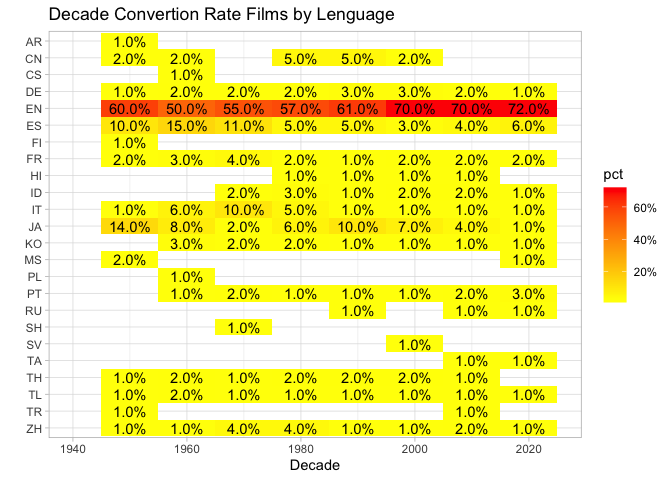
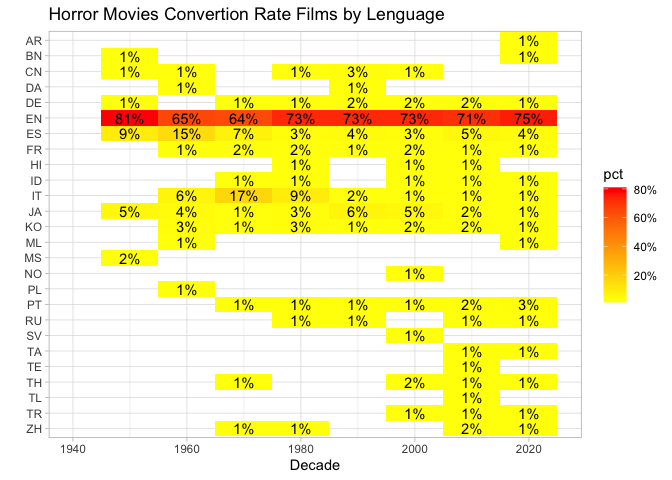
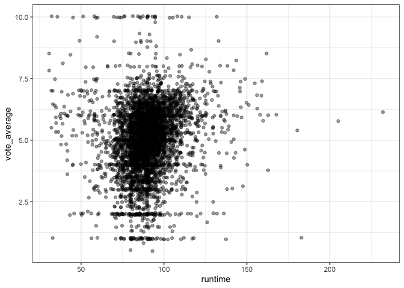
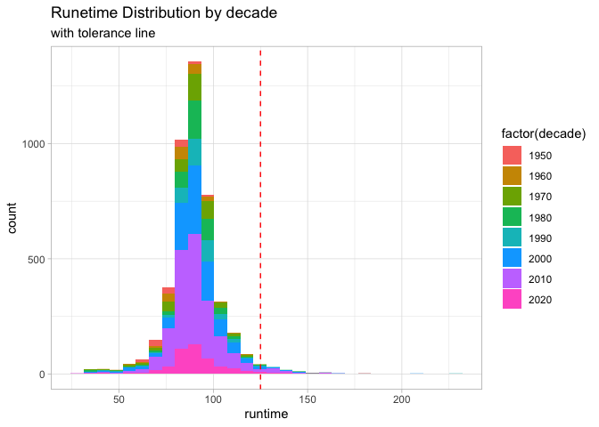
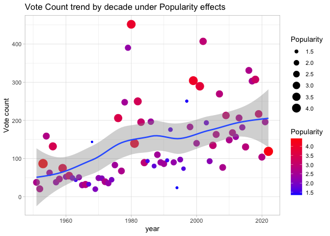
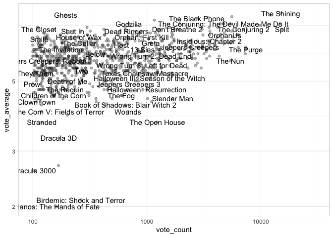
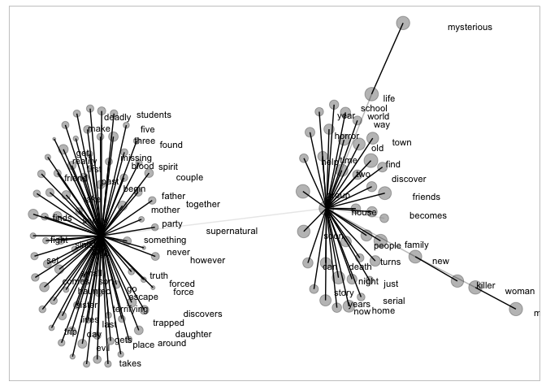
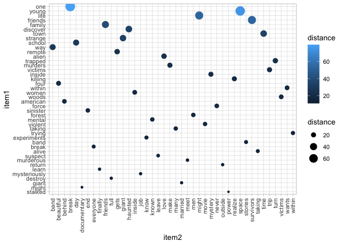
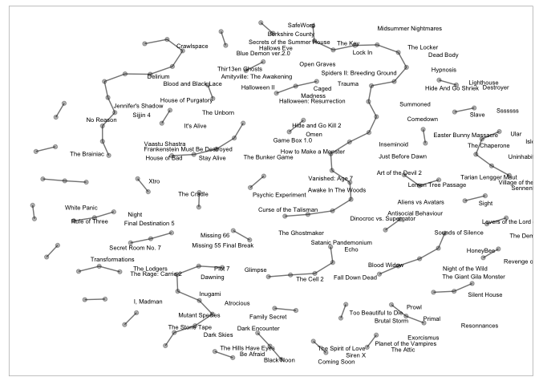

Horror Movies
================

## Libraries ———–

``` r
library(tidyverse)
library(tidymodels)
library(textrecipes)
library(stopwords)
library(lubridate)
library(tidytext)
library(scales)
library(ggraph)
library(tidygraph)
library(widyr)
theme_set(theme_light())
```

## Import Dataset ——-

``` r
horror_movies <- readr::read_csv('https://raw.githubusercontent.com/rfordatascience/tidytuesday/master/data/2022/2022-11-01/horror_movies.csv')
```

## Exploratory Data Analysis ——-

``` r
horror_movies %>%
  mutate(original_language=str_to_upper(original_language)) %>%
  group_by(original_language,
           decade=(year(release_date) %/%10)*10) %>%
  count(sort = TRUE) %>%
  group_by(decade) %>%
  mutate(pct=round(n/sum(n),2)) %>%
  ungroup() %>%
  filter(pct>0) %>%
  ggplot(aes(decade,
             original_language,
             fill = pct))+
  geom_tile()+
  geom_text(aes(label = percent(pct))) +
  scale_fill_gradient(high = "red", 
                       low = 'yellow',
                       labels = percent) +
  scale_y_discrete(limits=rev)+
  expand_limits(x=1940) +
  labs(title = 'Decade Convertion Rate Films by Lenguage',
       y = '' ,
       x = 'Decade')
```

<!-- -->

``` r
horror_movies %>%
  separate(genre_names,c('genre','genreII'),sep = ',',extra = 'merge',fill = 'left') %>%
  filter(genre=='Horror') %>%
  mutate(original_language=str_to_upper(original_language)) %>%
  group_by(original_language,
           decade=(year(release_date) %/%10)*10) %>%
  count(sort = TRUE) %>%
  group_by(decade) %>%
  mutate(pct=round(n/sum(n),2)) %>%
  ungroup() %>%
  filter(pct>0) %>%
  ggplot(aes(decade,
             original_language,
             fill = pct))+
  geom_tile()+
  geom_text(aes(label = percent(pct))) +
  scale_fill_gradient(high = "red", 
                       low = 'yellow',
                       labels = percent) +
  scale_y_discrete(limits=rev)+
  expand_limits(x=1940) +
  labs(title = 'Horror Movies Convertion Rate Films by Lenguage',
       y = '' ,
       x = 'Decade')
```

<!-- -->

``` r
horror_movies <- horror_movies %>%
  mutate(decade = (year(release_date) %/%10)*10) %>%
  separate(genre_names,c('genre','genreII'),sep = ',',extra = 'merge',fill = 'left') %>%
  filter(genre=='Horror',
         vote_average>0,
         runtime>30) 


cor.test(horror_movies$popularity,horror_movies$vote_count)
```

    ## 
    ##  Pearson's product-moment correlation
    ## 
    ## data:  horror_movies$popularity and horror_movies$vote_count
    ## t = 9.2632, df = 4536, p-value < 2.2e-16
    ## alternative hypothesis: true correlation is not equal to 0
    ## 95 percent confidence interval:
    ##  0.1075862 0.1646991
    ## sample estimates:
    ##       cor 
    ## 0.1362559

``` r
cor.test(horror_movies$vote_count , horror_movies$vote_average)
```

    ## 
    ##  Pearson's product-moment correlation
    ## 
    ## data:  horror_movies$vote_count and horror_movies$vote_average
    ## t = 14.838, df = 4536, p-value < 2.2e-16
    ## alternative hypothesis: true correlation is not equal to 0
    ## 95 percent confidence interval:
    ##  0.1872326 0.2427334
    ## sample estimates:
    ##       cor 
    ## 0.2151567

``` r
horror_movies %>%
  ggplot(aes(runtime,vote_average))+
  geom_jitter(alpha=0.4)+
  theme_bw()
```

<!-- -->

``` r
horror_movies %>%
  mutate(decade = (year(release_date) %/%10)*10) %>%
  group_by(decade) %>%
  ggplot(aes(runtime, fill=factor(decade)))+
  geom_histogram()+
  geom_vline(xintercept = quantile(horror_movies$runtime,
                                   probs = seq(0, 1, 0.01))[99],
             linetype='dashed',
             color='red')+
  labs(title = 'Runetime Distribution by decade',
       subtitle = 'with tolerance line')
```

<!-- -->

``` r
horror_movies %>%
 group_by(year=year(release_date)) %>%
 summarize(avg_vote_count = mean(vote_count),
           median_popularity = median(popularity)) %>%
  ungroup() %>%
  ggplot(aes(year,
             avg_vote_count))+
  geom_point(aes(size=median_popularity, 
                 color=median_popularity)) +
  geom_smooth()+
  scale_color_gradient(low = 'blue',high = 'red')+
  labs(title = 'Vote Count trend by decade under Popularity effects',
       y = 'Vote count',
       x = 'year',
       size='Popularity',
       color='Popularity')
```

<!-- -->

``` r
horror_movies %>%
  filter(vote_count >= 100) %>%
  ggplot(aes(vote_count,
             vote_average))+
  geom_point(alpha=0.3)+
  geom_text(aes(label=title),
           check_overlap = TRUE)+
  scale_x_log10()+
  scale_y_log10()+
  expand_limits(x=30000)
```

<!-- -->

## Modelling ———–

``` r
data_model<-horror_movies %>%
  mutate(calification = case_when(
    vote_average < 4 ~ 'Bad',
    vote_average >=4 & vote_average<=7 ~ 'Regular',
    vote_average >7 ~ 'Excelente',
    TRUE ~ 'OTHER'
  )) %>%
  select(title,decade,overview,popularity,vote_count,runtime,calification) %>%
  na.omit()
```

### Generate Networks Clusters ———–

``` r
bw<-stopwords(language = 'en')

relation_words_by_decade<-data_model %>%
  group_by(decade) %>%
  unnest_tokens(word,overview) %>%
  filter(!word %in% bw) %>%
  filter(!str_detect(word,'[0-9]+')) %>%
  add_count(word,name = 'word_total') %>%
  distinct() %>%
  arrange(desc(word_total)) %>%
  filter(word_total>50)


total_words<-data_model %>%
  unnest_tokens(word,overview) %>%
  filter(!word %in% bw) %>%
  filter(!str_detect(word,'[0-9]+')) %>%
  group_by(word) %>%
  count(sort = TRUE) 

relation_words_by_decade %>%
  pairwise_cor(word,decade,sort=TRUE,upper=FALSE) %>%
  distinct(item2,.keep_all = TRUE) %>%
  filter(!is.na(correlation)) %>%
  as_tbl_graph() %>%
  inner_join(total_words,by=c(name = 'word')) %>%
  ggraph(layout = 'fr')+
  geom_edge_link(aes(edge_alpha = correlation))+
  geom_node_point(aes(size=n),
                  alpha=0.3) +
  geom_node_text(aes(label=name),
                 check_overlap = TRUE,
                 vjust=1,
                 hjust=-1,
                 size=3)+
  theme(legend.position = 'none')
```

<!-- -->

### Understand context overview ——

``` r
relation_words<-data_model %>%
  unnest_tokens(word,overview) %>%
  filter(!word %in% bw) %>%
  filter(!str_detect(word,'[0-9]+')) %>%
  add_count(word,name = 'word_total') %>%
  distinct() %>%
  arrange(desc(word_total)) %>%
  filter(word_total>50)


relation_words %>%
  pairwise_dist(word, 
                popularity, 
                vote_count, 
                upper=FALSE,
                sort=TRUE) %>%
  distinct(item1,.keep_all = TRUE) %>%
  distinct(item2,.keep_all = TRUE) %>%
  mutate(item2=as.factor(item2),
         item1 =  reorder_within(item1,distance,item2)) %>%
  ungroup() %>%
  ggplot(aes(item2,item1,color=distance))+
  geom_point(aes(size=distance))+
  scale_y_reordered()+
  theme(axis.text.x = element_text(angle = 90, vjust = 0.5, hjust=1))
```

<!-- -->

## Similarity movies ———-

``` r
relation_words<-data_model %>%
  group_by(title) %>%
  unnest_tokens(word,overview) %>%
  filter(!word %in% bw) %>%
  filter(!str_detect(word,'[0-9]+')) %>%
  add_count(word,name = 'word_total') %>%
  distinct(word,title,.keep_all = TRUE) %>%
  arrange(desc(word_total)) %>%
  filter(word_total>2) %>%
  ungroup()


relation_words %>%
  pairwise_similarity(title,word,word_total, sort=TRUE,upper=FALSE) %>%
  distinct(item1,.keep_all = TRUE) %>%
  head(100) %>%
  filter(!is.na(similarity)) %>%
  as_tbl_graph() %>%
  ggraph(layout = 'fr')+
  geom_edge_link(aes(edge_alpha = similarity))+
  geom_node_point(alpha=0.3) +
  geom_node_text(aes(label=name),
                 check_overlap = TRUE,
                 vjust=1,
                 hjust=-1,
                 size=2)+
  theme(legend.position = 'none')
```

<!-- -->
