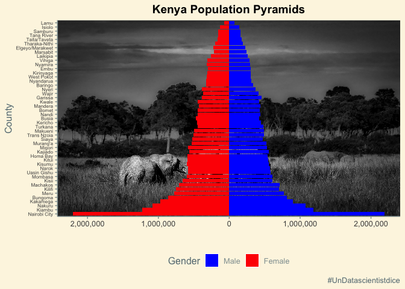
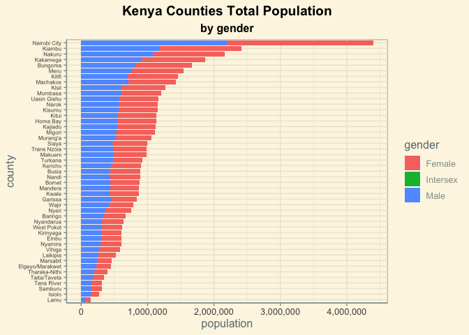
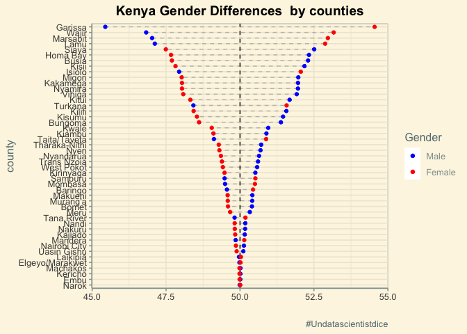
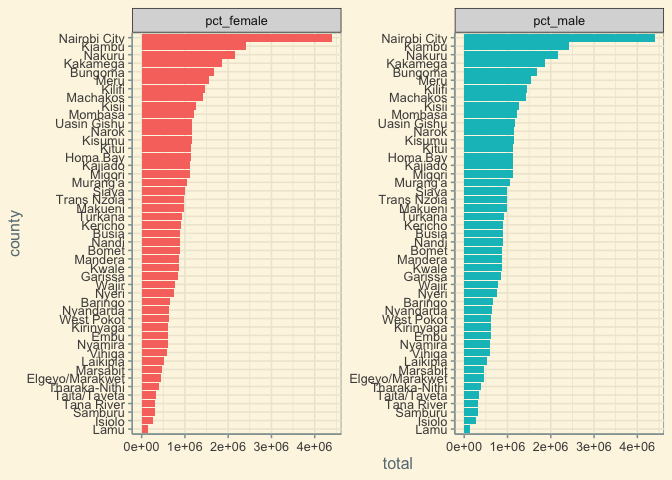
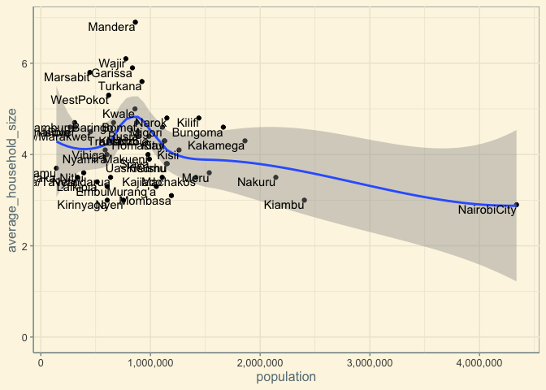
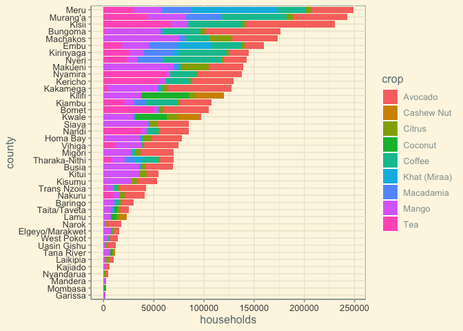
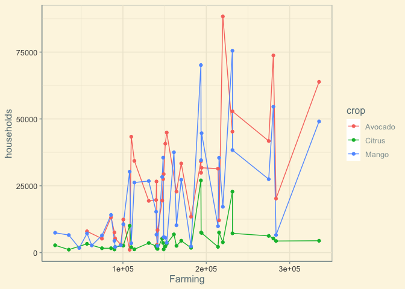
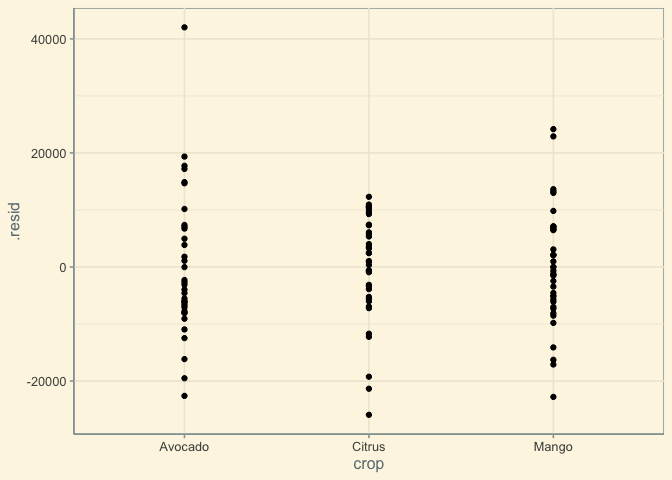
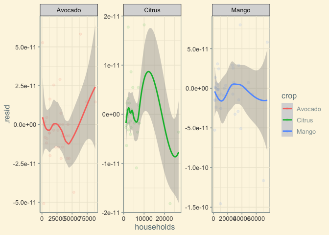

Kenya Census
================

## Libraries

``` r
library(tidyverse)
library(tidymodels)
library(scales)
library(ggpubr)
library(ggimage) 
library(ggthemes)
library(jpeg)
library(janitor)
library(broom)
theme_set(theme_solarized())
```

## Data

``` r
gender <- readr::read_csv('https://raw.githubusercontent.com/rfordatascience/tidytuesday/master/data/2021/2021-01-19/gender.csv')
crops <- readr::read_csv('https://raw.githubusercontent.com/rfordatascience/tidytuesday/master/data/2021/2021-01-19/crops.csv')
households <- readr::read_csv('https://raw.githubusercontent.com/rfordatascience/tidytuesday/master/data/2021/2021-01-19/households.csv')
```

## Explore Data Analysis

``` r
img <- readJPEG("kenya.jpeg")
```

## Kenya Population Pyramids

``` r
abs_commma <- function(x) {comma(abs(x))}
gender%>%
  filter(County!='Total')%>%
  mutate(County=fct_reorder(County,-Total))%>%
  ggplot(aes(Male,County))+
  background_image(img)+
  geom_col(aes(fill="blue"))+
  #scale_fill_manual(values = "blue")+
  geom_col(aes(-Female,County,fill="red"))+
  scale_fill_manual(values = c("blue","red"),
                    name="Gender",
                    breaks=c("blue","red"),
                    labels=c("Male","Female"))+
  scale_x_continuous(labels = abs_commma)+
  labs(x='',
       y='County',
       title = 'Kenya Population Pyramids',
       caption = '#UnDatascientistdice',
       fill="")+
  theme(plot.title = element_text(hjust = 0.5,face = "bold",color='black'),
        legend.position = "bottom",
        axis.text.y = element_text(size = 6))
```

<!-- -->

``` r
gender%>%
  clean_names()%>%
  filter(county!='Total')%>%
  gather(gender,population, male,female,intersex)%>%
  mutate(county=fct_reorder(county,total,sum))%>%
  mutate(gender=str_to_title(gender))%>%
  ggplot(aes(population,county,fill=gender))+
  geom_col()+
  #scale_x_log10()
  scale_x_continuous(labels = comma)+
  labs(title = "Kenya Counties Total Population",
       subtitle = "by gender")+
  theme(plot.title = element_text(hjust = 0.5,face = "bold",color='black'),
        plot.subtitle = element_text(hjust = 0.5,face = "bold",color='black'),
        axis.text.y = element_text(size = 6))
```

<!-- -->

``` r
# Hogares
households<-households%>%
  clean_names()%>%
  mutate(county=str_trim(county))

## Cultivos
crops
```

    ## # A tibble: 48 x 11
    ##    SubCounty Farming    Tea Coffee Avocado Citrus  Mango Coconut Macadamia
    ##    <chr>       <dbl>  <dbl>  <dbl>   <dbl>  <dbl>  <dbl>   <dbl>     <dbl>
    ##  1 KENYA     6354211 476613 478936  966976 177445 796867   90952    195999
    ##  2 MOMBASA     12497     NA     NA      NA     NA     NA    1688        NA
    ##  3 KWALE      108074     NA     NA    1063  10053  30272   31954       881
    ##  4 KILIFI     161188     NA     NA      NA   6808  37519   47561        NA
    ##  5 TANA RIV…   35094     NA     NA      NA   1109   6561    2228        NA
    ##  6 LAMU        18678     NA     NA      NA   2742   7423    5017       189
    ##  7 TAITA/TA…   56920     NA     NA    7963   3284   7171    2504      3650
    ##  8 GARISSA     47645     NA     NA      NA     NA   1726      NA        NA
    ##  9 WAJIR       63433     NA     NA      NA     NA     NA      NA        NA
    ## 10 MANDERA     62639     NA     NA      NA     NA   2685      NA        NA
    ## # … with 38 more rows, and 2 more variables: `Cashew Nut` <dbl>, `Khat
    ## #   (Miraa)` <dbl>

``` r
gender%>%
  clean_names()%>%
  mutate(pct_female=(female/total)*100,
         pct_male =(male/total)*100,
         differences=abs(pct_male-pct_female))%>%
  filter(county!='Total')%>%
  mutate(county=fct_reorder(county,differences,sum))%>%
  ggplot(aes(y=county))+
  geom_segment(aes(x=pct_female,xend=pct_male,yend=county), linetype="dashed",color="gray")+
  geom_vline(xintercept = 50, color='black',linetype="dashed")+
  geom_point(aes(x=pct_female,color='pct_female'))+
  geom_point(aes(x=pct_male,color='pct_male'))+
  scale_color_manual(values = c("blue","red"),
                    name="Gender",
                    labels=c("Male","Female"))+
  labs(title = "Kenya Gender Differences  by counties",
       caption = "#Undatascientistdice",
       x='')+
  theme(plot.title = element_text(hjust = 0.5,face = "bold",color='black'))
```

<!-- -->

``` r
library(tidytext)
gender_c<-gender%>%
  clean_names()%>%
  filter(county!='Total')%>%
  mutate(pct_female=(female/total)*100,
         pct_male =(male/total)*100)%>%
  gather(pct_gender,perc,pct_female,pct_male)%>%
  select(-c(male:intersex))%>%
  ungroup()
gender_c%>%
  mutate(pct_gender=as.factor(pct_gender),
         county=reorder_within(county,total,pct_gender))%>%
  ggplot(aes(total,county,fill=pct_gender))+
  geom_col(show.legend = FALSE)+
  scale_y_reordered()+
  facet_wrap(~pct_gender, scales = 'free_y')
```

<!-- -->

``` r
households%>%
  filter(county!='Kenya')%>%
  arrange(desc(average_household_size))%>%
  ggplot(aes(population,average_household_size))+
  geom_point()+
  geom_smooth()+
  geom_text(aes(label=county),
            vjust=1,
            hjust=1)+
  expand_limits(y=0)+
  scale_x_continuous(labels = comma)
```

<!-- -->

### Crops

``` r
crops_type<-crops%>%
  gather(crop,households,-SubCounty,-Farming)%>%
  filter(!is.na(households))

crops_type%>%
  rename(county=SubCounty)%>%
  mutate(county=str_to_title(county))%>%
  filter(county!='Kenya')%>%
  mutate(county=fct_reorder(county,households,sum))%>%
  ggplot(aes(households,county,fill=crop))+
  geom_col()
```

<!-- -->

## Linear model to each county crop combination (Avocado,Citrus,Mango)

``` r
crops_type%>%
  rename(county=SubCounty)%>%
  mutate(county=str_to_title(county))%>%
  filter(county!='Kenya')->crops_type

crops_type%>%
  filter(crop %in% c('Mango','Citrus','Avocado'))%>%
  ggplot(aes(Farming,households,color=crop))+
  geom_line()+
  geom_point()
```

<!-- -->

``` r
lineal_model<-crops_type%>%
  filter(county!='Kenya')%>%
  filter(crop %in% c('Mango','Citrus','Avocado'))
```

``` r
lineal_model <-lm(households~.,data = lineal_model)
```

``` r
lineal_model%>%
  augment() %>%
  ggplot(aes(x = crop, y = .resid)) + 
  geom_point()
```

<!-- -->

``` r
lineal_model<-crops_type%>%
  filter(county!='Kenya')%>%
  filter(crop %in% c('Mango','Citrus','Avocado'))
lineal_model%>%
  group_by(crop)%>%
  nest()%>%
   mutate(model = map(data, function(x){
    lm(households~., data = x)
  }))
```

    ## # A tibble: 3 x 3
    ## # Groups:   crop [3]
    ##   crop    data              model 
    ##   <chr>   <list>            <list>
    ## 1 Avocado <tibble [35 × 3]> <lm>  
    ## 2 Citrus  <tibble [37 × 3]> <lm>  
    ## 3 Mango   <tibble [39 × 3]> <lm>

``` r
create_baseline_model <- function(x){
  lm(households~., data = x)
}

lineal_model%>%
  group_by(crop)%>%
  nest()%>%
  mutate(model = map(data, create_baseline_model)) %>% 
  mutate(results = map(model, augment))%>%
  select(crop, results) %>% 
  unnest() %>% 
  ungroup()%>%
  select(crop, households, .resid)%>%
  ggplot(aes(x = households, y = .resid, color = crop)) + 
  geom_point(alpha = .1) + 
  geom_smooth() + 
  facet_wrap(~crop, scales = "free")
```

<!-- -->
