Gapminder Many Models
================
Daniel Jiménez

## Documentation

[R for Data Science](https://r4ds.had.co.nz/many-models.html)

## Colocar algo acá

## Explore Dataset

``` r
gapminder%>%
  head()
```

    ## # A tibble: 6 x 6
    ##   country     continent  year lifeExp      pop gdpPercap
    ##   <fct>       <fct>     <int>   <dbl>    <int>     <dbl>
    ## 1 Afghanistan Asia       1952    28.8  8425333      779.
    ## 2 Afghanistan Asia       1957    30.3  9240934      821.
    ## 3 Afghanistan Asia       1962    32.0 10267083      853.
    ## 4 Afghanistan Asia       1967    34.0 11537966      836.
    ## 5 Afghanistan Asia       1972    36.1 13079460      740.
    ## 6 Afghanistan Asia       1977    38.4 14880372      786.

``` r
gapminder%>%
  skim()
```

|                                                  |            |
| :----------------------------------------------- | :--------- |
| Name                                             | Piped data |
| Number of rows                                   | 1704       |
| Number of columns                                | 6          |
| \_\_\_\_\_\_\_\_\_\_\_\_\_\_\_\_\_\_\_\_\_\_\_   |            |
| Column type frequency:                           |            |
| factor                                           | 2          |
| numeric                                          | 4          |
| \_\_\_\_\_\_\_\_\_\_\_\_\_\_\_\_\_\_\_\_\_\_\_\_ |            |
| Group variables                                  | None       |

Data summary

**Variable type:
factor**

| skim\_variable | n\_missing | complete\_rate | ordered | n\_unique | top\_counts                            |
| :------------- | ---------: | -------------: | :------ | --------: | :------------------------------------- |
| country        |          0 |              1 | FALSE   |       142 | Afg: 12, Alb: 12, Alg: 12, Ang: 12     |
| continent      |          0 |              1 | FALSE   |         5 | Afr: 624, Asi: 396, Eur: 360, Ame: 300 |

**Variable type:
numeric**

| skim\_variable | n\_missing | complete\_rate |        mean |           sd |       p0 |        p25 |        p50 |         p75 |         p100 | hist  |
| :------------- | ---------: | -------------: | ----------: | -----------: | -------: | ---------: | ---------: | ----------: | -----------: | :---- |
| year           |          0 |              1 |     1979.50 |        17.27 |  1952.00 |    1965.75 |    1979.50 |     1993.25 |       2007.0 | ▇▅▅▅▇ |
| lifeExp        |          0 |              1 |       59.47 |        12.92 |    23.60 |      48.20 |      60.71 |       70.85 |         82.6 | ▁▆▇▇▇ |
| pop            |          0 |              1 | 29601212.32 | 106157896.74 | 60011.00 | 2793664.00 | 7023595.50 | 19585221.75 | 1318683096.0 | ▇▁▁▁▁ |
| gdpPercap      |          0 |              1 |     7215.33 |      9857.45 |   241.17 |    1202.06 |    3531.85 |     9325.46 |     113523.1 | ▇▁▁▁▁ |

life expectancy at birth per Continent

``` r
lifeExpsum<-gapminder%>%
  group_by(continent)%>%
  summarize(mean_lifeExp=mean(lifeExp),
            median_lifeExp=median(lifeExp),
            str_lifeExp=sd(lifeExp))

gapminder%>%
  inner_join(lifeExpsum)%>%
  ggplot(aes(lifeExp))+
  geom_histogram(aes(fill=continent))+
  geom_vline(aes(xintercept=mean_lifeExp),linetype="dashed")+
  facet_wrap(~continent,scales='free')+
  guides(fill=FALSE)+
  labs(y='',
       x='life expectancy at birth',
       title = 'Life Expectancy Distribution',
       subtitle = 'With Intercept in avegarage',
       caption = 'Many Models')
```

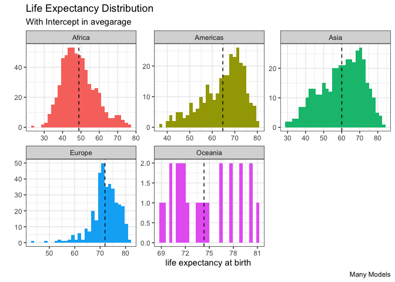<!-- -->

``` r
gapminder%>%
  ggplot(aes(fct_reorder(continent,lifeExp),lifeExp,fill=continent))+
  geom_boxplot()+
  guides(fill=FALSE)+
  labs(x='Continent',
       y= 'life expectancy',
       title = 'Comparative Relation Between Continent and Life Expectation')
```

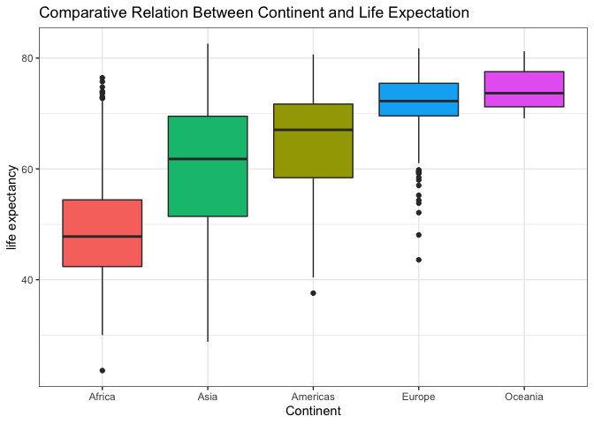<!-- -->

``` r
gapminder%>%
  ggplot(aes(fct_reorder(continent,pop),pop,fill=continent))+
  geom_boxplot()+
  guides(fill=FALSE)+
  scale_y_log10()+
  labs(x='Continent',
       y= 'Poblation',
       title = 'Comparative Relation Between (log) Poblation and Life Expectation')
```

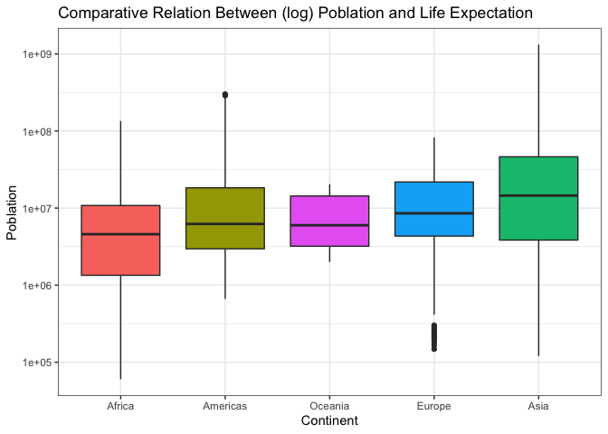<!-- -->

``` r
gapminder%>%
  group_by(continent)%>%
  summarize(corr=cor(lifeExp,pop))%>%
  mutate(continent=fct_reorder(continent,corr))%>%
  ggplot(aes(corr,continent,color=corr>0.05))+
  geom_errorbarh(aes(xmin=0.05,xmax=corr),height = 0,linetype = "dashed")+
  geom_point(aes(size=corr))+
  geom_vline(aes(xintercept=0.05),linetype='dotted')+
  guides(size=FALSE,
         color=FALSE)+
  labs(x='Correlation',
       y='Continent',
       title='Correlation Between Life Exp and Poblation',
       suntitle='Per Continet')
```

    ## `summarise()` ungrouping output (override with `.groups` argument)

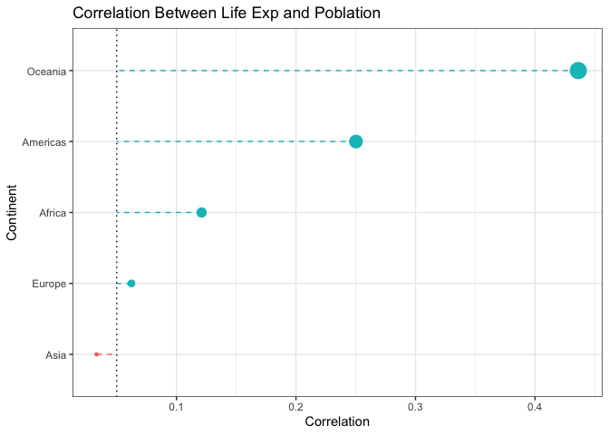<!-- -->

``` r
gapminder%>%
  ggplot(aes(lifeExp,pop,color=continent))+
  geom_point(alpha=0.1)+
  scale_y_log10()+
  geom_smooth()
```

    ## `geom_smooth()` using method = 'loess' and formula 'y ~ x'

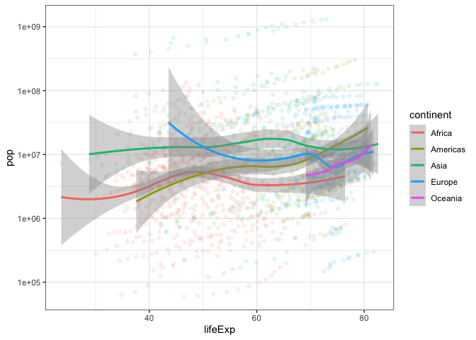<!-- -->

``` r
gapminder%>%
  ggplot(aes(lifeExp,
             gdpPercap,
             color=continent))+
  geom_point(alpha=0.4)+
  geom_smooth(method='lm',color='black')+
  facet_wrap(~continent,scales='free_y')+
  guides(color=FALSE)
```

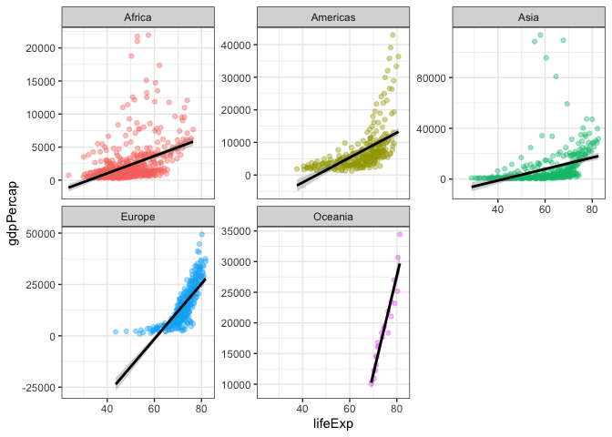<!-- -->

``` r
gapminder%>%
  ggplot(aes(lifeExp,
             gdpPercap,
             color=continent))+
  geom_point(alpha=0.4)+
  geom_smooth(method='loess',color='black')+
  facet_wrap(~continent,scales='free_y')+
  guides(color=FALSE)
```

    ## `geom_smooth()` using formula 'y ~ x'

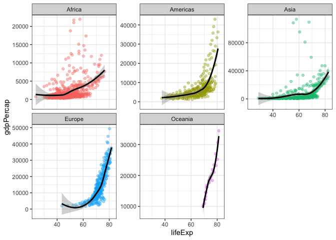<!-- -->

``` r
lm(lifeExp~.,data = gapminder)%>%
  tidy()%>%
  filter(p.value<=0.05)
```

    ## # A tibble: 141 x 5
    ##    term              estimate std.error statistic   p.value
    ##    <chr>                <dbl>     <dbl>     <dbl>     <dbl>
    ##  1 (Intercept)         -610.      11.4     -53.7  0.       
    ##  2 countryAlbania        31.4      1.44     21.8  3.80e- 92
    ##  3 countryAlgeria        21.8      1.44     15.1  3.04e- 48
    ##  4 countryArgentina      32.0      1.45     22.1  2.19e- 94
    ##  5 countryAustralia      38.7      1.48     26.1  9.36e-125
    ##  6 countryAustria        37.3      1.48     25.1  4.41e-117
    ##  7 countryBahrain        29.7      1.47     20.2  1.81e- 80
    ##  8 countryBangladesh     11.0      1.45      7.59 5.29e- 14
    ##  9 countryBelgium        37.7      1.48     25.5  7.98e-120
    ## 10 countryBenin          11.5      1.44      8.02 2.10e- 15
    ## # … with 131 more rows

``` r
gapminder%>%
  group_by(country,continent)%>%
  summarize(gam_model=list(gam(lifeExp~year+pop+gdpPercap)))%>%
  mutate(glanced = map(gam_model,glance))%>%
  unnest(glanced)
```

    ## `summarise()` regrouping output by 'country' (override with `.groups` argument)

    ## # A tibble: 142 x 9
    ## # Groups:   country [142]
    ##    country     continent gam_model    df logLik   AIC   BIC deviance df.residual
    ##    <fct>       <fct>     <list>    <dbl>  <dbl> <dbl> <dbl>    <dbl>       <dbl>
    ##  1 Afghanistan Asia      <gam>      3.   -29.3   66.5  68.4   92.0          9.00
    ##  2 Albania     Europe    <gam>      3.   -22.0   52.1  54.0   27.7          9.00
    ##  3 Algeria     Africa    <gam>      3.00 -21.0   50.0  52.0   23.3          9.  
    ##  4 Angola      Africa    <gam>      3.00 -25.0   58.0  59.9   45.3          9.  
    ##  5 Argentina   Americas  <gam>      3.    -1.47  10.9  12.9    0.898        9.00
    ##  6 Australia   Oceania   <gam>      3.    -8.72  25.4  27.4    3.00         9.00
    ##  7 Austria     Europe    <gam>      3.    -8.05  24.1  26.0    2.69         9.00
    ##  8 Bahrain     Asia      <gam>      3.   -27.3   62.6  64.6   66.6          9.00
    ##  9 Bangladesh  Asia      <gam>      3.00 -11.8   31.6  33.5    5.01         9.  
    ## 10 Belgium     Europe    <gam>      3.00  -5.97  19.9  21.9    1.90         9.  
    ## # … with 132 more rows

``` r
gapminder%>%
  group_by(country,continent)%>%
  summarize(lm_model=list(lm(lifeExp~year+pop+gdpPercap)))%>%
  mutate(tidied=map(lm_model,tidy))%>%
  unnest(tidied)%>%
  summarize(adjusted_pvalue = p.adjust(p.value, method = "fdr"))
```

    ## `summarise()` regrouping output by 'country' (override with `.groups` argument)
    ## `summarise()` regrouping output by 'country' (override with `.groups` argument)

    ## # A tibble: 568 x 2
    ## # Groups:   country [142]
    ##    country     adjusted_pvalue
    ##    <fct>                 <dbl>
    ##  1 Afghanistan      0.00000564
    ##  2 Afghanistan      0.00000564
    ##  3 Afghanistan      0.00651   
    ##  4 Afghanistan      0.264     
    ##  5 Albania          0.370     
    ##  6 Albania          0.370     
    ##  7 Albania          0.182     
    ##  8 Albania          0.182     
    ##  9 Algeria          0.0884    
    ## 10 Algeria          0.0884    
    ## # … with 558 more rows

``` r
country_pvalue<-gapminder%>%
  group_by(country,continent)%>%
  summarize(lm_model=list(lm(lifeExp~year+pop+gdpPercap)))%>%
  mutate(tidied=map(lm_model,tidy))%>%
  unnest(tidied)%>%
  group_by(country,continent)%>%
  summarize(adjusted_pvalue = p.adjust(p.value, method = "fdr"))
```

    ## `summarise()` regrouping output by 'country' (override with `.groups` argument)

    ## `summarise()` regrouping output by 'country', 'continent' (override with `.groups` argument)

``` r
country_pvalue%>%
  arrange(adjusted_pvalue)%>%
  mutate(country=fct_reorder(country,-adjusted_pvalue))%>%
  distinct(country,adjusted_pvalue,.keep_all = TRUE)%>%
  filter(adjusted_pvalue<=.05)%>%
  mutate(continet=as.factor(continent),
         country=reorder_within(country,-adjusted_pvalue,continent))%>%
  ggplot(aes(country,adjusted_pvalue,color=continent))+
  geom_point()+
  scale_x_reordered()+
  facet_wrap(~continent,scales = 'free_y')+
  coord_flip()
```

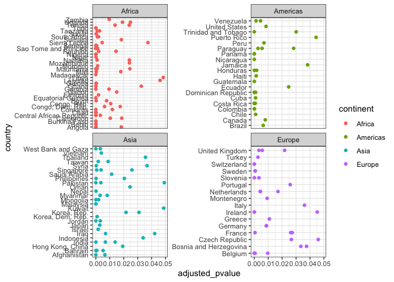<!-- -->

``` r
gapminder%>%
  group_by(continent)%>%
  summarize(lm_model=list(lm(lifeExp~year)))%>%
  mutate(tidied=map(lm_model,tidy,conf.int = TRUE))%>%
  unnest(tidied)%>%
  filter(term!="(Intercept)") %>%
  mutate(continent=fct_reorder(continent,estimate))%>%
  ggplot(aes(estimate,continent)) +
  geom_point()+
  geom_errorbarh(aes(xmin=conf.low, xmax=conf.high,height = .3))
```

    ## `summarise()` ungrouping output (override with `.groups` argument)

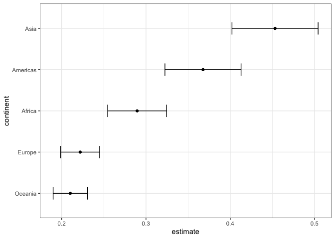<!-- -->

## Create model

``` r
numerical_features <- gapminder %>% 
  select(lifeExp, where(is.numeric)) %>% 
  lm(lifeExp~., data = .) %>% 
  tidy() %>% 
  filter(p.value <= .05) %>% 
  select(term)


categorical_features <-gapminder %>% 
  select(lifeExp, where(is.factor)) %>% 
  lm(lifeExp~., data = .) %>% 
  tidy() %>% 
  filter(p.value <= .05) %>% 
  select(term)%>%
  separate(col=term,
           into=c('country','country_name'),
           sep='country')%>%
  select(country_name)%>%
  na.omit()
```

    ## Warning: Expected 2 pieces. Missing pieces filled with `NA` in 1 rows [1].

``` r
gapminder%>%
  group_by(country,continent)%>%
  summarize(lm_model=list(lm(lifeExp~year+pop+gdpPercap)))%>%
  mutate(glanced=map(lm_model,glance))%>%
  unnest(glanced)%>%
  mutate(country=fct_reorder(country,r.squared))%>%
  ggplot(aes(continent,r.squared))+
  geom_jitter()+
  geom_text_repel(aes(label=country))+
  facet_wrap(~continent,scales='free')
```

    ## `summarise()` regrouping output by 'country' (override with `.groups` argument)

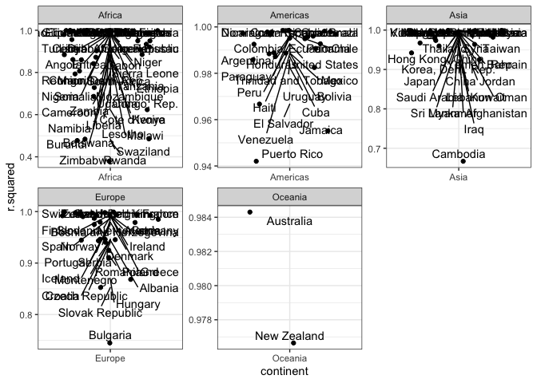<!-- -->

``` r
set.seed(2020)
gm_split <- initial_split(gapminder,prop=0.7,strata = lifeExp)
gm_train <- training(gm_split)
gm_test <- testing(gm_split)

xgboost_model <- 
  parsnip::boost_tree(
    mode = "regression",
    trees = 100,
    min_n = tune(),
    tree_depth = tune(),
    learn_rate = tune(),
    loss_reduction = tune()
  ) %>%
    set_engine("xgboost", objective = "reg:squarederror")
```

``` r
preprocessing_recipe <- recipes::recipe(lifeExp ~ ., data = training(gm_split)) %>%
  recipes::step_string2factor(all_nominal()) %>%
  recipes::step_other(all_nominal(), threshold = 0.01) %>%
  recipes::step_nzv(all_nominal()) %>%
  prep()


gm_cv_folds <- 
  recipes::bake(
    preprocessing_recipe, 
    new_data = training(gm_split)
  ) %>%  
  rsample::vfold_cv(v = 20)
```

``` r
xgboost_params <- dials::parameters(
    min_n(),
    tree_depth(),
    learn_rate(),
    loss_reduction()
  )


xgboost_grid <- dials::grid_max_entropy(
    xgboost_params, 
    size = 60
  )

knitr::kable(head(xgboost_grid))
```

| min\_n | tree\_depth | learn\_rate | loss\_reduction |
| -----: | ----------: | ----------: | --------------: |
|     20 |           2 |   0.0000000 |       0.0000110 |
|      2 |           1 |   0.0268170 |       0.0000000 |
|     40 |          11 |   0.0000000 |       0.0019171 |
|     10 |          12 |   0.0000000 |       0.0000000 |
|     38 |          15 |   0.0000017 |       0.0011556 |
|      4 |          15 |   0.0000000 |       0.0000010 |

``` r
xgboost_wf <- 
  workflows::workflow() %>%
  add_model(xgboost_model) %>% 
  add_formula(lifeExp ~ .)
xgboost_wf
```

    ## ══ Workflow ══════════════════
    ## Preprocessor: Formula
    ## Model: boost_tree()
    ## 
    ## ── Preprocessor ──────────────
    ## lifeExp ~ .
    ## 
    ## ── Model ─────────────────────
    ## Boosted Tree Model Specification (regression)
    ## 
    ## Main Arguments:
    ##   trees = 100
    ##   min_n = tune()
    ##   tree_depth = tune()
    ##   learn_rate = tune()
    ##   loss_reduction = tune()
    ## 
    ## Engine-Specific Arguments:
    ##   objective = reg:squarederror
    ## 
    ## Computational engine: xgboost

``` r
xgboost_tuned <- tune::tune_grid(
  object = xgboost_wf,
  resamples = gm_cv_folds,
  grid = xgboost_grid,
  metrics = yardstick::metric_set(rmse, rsq, mae),
  control = tune::control_grid(verbose = TRUE)
)
```

    ## i Fold01: formula

    ## ✓ Fold01: formula

    ## i Fold01: model  1/60

    ## ✓ Fold01: model  1/60

    ## i Fold01: model  1/60

    ## ✓ Fold01: model  1/60

    ## i Fold01: model  2/60

    ## ✓ Fold01: model  2/60

    ## i Fold01: model  2/60

    ## ✓ Fold01: model  2/60

    ## i Fold01: model  3/60

    ## ✓ Fold01: model  3/60

    ## i Fold01: model  3/60

    ## ✓ Fold01: model  3/60

    ## i Fold01: model  4/60

    ## ✓ Fold01: model  4/60

    ## i Fold01: model  4/60

    ## ✓ Fold01: model  4/60

    ## i Fold01: model  5/60

    ## ✓ Fold01: model  5/60

    ## i Fold01: model  5/60

    ## ✓ Fold01: model  5/60

    ## i Fold01: model  6/60

    ## ✓ Fold01: model  6/60

    ## i Fold01: model  6/60

    ## ✓ Fold01: model  6/60

    ## i Fold01: model  7/60

    ## ✓ Fold01: model  7/60

    ## i Fold01: model  7/60

    ## ✓ Fold01: model  7/60

    ## i Fold01: model  8/60

    ## ✓ Fold01: model  8/60

    ## i Fold01: model  8/60

    ## ✓ Fold01: model  8/60

    ## i Fold01: model  9/60

    ## ✓ Fold01: model  9/60

    ## i Fold01: model  9/60

    ## ✓ Fold01: model  9/60

    ## i Fold01: model 10/60

    ## ✓ Fold01: model 10/60

    ## i Fold01: model 10/60

    ## ✓ Fold01: model 10/60

    ## i Fold01: model 11/60

    ## ✓ Fold01: model 11/60

    ## i Fold01: model 11/60

    ## ✓ Fold01: model 11/60

    ## i Fold01: model 12/60

    ## ✓ Fold01: model 12/60

    ## i Fold01: model 12/60

    ## ✓ Fold01: model 12/60

    ## i Fold01: model 13/60

    ## ✓ Fold01: model 13/60

    ## i Fold01: model 13/60

    ## ✓ Fold01: model 13/60

    ## i Fold01: model 14/60

    ## ✓ Fold01: model 14/60

    ## i Fold01: model 14/60

    ## ✓ Fold01: model 14/60

    ## i Fold01: model 15/60

    ## ✓ Fold01: model 15/60

    ## i Fold01: model 15/60

    ## ✓ Fold01: model 15/60

    ## i Fold01: model 16/60

    ## ✓ Fold01: model 16/60

    ## i Fold01: model 16/60

    ## ✓ Fold01: model 16/60

    ## i Fold01: model 17/60

    ## ✓ Fold01: model 17/60

    ## i Fold01: model 17/60

    ## ✓ Fold01: model 17/60

    ## i Fold01: model 18/60

    ## ✓ Fold01: model 18/60

    ## i Fold01: model 18/60

    ## ✓ Fold01: model 18/60

    ## i Fold01: model 19/60

    ## ✓ Fold01: model 19/60

    ## i Fold01: model 19/60

    ## ✓ Fold01: model 19/60

    ## i Fold01: model 20/60

    ## ✓ Fold01: model 20/60

    ## i Fold01: model 20/60

    ## ✓ Fold01: model 20/60

    ## i Fold01: model 21/60

    ## ✓ Fold01: model 21/60

    ## i Fold01: model 21/60

    ## ✓ Fold01: model 21/60

    ## i Fold01: model 22/60

    ## ✓ Fold01: model 22/60

    ## i Fold01: model 22/60

    ## ✓ Fold01: model 22/60

    ## i Fold01: model 23/60

    ## ✓ Fold01: model 23/60

    ## i Fold01: model 23/60

    ## ✓ Fold01: model 23/60

    ## i Fold01: model 24/60

    ## ✓ Fold01: model 24/60

    ## i Fold01: model 24/60

    ## ✓ Fold01: model 24/60

    ## i Fold01: model 25/60

    ## ✓ Fold01: model 25/60

    ## i Fold01: model 25/60

    ## ✓ Fold01: model 25/60

    ## i Fold01: model 26/60

    ## ✓ Fold01: model 26/60

    ## i Fold01: model 26/60

    ## ✓ Fold01: model 26/60

    ## i Fold01: model 27/60

    ## ✓ Fold01: model 27/60

    ## i Fold01: model 27/60

    ## ✓ Fold01: model 27/60

    ## i Fold01: model 28/60

    ## ✓ Fold01: model 28/60

    ## i Fold01: model 28/60

    ## ✓ Fold01: model 28/60

    ## i Fold01: model 29/60

    ## ✓ Fold01: model 29/60

    ## i Fold01: model 29/60

    ## ✓ Fold01: model 29/60

    ## i Fold01: model 30/60

    ## ✓ Fold01: model 30/60

    ## i Fold01: model 30/60

    ## ✓ Fold01: model 30/60

    ## i Fold01: model 31/60

    ## ✓ Fold01: model 31/60

    ## i Fold01: model 31/60

    ## ✓ Fold01: model 31/60

    ## i Fold01: model 32/60

    ## ✓ Fold01: model 32/60

    ## i Fold01: model 32/60

    ## ✓ Fold01: model 32/60

    ## i Fold01: model 33/60

    ## ✓ Fold01: model 33/60

    ## i Fold01: model 33/60

    ## ✓ Fold01: model 33/60

    ## i Fold01: model 34/60

    ## ✓ Fold01: model 34/60

    ## i Fold01: model 34/60

    ## ✓ Fold01: model 34/60

    ## i Fold01: model 35/60

    ## ✓ Fold01: model 35/60

    ## i Fold01: model 35/60

    ## ✓ Fold01: model 35/60

    ## i Fold01: model 36/60

    ## ✓ Fold01: model 36/60

    ## i Fold01: model 36/60

    ## ✓ Fold01: model 36/60

    ## i Fold01: model 37/60

    ## ✓ Fold01: model 37/60

    ## i Fold01: model 37/60

    ## ✓ Fold01: model 37/60

    ## i Fold01: model 38/60

    ## ✓ Fold01: model 38/60

    ## i Fold01: model 38/60

    ## ✓ Fold01: model 38/60

    ## i Fold01: model 39/60

    ## ✓ Fold01: model 39/60

    ## i Fold01: model 39/60

    ## ✓ Fold01: model 39/60

    ## i Fold01: model 40/60

    ## ✓ Fold01: model 40/60

    ## i Fold01: model 40/60

    ## ✓ Fold01: model 40/60

    ## i Fold01: model 41/60

    ## ✓ Fold01: model 41/60

    ## i Fold01: model 41/60

    ## ✓ Fold01: model 41/60

    ## i Fold01: model 42/60

    ## ✓ Fold01: model 42/60

    ## i Fold01: model 42/60

    ## ✓ Fold01: model 42/60

    ## i Fold01: model 43/60

    ## ✓ Fold01: model 43/60

    ## i Fold01: model 43/60

    ## ✓ Fold01: model 43/60

    ## i Fold01: model 44/60

    ## ✓ Fold01: model 44/60

    ## i Fold01: model 44/60

    ## ✓ Fold01: model 44/60

    ## i Fold01: model 45/60

    ## ✓ Fold01: model 45/60

    ## i Fold01: model 45/60

    ## ✓ Fold01: model 45/60

    ## i Fold01: model 46/60

    ## ✓ Fold01: model 46/60

    ## i Fold01: model 46/60

    ## ✓ Fold01: model 46/60

    ## i Fold01: model 47/60

    ## ✓ Fold01: model 47/60

    ## i Fold01: model 47/60

    ## ✓ Fold01: model 47/60

    ## i Fold01: model 48/60

    ## ✓ Fold01: model 48/60

    ## i Fold01: model 48/60

    ## ✓ Fold01: model 48/60

    ## i Fold01: model 49/60

    ## ✓ Fold01: model 49/60

    ## i Fold01: model 49/60

    ## ✓ Fold01: model 49/60

    ## i Fold01: model 50/60

    ## ✓ Fold01: model 50/60

    ## i Fold01: model 50/60

    ## ✓ Fold01: model 50/60

    ## i Fold01: model 51/60

    ## ✓ Fold01: model 51/60

    ## i Fold01: model 51/60

    ## ✓ Fold01: model 51/60

    ## i Fold01: model 52/60

    ## ✓ Fold01: model 52/60

    ## i Fold01: model 52/60

    ## ✓ Fold01: model 52/60

    ## i Fold01: model 53/60

    ## ✓ Fold01: model 53/60

    ## i Fold01: model 53/60

    ## ✓ Fold01: model 53/60

    ## i Fold01: model 54/60

    ## ✓ Fold01: model 54/60

    ## i Fold01: model 54/60

    ## ✓ Fold01: model 54/60

    ## i Fold01: model 55/60

    ## ✓ Fold01: model 55/60

    ## i Fold01: model 55/60

    ## ✓ Fold01: model 55/60

    ## i Fold01: model 56/60

    ## ✓ Fold01: model 56/60

    ## i Fold01: model 56/60

    ## ✓ Fold01: model 56/60

    ## i Fold01: model 57/60

    ## ✓ Fold01: model 57/60

    ## i Fold01: model 57/60

    ## ✓ Fold01: model 57/60

    ## i Fold01: model 58/60

    ## ✓ Fold01: model 58/60

    ## i Fold01: model 58/60

    ## ✓ Fold01: model 58/60

    ## i Fold01: model 59/60

    ## ✓ Fold01: model 59/60

    ## i Fold01: model 59/60

    ## ✓ Fold01: model 59/60

    ## i Fold01: model 60/60

    ## ✓ Fold01: model 60/60

    ## i Fold01: model 60/60

    ## ✓ Fold01: model 60/60

    ## i Fold02: formula

    ## ✓ Fold02: formula

    ## i Fold02: model  1/60

    ## ✓ Fold02: model  1/60

    ## i Fold02: model  1/60

    ## ✓ Fold02: model  1/60

    ## i Fold02: model  2/60

    ## ✓ Fold02: model  2/60

    ## i Fold02: model  2/60

    ## ✓ Fold02: model  2/60

    ## i Fold02: model  3/60

    ## ✓ Fold02: model  3/60

    ## i Fold02: model  3/60

    ## ✓ Fold02: model  3/60

    ## i Fold02: model  4/60

    ## ✓ Fold02: model  4/60

    ## i Fold02: model  4/60

    ## ✓ Fold02: model  4/60

    ## i Fold02: model  5/60

    ## ✓ Fold02: model  5/60

    ## i Fold02: model  5/60

    ## ✓ Fold02: model  5/60

    ## i Fold02: model  6/60

    ## ✓ Fold02: model  6/60

    ## i Fold02: model  6/60

    ## ✓ Fold02: model  6/60

    ## i Fold02: model  7/60

    ## ✓ Fold02: model  7/60

    ## i Fold02: model  7/60

    ## ✓ Fold02: model  7/60

    ## i Fold02: model  8/60

    ## ✓ Fold02: model  8/60

    ## i Fold02: model  8/60

    ## ✓ Fold02: model  8/60

    ## i Fold02: model  9/60

    ## ✓ Fold02: model  9/60

    ## i Fold02: model  9/60

    ## ✓ Fold02: model  9/60

    ## i Fold02: model 10/60

    ## ✓ Fold02: model 10/60

    ## i Fold02: model 10/60

    ## ✓ Fold02: model 10/60

    ## i Fold02: model 11/60

    ## ✓ Fold02: model 11/60

    ## i Fold02: model 11/60

    ## ✓ Fold02: model 11/60

    ## i Fold02: model 12/60

    ## ✓ Fold02: model 12/60

    ## i Fold02: model 12/60

    ## ✓ Fold02: model 12/60

    ## i Fold02: model 13/60

    ## ✓ Fold02: model 13/60

    ## i Fold02: model 13/60

    ## ✓ Fold02: model 13/60

    ## i Fold02: model 14/60

    ## ✓ Fold02: model 14/60

    ## i Fold02: model 14/60

    ## ✓ Fold02: model 14/60

    ## i Fold02: model 15/60

    ## ✓ Fold02: model 15/60

    ## i Fold02: model 15/60

    ## ✓ Fold02: model 15/60

    ## i Fold02: model 16/60

    ## ✓ Fold02: model 16/60

    ## i Fold02: model 16/60

    ## ✓ Fold02: model 16/60

    ## i Fold02: model 17/60

    ## ✓ Fold02: model 17/60

    ## i Fold02: model 17/60

    ## ✓ Fold02: model 17/60

    ## i Fold02: model 18/60

    ## ✓ Fold02: model 18/60

    ## i Fold02: model 18/60

    ## ✓ Fold02: model 18/60

    ## i Fold02: model 19/60

    ## ✓ Fold02: model 19/60

    ## i Fold02: model 19/60

    ## ✓ Fold02: model 19/60

    ## i Fold02: model 20/60

    ## ✓ Fold02: model 20/60

    ## i Fold02: model 20/60

    ## ✓ Fold02: model 20/60

    ## i Fold02: model 21/60

    ## ✓ Fold02: model 21/60

    ## i Fold02: model 21/60

    ## ✓ Fold02: model 21/60

    ## i Fold02: model 22/60

    ## ✓ Fold02: model 22/60

    ## i Fold02: model 22/60

    ## ✓ Fold02: model 22/60

    ## i Fold02: model 23/60

    ## ✓ Fold02: model 23/60

    ## i Fold02: model 23/60

    ## ✓ Fold02: model 23/60

    ## i Fold02: model 24/60

    ## ✓ Fold02: model 24/60

    ## i Fold02: model 24/60

    ## ✓ Fold02: model 24/60

    ## i Fold02: model 25/60

    ## ✓ Fold02: model 25/60

    ## i Fold02: model 25/60

    ## ✓ Fold02: model 25/60

    ## i Fold02: model 26/60

    ## ✓ Fold02: model 26/60

    ## i Fold02: model 26/60

    ## ✓ Fold02: model 26/60

    ## i Fold02: model 27/60

    ## ✓ Fold02: model 27/60

    ## i Fold02: model 27/60

    ## ✓ Fold02: model 27/60

    ## i Fold02: model 28/60

    ## ✓ Fold02: model 28/60

    ## i Fold02: model 28/60

    ## ✓ Fold02: model 28/60

    ## i Fold02: model 29/60

    ## ✓ Fold02: model 29/60

    ## i Fold02: model 29/60

    ## ✓ Fold02: model 29/60

    ## i Fold02: model 30/60

    ## ✓ Fold02: model 30/60

    ## i Fold02: model 30/60

    ## ✓ Fold02: model 30/60

    ## i Fold02: model 31/60

    ## ✓ Fold02: model 31/60

    ## i Fold02: model 31/60

    ## ✓ Fold02: model 31/60

    ## i Fold02: model 32/60

    ## ✓ Fold02: model 32/60

    ## i Fold02: model 32/60

    ## ✓ Fold02: model 32/60

    ## i Fold02: model 33/60

    ## ✓ Fold02: model 33/60

    ## i Fold02: model 33/60

    ## ✓ Fold02: model 33/60

    ## i Fold02: model 34/60

    ## ✓ Fold02: model 34/60

    ## i Fold02: model 34/60

    ## ✓ Fold02: model 34/60

    ## i Fold02: model 35/60

    ## ✓ Fold02: model 35/60

    ## i Fold02: model 35/60

    ## ✓ Fold02: model 35/60

    ## i Fold02: model 36/60

    ## ✓ Fold02: model 36/60

    ## i Fold02: model 36/60

    ## ✓ Fold02: model 36/60

    ## i Fold02: model 37/60

    ## ✓ Fold02: model 37/60

    ## i Fold02: model 37/60

    ## ✓ Fold02: model 37/60

    ## i Fold02: model 38/60

    ## ✓ Fold02: model 38/60

    ## i Fold02: model 38/60

    ## ✓ Fold02: model 38/60

    ## i Fold02: model 39/60

    ## ✓ Fold02: model 39/60

    ## i Fold02: model 39/60

    ## ✓ Fold02: model 39/60

    ## i Fold02: model 40/60

    ## ✓ Fold02: model 40/60

    ## i Fold02: model 40/60

    ## ✓ Fold02: model 40/60

    ## i Fold02: model 41/60

    ## ✓ Fold02: model 41/60

    ## i Fold02: model 41/60

    ## ✓ Fold02: model 41/60

    ## i Fold02: model 42/60

    ## ✓ Fold02: model 42/60

    ## i Fold02: model 42/60

    ## ✓ Fold02: model 42/60

    ## i Fold02: model 43/60

    ## ✓ Fold02: model 43/60

    ## i Fold02: model 43/60

    ## ✓ Fold02: model 43/60

    ## i Fold02: model 44/60

    ## ✓ Fold02: model 44/60

    ## i Fold02: model 44/60

    ## ✓ Fold02: model 44/60

    ## i Fold02: model 45/60

    ## ✓ Fold02: model 45/60

    ## i Fold02: model 45/60

    ## ✓ Fold02: model 45/60

    ## i Fold02: model 46/60

    ## ✓ Fold02: model 46/60

    ## i Fold02: model 46/60

    ## ✓ Fold02: model 46/60

    ## i Fold02: model 47/60

    ## ✓ Fold02: model 47/60

    ## i Fold02: model 47/60

    ## ✓ Fold02: model 47/60

    ## i Fold02: model 48/60

    ## ✓ Fold02: model 48/60

    ## i Fold02: model 48/60

    ## ✓ Fold02: model 48/60

    ## i Fold02: model 49/60

    ## ✓ Fold02: model 49/60

    ## i Fold02: model 49/60

    ## ✓ Fold02: model 49/60

    ## i Fold02: model 50/60

    ## ✓ Fold02: model 50/60

    ## i Fold02: model 50/60

    ## ✓ Fold02: model 50/60

    ## i Fold02: model 51/60

    ## ✓ Fold02: model 51/60

    ## i Fold02: model 51/60

    ## ✓ Fold02: model 51/60

    ## i Fold02: model 52/60

    ## ✓ Fold02: model 52/60

    ## i Fold02: model 52/60

    ## ✓ Fold02: model 52/60

    ## i Fold02: model 53/60

    ## ✓ Fold02: model 53/60

    ## i Fold02: model 53/60

    ## ✓ Fold02: model 53/60

    ## i Fold02: model 54/60

    ## ✓ Fold02: model 54/60

    ## i Fold02: model 54/60

    ## ✓ Fold02: model 54/60

    ## i Fold02: model 55/60

    ## ✓ Fold02: model 55/60

    ## i Fold02: model 55/60

    ## ✓ Fold02: model 55/60

    ## i Fold02: model 56/60

    ## ✓ Fold02: model 56/60

    ## i Fold02: model 56/60

    ## ✓ Fold02: model 56/60

    ## i Fold02: model 57/60

    ## ✓ Fold02: model 57/60

    ## i Fold02: model 57/60

    ## ✓ Fold02: model 57/60

    ## i Fold02: model 58/60

    ## ✓ Fold02: model 58/60

    ## i Fold02: model 58/60

    ## ✓ Fold02: model 58/60

    ## i Fold02: model 59/60

    ## ✓ Fold02: model 59/60

    ## i Fold02: model 59/60

    ## ✓ Fold02: model 59/60

    ## i Fold02: model 60/60

    ## ✓ Fold02: model 60/60

    ## i Fold02: model 60/60

    ## ✓ Fold02: model 60/60

    ## i Fold03: formula

    ## ✓ Fold03: formula

    ## i Fold03: model  1/60

    ## ✓ Fold03: model  1/60

    ## i Fold03: model  1/60

    ## ✓ Fold03: model  1/60

    ## i Fold03: model  2/60

    ## ✓ Fold03: model  2/60

    ## i Fold03: model  2/60

    ## ✓ Fold03: model  2/60

    ## i Fold03: model  3/60

    ## ✓ Fold03: model  3/60

    ## i Fold03: model  3/60

    ## ✓ Fold03: model  3/60

    ## i Fold03: model  4/60

    ## ✓ Fold03: model  4/60

    ## i Fold03: model  4/60

    ## ✓ Fold03: model  4/60

    ## i Fold03: model  5/60

    ## ✓ Fold03: model  5/60

    ## i Fold03: model  5/60

    ## ✓ Fold03: model  5/60

    ## i Fold03: model  6/60

    ## ✓ Fold03: model  6/60

    ## i Fold03: model  6/60

    ## ✓ Fold03: model  6/60

    ## i Fold03: model  7/60

    ## ✓ Fold03: model  7/60

    ## i Fold03: model  7/60

    ## ✓ Fold03: model  7/60

    ## i Fold03: model  8/60

    ## ✓ Fold03: model  8/60

    ## i Fold03: model  8/60

    ## ✓ Fold03: model  8/60

    ## i Fold03: model  9/60

    ## ✓ Fold03: model  9/60

    ## i Fold03: model  9/60

    ## ✓ Fold03: model  9/60

    ## i Fold03: model 10/60

    ## ✓ Fold03: model 10/60

    ## i Fold03: model 10/60

    ## ✓ Fold03: model 10/60

    ## i Fold03: model 11/60

    ## ✓ Fold03: model 11/60

    ## i Fold03: model 11/60

    ## ✓ Fold03: model 11/60

    ## i Fold03: model 12/60

    ## ✓ Fold03: model 12/60

    ## i Fold03: model 12/60

    ## ✓ Fold03: model 12/60

    ## i Fold03: model 13/60

    ## ✓ Fold03: model 13/60

    ## i Fold03: model 13/60

    ## ✓ Fold03: model 13/60

    ## i Fold03: model 14/60

    ## ✓ Fold03: model 14/60

    ## i Fold03: model 14/60

    ## ✓ Fold03: model 14/60

    ## i Fold03: model 15/60

    ## ✓ Fold03: model 15/60

    ## i Fold03: model 15/60

    ## ✓ Fold03: model 15/60

    ## i Fold03: model 16/60

    ## ✓ Fold03: model 16/60

    ## i Fold03: model 16/60

    ## ✓ Fold03: model 16/60

    ## i Fold03: model 17/60

    ## ✓ Fold03: model 17/60

    ## i Fold03: model 17/60

    ## ✓ Fold03: model 17/60

    ## i Fold03: model 18/60

    ## ✓ Fold03: model 18/60

    ## i Fold03: model 18/60

    ## ✓ Fold03: model 18/60

    ## i Fold03: model 19/60

    ## ✓ Fold03: model 19/60

    ## i Fold03: model 19/60

    ## ✓ Fold03: model 19/60

    ## i Fold03: model 20/60

    ## ✓ Fold03: model 20/60

    ## i Fold03: model 20/60

    ## ✓ Fold03: model 20/60

    ## i Fold03: model 21/60

    ## ✓ Fold03: model 21/60

    ## i Fold03: model 21/60

    ## ✓ Fold03: model 21/60

    ## i Fold03: model 22/60

    ## ✓ Fold03: model 22/60

    ## i Fold03: model 22/60

    ## ✓ Fold03: model 22/60

    ## i Fold03: model 23/60

    ## ✓ Fold03: model 23/60

    ## i Fold03: model 23/60

    ## ✓ Fold03: model 23/60

    ## i Fold03: model 24/60

    ## ✓ Fold03: model 24/60

    ## i Fold03: model 24/60

    ## ✓ Fold03: model 24/60

    ## i Fold03: model 25/60

    ## ✓ Fold03: model 25/60

    ## i Fold03: model 25/60

    ## ✓ Fold03: model 25/60

    ## i Fold03: model 26/60

    ## ✓ Fold03: model 26/60

    ## i Fold03: model 26/60

    ## ✓ Fold03: model 26/60

    ## i Fold03: model 27/60

    ## ✓ Fold03: model 27/60

    ## i Fold03: model 27/60

    ## ✓ Fold03: model 27/60

    ## i Fold03: model 28/60

    ## ✓ Fold03: model 28/60

    ## i Fold03: model 28/60

    ## ✓ Fold03: model 28/60

    ## i Fold03: model 29/60

    ## ✓ Fold03: model 29/60

    ## i Fold03: model 29/60

    ## ✓ Fold03: model 29/60

    ## i Fold03: model 30/60

    ## ✓ Fold03: model 30/60

    ## i Fold03: model 30/60

    ## ✓ Fold03: model 30/60

    ## i Fold03: model 31/60

    ## ✓ Fold03: model 31/60

    ## i Fold03: model 31/60

    ## ✓ Fold03: model 31/60

    ## i Fold03: model 32/60

    ## ✓ Fold03: model 32/60

    ## i Fold03: model 32/60

    ## ✓ Fold03: model 32/60

    ## i Fold03: model 33/60

    ## ✓ Fold03: model 33/60

    ## i Fold03: model 33/60

    ## ✓ Fold03: model 33/60

    ## i Fold03: model 34/60

    ## ✓ Fold03: model 34/60

    ## i Fold03: model 34/60

    ## ✓ Fold03: model 34/60

    ## i Fold03: model 35/60

    ## ✓ Fold03: model 35/60

    ## i Fold03: model 35/60

    ## ✓ Fold03: model 35/60

    ## i Fold03: model 36/60

    ## ✓ Fold03: model 36/60

    ## i Fold03: model 36/60

    ## ✓ Fold03: model 36/60

    ## i Fold03: model 37/60

    ## ✓ Fold03: model 37/60

    ## i Fold03: model 37/60

    ## ✓ Fold03: model 37/60

    ## i Fold03: model 38/60

    ## ✓ Fold03: model 38/60

    ## i Fold03: model 38/60

    ## ✓ Fold03: model 38/60

    ## i Fold03: model 39/60

    ## ✓ Fold03: model 39/60

    ## i Fold03: model 39/60

    ## ✓ Fold03: model 39/60

    ## i Fold03: model 40/60

    ## ✓ Fold03: model 40/60

    ## i Fold03: model 40/60

    ## ✓ Fold03: model 40/60

    ## i Fold03: model 41/60

    ## ✓ Fold03: model 41/60

    ## i Fold03: model 41/60

    ## ✓ Fold03: model 41/60

    ## i Fold03: model 42/60

    ## ✓ Fold03: model 42/60

    ## i Fold03: model 42/60

    ## ✓ Fold03: model 42/60

    ## i Fold03: model 43/60

    ## ✓ Fold03: model 43/60

    ## i Fold03: model 43/60

    ## ✓ Fold03: model 43/60

    ## i Fold03: model 44/60

    ## ✓ Fold03: model 44/60

    ## i Fold03: model 44/60

    ## ✓ Fold03: model 44/60

    ## i Fold03: model 45/60

    ## ✓ Fold03: model 45/60

    ## i Fold03: model 45/60

    ## ✓ Fold03: model 45/60

    ## i Fold03: model 46/60

    ## ✓ Fold03: model 46/60

    ## i Fold03: model 46/60

    ## ✓ Fold03: model 46/60

    ## i Fold03: model 47/60

    ## ✓ Fold03: model 47/60

    ## i Fold03: model 47/60

    ## ✓ Fold03: model 47/60

    ## i Fold03: model 48/60

    ## ✓ Fold03: model 48/60

    ## i Fold03: model 48/60

    ## ✓ Fold03: model 48/60

    ## i Fold03: model 49/60

    ## ✓ Fold03: model 49/60

    ## i Fold03: model 49/60

    ## ✓ Fold03: model 49/60

    ## i Fold03: model 50/60

    ## ✓ Fold03: model 50/60

    ## i Fold03: model 50/60

    ## ✓ Fold03: model 50/60

    ## i Fold03: model 51/60

    ## ✓ Fold03: model 51/60

    ## i Fold03: model 51/60

    ## ✓ Fold03: model 51/60

    ## i Fold03: model 52/60

    ## ✓ Fold03: model 52/60

    ## i Fold03: model 52/60

    ## ✓ Fold03: model 52/60

    ## i Fold03: model 53/60

    ## ✓ Fold03: model 53/60

    ## i Fold03: model 53/60

    ## ✓ Fold03: model 53/60

    ## i Fold03: model 54/60

    ## ✓ Fold03: model 54/60

    ## i Fold03: model 54/60

    ## ✓ Fold03: model 54/60

    ## i Fold03: model 55/60

    ## ✓ Fold03: model 55/60

    ## i Fold03: model 55/60

    ## ✓ Fold03: model 55/60

    ## i Fold03: model 56/60

    ## ✓ Fold03: model 56/60

    ## i Fold03: model 56/60

    ## ✓ Fold03: model 56/60

    ## i Fold03: model 57/60

    ## ✓ Fold03: model 57/60

    ## i Fold03: model 57/60

    ## ✓ Fold03: model 57/60

    ## i Fold03: model 58/60

    ## ✓ Fold03: model 58/60

    ## i Fold03: model 58/60

    ## ✓ Fold03: model 58/60

    ## i Fold03: model 59/60

    ## ✓ Fold03: model 59/60

    ## i Fold03: model 59/60

    ## ✓ Fold03: model 59/60

    ## i Fold03: model 60/60

    ## ✓ Fold03: model 60/60

    ## i Fold03: model 60/60

    ## ✓ Fold03: model 60/60

    ## i Fold04: formula

    ## ✓ Fold04: formula

    ## i Fold04: model  1/60

    ## ✓ Fold04: model  1/60

    ## i Fold04: model  1/60

    ## ✓ Fold04: model  1/60

    ## i Fold04: model  2/60

    ## ✓ Fold04: model  2/60

    ## i Fold04: model  2/60

    ## ✓ Fold04: model  2/60

    ## i Fold04: model  3/60

    ## ✓ Fold04: model  3/60

    ## i Fold04: model  3/60

    ## ✓ Fold04: model  3/60

    ## i Fold04: model  4/60

    ## ✓ Fold04: model  4/60

    ## i Fold04: model  4/60

    ## ✓ Fold04: model  4/60

    ## i Fold04: model  5/60

    ## ✓ Fold04: model  5/60

    ## i Fold04: model  5/60

    ## ✓ Fold04: model  5/60

    ## i Fold04: model  6/60

    ## ✓ Fold04: model  6/60

    ## i Fold04: model  6/60

    ## ✓ Fold04: model  6/60

    ## i Fold04: model  7/60

    ## ✓ Fold04: model  7/60

    ## i Fold04: model  7/60

    ## ✓ Fold04: model  7/60

    ## i Fold04: model  8/60

    ## ✓ Fold04: model  8/60

    ## i Fold04: model  8/60

    ## ✓ Fold04: model  8/60

    ## i Fold04: model  9/60

    ## ✓ Fold04: model  9/60

    ## i Fold04: model  9/60

    ## ✓ Fold04: model  9/60

    ## i Fold04: model 10/60

    ## ✓ Fold04: model 10/60

    ## i Fold04: model 10/60

    ## ✓ Fold04: model 10/60

    ## i Fold04: model 11/60

    ## ✓ Fold04: model 11/60

    ## i Fold04: model 11/60

    ## ✓ Fold04: model 11/60

    ## i Fold04: model 12/60

    ## ✓ Fold04: model 12/60

    ## i Fold04: model 12/60

    ## ✓ Fold04: model 12/60

    ## i Fold04: model 13/60

    ## ✓ Fold04: model 13/60

    ## i Fold04: model 13/60

    ## ✓ Fold04: model 13/60

    ## i Fold04: model 14/60

    ## ✓ Fold04: model 14/60

    ## i Fold04: model 14/60

    ## ✓ Fold04: model 14/60

    ## i Fold04: model 15/60

    ## ✓ Fold04: model 15/60

    ## i Fold04: model 15/60

    ## ✓ Fold04: model 15/60

    ## i Fold04: model 16/60

    ## ✓ Fold04: model 16/60

    ## i Fold04: model 16/60

    ## ✓ Fold04: model 16/60

    ## i Fold04: model 17/60

    ## ✓ Fold04: model 17/60

    ## i Fold04: model 17/60

    ## ✓ Fold04: model 17/60

    ## i Fold04: model 18/60

    ## ✓ Fold04: model 18/60

    ## i Fold04: model 18/60

    ## ✓ Fold04: model 18/60

    ## i Fold04: model 19/60

    ## ✓ Fold04: model 19/60

    ## i Fold04: model 19/60

    ## ✓ Fold04: model 19/60

    ## i Fold04: model 20/60

    ## ✓ Fold04: model 20/60

    ## i Fold04: model 20/60

    ## ✓ Fold04: model 20/60

    ## i Fold04: model 21/60

    ## ✓ Fold04: model 21/60

    ## i Fold04: model 21/60

    ## ✓ Fold04: model 21/60

    ## i Fold04: model 22/60

    ## ✓ Fold04: model 22/60

    ## i Fold04: model 22/60

    ## ✓ Fold04: model 22/60

    ## i Fold04: model 23/60

    ## ✓ Fold04: model 23/60

    ## i Fold04: model 23/60

    ## ✓ Fold04: model 23/60

    ## i Fold04: model 24/60

    ## ✓ Fold04: model 24/60

    ## i Fold04: model 24/60

    ## ✓ Fold04: model 24/60

    ## i Fold04: model 25/60

    ## ✓ Fold04: model 25/60

    ## i Fold04: model 25/60

    ## ✓ Fold04: model 25/60

    ## i Fold04: model 26/60

    ## ✓ Fold04: model 26/60

    ## i Fold04: model 26/60

    ## ✓ Fold04: model 26/60

    ## i Fold04: model 27/60

    ## ✓ Fold04: model 27/60

    ## i Fold04: model 27/60

    ## ✓ Fold04: model 27/60

    ## i Fold04: model 28/60

    ## ✓ Fold04: model 28/60

    ## i Fold04: model 28/60

    ## ✓ Fold04: model 28/60

    ## i Fold04: model 29/60

    ## ✓ Fold04: model 29/60

    ## i Fold04: model 29/60

    ## ✓ Fold04: model 29/60

    ## i Fold04: model 30/60

    ## ✓ Fold04: model 30/60

    ## i Fold04: model 30/60

    ## ✓ Fold04: model 30/60

    ## i Fold04: model 31/60

    ## ✓ Fold04: model 31/60

    ## i Fold04: model 31/60

    ## ✓ Fold04: model 31/60

    ## i Fold04: model 32/60

    ## ✓ Fold04: model 32/60

    ## i Fold04: model 32/60

    ## ✓ Fold04: model 32/60

    ## i Fold04: model 33/60

    ## ✓ Fold04: model 33/60

    ## i Fold04: model 33/60

    ## ✓ Fold04: model 33/60

    ## i Fold04: model 34/60

    ## ✓ Fold04: model 34/60

    ## i Fold04: model 34/60

    ## ✓ Fold04: model 34/60

    ## i Fold04: model 35/60

    ## ✓ Fold04: model 35/60

    ## i Fold04: model 35/60

    ## ✓ Fold04: model 35/60

    ## i Fold04: model 36/60

    ## ✓ Fold04: model 36/60

    ## i Fold04: model 36/60

    ## ✓ Fold04: model 36/60

    ## i Fold04: model 37/60

    ## ✓ Fold04: model 37/60

    ## i Fold04: model 37/60

    ## ✓ Fold04: model 37/60

    ## i Fold04: model 38/60

    ## ✓ Fold04: model 38/60

    ## i Fold04: model 38/60

    ## ✓ Fold04: model 38/60

    ## i Fold04: model 39/60

    ## ✓ Fold04: model 39/60

    ## i Fold04: model 39/60

    ## ✓ Fold04: model 39/60

    ## i Fold04: model 40/60

    ## ✓ Fold04: model 40/60

    ## i Fold04: model 40/60

    ## ✓ Fold04: model 40/60

    ## i Fold04: model 41/60

    ## ✓ Fold04: model 41/60

    ## i Fold04: model 41/60

    ## ✓ Fold04: model 41/60

    ## i Fold04: model 42/60

    ## ✓ Fold04: model 42/60

    ## i Fold04: model 42/60

    ## ✓ Fold04: model 42/60

    ## i Fold04: model 43/60

    ## ✓ Fold04: model 43/60

    ## i Fold04: model 43/60

    ## ✓ Fold04: model 43/60

    ## i Fold04: model 44/60

    ## ✓ Fold04: model 44/60

    ## i Fold04: model 44/60

    ## ✓ Fold04: model 44/60

    ## i Fold04: model 45/60

    ## ✓ Fold04: model 45/60

    ## i Fold04: model 45/60

    ## ✓ Fold04: model 45/60

    ## i Fold04: model 46/60

    ## ✓ Fold04: model 46/60

    ## i Fold04: model 46/60

    ## ✓ Fold04: model 46/60

    ## i Fold04: model 47/60

    ## ✓ Fold04: model 47/60

    ## i Fold04: model 47/60

    ## ✓ Fold04: model 47/60

    ## i Fold04: model 48/60

    ## ✓ Fold04: model 48/60

    ## i Fold04: model 48/60

    ## ✓ Fold04: model 48/60

    ## i Fold04: model 49/60

    ## ✓ Fold04: model 49/60

    ## i Fold04: model 49/60

    ## ✓ Fold04: model 49/60

    ## i Fold04: model 50/60

    ## ✓ Fold04: model 50/60

    ## i Fold04: model 50/60

    ## ✓ Fold04: model 50/60

    ## i Fold04: model 51/60

    ## ✓ Fold04: model 51/60

    ## i Fold04: model 51/60

    ## ✓ Fold04: model 51/60

    ## i Fold04: model 52/60

    ## ✓ Fold04: model 52/60

    ## i Fold04: model 52/60

    ## ✓ Fold04: model 52/60

    ## i Fold04: model 53/60

    ## ✓ Fold04: model 53/60

    ## i Fold04: model 53/60

    ## ✓ Fold04: model 53/60

    ## i Fold04: model 54/60

    ## ✓ Fold04: model 54/60

    ## i Fold04: model 54/60

    ## ✓ Fold04: model 54/60

    ## i Fold04: model 55/60

    ## ✓ Fold04: model 55/60

    ## i Fold04: model 55/60

    ## ✓ Fold04: model 55/60

    ## i Fold04: model 56/60

    ## ✓ Fold04: model 56/60

    ## i Fold04: model 56/60

    ## ✓ Fold04: model 56/60

    ## i Fold04: model 57/60

    ## ✓ Fold04: model 57/60

    ## i Fold04: model 57/60

    ## ✓ Fold04: model 57/60

    ## i Fold04: model 58/60

    ## ✓ Fold04: model 58/60

    ## i Fold04: model 58/60

    ## ✓ Fold04: model 58/60

    ## i Fold04: model 59/60

    ## ✓ Fold04: model 59/60

    ## i Fold04: model 59/60

    ## ✓ Fold04: model 59/60

    ## i Fold04: model 60/60

    ## ✓ Fold04: model 60/60

    ## i Fold04: model 60/60

    ## ✓ Fold04: model 60/60

    ## i Fold05: formula

    ## ✓ Fold05: formula

    ## i Fold05: model  1/60

    ## ✓ Fold05: model  1/60

    ## i Fold05: model  1/60

    ## ✓ Fold05: model  1/60

    ## i Fold05: model  2/60

    ## ✓ Fold05: model  2/60

    ## i Fold05: model  2/60

    ## ✓ Fold05: model  2/60

    ## i Fold05: model  3/60

    ## ✓ Fold05: model  3/60

    ## i Fold05: model  3/60

    ## ✓ Fold05: model  3/60

    ## i Fold05: model  4/60

    ## ✓ Fold05: model  4/60

    ## i Fold05: model  4/60

    ## ✓ Fold05: model  4/60

    ## i Fold05: model  5/60

    ## ✓ Fold05: model  5/60

    ## i Fold05: model  5/60

    ## ✓ Fold05: model  5/60

    ## i Fold05: model  6/60

    ## ✓ Fold05: model  6/60

    ## i Fold05: model  6/60

    ## ✓ Fold05: model  6/60

    ## i Fold05: model  7/60

    ## ✓ Fold05: model  7/60

    ## i Fold05: model  7/60

    ## ✓ Fold05: model  7/60

    ## i Fold05: model  8/60

    ## ✓ Fold05: model  8/60

    ## i Fold05: model  8/60

    ## ✓ Fold05: model  8/60

    ## i Fold05: model  9/60

    ## ✓ Fold05: model  9/60

    ## i Fold05: model  9/60

    ## ✓ Fold05: model  9/60

    ## i Fold05: model 10/60

    ## ✓ Fold05: model 10/60

    ## i Fold05: model 10/60

    ## ✓ Fold05: model 10/60

    ## i Fold05: model 11/60

    ## ✓ Fold05: model 11/60

    ## i Fold05: model 11/60

    ## ✓ Fold05: model 11/60

    ## i Fold05: model 12/60

    ## ✓ Fold05: model 12/60

    ## i Fold05: model 12/60

    ## ✓ Fold05: model 12/60

    ## i Fold05: model 13/60

    ## ✓ Fold05: model 13/60

    ## i Fold05: model 13/60

    ## ✓ Fold05: model 13/60

    ## i Fold05: model 14/60

    ## ✓ Fold05: model 14/60

    ## i Fold05: model 14/60

    ## ✓ Fold05: model 14/60

    ## i Fold05: model 15/60

    ## ✓ Fold05: model 15/60

    ## i Fold05: model 15/60

    ## ✓ Fold05: model 15/60

    ## i Fold05: model 16/60

    ## ✓ Fold05: model 16/60

    ## i Fold05: model 16/60

    ## ✓ Fold05: model 16/60

    ## i Fold05: model 17/60

    ## ✓ Fold05: model 17/60

    ## i Fold05: model 17/60

    ## ✓ Fold05: model 17/60

    ## i Fold05: model 18/60

    ## ✓ Fold05: model 18/60

    ## i Fold05: model 18/60

    ## ✓ Fold05: model 18/60

    ## i Fold05: model 19/60

    ## ✓ Fold05: model 19/60

    ## i Fold05: model 19/60

    ## ✓ Fold05: model 19/60

    ## i Fold05: model 20/60

    ## ✓ Fold05: model 20/60

    ## i Fold05: model 20/60

    ## ✓ Fold05: model 20/60

    ## i Fold05: model 21/60

    ## ✓ Fold05: model 21/60

    ## i Fold05: model 21/60

    ## ✓ Fold05: model 21/60

    ## i Fold05: model 22/60

    ## ✓ Fold05: model 22/60

    ## i Fold05: model 22/60

    ## ✓ Fold05: model 22/60

    ## i Fold05: model 23/60

    ## ✓ Fold05: model 23/60

    ## i Fold05: model 23/60

    ## ✓ Fold05: model 23/60

    ## i Fold05: model 24/60

    ## ✓ Fold05: model 24/60

    ## i Fold05: model 24/60

    ## ✓ Fold05: model 24/60

    ## i Fold05: model 25/60

    ## ✓ Fold05: model 25/60

    ## i Fold05: model 25/60

    ## ✓ Fold05: model 25/60

    ## i Fold05: model 26/60

    ## ✓ Fold05: model 26/60

    ## i Fold05: model 26/60

    ## ✓ Fold05: model 26/60

    ## i Fold05: model 27/60

    ## ✓ Fold05: model 27/60

    ## i Fold05: model 27/60

    ## ✓ Fold05: model 27/60

    ## i Fold05: model 28/60

    ## ✓ Fold05: model 28/60

    ## i Fold05: model 28/60

    ## ✓ Fold05: model 28/60

    ## i Fold05: model 29/60

    ## ✓ Fold05: model 29/60

    ## i Fold05: model 29/60

    ## ✓ Fold05: model 29/60

    ## i Fold05: model 30/60

    ## ✓ Fold05: model 30/60

    ## i Fold05: model 30/60

    ## ✓ Fold05: model 30/60

    ## i Fold05: model 31/60

    ## ✓ Fold05: model 31/60

    ## i Fold05: model 31/60

    ## ✓ Fold05: model 31/60

    ## i Fold05: model 32/60

    ## ✓ Fold05: model 32/60

    ## i Fold05: model 32/60

    ## ✓ Fold05: model 32/60

    ## i Fold05: model 33/60

    ## ✓ Fold05: model 33/60

    ## i Fold05: model 33/60

    ## ✓ Fold05: model 33/60

    ## i Fold05: model 34/60

    ## ✓ Fold05: model 34/60

    ## i Fold05: model 34/60

    ## ✓ Fold05: model 34/60

    ## i Fold05: model 35/60

    ## ✓ Fold05: model 35/60

    ## i Fold05: model 35/60

    ## ✓ Fold05: model 35/60

    ## i Fold05: model 36/60

    ## ✓ Fold05: model 36/60

    ## i Fold05: model 36/60

    ## ✓ Fold05: model 36/60

    ## i Fold05: model 37/60

    ## ✓ Fold05: model 37/60

    ## i Fold05: model 37/60

    ## ✓ Fold05: model 37/60

    ## i Fold05: model 38/60

    ## ✓ Fold05: model 38/60

    ## i Fold05: model 38/60

    ## ✓ Fold05: model 38/60

    ## i Fold05: model 39/60

    ## ✓ Fold05: model 39/60

    ## i Fold05: model 39/60

    ## ✓ Fold05: model 39/60

    ## i Fold05: model 40/60

    ## ✓ Fold05: model 40/60

    ## i Fold05: model 40/60

    ## ✓ Fold05: model 40/60

    ## i Fold05: model 41/60

    ## ✓ Fold05: model 41/60

    ## i Fold05: model 41/60

    ## ✓ Fold05: model 41/60

    ## i Fold05: model 42/60

    ## ✓ Fold05: model 42/60

    ## i Fold05: model 42/60

    ## ✓ Fold05: model 42/60

    ## i Fold05: model 43/60

    ## ✓ Fold05: model 43/60

    ## i Fold05: model 43/60

    ## ✓ Fold05: model 43/60

    ## i Fold05: model 44/60

    ## ✓ Fold05: model 44/60

    ## i Fold05: model 44/60

    ## ✓ Fold05: model 44/60

    ## i Fold05: model 45/60

    ## ✓ Fold05: model 45/60

    ## i Fold05: model 45/60

    ## ✓ Fold05: model 45/60

    ## i Fold05: model 46/60

    ## ✓ Fold05: model 46/60

    ## i Fold05: model 46/60

    ## ✓ Fold05: model 46/60

    ## i Fold05: model 47/60

    ## ✓ Fold05: model 47/60

    ## i Fold05: model 47/60

    ## ✓ Fold05: model 47/60

    ## i Fold05: model 48/60

    ## ✓ Fold05: model 48/60

    ## i Fold05: model 48/60

    ## ✓ Fold05: model 48/60

    ## i Fold05: model 49/60

    ## ✓ Fold05: model 49/60

    ## i Fold05: model 49/60

    ## ✓ Fold05: model 49/60

    ## i Fold05: model 50/60

    ## ✓ Fold05: model 50/60

    ## i Fold05: model 50/60

    ## ✓ Fold05: model 50/60

    ## i Fold05: model 51/60

    ## ✓ Fold05: model 51/60

    ## i Fold05: model 51/60

    ## ✓ Fold05: model 51/60

    ## i Fold05: model 52/60

    ## ✓ Fold05: model 52/60

    ## i Fold05: model 52/60

    ## ✓ Fold05: model 52/60

    ## i Fold05: model 53/60

    ## ✓ Fold05: model 53/60

    ## i Fold05: model 53/60

    ## ✓ Fold05: model 53/60

    ## i Fold05: model 54/60

    ## ✓ Fold05: model 54/60

    ## i Fold05: model 54/60

    ## ✓ Fold05: model 54/60

    ## i Fold05: model 55/60

    ## ✓ Fold05: model 55/60

    ## i Fold05: model 55/60

    ## ✓ Fold05: model 55/60

    ## i Fold05: model 56/60

    ## ✓ Fold05: model 56/60

    ## i Fold05: model 56/60

    ## ✓ Fold05: model 56/60

    ## i Fold05: model 57/60

    ## ✓ Fold05: model 57/60

    ## i Fold05: model 57/60

    ## ✓ Fold05: model 57/60

    ## i Fold05: model 58/60

    ## ✓ Fold05: model 58/60

    ## i Fold05: model 58/60

    ## ✓ Fold05: model 58/60

    ## i Fold05: model 59/60

    ## ✓ Fold05: model 59/60

    ## i Fold05: model 59/60

    ## ✓ Fold05: model 59/60

    ## i Fold05: model 60/60

    ## ✓ Fold05: model 60/60

    ## i Fold05: model 60/60

    ## ✓ Fold05: model 60/60

    ## i Fold06: formula

    ## ✓ Fold06: formula

    ## i Fold06: model  1/60

    ## ✓ Fold06: model  1/60

    ## i Fold06: model  1/60

    ## ✓ Fold06: model  1/60

    ## i Fold06: model  2/60

    ## ✓ Fold06: model  2/60

    ## i Fold06: model  2/60

    ## ✓ Fold06: model  2/60

    ## i Fold06: model  3/60

    ## ✓ Fold06: model  3/60

    ## i Fold06: model  3/60

    ## ✓ Fold06: model  3/60

    ## i Fold06: model  4/60

    ## ✓ Fold06: model  4/60

    ## i Fold06: model  4/60

    ## ✓ Fold06: model  4/60

    ## i Fold06: model  5/60

    ## ✓ Fold06: model  5/60

    ## i Fold06: model  5/60

    ## ✓ Fold06: model  5/60

    ## i Fold06: model  6/60

    ## ✓ Fold06: model  6/60

    ## i Fold06: model  6/60

    ## ✓ Fold06: model  6/60

    ## i Fold06: model  7/60

    ## ✓ Fold06: model  7/60

    ## i Fold06: model  7/60

    ## ✓ Fold06: model  7/60

    ## i Fold06: model  8/60

    ## ✓ Fold06: model  8/60

    ## i Fold06: model  8/60

    ## ✓ Fold06: model  8/60

    ## i Fold06: model  9/60

    ## ✓ Fold06: model  9/60

    ## i Fold06: model  9/60

    ## ✓ Fold06: model  9/60

    ## i Fold06: model 10/60

    ## ✓ Fold06: model 10/60

    ## i Fold06: model 10/60

    ## ✓ Fold06: model 10/60

    ## i Fold06: model 11/60

    ## ✓ Fold06: model 11/60

    ## i Fold06: model 11/60

    ## ✓ Fold06: model 11/60

    ## i Fold06: model 12/60

    ## ✓ Fold06: model 12/60

    ## i Fold06: model 12/60

    ## ✓ Fold06: model 12/60

    ## i Fold06: model 13/60

    ## ✓ Fold06: model 13/60

    ## i Fold06: model 13/60

    ## ✓ Fold06: model 13/60

    ## i Fold06: model 14/60

    ## ✓ Fold06: model 14/60

    ## i Fold06: model 14/60

    ## ✓ Fold06: model 14/60

    ## i Fold06: model 15/60

    ## ✓ Fold06: model 15/60

    ## i Fold06: model 15/60

    ## ✓ Fold06: model 15/60

    ## i Fold06: model 16/60

    ## ✓ Fold06: model 16/60

    ## i Fold06: model 16/60

    ## ✓ Fold06: model 16/60

    ## i Fold06: model 17/60

    ## ✓ Fold06: model 17/60

    ## i Fold06: model 17/60

    ## ✓ Fold06: model 17/60

    ## i Fold06: model 18/60

    ## ✓ Fold06: model 18/60

    ## i Fold06: model 18/60

    ## ✓ Fold06: model 18/60

    ## i Fold06: model 19/60

    ## ✓ Fold06: model 19/60

    ## i Fold06: model 19/60

    ## ✓ Fold06: model 19/60

    ## i Fold06: model 20/60

    ## ✓ Fold06: model 20/60

    ## i Fold06: model 20/60

    ## ✓ Fold06: model 20/60

    ## i Fold06: model 21/60

    ## ✓ Fold06: model 21/60

    ## i Fold06: model 21/60

    ## ✓ Fold06: model 21/60

    ## i Fold06: model 22/60

    ## ✓ Fold06: model 22/60

    ## i Fold06: model 22/60

    ## ✓ Fold06: model 22/60

    ## i Fold06: model 23/60

    ## ✓ Fold06: model 23/60

    ## i Fold06: model 23/60

    ## ✓ Fold06: model 23/60

    ## i Fold06: model 24/60

    ## ✓ Fold06: model 24/60

    ## i Fold06: model 24/60

    ## ✓ Fold06: model 24/60

    ## i Fold06: model 25/60

    ## ✓ Fold06: model 25/60

    ## i Fold06: model 25/60

    ## ✓ Fold06: model 25/60

    ## i Fold06: model 26/60

    ## ✓ Fold06: model 26/60

    ## i Fold06: model 26/60

    ## ✓ Fold06: model 26/60

    ## i Fold06: model 27/60

    ## ✓ Fold06: model 27/60

    ## i Fold06: model 27/60

    ## ✓ Fold06: model 27/60

    ## i Fold06: model 28/60

    ## ✓ Fold06: model 28/60

    ## i Fold06: model 28/60

    ## ✓ Fold06: model 28/60

    ## i Fold06: model 29/60

    ## ✓ Fold06: model 29/60

    ## i Fold06: model 29/60

    ## ✓ Fold06: model 29/60

    ## i Fold06: model 30/60

    ## ✓ Fold06: model 30/60

    ## i Fold06: model 30/60

    ## ✓ Fold06: model 30/60

    ## i Fold06: model 31/60

    ## ✓ Fold06: model 31/60

    ## i Fold06: model 31/60

    ## ✓ Fold06: model 31/60

    ## i Fold06: model 32/60

    ## ✓ Fold06: model 32/60

    ## i Fold06: model 32/60

    ## ✓ Fold06: model 32/60

    ## i Fold06: model 33/60

    ## ✓ Fold06: model 33/60

    ## i Fold06: model 33/60

    ## ✓ Fold06: model 33/60

    ## i Fold06: model 34/60

    ## ✓ Fold06: model 34/60

    ## i Fold06: model 34/60

    ## ✓ Fold06: model 34/60

    ## i Fold06: model 35/60

    ## ✓ Fold06: model 35/60

    ## i Fold06: model 35/60

    ## ✓ Fold06: model 35/60

    ## i Fold06: model 36/60

    ## ✓ Fold06: model 36/60

    ## i Fold06: model 36/60

    ## ✓ Fold06: model 36/60

    ## i Fold06: model 37/60

    ## ✓ Fold06: model 37/60

    ## i Fold06: model 37/60

    ## ✓ Fold06: model 37/60

    ## i Fold06: model 38/60

    ## ✓ Fold06: model 38/60

    ## i Fold06: model 38/60

    ## ✓ Fold06: model 38/60

    ## i Fold06: model 39/60

    ## ✓ Fold06: model 39/60

    ## i Fold06: model 39/60

    ## ✓ Fold06: model 39/60

    ## i Fold06: model 40/60

    ## ✓ Fold06: model 40/60

    ## i Fold06: model 40/60

    ## ✓ Fold06: model 40/60

    ## i Fold06: model 41/60

    ## ✓ Fold06: model 41/60

    ## i Fold06: model 41/60

    ## ✓ Fold06: model 41/60

    ## i Fold06: model 42/60

    ## ✓ Fold06: model 42/60

    ## i Fold06: model 42/60

    ## ✓ Fold06: model 42/60

    ## i Fold06: model 43/60

    ## ✓ Fold06: model 43/60

    ## i Fold06: model 43/60

    ## ✓ Fold06: model 43/60

    ## i Fold06: model 44/60

    ## ✓ Fold06: model 44/60

    ## i Fold06: model 44/60

    ## ✓ Fold06: model 44/60

    ## i Fold06: model 45/60

    ## ✓ Fold06: model 45/60

    ## i Fold06: model 45/60

    ## ✓ Fold06: model 45/60

    ## i Fold06: model 46/60

    ## ✓ Fold06: model 46/60

    ## i Fold06: model 46/60

    ## ✓ Fold06: model 46/60

    ## i Fold06: model 47/60

    ## ✓ Fold06: model 47/60

    ## i Fold06: model 47/60

    ## ✓ Fold06: model 47/60

    ## i Fold06: model 48/60

    ## ✓ Fold06: model 48/60

    ## i Fold06: model 48/60

    ## ✓ Fold06: model 48/60

    ## i Fold06: model 49/60

    ## ✓ Fold06: model 49/60

    ## i Fold06: model 49/60

    ## ✓ Fold06: model 49/60

    ## i Fold06: model 50/60

    ## ✓ Fold06: model 50/60

    ## i Fold06: model 50/60

    ## ✓ Fold06: model 50/60

    ## i Fold06: model 51/60

    ## ✓ Fold06: model 51/60

    ## i Fold06: model 51/60

    ## ✓ Fold06: model 51/60

    ## i Fold06: model 52/60

    ## ✓ Fold06: model 52/60

    ## i Fold06: model 52/60

    ## ✓ Fold06: model 52/60

    ## i Fold06: model 53/60

    ## ✓ Fold06: model 53/60

    ## i Fold06: model 53/60

    ## ✓ Fold06: model 53/60

    ## i Fold06: model 54/60

    ## ✓ Fold06: model 54/60

    ## i Fold06: model 54/60

    ## ✓ Fold06: model 54/60

    ## i Fold06: model 55/60

    ## ✓ Fold06: model 55/60

    ## i Fold06: model 55/60

    ## ✓ Fold06: model 55/60

    ## i Fold06: model 56/60

    ## ✓ Fold06: model 56/60

    ## i Fold06: model 56/60

    ## ✓ Fold06: model 56/60

    ## i Fold06: model 57/60

    ## ✓ Fold06: model 57/60

    ## i Fold06: model 57/60

    ## ✓ Fold06: model 57/60

    ## i Fold06: model 58/60

    ## ✓ Fold06: model 58/60

    ## i Fold06: model 58/60

    ## ✓ Fold06: model 58/60

    ## i Fold06: model 59/60

    ## ✓ Fold06: model 59/60

    ## i Fold06: model 59/60

    ## ✓ Fold06: model 59/60

    ## i Fold06: model 60/60

    ## ✓ Fold06: model 60/60

    ## i Fold06: model 60/60

    ## ✓ Fold06: model 60/60

    ## i Fold07: formula

    ## ✓ Fold07: formula

    ## i Fold07: model  1/60

    ## ✓ Fold07: model  1/60

    ## i Fold07: model  1/60

    ## ✓ Fold07: model  1/60

    ## i Fold07: model  2/60

    ## ✓ Fold07: model  2/60

    ## i Fold07: model  2/60

    ## ✓ Fold07: model  2/60

    ## i Fold07: model  3/60

    ## ✓ Fold07: model  3/60

    ## i Fold07: model  3/60

    ## ✓ Fold07: model  3/60

    ## i Fold07: model  4/60

    ## ✓ Fold07: model  4/60

    ## i Fold07: model  4/60

    ## ✓ Fold07: model  4/60

    ## i Fold07: model  5/60

    ## ✓ Fold07: model  5/60

    ## i Fold07: model  5/60

    ## ✓ Fold07: model  5/60

    ## i Fold07: model  6/60

    ## ✓ Fold07: model  6/60

    ## i Fold07: model  6/60

    ## ✓ Fold07: model  6/60

    ## i Fold07: model  7/60

    ## ✓ Fold07: model  7/60

    ## i Fold07: model  7/60

    ## ✓ Fold07: model  7/60

    ## i Fold07: model  8/60

    ## ✓ Fold07: model  8/60

    ## i Fold07: model  8/60

    ## ✓ Fold07: model  8/60

    ## i Fold07: model  9/60

    ## ✓ Fold07: model  9/60

    ## i Fold07: model  9/60

    ## ✓ Fold07: model  9/60

    ## i Fold07: model 10/60

    ## ✓ Fold07: model 10/60

    ## i Fold07: model 10/60

    ## ✓ Fold07: model 10/60

    ## i Fold07: model 11/60

    ## ✓ Fold07: model 11/60

    ## i Fold07: model 11/60

    ## ✓ Fold07: model 11/60

    ## i Fold07: model 12/60

    ## ✓ Fold07: model 12/60

    ## i Fold07: model 12/60

    ## ✓ Fold07: model 12/60

    ## i Fold07: model 13/60

    ## ✓ Fold07: model 13/60

    ## i Fold07: model 13/60

    ## ✓ Fold07: model 13/60

    ## i Fold07: model 14/60

    ## ✓ Fold07: model 14/60

    ## i Fold07: model 14/60

    ## ✓ Fold07: model 14/60

    ## i Fold07: model 15/60

    ## ✓ Fold07: model 15/60

    ## i Fold07: model 15/60

    ## ✓ Fold07: model 15/60

    ## i Fold07: model 16/60

    ## ✓ Fold07: model 16/60

    ## i Fold07: model 16/60

    ## ✓ Fold07: model 16/60

    ## i Fold07: model 17/60

    ## ✓ Fold07: model 17/60

    ## i Fold07: model 17/60

    ## ✓ Fold07: model 17/60

    ## i Fold07: model 18/60

    ## ✓ Fold07: model 18/60

    ## i Fold07: model 18/60

    ## ✓ Fold07: model 18/60

    ## i Fold07: model 19/60

    ## ✓ Fold07: model 19/60

    ## i Fold07: model 19/60

    ## ✓ Fold07: model 19/60

    ## i Fold07: model 20/60

    ## ✓ Fold07: model 20/60

    ## i Fold07: model 20/60

    ## ✓ Fold07: model 20/60

    ## i Fold07: model 21/60

    ## ✓ Fold07: model 21/60

    ## i Fold07: model 21/60

    ## ✓ Fold07: model 21/60

    ## i Fold07: model 22/60

    ## ✓ Fold07: model 22/60

    ## i Fold07: model 22/60

    ## ✓ Fold07: model 22/60

    ## i Fold07: model 23/60

    ## ✓ Fold07: model 23/60

    ## i Fold07: model 23/60

    ## ✓ Fold07: model 23/60

    ## i Fold07: model 24/60

    ## ✓ Fold07: model 24/60

    ## i Fold07: model 24/60

    ## ✓ Fold07: model 24/60

    ## i Fold07: model 25/60

    ## ✓ Fold07: model 25/60

    ## i Fold07: model 25/60

    ## ✓ Fold07: model 25/60

    ## i Fold07: model 26/60

    ## ✓ Fold07: model 26/60

    ## i Fold07: model 26/60

    ## ✓ Fold07: model 26/60

    ## i Fold07: model 27/60

    ## ✓ Fold07: model 27/60

    ## i Fold07: model 27/60

    ## ✓ Fold07: model 27/60

    ## i Fold07: model 28/60

    ## ✓ Fold07: model 28/60

    ## i Fold07: model 28/60

    ## ✓ Fold07: model 28/60

    ## i Fold07: model 29/60

    ## ✓ Fold07: model 29/60

    ## i Fold07: model 29/60

    ## ✓ Fold07: model 29/60

    ## i Fold07: model 30/60

    ## ✓ Fold07: model 30/60

    ## i Fold07: model 30/60

    ## ✓ Fold07: model 30/60

    ## i Fold07: model 31/60

    ## ✓ Fold07: model 31/60

    ## i Fold07: model 31/60

    ## ✓ Fold07: model 31/60

    ## i Fold07: model 32/60

    ## ✓ Fold07: model 32/60

    ## i Fold07: model 32/60

    ## ✓ Fold07: model 32/60

    ## i Fold07: model 33/60

    ## ✓ Fold07: model 33/60

    ## i Fold07: model 33/60

    ## ✓ Fold07: model 33/60

    ## i Fold07: model 34/60

    ## ✓ Fold07: model 34/60

    ## i Fold07: model 34/60

    ## ✓ Fold07: model 34/60

    ## i Fold07: model 35/60

    ## ✓ Fold07: model 35/60

    ## i Fold07: model 35/60

    ## ✓ Fold07: model 35/60

    ## i Fold07: model 36/60

    ## ✓ Fold07: model 36/60

    ## i Fold07: model 36/60

    ## ✓ Fold07: model 36/60

    ## i Fold07: model 37/60

    ## ✓ Fold07: model 37/60

    ## i Fold07: model 37/60

    ## ✓ Fold07: model 37/60

    ## i Fold07: model 38/60

    ## ✓ Fold07: model 38/60

    ## i Fold07: model 38/60

    ## ✓ Fold07: model 38/60

    ## i Fold07: model 39/60

    ## ✓ Fold07: model 39/60

    ## i Fold07: model 39/60

    ## ✓ Fold07: model 39/60

    ## i Fold07: model 40/60

    ## ✓ Fold07: model 40/60

    ## i Fold07: model 40/60

    ## ✓ Fold07: model 40/60

    ## i Fold07: model 41/60

    ## ✓ Fold07: model 41/60

    ## i Fold07: model 41/60

    ## ✓ Fold07: model 41/60

    ## i Fold07: model 42/60

    ## ✓ Fold07: model 42/60

    ## i Fold07: model 42/60

    ## ✓ Fold07: model 42/60

    ## i Fold07: model 43/60

    ## ✓ Fold07: model 43/60

    ## i Fold07: model 43/60

    ## ✓ Fold07: model 43/60

    ## i Fold07: model 44/60

    ## ✓ Fold07: model 44/60

    ## i Fold07: model 44/60

    ## ✓ Fold07: model 44/60

    ## i Fold07: model 45/60

    ## ✓ Fold07: model 45/60

    ## i Fold07: model 45/60

    ## ✓ Fold07: model 45/60

    ## i Fold07: model 46/60

    ## ✓ Fold07: model 46/60

    ## i Fold07: model 46/60

    ## ✓ Fold07: model 46/60

    ## i Fold07: model 47/60

    ## ✓ Fold07: model 47/60

    ## i Fold07: model 47/60

    ## ✓ Fold07: model 47/60

    ## i Fold07: model 48/60

    ## ✓ Fold07: model 48/60

    ## i Fold07: model 48/60

    ## ✓ Fold07: model 48/60

    ## i Fold07: model 49/60

    ## ✓ Fold07: model 49/60

    ## i Fold07: model 49/60

    ## ✓ Fold07: model 49/60

    ## i Fold07: model 50/60

    ## ✓ Fold07: model 50/60

    ## i Fold07: model 50/60

    ## ✓ Fold07: model 50/60

    ## i Fold07: model 51/60

    ## ✓ Fold07: model 51/60

    ## i Fold07: model 51/60

    ## ✓ Fold07: model 51/60

    ## i Fold07: model 52/60

    ## ✓ Fold07: model 52/60

    ## i Fold07: model 52/60

    ## ✓ Fold07: model 52/60

    ## i Fold07: model 53/60

    ## ✓ Fold07: model 53/60

    ## i Fold07: model 53/60

    ## ✓ Fold07: model 53/60

    ## i Fold07: model 54/60

    ## ✓ Fold07: model 54/60

    ## i Fold07: model 54/60

    ## ✓ Fold07: model 54/60

    ## i Fold07: model 55/60

    ## ✓ Fold07: model 55/60

    ## i Fold07: model 55/60

    ## ✓ Fold07: model 55/60

    ## i Fold07: model 56/60

    ## ✓ Fold07: model 56/60

    ## i Fold07: model 56/60

    ## ✓ Fold07: model 56/60

    ## i Fold07: model 57/60

    ## ✓ Fold07: model 57/60

    ## i Fold07: model 57/60

    ## ✓ Fold07: model 57/60

    ## i Fold07: model 58/60

    ## ✓ Fold07: model 58/60

    ## i Fold07: model 58/60

    ## ✓ Fold07: model 58/60

    ## i Fold07: model 59/60

    ## ✓ Fold07: model 59/60

    ## i Fold07: model 59/60

    ## ✓ Fold07: model 59/60

    ## i Fold07: model 60/60

    ## ✓ Fold07: model 60/60

    ## i Fold07: model 60/60

    ## ✓ Fold07: model 60/60

    ## i Fold08: formula

    ## ✓ Fold08: formula

    ## i Fold08: model  1/60

    ## ✓ Fold08: model  1/60

    ## i Fold08: model  1/60

    ## ✓ Fold08: model  1/60

    ## i Fold08: model  2/60

    ## ✓ Fold08: model  2/60

    ## i Fold08: model  2/60

    ## ✓ Fold08: model  2/60

    ## i Fold08: model  3/60

    ## ✓ Fold08: model  3/60

    ## i Fold08: model  3/60

    ## ✓ Fold08: model  3/60

    ## i Fold08: model  4/60

    ## ✓ Fold08: model  4/60

    ## i Fold08: model  4/60

    ## ✓ Fold08: model  4/60

    ## i Fold08: model  5/60

    ## ✓ Fold08: model  5/60

    ## i Fold08: model  5/60

    ## ✓ Fold08: model  5/60

    ## i Fold08: model  6/60

    ## ✓ Fold08: model  6/60

    ## i Fold08: model  6/60

    ## ✓ Fold08: model  6/60

    ## i Fold08: model  7/60

    ## ✓ Fold08: model  7/60

    ## i Fold08: model  7/60

    ## ✓ Fold08: model  7/60

    ## i Fold08: model  8/60

    ## ✓ Fold08: model  8/60

    ## i Fold08: model  8/60

    ## ✓ Fold08: model  8/60

    ## i Fold08: model  9/60

    ## ✓ Fold08: model  9/60

    ## i Fold08: model  9/60

    ## ✓ Fold08: model  9/60

    ## i Fold08: model 10/60

    ## ✓ Fold08: model 10/60

    ## i Fold08: model 10/60

    ## ✓ Fold08: model 10/60

    ## i Fold08: model 11/60

    ## ✓ Fold08: model 11/60

    ## i Fold08: model 11/60

    ## ✓ Fold08: model 11/60

    ## i Fold08: model 12/60

    ## ✓ Fold08: model 12/60

    ## i Fold08: model 12/60

    ## ✓ Fold08: model 12/60

    ## i Fold08: model 13/60

    ## ✓ Fold08: model 13/60

    ## i Fold08: model 13/60

    ## ✓ Fold08: model 13/60

    ## i Fold08: model 14/60

    ## ✓ Fold08: model 14/60

    ## i Fold08: model 14/60

    ## ✓ Fold08: model 14/60

    ## i Fold08: model 15/60

    ## ✓ Fold08: model 15/60

    ## i Fold08: model 15/60

    ## ✓ Fold08: model 15/60

    ## i Fold08: model 16/60

    ## ✓ Fold08: model 16/60

    ## i Fold08: model 16/60

    ## ✓ Fold08: model 16/60

    ## i Fold08: model 17/60

    ## ✓ Fold08: model 17/60

    ## i Fold08: model 17/60

    ## ✓ Fold08: model 17/60

    ## i Fold08: model 18/60

    ## ✓ Fold08: model 18/60

    ## i Fold08: model 18/60

    ## ✓ Fold08: model 18/60

    ## i Fold08: model 19/60

    ## ✓ Fold08: model 19/60

    ## i Fold08: model 19/60

    ## ✓ Fold08: model 19/60

    ## i Fold08: model 20/60

    ## ✓ Fold08: model 20/60

    ## i Fold08: model 20/60

    ## ✓ Fold08: model 20/60

    ## i Fold08: model 21/60

    ## ✓ Fold08: model 21/60

    ## i Fold08: model 21/60

    ## ✓ Fold08: model 21/60

    ## i Fold08: model 22/60

    ## ✓ Fold08: model 22/60

    ## i Fold08: model 22/60

    ## ✓ Fold08: model 22/60

    ## i Fold08: model 23/60

    ## ✓ Fold08: model 23/60

    ## i Fold08: model 23/60

    ## ✓ Fold08: model 23/60

    ## i Fold08: model 24/60

    ## ✓ Fold08: model 24/60

    ## i Fold08: model 24/60

    ## ✓ Fold08: model 24/60

    ## i Fold08: model 25/60

    ## ✓ Fold08: model 25/60

    ## i Fold08: model 25/60

    ## ✓ Fold08: model 25/60

    ## i Fold08: model 26/60

    ## ✓ Fold08: model 26/60

    ## i Fold08: model 26/60

    ## ✓ Fold08: model 26/60

    ## i Fold08: model 27/60

    ## ✓ Fold08: model 27/60

    ## i Fold08: model 27/60

    ## ✓ Fold08: model 27/60

    ## i Fold08: model 28/60

    ## ✓ Fold08: model 28/60

    ## i Fold08: model 28/60

    ## ✓ Fold08: model 28/60

    ## i Fold08: model 29/60

    ## ✓ Fold08: model 29/60

    ## i Fold08: model 29/60

    ## ✓ Fold08: model 29/60

    ## i Fold08: model 30/60

    ## ✓ Fold08: model 30/60

    ## i Fold08: model 30/60

    ## ✓ Fold08: model 30/60

    ## i Fold08: model 31/60

    ## ✓ Fold08: model 31/60

    ## i Fold08: model 31/60

    ## ✓ Fold08: model 31/60

    ## i Fold08: model 32/60

    ## ✓ Fold08: model 32/60

    ## i Fold08: model 32/60

    ## ✓ Fold08: model 32/60

    ## i Fold08: model 33/60

    ## ✓ Fold08: model 33/60

    ## i Fold08: model 33/60

    ## ✓ Fold08: model 33/60

    ## i Fold08: model 34/60

    ## ✓ Fold08: model 34/60

    ## i Fold08: model 34/60

    ## ✓ Fold08: model 34/60

    ## i Fold08: model 35/60

    ## ✓ Fold08: model 35/60

    ## i Fold08: model 35/60

    ## ✓ Fold08: model 35/60

    ## i Fold08: model 36/60

    ## ✓ Fold08: model 36/60

    ## i Fold08: model 36/60

    ## ✓ Fold08: model 36/60

    ## i Fold08: model 37/60

    ## ✓ Fold08: model 37/60

    ## i Fold08: model 37/60

    ## ✓ Fold08: model 37/60

    ## i Fold08: model 38/60

    ## ✓ Fold08: model 38/60

    ## i Fold08: model 38/60

    ## ✓ Fold08: model 38/60

    ## i Fold08: model 39/60

    ## ✓ Fold08: model 39/60

    ## i Fold08: model 39/60

    ## ✓ Fold08: model 39/60

    ## i Fold08: model 40/60

    ## ✓ Fold08: model 40/60

    ## i Fold08: model 40/60

    ## ✓ Fold08: model 40/60

    ## i Fold08: model 41/60

    ## ✓ Fold08: model 41/60

    ## i Fold08: model 41/60

    ## ✓ Fold08: model 41/60

    ## i Fold08: model 42/60

    ## ✓ Fold08: model 42/60

    ## i Fold08: model 42/60

    ## ✓ Fold08: model 42/60

    ## i Fold08: model 43/60

    ## ✓ Fold08: model 43/60

    ## i Fold08: model 43/60

    ## ✓ Fold08: model 43/60

    ## i Fold08: model 44/60

    ## ✓ Fold08: model 44/60

    ## i Fold08: model 44/60

    ## ✓ Fold08: model 44/60

    ## i Fold08: model 45/60

    ## ✓ Fold08: model 45/60

    ## i Fold08: model 45/60

    ## ✓ Fold08: model 45/60

    ## i Fold08: model 46/60

    ## ✓ Fold08: model 46/60

    ## i Fold08: model 46/60

    ## ✓ Fold08: model 46/60

    ## i Fold08: model 47/60

    ## ✓ Fold08: model 47/60

    ## i Fold08: model 47/60

    ## ✓ Fold08: model 47/60

    ## i Fold08: model 48/60

    ## ✓ Fold08: model 48/60

    ## i Fold08: model 48/60

    ## ✓ Fold08: model 48/60

    ## i Fold08: model 49/60

    ## ✓ Fold08: model 49/60

    ## i Fold08: model 49/60

    ## ✓ Fold08: model 49/60

    ## i Fold08: model 50/60

    ## ✓ Fold08: model 50/60

    ## i Fold08: model 50/60

    ## ✓ Fold08: model 50/60

    ## i Fold08: model 51/60

    ## ✓ Fold08: model 51/60

    ## i Fold08: model 51/60

    ## ✓ Fold08: model 51/60

    ## i Fold08: model 52/60

    ## ✓ Fold08: model 52/60

    ## i Fold08: model 52/60

    ## ✓ Fold08: model 52/60

    ## i Fold08: model 53/60

    ## ✓ Fold08: model 53/60

    ## i Fold08: model 53/60

    ## ✓ Fold08: model 53/60

    ## i Fold08: model 54/60

    ## ✓ Fold08: model 54/60

    ## i Fold08: model 54/60

    ## ✓ Fold08: model 54/60

    ## i Fold08: model 55/60

    ## ✓ Fold08: model 55/60

    ## i Fold08: model 55/60

    ## ✓ Fold08: model 55/60

    ## i Fold08: model 56/60

    ## ✓ Fold08: model 56/60

    ## i Fold08: model 56/60

    ## ✓ Fold08: model 56/60

    ## i Fold08: model 57/60

    ## ✓ Fold08: model 57/60

    ## i Fold08: model 57/60

    ## ✓ Fold08: model 57/60

    ## i Fold08: model 58/60

    ## ✓ Fold08: model 58/60

    ## i Fold08: model 58/60

    ## ✓ Fold08: model 58/60

    ## i Fold08: model 59/60

    ## ✓ Fold08: model 59/60

    ## i Fold08: model 59/60

    ## ✓ Fold08: model 59/60

    ## i Fold08: model 60/60

    ## ✓ Fold08: model 60/60

    ## i Fold08: model 60/60

    ## ✓ Fold08: model 60/60

    ## i Fold09: formula

    ## ✓ Fold09: formula

    ## i Fold09: model  1/60

    ## ✓ Fold09: model  1/60

    ## i Fold09: model  1/60

    ## ✓ Fold09: model  1/60

    ## i Fold09: model  2/60

    ## ✓ Fold09: model  2/60

    ## i Fold09: model  2/60

    ## ✓ Fold09: model  2/60

    ## i Fold09: model  3/60

    ## ✓ Fold09: model  3/60

    ## i Fold09: model  3/60

    ## ✓ Fold09: model  3/60

    ## i Fold09: model  4/60

    ## ✓ Fold09: model  4/60

    ## i Fold09: model  4/60

    ## ✓ Fold09: model  4/60

    ## i Fold09: model  5/60

    ## ✓ Fold09: model  5/60

    ## i Fold09: model  5/60

    ## ✓ Fold09: model  5/60

    ## i Fold09: model  6/60

    ## ✓ Fold09: model  6/60

    ## i Fold09: model  6/60

    ## ✓ Fold09: model  6/60

    ## i Fold09: model  7/60

    ## ✓ Fold09: model  7/60

    ## i Fold09: model  7/60

    ## ✓ Fold09: model  7/60

    ## i Fold09: model  8/60

    ## ✓ Fold09: model  8/60

    ## i Fold09: model  8/60

    ## ✓ Fold09: model  8/60

    ## i Fold09: model  9/60

    ## ✓ Fold09: model  9/60

    ## i Fold09: model  9/60

    ## ✓ Fold09: model  9/60

    ## i Fold09: model 10/60

    ## ✓ Fold09: model 10/60

    ## i Fold09: model 10/60

    ## ✓ Fold09: model 10/60

    ## i Fold09: model 11/60

    ## ✓ Fold09: model 11/60

    ## i Fold09: model 11/60

    ## ✓ Fold09: model 11/60

    ## i Fold09: model 12/60

    ## ✓ Fold09: model 12/60

    ## i Fold09: model 12/60

    ## ✓ Fold09: model 12/60

    ## i Fold09: model 13/60

    ## ✓ Fold09: model 13/60

    ## i Fold09: model 13/60

    ## ✓ Fold09: model 13/60

    ## i Fold09: model 14/60

    ## ✓ Fold09: model 14/60

    ## i Fold09: model 14/60

    ## ✓ Fold09: model 14/60

    ## i Fold09: model 15/60

    ## ✓ Fold09: model 15/60

    ## i Fold09: model 15/60

    ## ✓ Fold09: model 15/60

    ## i Fold09: model 16/60

    ## ✓ Fold09: model 16/60

    ## i Fold09: model 16/60

    ## ✓ Fold09: model 16/60

    ## i Fold09: model 17/60

    ## ✓ Fold09: model 17/60

    ## i Fold09: model 17/60

    ## ✓ Fold09: model 17/60

    ## i Fold09: model 18/60

    ## ✓ Fold09: model 18/60

    ## i Fold09: model 18/60

    ## ✓ Fold09: model 18/60

    ## i Fold09: model 19/60

    ## ✓ Fold09: model 19/60

    ## i Fold09: model 19/60

    ## ✓ Fold09: model 19/60

    ## i Fold09: model 20/60

    ## ✓ Fold09: model 20/60

    ## i Fold09: model 20/60

    ## ✓ Fold09: model 20/60

    ## i Fold09: model 21/60

    ## ✓ Fold09: model 21/60

    ## i Fold09: model 21/60

    ## ✓ Fold09: model 21/60

    ## i Fold09: model 22/60

    ## ✓ Fold09: model 22/60

    ## i Fold09: model 22/60

    ## ✓ Fold09: model 22/60

    ## i Fold09: model 23/60

    ## ✓ Fold09: model 23/60

    ## i Fold09: model 23/60

    ## ✓ Fold09: model 23/60

    ## i Fold09: model 24/60

    ## ✓ Fold09: model 24/60

    ## i Fold09: model 24/60

    ## ✓ Fold09: model 24/60

    ## i Fold09: model 25/60

    ## ✓ Fold09: model 25/60

    ## i Fold09: model 25/60

    ## ✓ Fold09: model 25/60

    ## i Fold09: model 26/60

    ## ✓ Fold09: model 26/60

    ## i Fold09: model 26/60

    ## ✓ Fold09: model 26/60

    ## i Fold09: model 27/60

    ## ✓ Fold09: model 27/60

    ## i Fold09: model 27/60

    ## ✓ Fold09: model 27/60

    ## i Fold09: model 28/60

    ## ✓ Fold09: model 28/60

    ## i Fold09: model 28/60

    ## ✓ Fold09: model 28/60

    ## i Fold09: model 29/60

    ## ✓ Fold09: model 29/60

    ## i Fold09: model 29/60

    ## ✓ Fold09: model 29/60

    ## i Fold09: model 30/60

    ## ✓ Fold09: model 30/60

    ## i Fold09: model 30/60

    ## ✓ Fold09: model 30/60

    ## i Fold09: model 31/60

    ## ✓ Fold09: model 31/60

    ## i Fold09: model 31/60

    ## ✓ Fold09: model 31/60

    ## i Fold09: model 32/60

    ## ✓ Fold09: model 32/60

    ## i Fold09: model 32/60

    ## ✓ Fold09: model 32/60

    ## i Fold09: model 33/60

    ## ✓ Fold09: model 33/60

    ## i Fold09: model 33/60

    ## ✓ Fold09: model 33/60

    ## i Fold09: model 34/60

    ## ✓ Fold09: model 34/60

    ## i Fold09: model 34/60

    ## ✓ Fold09: model 34/60

    ## i Fold09: model 35/60

    ## ✓ Fold09: model 35/60

    ## i Fold09: model 35/60

    ## ✓ Fold09: model 35/60

    ## i Fold09: model 36/60

    ## ✓ Fold09: model 36/60

    ## i Fold09: model 36/60

    ## ✓ Fold09: model 36/60

    ## i Fold09: model 37/60

    ## ✓ Fold09: model 37/60

    ## i Fold09: model 37/60

    ## ✓ Fold09: model 37/60

    ## i Fold09: model 38/60

    ## ✓ Fold09: model 38/60

    ## i Fold09: model 38/60

    ## ✓ Fold09: model 38/60

    ## i Fold09: model 39/60

    ## ✓ Fold09: model 39/60

    ## i Fold09: model 39/60

    ## ✓ Fold09: model 39/60

    ## i Fold09: model 40/60

    ## ✓ Fold09: model 40/60

    ## i Fold09: model 40/60

    ## ✓ Fold09: model 40/60

    ## i Fold09: model 41/60

    ## ✓ Fold09: model 41/60

    ## i Fold09: model 41/60

    ## ✓ Fold09: model 41/60

    ## i Fold09: model 42/60

    ## ✓ Fold09: model 42/60

    ## i Fold09: model 42/60

    ## ✓ Fold09: model 42/60

    ## i Fold09: model 43/60

    ## ✓ Fold09: model 43/60

    ## i Fold09: model 43/60

    ## ✓ Fold09: model 43/60

    ## i Fold09: model 44/60

    ## ✓ Fold09: model 44/60

    ## i Fold09: model 44/60

    ## ✓ Fold09: model 44/60

    ## i Fold09: model 45/60

    ## ✓ Fold09: model 45/60

    ## i Fold09: model 45/60

    ## ✓ Fold09: model 45/60

    ## i Fold09: model 46/60

    ## ✓ Fold09: model 46/60

    ## i Fold09: model 46/60

    ## ✓ Fold09: model 46/60

    ## i Fold09: model 47/60

    ## ✓ Fold09: model 47/60

    ## i Fold09: model 47/60

    ## ✓ Fold09: model 47/60

    ## i Fold09: model 48/60

    ## ✓ Fold09: model 48/60

    ## i Fold09: model 48/60

    ## ✓ Fold09: model 48/60

    ## i Fold09: model 49/60

    ## ✓ Fold09: model 49/60

    ## i Fold09: model 49/60

    ## ✓ Fold09: model 49/60

    ## i Fold09: model 50/60

    ## ✓ Fold09: model 50/60

    ## i Fold09: model 50/60

    ## ✓ Fold09: model 50/60

    ## i Fold09: model 51/60

    ## ✓ Fold09: model 51/60

    ## i Fold09: model 51/60

    ## ✓ Fold09: model 51/60

    ## i Fold09: model 52/60

    ## ✓ Fold09: model 52/60

    ## i Fold09: model 52/60

    ## ✓ Fold09: model 52/60

    ## i Fold09: model 53/60

    ## ✓ Fold09: model 53/60

    ## i Fold09: model 53/60

    ## ✓ Fold09: model 53/60

    ## i Fold09: model 54/60

    ## ✓ Fold09: model 54/60

    ## i Fold09: model 54/60

    ## ✓ Fold09: model 54/60

    ## i Fold09: model 55/60

    ## ✓ Fold09: model 55/60

    ## i Fold09: model 55/60

    ## ✓ Fold09: model 55/60

    ## i Fold09: model 56/60

    ## ✓ Fold09: model 56/60

    ## i Fold09: model 56/60

    ## ✓ Fold09: model 56/60

    ## i Fold09: model 57/60

    ## ✓ Fold09: model 57/60

    ## i Fold09: model 57/60

    ## ✓ Fold09: model 57/60

    ## i Fold09: model 58/60

    ## ✓ Fold09: model 58/60

    ## i Fold09: model 58/60

    ## ✓ Fold09: model 58/60

    ## i Fold09: model 59/60

    ## ✓ Fold09: model 59/60

    ## i Fold09: model 59/60

    ## ✓ Fold09: model 59/60

    ## i Fold09: model 60/60

    ## ✓ Fold09: model 60/60

    ## i Fold09: model 60/60

    ## ✓ Fold09: model 60/60

    ## i Fold10: formula

    ## ✓ Fold10: formula

    ## i Fold10: model  1/60

    ## ✓ Fold10: model  1/60

    ## i Fold10: model  1/60

    ## ✓ Fold10: model  1/60

    ## i Fold10: model  2/60

    ## ✓ Fold10: model  2/60

    ## i Fold10: model  2/60

    ## ✓ Fold10: model  2/60

    ## i Fold10: model  3/60

    ## ✓ Fold10: model  3/60

    ## i Fold10: model  3/60

    ## ✓ Fold10: model  3/60

    ## i Fold10: model  4/60

    ## ✓ Fold10: model  4/60

    ## i Fold10: model  4/60

    ## ✓ Fold10: model  4/60

    ## i Fold10: model  5/60

    ## ✓ Fold10: model  5/60

    ## i Fold10: model  5/60

    ## ✓ Fold10: model  5/60

    ## i Fold10: model  6/60

    ## ✓ Fold10: model  6/60

    ## i Fold10: model  6/60

    ## ✓ Fold10: model  6/60

    ## i Fold10: model  7/60

    ## ✓ Fold10: model  7/60

    ## i Fold10: model  7/60

    ## ✓ Fold10: model  7/60

    ## i Fold10: model  8/60

    ## ✓ Fold10: model  8/60

    ## i Fold10: model  8/60

    ## ✓ Fold10: model  8/60

    ## i Fold10: model  9/60

    ## ✓ Fold10: model  9/60

    ## i Fold10: model  9/60

    ## ✓ Fold10: model  9/60

    ## i Fold10: model 10/60

    ## ✓ Fold10: model 10/60

    ## i Fold10: model 10/60

    ## ✓ Fold10: model 10/60

    ## i Fold10: model 11/60

    ## ✓ Fold10: model 11/60

    ## i Fold10: model 11/60

    ## ✓ Fold10: model 11/60

    ## i Fold10: model 12/60

    ## ✓ Fold10: model 12/60

    ## i Fold10: model 12/60

    ## ✓ Fold10: model 12/60

    ## i Fold10: model 13/60

    ## ✓ Fold10: model 13/60

    ## i Fold10: model 13/60

    ## ✓ Fold10: model 13/60

    ## i Fold10: model 14/60

    ## ✓ Fold10: model 14/60

    ## i Fold10: model 14/60

    ## ✓ Fold10: model 14/60

    ## i Fold10: model 15/60

    ## ✓ Fold10: model 15/60

    ## i Fold10: model 15/60

    ## ✓ Fold10: model 15/60

    ## i Fold10: model 16/60

    ## ✓ Fold10: model 16/60

    ## i Fold10: model 16/60

    ## ✓ Fold10: model 16/60

    ## i Fold10: model 17/60

    ## ✓ Fold10: model 17/60

    ## i Fold10: model 17/60

    ## ✓ Fold10: model 17/60

    ## i Fold10: model 18/60

    ## ✓ Fold10: model 18/60

    ## i Fold10: model 18/60

    ## ✓ Fold10: model 18/60

    ## i Fold10: model 19/60

    ## ✓ Fold10: model 19/60

    ## i Fold10: model 19/60

    ## ✓ Fold10: model 19/60

    ## i Fold10: model 20/60

    ## ✓ Fold10: model 20/60

    ## i Fold10: model 20/60

    ## ✓ Fold10: model 20/60

    ## i Fold10: model 21/60

    ## ✓ Fold10: model 21/60

    ## i Fold10: model 21/60

    ## ✓ Fold10: model 21/60

    ## i Fold10: model 22/60

    ## ✓ Fold10: model 22/60

    ## i Fold10: model 22/60

    ## ✓ Fold10: model 22/60

    ## i Fold10: model 23/60

    ## ✓ Fold10: model 23/60

    ## i Fold10: model 23/60

    ## ✓ Fold10: model 23/60

    ## i Fold10: model 24/60

    ## ✓ Fold10: model 24/60

    ## i Fold10: model 24/60

    ## ✓ Fold10: model 24/60

    ## i Fold10: model 25/60

    ## ✓ Fold10: model 25/60

    ## i Fold10: model 25/60

    ## ✓ Fold10: model 25/60

    ## i Fold10: model 26/60

    ## ✓ Fold10: model 26/60

    ## i Fold10: model 26/60

    ## ✓ Fold10: model 26/60

    ## i Fold10: model 27/60

    ## ✓ Fold10: model 27/60

    ## i Fold10: model 27/60

    ## ✓ Fold10: model 27/60

    ## i Fold10: model 28/60

    ## ✓ Fold10: model 28/60

    ## i Fold10: model 28/60

    ## ✓ Fold10: model 28/60

    ## i Fold10: model 29/60

    ## ✓ Fold10: model 29/60

    ## i Fold10: model 29/60

    ## ✓ Fold10: model 29/60

    ## i Fold10: model 30/60

    ## ✓ Fold10: model 30/60

    ## i Fold10: model 30/60

    ## ✓ Fold10: model 30/60

    ## i Fold10: model 31/60

    ## ✓ Fold10: model 31/60

    ## i Fold10: model 31/60

    ## ✓ Fold10: model 31/60

    ## i Fold10: model 32/60

    ## ✓ Fold10: model 32/60

    ## i Fold10: model 32/60

    ## ✓ Fold10: model 32/60

    ## i Fold10: model 33/60

    ## ✓ Fold10: model 33/60

    ## i Fold10: model 33/60

    ## ✓ Fold10: model 33/60

    ## i Fold10: model 34/60

    ## ✓ Fold10: model 34/60

    ## i Fold10: model 34/60

    ## ✓ Fold10: model 34/60

    ## i Fold10: model 35/60

    ## ✓ Fold10: model 35/60

    ## i Fold10: model 35/60

    ## ✓ Fold10: model 35/60

    ## i Fold10: model 36/60

    ## ✓ Fold10: model 36/60

    ## i Fold10: model 36/60

    ## ✓ Fold10: model 36/60

    ## i Fold10: model 37/60

    ## ✓ Fold10: model 37/60

    ## i Fold10: model 37/60

    ## ✓ Fold10: model 37/60

    ## i Fold10: model 38/60

    ## ✓ Fold10: model 38/60

    ## i Fold10: model 38/60

    ## ✓ Fold10: model 38/60

    ## i Fold10: model 39/60

    ## ✓ Fold10: model 39/60

    ## i Fold10: model 39/60

    ## ✓ Fold10: model 39/60

    ## i Fold10: model 40/60

    ## ✓ Fold10: model 40/60

    ## i Fold10: model 40/60

    ## ✓ Fold10: model 40/60

    ## i Fold10: model 41/60

    ## ✓ Fold10: model 41/60

    ## i Fold10: model 41/60

    ## ✓ Fold10: model 41/60

    ## i Fold10: model 42/60

    ## ✓ Fold10: model 42/60

    ## i Fold10: model 42/60

    ## ✓ Fold10: model 42/60

    ## i Fold10: model 43/60

    ## ✓ Fold10: model 43/60

    ## i Fold10: model 43/60

    ## ✓ Fold10: model 43/60

    ## i Fold10: model 44/60

    ## ✓ Fold10: model 44/60

    ## i Fold10: model 44/60

    ## ✓ Fold10: model 44/60

    ## i Fold10: model 45/60

    ## ✓ Fold10: model 45/60

    ## i Fold10: model 45/60

    ## ✓ Fold10: model 45/60

    ## i Fold10: model 46/60

    ## ✓ Fold10: model 46/60

    ## i Fold10: model 46/60

    ## ✓ Fold10: model 46/60

    ## i Fold10: model 47/60

    ## ✓ Fold10: model 47/60

    ## i Fold10: model 47/60

    ## ✓ Fold10: model 47/60

    ## i Fold10: model 48/60

    ## ✓ Fold10: model 48/60

    ## i Fold10: model 48/60

    ## ✓ Fold10: model 48/60

    ## i Fold10: model 49/60

    ## ✓ Fold10: model 49/60

    ## i Fold10: model 49/60

    ## ✓ Fold10: model 49/60

    ## i Fold10: model 50/60

    ## ✓ Fold10: model 50/60

    ## i Fold10: model 50/60

    ## ✓ Fold10: model 50/60

    ## i Fold10: model 51/60

    ## ✓ Fold10: model 51/60

    ## i Fold10: model 51/60

    ## ✓ Fold10: model 51/60

    ## i Fold10: model 52/60

    ## ✓ Fold10: model 52/60

    ## i Fold10: model 52/60

    ## ✓ Fold10: model 52/60

    ## i Fold10: model 53/60

    ## ✓ Fold10: model 53/60

    ## i Fold10: model 53/60

    ## ✓ Fold10: model 53/60

    ## i Fold10: model 54/60

    ## ✓ Fold10: model 54/60

    ## i Fold10: model 54/60

    ## ✓ Fold10: model 54/60

    ## i Fold10: model 55/60

    ## ✓ Fold10: model 55/60

    ## i Fold10: model 55/60

    ## ✓ Fold10: model 55/60

    ## i Fold10: model 56/60

    ## ✓ Fold10: model 56/60

    ## i Fold10: model 56/60

    ## ✓ Fold10: model 56/60

    ## i Fold10: model 57/60

    ## ✓ Fold10: model 57/60

    ## i Fold10: model 57/60

    ## ✓ Fold10: model 57/60

    ## i Fold10: model 58/60

    ## ✓ Fold10: model 58/60

    ## i Fold10: model 58/60

    ## ✓ Fold10: model 58/60

    ## i Fold10: model 59/60

    ## ✓ Fold10: model 59/60

    ## i Fold10: model 59/60

    ## ✓ Fold10: model 59/60

    ## i Fold10: model 60/60

    ## ✓ Fold10: model 60/60

    ## i Fold10: model 60/60

    ## ✓ Fold10: model 60/60

    ## i Fold11: formula

    ## ✓ Fold11: formula

    ## i Fold11: model  1/60

    ## ✓ Fold11: model  1/60

    ## i Fold11: model  1/60

    ## ✓ Fold11: model  1/60

    ## i Fold11: model  2/60

    ## ✓ Fold11: model  2/60

    ## i Fold11: model  2/60

    ## ✓ Fold11: model  2/60

    ## i Fold11: model  3/60

    ## ✓ Fold11: model  3/60

    ## i Fold11: model  3/60

    ## ✓ Fold11: model  3/60

    ## i Fold11: model  4/60

    ## ✓ Fold11: model  4/60

    ## i Fold11: model  4/60

    ## ✓ Fold11: model  4/60

    ## i Fold11: model  5/60

    ## ✓ Fold11: model  5/60

    ## i Fold11: model  5/60

    ## ✓ Fold11: model  5/60

    ## i Fold11: model  6/60

    ## ✓ Fold11: model  6/60

    ## i Fold11: model  6/60

    ## ✓ Fold11: model  6/60

    ## i Fold11: model  7/60

    ## ✓ Fold11: model  7/60

    ## i Fold11: model  7/60

    ## ✓ Fold11: model  7/60

    ## i Fold11: model  8/60

    ## ✓ Fold11: model  8/60

    ## i Fold11: model  8/60

    ## ✓ Fold11: model  8/60

    ## i Fold11: model  9/60

    ## ✓ Fold11: model  9/60

    ## i Fold11: model  9/60

    ## ✓ Fold11: model  9/60

    ## i Fold11: model 10/60

    ## ✓ Fold11: model 10/60

    ## i Fold11: model 10/60

    ## ✓ Fold11: model 10/60

    ## i Fold11: model 11/60

    ## ✓ Fold11: model 11/60

    ## i Fold11: model 11/60

    ## ✓ Fold11: model 11/60

    ## i Fold11: model 12/60

    ## ✓ Fold11: model 12/60

    ## i Fold11: model 12/60

    ## ✓ Fold11: model 12/60

    ## i Fold11: model 13/60

    ## ✓ Fold11: model 13/60

    ## i Fold11: model 13/60

    ## ✓ Fold11: model 13/60

    ## i Fold11: model 14/60

    ## ✓ Fold11: model 14/60

    ## i Fold11: model 14/60

    ## ✓ Fold11: model 14/60

    ## i Fold11: model 15/60

    ## ✓ Fold11: model 15/60

    ## i Fold11: model 15/60

    ## ✓ Fold11: model 15/60

    ## i Fold11: model 16/60

    ## ✓ Fold11: model 16/60

    ## i Fold11: model 16/60

    ## ✓ Fold11: model 16/60

    ## i Fold11: model 17/60

    ## ✓ Fold11: model 17/60

    ## i Fold11: model 17/60

    ## ✓ Fold11: model 17/60

    ## i Fold11: model 18/60

    ## ✓ Fold11: model 18/60

    ## i Fold11: model 18/60

    ## ✓ Fold11: model 18/60

    ## i Fold11: model 19/60

    ## ✓ Fold11: model 19/60

    ## i Fold11: model 19/60

    ## ✓ Fold11: model 19/60

    ## i Fold11: model 20/60

    ## ✓ Fold11: model 20/60

    ## i Fold11: model 20/60

    ## ✓ Fold11: model 20/60

    ## i Fold11: model 21/60

    ## ✓ Fold11: model 21/60

    ## i Fold11: model 21/60

    ## ✓ Fold11: model 21/60

    ## i Fold11: model 22/60

    ## ✓ Fold11: model 22/60

    ## i Fold11: model 22/60

    ## ✓ Fold11: model 22/60

    ## i Fold11: model 23/60

    ## ✓ Fold11: model 23/60

    ## i Fold11: model 23/60

    ## ✓ Fold11: model 23/60

    ## i Fold11: model 24/60

    ## ✓ Fold11: model 24/60

    ## i Fold11: model 24/60

    ## ✓ Fold11: model 24/60

    ## i Fold11: model 25/60

    ## ✓ Fold11: model 25/60

    ## i Fold11: model 25/60

    ## ✓ Fold11: model 25/60

    ## i Fold11: model 26/60

    ## ✓ Fold11: model 26/60

    ## i Fold11: model 26/60

    ## ✓ Fold11: model 26/60

    ## i Fold11: model 27/60

    ## ✓ Fold11: model 27/60

    ## i Fold11: model 27/60

    ## ✓ Fold11: model 27/60

    ## i Fold11: model 28/60

    ## ✓ Fold11: model 28/60

    ## i Fold11: model 28/60

    ## ✓ Fold11: model 28/60

    ## i Fold11: model 29/60

    ## ✓ Fold11: model 29/60

    ## i Fold11: model 29/60

    ## ✓ Fold11: model 29/60

    ## i Fold11: model 30/60

    ## ✓ Fold11: model 30/60

    ## i Fold11: model 30/60

    ## ✓ Fold11: model 30/60

    ## i Fold11: model 31/60

    ## ✓ Fold11: model 31/60

    ## i Fold11: model 31/60

    ## ✓ Fold11: model 31/60

    ## i Fold11: model 32/60

    ## ✓ Fold11: model 32/60

    ## i Fold11: model 32/60

    ## ✓ Fold11: model 32/60

    ## i Fold11: model 33/60

    ## ✓ Fold11: model 33/60

    ## i Fold11: model 33/60

    ## ✓ Fold11: model 33/60

    ## i Fold11: model 34/60

    ## ✓ Fold11: model 34/60

    ## i Fold11: model 34/60

    ## ✓ Fold11: model 34/60

    ## i Fold11: model 35/60

    ## ✓ Fold11: model 35/60

    ## i Fold11: model 35/60

    ## ✓ Fold11: model 35/60

    ## i Fold11: model 36/60

    ## ✓ Fold11: model 36/60

    ## i Fold11: model 36/60

    ## ✓ Fold11: model 36/60

    ## i Fold11: model 37/60

    ## ✓ Fold11: model 37/60

    ## i Fold11: model 37/60

    ## ✓ Fold11: model 37/60

    ## i Fold11: model 38/60

    ## ✓ Fold11: model 38/60

    ## i Fold11: model 38/60

    ## ✓ Fold11: model 38/60

    ## i Fold11: model 39/60

    ## ✓ Fold11: model 39/60

    ## i Fold11: model 39/60

    ## ✓ Fold11: model 39/60

    ## i Fold11: model 40/60

    ## ✓ Fold11: model 40/60

    ## i Fold11: model 40/60

    ## ✓ Fold11: model 40/60

    ## i Fold11: model 41/60

    ## ✓ Fold11: model 41/60

    ## i Fold11: model 41/60

    ## ✓ Fold11: model 41/60

    ## i Fold11: model 42/60

    ## ✓ Fold11: model 42/60

    ## i Fold11: model 42/60

    ## ✓ Fold11: model 42/60

    ## i Fold11: model 43/60

    ## ✓ Fold11: model 43/60

    ## i Fold11: model 43/60

    ## ✓ Fold11: model 43/60

    ## i Fold11: model 44/60

    ## ✓ Fold11: model 44/60

    ## i Fold11: model 44/60

    ## ✓ Fold11: model 44/60

    ## i Fold11: model 45/60

    ## ✓ Fold11: model 45/60

    ## i Fold11: model 45/60

    ## ✓ Fold11: model 45/60

    ## i Fold11: model 46/60

    ## ✓ Fold11: model 46/60

    ## i Fold11: model 46/60

    ## ✓ Fold11: model 46/60

    ## i Fold11: model 47/60

    ## ✓ Fold11: model 47/60

    ## i Fold11: model 47/60

    ## ✓ Fold11: model 47/60

    ## i Fold11: model 48/60

    ## ✓ Fold11: model 48/60

    ## i Fold11: model 48/60

    ## ✓ Fold11: model 48/60

    ## i Fold11: model 49/60

    ## ✓ Fold11: model 49/60

    ## i Fold11: model 49/60

    ## ✓ Fold11: model 49/60

    ## i Fold11: model 50/60

    ## ✓ Fold11: model 50/60

    ## i Fold11: model 50/60

    ## ✓ Fold11: model 50/60

    ## i Fold11: model 51/60

    ## ✓ Fold11: model 51/60

    ## i Fold11: model 51/60

    ## ✓ Fold11: model 51/60

    ## i Fold11: model 52/60

    ## ✓ Fold11: model 52/60

    ## i Fold11: model 52/60

    ## ✓ Fold11: model 52/60

    ## i Fold11: model 53/60

    ## ✓ Fold11: model 53/60

    ## i Fold11: model 53/60

    ## ✓ Fold11: model 53/60

    ## i Fold11: model 54/60

    ## ✓ Fold11: model 54/60

    ## i Fold11: model 54/60

    ## ✓ Fold11: model 54/60

    ## i Fold11: model 55/60

    ## ✓ Fold11: model 55/60

    ## i Fold11: model 55/60

    ## ✓ Fold11: model 55/60

    ## i Fold11: model 56/60

    ## ✓ Fold11: model 56/60

    ## i Fold11: model 56/60

    ## ✓ Fold11: model 56/60

    ## i Fold11: model 57/60

    ## ✓ Fold11: model 57/60

    ## i Fold11: model 57/60

    ## ✓ Fold11: model 57/60

    ## i Fold11: model 58/60

    ## ✓ Fold11: model 58/60

    ## i Fold11: model 58/60

    ## ✓ Fold11: model 58/60

    ## i Fold11: model 59/60

    ## ✓ Fold11: model 59/60

    ## i Fold11: model 59/60

    ## ✓ Fold11: model 59/60

    ## i Fold11: model 60/60

    ## ✓ Fold11: model 60/60

    ## i Fold11: model 60/60

    ## ✓ Fold11: model 60/60

    ## i Fold12: formula

    ## ✓ Fold12: formula

    ## i Fold12: model  1/60

    ## ✓ Fold12: model  1/60

    ## i Fold12: model  1/60

    ## ✓ Fold12: model  1/60

    ## i Fold12: model  2/60

    ## ✓ Fold12: model  2/60

    ## i Fold12: model  2/60

    ## ✓ Fold12: model  2/60

    ## i Fold12: model  3/60

    ## ✓ Fold12: model  3/60

    ## i Fold12: model  3/60

    ## ✓ Fold12: model  3/60

    ## i Fold12: model  4/60

    ## ✓ Fold12: model  4/60

    ## i Fold12: model  4/60

    ## ✓ Fold12: model  4/60

    ## i Fold12: model  5/60

    ## ✓ Fold12: model  5/60

    ## i Fold12: model  5/60

    ## ✓ Fold12: model  5/60

    ## i Fold12: model  6/60

    ## ✓ Fold12: model  6/60

    ## i Fold12: model  6/60

    ## ✓ Fold12: model  6/60

    ## i Fold12: model  7/60

    ## ✓ Fold12: model  7/60

    ## i Fold12: model  7/60

    ## ✓ Fold12: model  7/60

    ## i Fold12: model  8/60

    ## ✓ Fold12: model  8/60

    ## i Fold12: model  8/60

    ## ✓ Fold12: model  8/60

    ## i Fold12: model  9/60

    ## ✓ Fold12: model  9/60

    ## i Fold12: model  9/60

    ## ✓ Fold12: model  9/60

    ## i Fold12: model 10/60

    ## ✓ Fold12: model 10/60

    ## i Fold12: model 10/60

    ## ✓ Fold12: model 10/60

    ## i Fold12: model 11/60

    ## ✓ Fold12: model 11/60

    ## i Fold12: model 11/60

    ## ✓ Fold12: model 11/60

    ## i Fold12: model 12/60

    ## ✓ Fold12: model 12/60

    ## i Fold12: model 12/60

    ## ✓ Fold12: model 12/60

    ## i Fold12: model 13/60

    ## ✓ Fold12: model 13/60

    ## i Fold12: model 13/60

    ## ✓ Fold12: model 13/60

    ## i Fold12: model 14/60

    ## ✓ Fold12: model 14/60

    ## i Fold12: model 14/60

    ## ✓ Fold12: model 14/60

    ## i Fold12: model 15/60

    ## ✓ Fold12: model 15/60

    ## i Fold12: model 15/60

    ## ✓ Fold12: model 15/60

    ## i Fold12: model 16/60

    ## ✓ Fold12: model 16/60

    ## i Fold12: model 16/60

    ## ✓ Fold12: model 16/60

    ## i Fold12: model 17/60

    ## ✓ Fold12: model 17/60

    ## i Fold12: model 17/60

    ## ✓ Fold12: model 17/60

    ## i Fold12: model 18/60

    ## ✓ Fold12: model 18/60

    ## i Fold12: model 18/60

    ## ✓ Fold12: model 18/60

    ## i Fold12: model 19/60

    ## ✓ Fold12: model 19/60

    ## i Fold12: model 19/60

    ## ✓ Fold12: model 19/60

    ## i Fold12: model 20/60

    ## ✓ Fold12: model 20/60

    ## i Fold12: model 20/60

    ## ✓ Fold12: model 20/60

    ## i Fold12: model 21/60

    ## ✓ Fold12: model 21/60

    ## i Fold12: model 21/60

    ## ✓ Fold12: model 21/60

    ## i Fold12: model 22/60

    ## ✓ Fold12: model 22/60

    ## i Fold12: model 22/60

    ## ✓ Fold12: model 22/60

    ## i Fold12: model 23/60

    ## ✓ Fold12: model 23/60

    ## i Fold12: model 23/60

    ## ✓ Fold12: model 23/60

    ## i Fold12: model 24/60

    ## ✓ Fold12: model 24/60

    ## i Fold12: model 24/60

    ## ✓ Fold12: model 24/60

    ## i Fold12: model 25/60

    ## ✓ Fold12: model 25/60

    ## i Fold12: model 25/60

    ## ✓ Fold12: model 25/60

    ## i Fold12: model 26/60

    ## ✓ Fold12: model 26/60

    ## i Fold12: model 26/60

    ## ✓ Fold12: model 26/60

    ## i Fold12: model 27/60

    ## ✓ Fold12: model 27/60

    ## i Fold12: model 27/60

    ## ✓ Fold12: model 27/60

    ## i Fold12: model 28/60

    ## ✓ Fold12: model 28/60

    ## i Fold12: model 28/60

    ## ✓ Fold12: model 28/60

    ## i Fold12: model 29/60

    ## ✓ Fold12: model 29/60

    ## i Fold12: model 29/60

    ## ✓ Fold12: model 29/60

    ## i Fold12: model 30/60

    ## ✓ Fold12: model 30/60

    ## i Fold12: model 30/60

    ## ✓ Fold12: model 30/60

    ## i Fold12: model 31/60

    ## ✓ Fold12: model 31/60

    ## i Fold12: model 31/60

    ## ✓ Fold12: model 31/60

    ## i Fold12: model 32/60

    ## ✓ Fold12: model 32/60

    ## i Fold12: model 32/60

    ## ✓ Fold12: model 32/60

    ## i Fold12: model 33/60

    ## ✓ Fold12: model 33/60

    ## i Fold12: model 33/60

    ## ✓ Fold12: model 33/60

    ## i Fold12: model 34/60

    ## ✓ Fold12: model 34/60

    ## i Fold12: model 34/60

    ## ✓ Fold12: model 34/60

    ## i Fold12: model 35/60

    ## ✓ Fold12: model 35/60

    ## i Fold12: model 35/60

    ## ✓ Fold12: model 35/60

    ## i Fold12: model 36/60

    ## ✓ Fold12: model 36/60

    ## i Fold12: model 36/60

    ## ✓ Fold12: model 36/60

    ## i Fold12: model 37/60

    ## ✓ Fold12: model 37/60

    ## i Fold12: model 37/60

    ## ✓ Fold12: model 37/60

    ## i Fold12: model 38/60

    ## ✓ Fold12: model 38/60

    ## i Fold12: model 38/60

    ## ✓ Fold12: model 38/60

    ## i Fold12: model 39/60

    ## ✓ Fold12: model 39/60

    ## i Fold12: model 39/60

    ## ✓ Fold12: model 39/60

    ## i Fold12: model 40/60

    ## ✓ Fold12: model 40/60

    ## i Fold12: model 40/60

    ## ✓ Fold12: model 40/60

    ## i Fold12: model 41/60

    ## ✓ Fold12: model 41/60

    ## i Fold12: model 41/60

    ## ✓ Fold12: model 41/60

    ## i Fold12: model 42/60

    ## ✓ Fold12: model 42/60

    ## i Fold12: model 42/60

    ## ✓ Fold12: model 42/60

    ## i Fold12: model 43/60

    ## ✓ Fold12: model 43/60

    ## i Fold12: model 43/60

    ## ✓ Fold12: model 43/60

    ## i Fold12: model 44/60

    ## ✓ Fold12: model 44/60

    ## i Fold12: model 44/60

    ## ✓ Fold12: model 44/60

    ## i Fold12: model 45/60

    ## ✓ Fold12: model 45/60

    ## i Fold12: model 45/60

    ## ✓ Fold12: model 45/60

    ## i Fold12: model 46/60

    ## ✓ Fold12: model 46/60

    ## i Fold12: model 46/60

    ## ✓ Fold12: model 46/60

    ## i Fold12: model 47/60

    ## ✓ Fold12: model 47/60

    ## i Fold12: model 47/60

    ## ✓ Fold12: model 47/60

    ## i Fold12: model 48/60

    ## ✓ Fold12: model 48/60

    ## i Fold12: model 48/60

    ## ✓ Fold12: model 48/60

    ## i Fold12: model 49/60

    ## ✓ Fold12: model 49/60

    ## i Fold12: model 49/60

    ## ✓ Fold12: model 49/60

    ## i Fold12: model 50/60

    ## ✓ Fold12: model 50/60

    ## i Fold12: model 50/60

    ## ✓ Fold12: model 50/60

    ## i Fold12: model 51/60

    ## ✓ Fold12: model 51/60

    ## i Fold12: model 51/60

    ## ✓ Fold12: model 51/60

    ## i Fold12: model 52/60

    ## ✓ Fold12: model 52/60

    ## i Fold12: model 52/60

    ## ✓ Fold12: model 52/60

    ## i Fold12: model 53/60

    ## ✓ Fold12: model 53/60

    ## i Fold12: model 53/60

    ## ✓ Fold12: model 53/60

    ## i Fold12: model 54/60

    ## ✓ Fold12: model 54/60

    ## i Fold12: model 54/60

    ## ✓ Fold12: model 54/60

    ## i Fold12: model 55/60

    ## ✓ Fold12: model 55/60

    ## i Fold12: model 55/60

    ## ✓ Fold12: model 55/60

    ## i Fold12: model 56/60

    ## ✓ Fold12: model 56/60

    ## i Fold12: model 56/60

    ## ✓ Fold12: model 56/60

    ## i Fold12: model 57/60

    ## ✓ Fold12: model 57/60

    ## i Fold12: model 57/60

    ## ✓ Fold12: model 57/60

    ## i Fold12: model 58/60

    ## ✓ Fold12: model 58/60

    ## i Fold12: model 58/60

    ## ✓ Fold12: model 58/60

    ## i Fold12: model 59/60

    ## ✓ Fold12: model 59/60

    ## i Fold12: model 59/60

    ## ✓ Fold12: model 59/60

    ## i Fold12: model 60/60

    ## ✓ Fold12: model 60/60

    ## i Fold12: model 60/60

    ## ✓ Fold12: model 60/60

    ## i Fold13: formula

    ## ✓ Fold13: formula

    ## i Fold13: model  1/60

    ## ✓ Fold13: model  1/60

    ## i Fold13: model  1/60

    ## ✓ Fold13: model  1/60

    ## i Fold13: model  2/60

    ## ✓ Fold13: model  2/60

    ## i Fold13: model  2/60

    ## ✓ Fold13: model  2/60

    ## i Fold13: model  3/60

    ## ✓ Fold13: model  3/60

    ## i Fold13: model  3/60

    ## ✓ Fold13: model  3/60

    ## i Fold13: model  4/60

    ## ✓ Fold13: model  4/60

    ## i Fold13: model  4/60

    ## ✓ Fold13: model  4/60

    ## i Fold13: model  5/60

    ## ✓ Fold13: model  5/60

    ## i Fold13: model  5/60

    ## ✓ Fold13: model  5/60

    ## i Fold13: model  6/60

    ## ✓ Fold13: model  6/60

    ## i Fold13: model  6/60

    ## ✓ Fold13: model  6/60

    ## i Fold13: model  7/60

    ## ✓ Fold13: model  7/60

    ## i Fold13: model  7/60

    ## ✓ Fold13: model  7/60

    ## i Fold13: model  8/60

    ## ✓ Fold13: model  8/60

    ## i Fold13: model  8/60

    ## ✓ Fold13: model  8/60

    ## i Fold13: model  9/60

    ## ✓ Fold13: model  9/60

    ## i Fold13: model  9/60

    ## ✓ Fold13: model  9/60

    ## i Fold13: model 10/60

    ## ✓ Fold13: model 10/60

    ## i Fold13: model 10/60

    ## ✓ Fold13: model 10/60

    ## i Fold13: model 11/60

    ## ✓ Fold13: model 11/60

    ## i Fold13: model 11/60

    ## ✓ Fold13: model 11/60

    ## i Fold13: model 12/60

    ## ✓ Fold13: model 12/60

    ## i Fold13: model 12/60

    ## ✓ Fold13: model 12/60

    ## i Fold13: model 13/60

    ## ✓ Fold13: model 13/60

    ## i Fold13: model 13/60

    ## ✓ Fold13: model 13/60

    ## i Fold13: model 14/60

    ## ✓ Fold13: model 14/60

    ## i Fold13: model 14/60

    ## ✓ Fold13: model 14/60

    ## i Fold13: model 15/60

    ## ✓ Fold13: model 15/60

    ## i Fold13: model 15/60

    ## ✓ Fold13: model 15/60

    ## i Fold13: model 16/60

    ## ✓ Fold13: model 16/60

    ## i Fold13: model 16/60

    ## ✓ Fold13: model 16/60

    ## i Fold13: model 17/60

    ## ✓ Fold13: model 17/60

    ## i Fold13: model 17/60

    ## ✓ Fold13: model 17/60

    ## i Fold13: model 18/60

    ## ✓ Fold13: model 18/60

    ## i Fold13: model 18/60

    ## ✓ Fold13: model 18/60

    ## i Fold13: model 19/60

    ## ✓ Fold13: model 19/60

    ## i Fold13: model 19/60

    ## ✓ Fold13: model 19/60

    ## i Fold13: model 20/60

    ## ✓ Fold13: model 20/60

    ## i Fold13: model 20/60

    ## ✓ Fold13: model 20/60

    ## i Fold13: model 21/60

    ## ✓ Fold13: model 21/60

    ## i Fold13: model 21/60

    ## ✓ Fold13: model 21/60

    ## i Fold13: model 22/60

    ## ✓ Fold13: model 22/60

    ## i Fold13: model 22/60

    ## ✓ Fold13: model 22/60

    ## i Fold13: model 23/60

    ## ✓ Fold13: model 23/60

    ## i Fold13: model 23/60

    ## ✓ Fold13: model 23/60

    ## i Fold13: model 24/60

    ## ✓ Fold13: model 24/60

    ## i Fold13: model 24/60

    ## ✓ Fold13: model 24/60

    ## i Fold13: model 25/60

    ## ✓ Fold13: model 25/60

    ## i Fold13: model 25/60

    ## ✓ Fold13: model 25/60

    ## i Fold13: model 26/60

    ## ✓ Fold13: model 26/60

    ## i Fold13: model 26/60

    ## ✓ Fold13: model 26/60

    ## i Fold13: model 27/60

    ## ✓ Fold13: model 27/60

    ## i Fold13: model 27/60

    ## ✓ Fold13: model 27/60

    ## i Fold13: model 28/60

    ## ✓ Fold13: model 28/60

    ## i Fold13: model 28/60

    ## ✓ Fold13: model 28/60

    ## i Fold13: model 29/60

    ## ✓ Fold13: model 29/60

    ## i Fold13: model 29/60

    ## ✓ Fold13: model 29/60

    ## i Fold13: model 30/60

    ## ✓ Fold13: model 30/60

    ## i Fold13: model 30/60

    ## ✓ Fold13: model 30/60

    ## i Fold13: model 31/60

    ## ✓ Fold13: model 31/60

    ## i Fold13: model 31/60

    ## ✓ Fold13: model 31/60

    ## i Fold13: model 32/60

    ## ✓ Fold13: model 32/60

    ## i Fold13: model 32/60

    ## ✓ Fold13: model 32/60

    ## i Fold13: model 33/60

    ## ✓ Fold13: model 33/60

    ## i Fold13: model 33/60

    ## ✓ Fold13: model 33/60

    ## i Fold13: model 34/60

    ## ✓ Fold13: model 34/60

    ## i Fold13: model 34/60

    ## ✓ Fold13: model 34/60

    ## i Fold13: model 35/60

    ## ✓ Fold13: model 35/60

    ## i Fold13: model 35/60

    ## ✓ Fold13: model 35/60

    ## i Fold13: model 36/60

    ## ✓ Fold13: model 36/60

    ## i Fold13: model 36/60

    ## ✓ Fold13: model 36/60

    ## i Fold13: model 37/60

    ## ✓ Fold13: model 37/60

    ## i Fold13: model 37/60

    ## ✓ Fold13: model 37/60

    ## i Fold13: model 38/60

    ## ✓ Fold13: model 38/60

    ## i Fold13: model 38/60

    ## ✓ Fold13: model 38/60

    ## i Fold13: model 39/60

    ## ✓ Fold13: model 39/60

    ## i Fold13: model 39/60

    ## ✓ Fold13: model 39/60

    ## i Fold13: model 40/60

    ## ✓ Fold13: model 40/60

    ## i Fold13: model 40/60

    ## ✓ Fold13: model 40/60

    ## i Fold13: model 41/60

    ## ✓ Fold13: model 41/60

    ## i Fold13: model 41/60

    ## ✓ Fold13: model 41/60

    ## i Fold13: model 42/60

    ## ✓ Fold13: model 42/60

    ## i Fold13: model 42/60

    ## ✓ Fold13: model 42/60

    ## i Fold13: model 43/60

    ## ✓ Fold13: model 43/60

    ## i Fold13: model 43/60

    ## ✓ Fold13: model 43/60

    ## i Fold13: model 44/60

    ## ✓ Fold13: model 44/60

    ## i Fold13: model 44/60

    ## ✓ Fold13: model 44/60

    ## i Fold13: model 45/60

    ## ✓ Fold13: model 45/60

    ## i Fold13: model 45/60

    ## ✓ Fold13: model 45/60

    ## i Fold13: model 46/60

    ## ✓ Fold13: model 46/60

    ## i Fold13: model 46/60

    ## ✓ Fold13: model 46/60

    ## i Fold13: model 47/60

    ## ✓ Fold13: model 47/60

    ## i Fold13: model 47/60

    ## ✓ Fold13: model 47/60

    ## i Fold13: model 48/60

    ## ✓ Fold13: model 48/60

    ## i Fold13: model 48/60

    ## ✓ Fold13: model 48/60

    ## i Fold13: model 49/60

    ## ✓ Fold13: model 49/60

    ## i Fold13: model 49/60

    ## ✓ Fold13: model 49/60

    ## i Fold13: model 50/60

    ## ✓ Fold13: model 50/60

    ## i Fold13: model 50/60

    ## ✓ Fold13: model 50/60

    ## i Fold13: model 51/60

    ## ✓ Fold13: model 51/60

    ## i Fold13: model 51/60

    ## ✓ Fold13: model 51/60

    ## i Fold13: model 52/60

    ## ✓ Fold13: model 52/60

    ## i Fold13: model 52/60

    ## ✓ Fold13: model 52/60

    ## i Fold13: model 53/60

    ## ✓ Fold13: model 53/60

    ## i Fold13: model 53/60

    ## ✓ Fold13: model 53/60

    ## i Fold13: model 54/60

    ## ✓ Fold13: model 54/60

    ## i Fold13: model 54/60

    ## ✓ Fold13: model 54/60

    ## i Fold13: model 55/60

    ## ✓ Fold13: model 55/60

    ## i Fold13: model 55/60

    ## ✓ Fold13: model 55/60

    ## i Fold13: model 56/60

    ## ✓ Fold13: model 56/60

    ## i Fold13: model 56/60

    ## ✓ Fold13: model 56/60

    ## i Fold13: model 57/60

    ## ✓ Fold13: model 57/60

    ## i Fold13: model 57/60

    ## ✓ Fold13: model 57/60

    ## i Fold13: model 58/60

    ## ✓ Fold13: model 58/60

    ## i Fold13: model 58/60

    ## ✓ Fold13: model 58/60

    ## i Fold13: model 59/60

    ## ✓ Fold13: model 59/60

    ## i Fold13: model 59/60

    ## ✓ Fold13: model 59/60

    ## i Fold13: model 60/60

    ## ✓ Fold13: model 60/60

    ## i Fold13: model 60/60

    ## ✓ Fold13: model 60/60

    ## i Fold14: formula

    ## ✓ Fold14: formula

    ## i Fold14: model  1/60

    ## ✓ Fold14: model  1/60

    ## i Fold14: model  1/60

    ## ✓ Fold14: model  1/60

    ## i Fold14: model  2/60

    ## ✓ Fold14: model  2/60

    ## i Fold14: model  2/60

    ## ✓ Fold14: model  2/60

    ## i Fold14: model  3/60

    ## ✓ Fold14: model  3/60

    ## i Fold14: model  3/60

    ## ✓ Fold14: model  3/60

    ## i Fold14: model  4/60

    ## ✓ Fold14: model  4/60

    ## i Fold14: model  4/60

    ## ✓ Fold14: model  4/60

    ## i Fold14: model  5/60

    ## ✓ Fold14: model  5/60

    ## i Fold14: model  5/60

    ## ✓ Fold14: model  5/60

    ## i Fold14: model  6/60

    ## ✓ Fold14: model  6/60

    ## i Fold14: model  6/60

    ## ✓ Fold14: model  6/60

    ## i Fold14: model  7/60

    ## ✓ Fold14: model  7/60

    ## i Fold14: model  7/60

    ## ✓ Fold14: model  7/60

    ## i Fold14: model  8/60

    ## ✓ Fold14: model  8/60

    ## i Fold14: model  8/60

    ## ✓ Fold14: model  8/60

    ## i Fold14: model  9/60

    ## ✓ Fold14: model  9/60

    ## i Fold14: model  9/60

    ## ✓ Fold14: model  9/60

    ## i Fold14: model 10/60

    ## ✓ Fold14: model 10/60

    ## i Fold14: model 10/60

    ## ✓ Fold14: model 10/60

    ## i Fold14: model 11/60

    ## ✓ Fold14: model 11/60

    ## i Fold14: model 11/60

    ## ✓ Fold14: model 11/60

    ## i Fold14: model 12/60

    ## ✓ Fold14: model 12/60

    ## i Fold14: model 12/60

    ## ✓ Fold14: model 12/60

    ## i Fold14: model 13/60

    ## ✓ Fold14: model 13/60

    ## i Fold14: model 13/60

    ## ✓ Fold14: model 13/60

    ## i Fold14: model 14/60

    ## ✓ Fold14: model 14/60

    ## i Fold14: model 14/60

    ## ✓ Fold14: model 14/60

    ## i Fold14: model 15/60

    ## ✓ Fold14: model 15/60

    ## i Fold14: model 15/60

    ## ✓ Fold14: model 15/60

    ## i Fold14: model 16/60

    ## ✓ Fold14: model 16/60

    ## i Fold14: model 16/60

    ## ✓ Fold14: model 16/60

    ## i Fold14: model 17/60

    ## ✓ Fold14: model 17/60

    ## i Fold14: model 17/60

    ## ✓ Fold14: model 17/60

    ## i Fold14: model 18/60

    ## ✓ Fold14: model 18/60

    ## i Fold14: model 18/60

    ## ✓ Fold14: model 18/60

    ## i Fold14: model 19/60

    ## ✓ Fold14: model 19/60

    ## i Fold14: model 19/60

    ## ✓ Fold14: model 19/60

    ## i Fold14: model 20/60

    ## ✓ Fold14: model 20/60

    ## i Fold14: model 20/60

    ## ✓ Fold14: model 20/60

    ## i Fold14: model 21/60

    ## ✓ Fold14: model 21/60

    ## i Fold14: model 21/60

    ## ✓ Fold14: model 21/60

    ## i Fold14: model 22/60

    ## ✓ Fold14: model 22/60

    ## i Fold14: model 22/60

    ## ✓ Fold14: model 22/60

    ## i Fold14: model 23/60

    ## ✓ Fold14: model 23/60

    ## i Fold14: model 23/60

    ## ✓ Fold14: model 23/60

    ## i Fold14: model 24/60

    ## ✓ Fold14: model 24/60

    ## i Fold14: model 24/60

    ## ✓ Fold14: model 24/60

    ## i Fold14: model 25/60

    ## ✓ Fold14: model 25/60

    ## i Fold14: model 25/60

    ## ✓ Fold14: model 25/60

    ## i Fold14: model 26/60

    ## ✓ Fold14: model 26/60

    ## i Fold14: model 26/60

    ## ✓ Fold14: model 26/60

    ## i Fold14: model 27/60

    ## ✓ Fold14: model 27/60

    ## i Fold14: model 27/60

    ## ✓ Fold14: model 27/60

    ## i Fold14: model 28/60

    ## ✓ Fold14: model 28/60

    ## i Fold14: model 28/60

    ## ✓ Fold14: model 28/60

    ## i Fold14: model 29/60

    ## ✓ Fold14: model 29/60

    ## i Fold14: model 29/60

    ## ✓ Fold14: model 29/60

    ## i Fold14: model 30/60

    ## ✓ Fold14: model 30/60

    ## i Fold14: model 30/60

    ## ✓ Fold14: model 30/60

    ## i Fold14: model 31/60

    ## ✓ Fold14: model 31/60

    ## i Fold14: model 31/60

    ## ✓ Fold14: model 31/60

    ## i Fold14: model 32/60

    ## ✓ Fold14: model 32/60

    ## i Fold14: model 32/60

    ## ✓ Fold14: model 32/60

    ## i Fold14: model 33/60

    ## ✓ Fold14: model 33/60

    ## i Fold14: model 33/60

    ## ✓ Fold14: model 33/60

    ## i Fold14: model 34/60

    ## ✓ Fold14: model 34/60

    ## i Fold14: model 34/60

    ## ✓ Fold14: model 34/60

    ## i Fold14: model 35/60

    ## ✓ Fold14: model 35/60

    ## i Fold14: model 35/60

    ## ✓ Fold14: model 35/60

    ## i Fold14: model 36/60

    ## ✓ Fold14: model 36/60

    ## i Fold14: model 36/60

    ## ✓ Fold14: model 36/60

    ## i Fold14: model 37/60

    ## ✓ Fold14: model 37/60

    ## i Fold14: model 37/60

    ## ✓ Fold14: model 37/60

    ## i Fold14: model 38/60

    ## ✓ Fold14: model 38/60

    ## i Fold14: model 38/60

    ## ✓ Fold14: model 38/60

    ## i Fold14: model 39/60

    ## ✓ Fold14: model 39/60

    ## i Fold14: model 39/60

    ## ✓ Fold14: model 39/60

    ## i Fold14: model 40/60

    ## ✓ Fold14: model 40/60

    ## i Fold14: model 40/60

    ## ✓ Fold14: model 40/60

    ## i Fold14: model 41/60

    ## ✓ Fold14: model 41/60

    ## i Fold14: model 41/60

    ## ✓ Fold14: model 41/60

    ## i Fold14: model 42/60

    ## ✓ Fold14: model 42/60

    ## i Fold14: model 42/60

    ## ✓ Fold14: model 42/60

    ## i Fold14: model 43/60

    ## ✓ Fold14: model 43/60

    ## i Fold14: model 43/60

    ## ✓ Fold14: model 43/60

    ## i Fold14: model 44/60

    ## ✓ Fold14: model 44/60

    ## i Fold14: model 44/60

    ## ✓ Fold14: model 44/60

    ## i Fold14: model 45/60

    ## ✓ Fold14: model 45/60

    ## i Fold14: model 45/60

    ## ✓ Fold14: model 45/60

    ## i Fold14: model 46/60

    ## ✓ Fold14: model 46/60

    ## i Fold14: model 46/60

    ## ✓ Fold14: model 46/60

    ## i Fold14: model 47/60

    ## ✓ Fold14: model 47/60

    ## i Fold14: model 47/60

    ## ✓ Fold14: model 47/60

    ## i Fold14: model 48/60

    ## ✓ Fold14: model 48/60

    ## i Fold14: model 48/60

    ## ✓ Fold14: model 48/60

    ## i Fold14: model 49/60

    ## ✓ Fold14: model 49/60

    ## i Fold14: model 49/60

    ## ✓ Fold14: model 49/60

    ## i Fold14: model 50/60

    ## ✓ Fold14: model 50/60

    ## i Fold14: model 50/60

    ## ✓ Fold14: model 50/60

    ## i Fold14: model 51/60

    ## ✓ Fold14: model 51/60

    ## i Fold14: model 51/60

    ## ✓ Fold14: model 51/60

    ## i Fold14: model 52/60

    ## ✓ Fold14: model 52/60

    ## i Fold14: model 52/60

    ## ✓ Fold14: model 52/60

    ## i Fold14: model 53/60

    ## ✓ Fold14: model 53/60

    ## i Fold14: model 53/60

    ## ✓ Fold14: model 53/60

    ## i Fold14: model 54/60

    ## ✓ Fold14: model 54/60

    ## i Fold14: model 54/60

    ## ✓ Fold14: model 54/60

    ## i Fold14: model 55/60

    ## ✓ Fold14: model 55/60

    ## i Fold14: model 55/60

    ## ✓ Fold14: model 55/60

    ## i Fold14: model 56/60

    ## ✓ Fold14: model 56/60

    ## i Fold14: model 56/60

    ## ✓ Fold14: model 56/60

    ## i Fold14: model 57/60

    ## ✓ Fold14: model 57/60

    ## i Fold14: model 57/60

    ## ✓ Fold14: model 57/60

    ## i Fold14: model 58/60

    ## ✓ Fold14: model 58/60

    ## i Fold14: model 58/60

    ## ✓ Fold14: model 58/60

    ## i Fold14: model 59/60

    ## ✓ Fold14: model 59/60

    ## i Fold14: model 59/60

    ## ✓ Fold14: model 59/60

    ## i Fold14: model 60/60

    ## ✓ Fold14: model 60/60

    ## i Fold14: model 60/60

    ## ✓ Fold14: model 60/60

    ## i Fold15: formula

    ## ✓ Fold15: formula

    ## i Fold15: model  1/60

    ## ✓ Fold15: model  1/60

    ## i Fold15: model  1/60

    ## ✓ Fold15: model  1/60

    ## i Fold15: model  2/60

    ## ✓ Fold15: model  2/60

    ## i Fold15: model  2/60

    ## ✓ Fold15: model  2/60

    ## i Fold15: model  3/60

    ## ✓ Fold15: model  3/60

    ## i Fold15: model  3/60

    ## ✓ Fold15: model  3/60

    ## i Fold15: model  4/60

    ## ✓ Fold15: model  4/60

    ## i Fold15: model  4/60

    ## ✓ Fold15: model  4/60

    ## i Fold15: model  5/60

    ## ✓ Fold15: model  5/60

    ## i Fold15: model  5/60

    ## ✓ Fold15: model  5/60

    ## i Fold15: model  6/60

    ## ✓ Fold15: model  6/60

    ## i Fold15: model  6/60

    ## ✓ Fold15: model  6/60

    ## i Fold15: model  7/60

    ## ✓ Fold15: model  7/60

    ## i Fold15: model  7/60

    ## ✓ Fold15: model  7/60

    ## i Fold15: model  8/60

    ## ✓ Fold15: model  8/60

    ## i Fold15: model  8/60

    ## ✓ Fold15: model  8/60

    ## i Fold15: model  9/60

    ## ✓ Fold15: model  9/60

    ## i Fold15: model  9/60

    ## ✓ Fold15: model  9/60

    ## i Fold15: model 10/60

    ## ✓ Fold15: model 10/60

    ## i Fold15: model 10/60

    ## ✓ Fold15: model 10/60

    ## i Fold15: model 11/60

    ## ✓ Fold15: model 11/60

    ## i Fold15: model 11/60

    ## ✓ Fold15: model 11/60

    ## i Fold15: model 12/60

    ## ✓ Fold15: model 12/60

    ## i Fold15: model 12/60

    ## ✓ Fold15: model 12/60

    ## i Fold15: model 13/60

    ## ✓ Fold15: model 13/60

    ## i Fold15: model 13/60

    ## ✓ Fold15: model 13/60

    ## i Fold15: model 14/60

    ## ✓ Fold15: model 14/60

    ## i Fold15: model 14/60

    ## ✓ Fold15: model 14/60

    ## i Fold15: model 15/60

    ## ✓ Fold15: model 15/60

    ## i Fold15: model 15/60

    ## ✓ Fold15: model 15/60

    ## i Fold15: model 16/60

    ## ✓ Fold15: model 16/60

    ## i Fold15: model 16/60

    ## ✓ Fold15: model 16/60

    ## i Fold15: model 17/60

    ## ✓ Fold15: model 17/60

    ## i Fold15: model 17/60

    ## ✓ Fold15: model 17/60

    ## i Fold15: model 18/60

    ## ✓ Fold15: model 18/60

    ## i Fold15: model 18/60

    ## ✓ Fold15: model 18/60

    ## i Fold15: model 19/60

    ## ✓ Fold15: model 19/60

    ## i Fold15: model 19/60

    ## ✓ Fold15: model 19/60

    ## i Fold15: model 20/60

    ## ✓ Fold15: model 20/60

    ## i Fold15: model 20/60

    ## ✓ Fold15: model 20/60

    ## i Fold15: model 21/60

    ## ✓ Fold15: model 21/60

    ## i Fold15: model 21/60

    ## ✓ Fold15: model 21/60

    ## i Fold15: model 22/60

    ## ✓ Fold15: model 22/60

    ## i Fold15: model 22/60

    ## ✓ Fold15: model 22/60

    ## i Fold15: model 23/60

    ## ✓ Fold15: model 23/60

    ## i Fold15: model 23/60

    ## ✓ Fold15: model 23/60

    ## i Fold15: model 24/60

    ## ✓ Fold15: model 24/60

    ## i Fold15: model 24/60

    ## ✓ Fold15: model 24/60

    ## i Fold15: model 25/60

    ## ✓ Fold15: model 25/60

    ## i Fold15: model 25/60

    ## ✓ Fold15: model 25/60

    ## i Fold15: model 26/60

    ## ✓ Fold15: model 26/60

    ## i Fold15: model 26/60

    ## ✓ Fold15: model 26/60

    ## i Fold15: model 27/60

    ## ✓ Fold15: model 27/60

    ## i Fold15: model 27/60

    ## ✓ Fold15: model 27/60

    ## i Fold15: model 28/60

    ## ✓ Fold15: model 28/60

    ## i Fold15: model 28/60

    ## ✓ Fold15: model 28/60

    ## i Fold15: model 29/60

    ## ✓ Fold15: model 29/60

    ## i Fold15: model 29/60

    ## ✓ Fold15: model 29/60

    ## i Fold15: model 30/60

    ## ✓ Fold15: model 30/60

    ## i Fold15: model 30/60

    ## ✓ Fold15: model 30/60

    ## i Fold15: model 31/60

    ## ✓ Fold15: model 31/60

    ## i Fold15: model 31/60

    ## ✓ Fold15: model 31/60

    ## i Fold15: model 32/60

    ## ✓ Fold15: model 32/60

    ## i Fold15: model 32/60

    ## ✓ Fold15: model 32/60

    ## i Fold15: model 33/60

    ## ✓ Fold15: model 33/60

    ## i Fold15: model 33/60

    ## ✓ Fold15: model 33/60

    ## i Fold15: model 34/60

    ## ✓ Fold15: model 34/60

    ## i Fold15: model 34/60

    ## ✓ Fold15: model 34/60

    ## i Fold15: model 35/60

    ## ✓ Fold15: model 35/60

    ## i Fold15: model 35/60

    ## ✓ Fold15: model 35/60

    ## i Fold15: model 36/60

    ## ✓ Fold15: model 36/60

    ## i Fold15: model 36/60

    ## ✓ Fold15: model 36/60

    ## i Fold15: model 37/60

    ## ✓ Fold15: model 37/60

    ## i Fold15: model 37/60

    ## ✓ Fold15: model 37/60

    ## i Fold15: model 38/60

    ## ✓ Fold15: model 38/60

    ## i Fold15: model 38/60

    ## ✓ Fold15: model 38/60

    ## i Fold15: model 39/60

    ## ✓ Fold15: model 39/60

    ## i Fold15: model 39/60

    ## ✓ Fold15: model 39/60

    ## i Fold15: model 40/60

    ## ✓ Fold15: model 40/60

    ## i Fold15: model 40/60

    ## ✓ Fold15: model 40/60

    ## i Fold15: model 41/60

    ## ✓ Fold15: model 41/60

    ## i Fold15: model 41/60

    ## ✓ Fold15: model 41/60

    ## i Fold15: model 42/60

    ## ✓ Fold15: model 42/60

    ## i Fold15: model 42/60

    ## ✓ Fold15: model 42/60

    ## i Fold15: model 43/60

    ## ✓ Fold15: model 43/60

    ## i Fold15: model 43/60

    ## ✓ Fold15: model 43/60

    ## i Fold15: model 44/60

    ## ✓ Fold15: model 44/60

    ## i Fold15: model 44/60

    ## ✓ Fold15: model 44/60

    ## i Fold15: model 45/60

    ## ✓ Fold15: model 45/60

    ## i Fold15: model 45/60

    ## ✓ Fold15: model 45/60

    ## i Fold15: model 46/60

    ## ✓ Fold15: model 46/60

    ## i Fold15: model 46/60

    ## ✓ Fold15: model 46/60

    ## i Fold15: model 47/60

    ## ✓ Fold15: model 47/60

    ## i Fold15: model 47/60

    ## ✓ Fold15: model 47/60

    ## i Fold15: model 48/60

    ## ✓ Fold15: model 48/60

    ## i Fold15: model 48/60

    ## ✓ Fold15: model 48/60

    ## i Fold15: model 49/60

    ## ✓ Fold15: model 49/60

    ## i Fold15: model 49/60

    ## ✓ Fold15: model 49/60

    ## i Fold15: model 50/60

    ## ✓ Fold15: model 50/60

    ## i Fold15: model 50/60

    ## ✓ Fold15: model 50/60

    ## i Fold15: model 51/60

    ## ✓ Fold15: model 51/60

    ## i Fold15: model 51/60

    ## ✓ Fold15: model 51/60

    ## i Fold15: model 52/60

    ## ✓ Fold15: model 52/60

    ## i Fold15: model 52/60

    ## ✓ Fold15: model 52/60

    ## i Fold15: model 53/60

    ## ✓ Fold15: model 53/60

    ## i Fold15: model 53/60

    ## ✓ Fold15: model 53/60

    ## i Fold15: model 54/60

    ## ✓ Fold15: model 54/60

    ## i Fold15: model 54/60

    ## ✓ Fold15: model 54/60

    ## i Fold15: model 55/60

    ## ✓ Fold15: model 55/60

    ## i Fold15: model 55/60

    ## ✓ Fold15: model 55/60

    ## i Fold15: model 56/60

    ## ✓ Fold15: model 56/60

    ## i Fold15: model 56/60

    ## ✓ Fold15: model 56/60

    ## i Fold15: model 57/60

    ## ✓ Fold15: model 57/60

    ## i Fold15: model 57/60

    ## ✓ Fold15: model 57/60

    ## i Fold15: model 58/60

    ## ✓ Fold15: model 58/60

    ## i Fold15: model 58/60

    ## ✓ Fold15: model 58/60

    ## i Fold15: model 59/60

    ## ✓ Fold15: model 59/60

    ## i Fold15: model 59/60

    ## ✓ Fold15: model 59/60

    ## i Fold15: model 60/60

    ## ✓ Fold15: model 60/60

    ## i Fold15: model 60/60

    ## ✓ Fold15: model 60/60

    ## i Fold16: formula

    ## ✓ Fold16: formula

    ## i Fold16: model  1/60

    ## ✓ Fold16: model  1/60

    ## i Fold16: model  1/60

    ## ✓ Fold16: model  1/60

    ## i Fold16: model  2/60

    ## ✓ Fold16: model  2/60

    ## i Fold16: model  2/60

    ## ✓ Fold16: model  2/60

    ## i Fold16: model  3/60

    ## ✓ Fold16: model  3/60

    ## i Fold16: model  3/60

    ## ✓ Fold16: model  3/60

    ## i Fold16: model  4/60

    ## ✓ Fold16: model  4/60

    ## i Fold16: model  4/60

    ## ✓ Fold16: model  4/60

    ## i Fold16: model  5/60

    ## ✓ Fold16: model  5/60

    ## i Fold16: model  5/60

    ## ✓ Fold16: model  5/60

    ## i Fold16: model  6/60

    ## ✓ Fold16: model  6/60

    ## i Fold16: model  6/60

    ## ✓ Fold16: model  6/60

    ## i Fold16: model  7/60

    ## ✓ Fold16: model  7/60

    ## i Fold16: model  7/60

    ## ✓ Fold16: model  7/60

    ## i Fold16: model  8/60

    ## ✓ Fold16: model  8/60

    ## i Fold16: model  8/60

    ## ✓ Fold16: model  8/60

    ## i Fold16: model  9/60

    ## ✓ Fold16: model  9/60

    ## i Fold16: model  9/60

    ## ✓ Fold16: model  9/60

    ## i Fold16: model 10/60

    ## ✓ Fold16: model 10/60

    ## i Fold16: model 10/60

    ## ✓ Fold16: model 10/60

    ## i Fold16: model 11/60

    ## ✓ Fold16: model 11/60

    ## i Fold16: model 11/60

    ## ✓ Fold16: model 11/60

    ## i Fold16: model 12/60

    ## ✓ Fold16: model 12/60

    ## i Fold16: model 12/60

    ## ✓ Fold16: model 12/60

    ## i Fold16: model 13/60

    ## ✓ Fold16: model 13/60

    ## i Fold16: model 13/60

    ## ✓ Fold16: model 13/60

    ## i Fold16: model 14/60

    ## ✓ Fold16: model 14/60

    ## i Fold16: model 14/60

    ## ✓ Fold16: model 14/60

    ## i Fold16: model 15/60

    ## ✓ Fold16: model 15/60

    ## i Fold16: model 15/60

    ## ✓ Fold16: model 15/60

    ## i Fold16: model 16/60

    ## ✓ Fold16: model 16/60

    ## i Fold16: model 16/60

    ## ✓ Fold16: model 16/60

    ## i Fold16: model 17/60

    ## ✓ Fold16: model 17/60

    ## i Fold16: model 17/60

    ## ✓ Fold16: model 17/60

    ## i Fold16: model 18/60

    ## ✓ Fold16: model 18/60

    ## i Fold16: model 18/60

    ## ✓ Fold16: model 18/60

    ## i Fold16: model 19/60

    ## ✓ Fold16: model 19/60

    ## i Fold16: model 19/60

    ## ✓ Fold16: model 19/60

    ## i Fold16: model 20/60

    ## ✓ Fold16: model 20/60

    ## i Fold16: model 20/60

    ## ✓ Fold16: model 20/60

    ## i Fold16: model 21/60

    ## ✓ Fold16: model 21/60

    ## i Fold16: model 21/60

    ## ✓ Fold16: model 21/60

    ## i Fold16: model 22/60

    ## ✓ Fold16: model 22/60

    ## i Fold16: model 22/60

    ## ✓ Fold16: model 22/60

    ## i Fold16: model 23/60

    ## ✓ Fold16: model 23/60

    ## i Fold16: model 23/60

    ## ✓ Fold16: model 23/60

    ## i Fold16: model 24/60

    ## ✓ Fold16: model 24/60

    ## i Fold16: model 24/60

    ## ✓ Fold16: model 24/60

    ## i Fold16: model 25/60

    ## ✓ Fold16: model 25/60

    ## i Fold16: model 25/60

    ## ✓ Fold16: model 25/60

    ## i Fold16: model 26/60

    ## ✓ Fold16: model 26/60

    ## i Fold16: model 26/60

    ## ✓ Fold16: model 26/60

    ## i Fold16: model 27/60

    ## ✓ Fold16: model 27/60

    ## i Fold16: model 27/60

    ## ✓ Fold16: model 27/60

    ## i Fold16: model 28/60

    ## ✓ Fold16: model 28/60

    ## i Fold16: model 28/60

    ## ✓ Fold16: model 28/60

    ## i Fold16: model 29/60

    ## ✓ Fold16: model 29/60

    ## i Fold16: model 29/60

    ## ✓ Fold16: model 29/60

    ## i Fold16: model 30/60

    ## ✓ Fold16: model 30/60

    ## i Fold16: model 30/60

    ## ✓ Fold16: model 30/60

    ## i Fold16: model 31/60

    ## ✓ Fold16: model 31/60

    ## i Fold16: model 31/60

    ## ✓ Fold16: model 31/60

    ## i Fold16: model 32/60

    ## ✓ Fold16: model 32/60

    ## i Fold16: model 32/60

    ## ✓ Fold16: model 32/60

    ## i Fold16: model 33/60

    ## ✓ Fold16: model 33/60

    ## i Fold16: model 33/60

    ## ✓ Fold16: model 33/60

    ## i Fold16: model 34/60

    ## ✓ Fold16: model 34/60

    ## i Fold16: model 34/60

    ## ✓ Fold16: model 34/60

    ## i Fold16: model 35/60

    ## ✓ Fold16: model 35/60

    ## i Fold16: model 35/60

    ## ✓ Fold16: model 35/60

    ## i Fold16: model 36/60

    ## ✓ Fold16: model 36/60

    ## i Fold16: model 36/60

    ## ✓ Fold16: model 36/60

    ## i Fold16: model 37/60

    ## ✓ Fold16: model 37/60

    ## i Fold16: model 37/60

    ## ✓ Fold16: model 37/60

    ## i Fold16: model 38/60

    ## ✓ Fold16: model 38/60

    ## i Fold16: model 38/60

    ## ✓ Fold16: model 38/60

    ## i Fold16: model 39/60

    ## ✓ Fold16: model 39/60

    ## i Fold16: model 39/60

    ## ✓ Fold16: model 39/60

    ## i Fold16: model 40/60

    ## ✓ Fold16: model 40/60

    ## i Fold16: model 40/60

    ## ✓ Fold16: model 40/60

    ## i Fold16: model 41/60

    ## ✓ Fold16: model 41/60

    ## i Fold16: model 41/60

    ## ✓ Fold16: model 41/60

    ## i Fold16: model 42/60

    ## ✓ Fold16: model 42/60

    ## i Fold16: model 42/60

    ## ✓ Fold16: model 42/60

    ## i Fold16: model 43/60

    ## ✓ Fold16: model 43/60

    ## i Fold16: model 43/60

    ## ✓ Fold16: model 43/60

    ## i Fold16: model 44/60

    ## ✓ Fold16: model 44/60

    ## i Fold16: model 44/60

    ## ✓ Fold16: model 44/60

    ## i Fold16: model 45/60

    ## ✓ Fold16: model 45/60

    ## i Fold16: model 45/60

    ## ✓ Fold16: model 45/60

    ## i Fold16: model 46/60

    ## ✓ Fold16: model 46/60

    ## i Fold16: model 46/60

    ## ✓ Fold16: model 46/60

    ## i Fold16: model 47/60

    ## ✓ Fold16: model 47/60

    ## i Fold16: model 47/60

    ## ✓ Fold16: model 47/60

    ## i Fold16: model 48/60

    ## ✓ Fold16: model 48/60

    ## i Fold16: model 48/60

    ## ✓ Fold16: model 48/60

    ## i Fold16: model 49/60

    ## ✓ Fold16: model 49/60

    ## i Fold16: model 49/60

    ## ✓ Fold16: model 49/60

    ## i Fold16: model 50/60

    ## ✓ Fold16: model 50/60

    ## i Fold16: model 50/60

    ## ✓ Fold16: model 50/60

    ## i Fold16: model 51/60

    ## ✓ Fold16: model 51/60

    ## i Fold16: model 51/60

    ## ✓ Fold16: model 51/60

    ## i Fold16: model 52/60

    ## ✓ Fold16: model 52/60

    ## i Fold16: model 52/60

    ## ✓ Fold16: model 52/60

    ## i Fold16: model 53/60

    ## ✓ Fold16: model 53/60

    ## i Fold16: model 53/60

    ## ✓ Fold16: model 53/60

    ## i Fold16: model 54/60

    ## ✓ Fold16: model 54/60

    ## i Fold16: model 54/60

    ## ✓ Fold16: model 54/60

    ## i Fold16: model 55/60

    ## ✓ Fold16: model 55/60

    ## i Fold16: model 55/60

    ## ✓ Fold16: model 55/60

    ## i Fold16: model 56/60

    ## ✓ Fold16: model 56/60

    ## i Fold16: model 56/60

    ## ✓ Fold16: model 56/60

    ## i Fold16: model 57/60

    ## ✓ Fold16: model 57/60

    ## i Fold16: model 57/60

    ## ✓ Fold16: model 57/60

    ## i Fold16: model 58/60

    ## ✓ Fold16: model 58/60

    ## i Fold16: model 58/60

    ## ✓ Fold16: model 58/60

    ## i Fold16: model 59/60

    ## ✓ Fold16: model 59/60

    ## i Fold16: model 59/60

    ## ✓ Fold16: model 59/60

    ## i Fold16: model 60/60

    ## ✓ Fold16: model 60/60

    ## i Fold16: model 60/60

    ## ✓ Fold16: model 60/60

    ## i Fold17: formula

    ## ✓ Fold17: formula

    ## i Fold17: model  1/60

    ## ✓ Fold17: model  1/60

    ## i Fold17: model  1/60

    ## ✓ Fold17: model  1/60

    ## i Fold17: model  2/60

    ## ✓ Fold17: model  2/60

    ## i Fold17: model  2/60

    ## ✓ Fold17: model  2/60

    ## i Fold17: model  3/60

    ## ✓ Fold17: model  3/60

    ## i Fold17: model  3/60

    ## ✓ Fold17: model  3/60

    ## i Fold17: model  4/60

    ## ✓ Fold17: model  4/60

    ## i Fold17: model  4/60

    ## ✓ Fold17: model  4/60

    ## i Fold17: model  5/60

    ## ✓ Fold17: model  5/60

    ## i Fold17: model  5/60

    ## ✓ Fold17: model  5/60

    ## i Fold17: model  6/60

    ## ✓ Fold17: model  6/60

    ## i Fold17: model  6/60

    ## ✓ Fold17: model  6/60

    ## i Fold17: model  7/60

    ## ✓ Fold17: model  7/60

    ## i Fold17: model  7/60

    ## ✓ Fold17: model  7/60

    ## i Fold17: model  8/60

    ## ✓ Fold17: model  8/60

    ## i Fold17: model  8/60

    ## ✓ Fold17: model  8/60

    ## i Fold17: model  9/60

    ## ✓ Fold17: model  9/60

    ## i Fold17: model  9/60

    ## ✓ Fold17: model  9/60

    ## i Fold17: model 10/60

    ## ✓ Fold17: model 10/60

    ## i Fold17: model 10/60

    ## ✓ Fold17: model 10/60

    ## i Fold17: model 11/60

    ## ✓ Fold17: model 11/60

    ## i Fold17: model 11/60

    ## ✓ Fold17: model 11/60

    ## i Fold17: model 12/60

    ## ✓ Fold17: model 12/60

    ## i Fold17: model 12/60

    ## ✓ Fold17: model 12/60

    ## i Fold17: model 13/60

    ## ✓ Fold17: model 13/60

    ## i Fold17: model 13/60

    ## ✓ Fold17: model 13/60

    ## i Fold17: model 14/60

    ## ✓ Fold17: model 14/60

    ## i Fold17: model 14/60

    ## ✓ Fold17: model 14/60

    ## i Fold17: model 15/60

    ## ✓ Fold17: model 15/60

    ## i Fold17: model 15/60

    ## ✓ Fold17: model 15/60

    ## i Fold17: model 16/60

    ## ✓ Fold17: model 16/60

    ## i Fold17: model 16/60

    ## ✓ Fold17: model 16/60

    ## i Fold17: model 17/60

    ## ✓ Fold17: model 17/60

    ## i Fold17: model 17/60

    ## ✓ Fold17: model 17/60

    ## i Fold17: model 18/60

    ## ✓ Fold17: model 18/60

    ## i Fold17: model 18/60

    ## ✓ Fold17: model 18/60

    ## i Fold17: model 19/60

    ## ✓ Fold17: model 19/60

    ## i Fold17: model 19/60

    ## ✓ Fold17: model 19/60

    ## i Fold17: model 20/60

    ## ✓ Fold17: model 20/60

    ## i Fold17: model 20/60

    ## ✓ Fold17: model 20/60

    ## i Fold17: model 21/60

    ## ✓ Fold17: model 21/60

    ## i Fold17: model 21/60

    ## ✓ Fold17: model 21/60

    ## i Fold17: model 22/60

    ## ✓ Fold17: model 22/60

    ## i Fold17: model 22/60

    ## ✓ Fold17: model 22/60

    ## i Fold17: model 23/60

    ## ✓ Fold17: model 23/60

    ## i Fold17: model 23/60

    ## ✓ Fold17: model 23/60

    ## i Fold17: model 24/60

    ## ✓ Fold17: model 24/60

    ## i Fold17: model 24/60

    ## ✓ Fold17: model 24/60

    ## i Fold17: model 25/60

    ## ✓ Fold17: model 25/60

    ## i Fold17: model 25/60

    ## ✓ Fold17: model 25/60

    ## i Fold17: model 26/60

    ## ✓ Fold17: model 26/60

    ## i Fold17: model 26/60

    ## ✓ Fold17: model 26/60

    ## i Fold17: model 27/60

    ## ✓ Fold17: model 27/60

    ## i Fold17: model 27/60

    ## ✓ Fold17: model 27/60

    ## i Fold17: model 28/60

    ## ✓ Fold17: model 28/60

    ## i Fold17: model 28/60

    ## ✓ Fold17: model 28/60

    ## i Fold17: model 29/60

    ## ✓ Fold17: model 29/60

    ## i Fold17: model 29/60

    ## ✓ Fold17: model 29/60

    ## i Fold17: model 30/60

    ## ✓ Fold17: model 30/60

    ## i Fold17: model 30/60

    ## ✓ Fold17: model 30/60

    ## i Fold17: model 31/60

    ## ✓ Fold17: model 31/60

    ## i Fold17: model 31/60

    ## ✓ Fold17: model 31/60

    ## i Fold17: model 32/60

    ## ✓ Fold17: model 32/60

    ## i Fold17: model 32/60

    ## ✓ Fold17: model 32/60

    ## i Fold17: model 33/60

    ## ✓ Fold17: model 33/60

    ## i Fold17: model 33/60

    ## ✓ Fold17: model 33/60

    ## i Fold17: model 34/60

    ## ✓ Fold17: model 34/60

    ## i Fold17: model 34/60

    ## ✓ Fold17: model 34/60

    ## i Fold17: model 35/60

    ## ✓ Fold17: model 35/60

    ## i Fold17: model 35/60

    ## ✓ Fold17: model 35/60

    ## i Fold17: model 36/60

    ## ✓ Fold17: model 36/60

    ## i Fold17: model 36/60

    ## ✓ Fold17: model 36/60

    ## i Fold17: model 37/60

    ## ✓ Fold17: model 37/60

    ## i Fold17: model 37/60

    ## ✓ Fold17: model 37/60

    ## i Fold17: model 38/60

    ## ✓ Fold17: model 38/60

    ## i Fold17: model 38/60

    ## ✓ Fold17: model 38/60

    ## i Fold17: model 39/60

    ## ✓ Fold17: model 39/60

    ## i Fold17: model 39/60

    ## ✓ Fold17: model 39/60

    ## i Fold17: model 40/60

    ## ✓ Fold17: model 40/60

    ## i Fold17: model 40/60

    ## ✓ Fold17: model 40/60

    ## i Fold17: model 41/60

    ## ✓ Fold17: model 41/60

    ## i Fold17: model 41/60

    ## ✓ Fold17: model 41/60

    ## i Fold17: model 42/60

    ## ✓ Fold17: model 42/60

    ## i Fold17: model 42/60

    ## ✓ Fold17: model 42/60

    ## i Fold17: model 43/60

    ## ✓ Fold17: model 43/60

    ## i Fold17: model 43/60

    ## ✓ Fold17: model 43/60

    ## i Fold17: model 44/60

    ## ✓ Fold17: model 44/60

    ## i Fold17: model 44/60

    ## ✓ Fold17: model 44/60

    ## i Fold17: model 45/60

    ## ✓ Fold17: model 45/60

    ## i Fold17: model 45/60

    ## ✓ Fold17: model 45/60

    ## i Fold17: model 46/60

    ## ✓ Fold17: model 46/60

    ## i Fold17: model 46/60

    ## ✓ Fold17: model 46/60

    ## i Fold17: model 47/60

    ## ✓ Fold17: model 47/60

    ## i Fold17: model 47/60

    ## ✓ Fold17: model 47/60

    ## i Fold17: model 48/60

    ## ✓ Fold17: model 48/60

    ## i Fold17: model 48/60

    ## ✓ Fold17: model 48/60

    ## i Fold17: model 49/60

    ## ✓ Fold17: model 49/60

    ## i Fold17: model 49/60

    ## ✓ Fold17: model 49/60

    ## i Fold17: model 50/60

    ## ✓ Fold17: model 50/60

    ## i Fold17: model 50/60

    ## ✓ Fold17: model 50/60

    ## i Fold17: model 51/60

    ## ✓ Fold17: model 51/60

    ## i Fold17: model 51/60

    ## ✓ Fold17: model 51/60

    ## i Fold17: model 52/60

    ## ✓ Fold17: model 52/60

    ## i Fold17: model 52/60

    ## ✓ Fold17: model 52/60

    ## i Fold17: model 53/60

    ## ✓ Fold17: model 53/60

    ## i Fold17: model 53/60

    ## ✓ Fold17: model 53/60

    ## i Fold17: model 54/60

    ## ✓ Fold17: model 54/60

    ## i Fold17: model 54/60

    ## ✓ Fold17: model 54/60

    ## i Fold17: model 55/60

    ## ✓ Fold17: model 55/60

    ## i Fold17: model 55/60

    ## ✓ Fold17: model 55/60

    ## i Fold17: model 56/60

    ## ✓ Fold17: model 56/60

    ## i Fold17: model 56/60

    ## ✓ Fold17: model 56/60

    ## i Fold17: model 57/60

    ## ✓ Fold17: model 57/60

    ## i Fold17: model 57/60

    ## ✓ Fold17: model 57/60

    ## i Fold17: model 58/60

    ## ✓ Fold17: model 58/60

    ## i Fold17: model 58/60

    ## ✓ Fold17: model 58/60

    ## i Fold17: model 59/60

    ## ✓ Fold17: model 59/60

    ## i Fold17: model 59/60

    ## ✓ Fold17: model 59/60

    ## i Fold17: model 60/60

    ## ✓ Fold17: model 60/60

    ## i Fold17: model 60/60

    ## ✓ Fold17: model 60/60

    ## i Fold18: formula

    ## ✓ Fold18: formula

    ## i Fold18: model  1/60

    ## ✓ Fold18: model  1/60

    ## i Fold18: model  1/60

    ## ✓ Fold18: model  1/60

    ## i Fold18: model  2/60

    ## ✓ Fold18: model  2/60

    ## i Fold18: model  2/60

    ## ✓ Fold18: model  2/60

    ## i Fold18: model  3/60

    ## ✓ Fold18: model  3/60

    ## i Fold18: model  3/60

    ## ✓ Fold18: model  3/60

    ## i Fold18: model  4/60

    ## ✓ Fold18: model  4/60

    ## i Fold18: model  4/60

    ## ✓ Fold18: model  4/60

    ## i Fold18: model  5/60

    ## ✓ Fold18: model  5/60

    ## i Fold18: model  5/60

    ## ✓ Fold18: model  5/60

    ## i Fold18: model  6/60

    ## ✓ Fold18: model  6/60

    ## i Fold18: model  6/60

    ## ✓ Fold18: model  6/60

    ## i Fold18: model  7/60

    ## ✓ Fold18: model  7/60

    ## i Fold18: model  7/60

    ## ✓ Fold18: model  7/60

    ## i Fold18: model  8/60

    ## ✓ Fold18: model  8/60

    ## i Fold18: model  8/60

    ## ✓ Fold18: model  8/60

    ## i Fold18: model  9/60

    ## ✓ Fold18: model  9/60

    ## i Fold18: model  9/60

    ## ✓ Fold18: model  9/60

    ## i Fold18: model 10/60

    ## ✓ Fold18: model 10/60

    ## i Fold18: model 10/60

    ## ✓ Fold18: model 10/60

    ## i Fold18: model 11/60

    ## ✓ Fold18: model 11/60

    ## i Fold18: model 11/60

    ## ✓ Fold18: model 11/60

    ## i Fold18: model 12/60

    ## ✓ Fold18: model 12/60

    ## i Fold18: model 12/60

    ## ✓ Fold18: model 12/60

    ## i Fold18: model 13/60

    ## ✓ Fold18: model 13/60

    ## i Fold18: model 13/60

    ## ✓ Fold18: model 13/60

    ## i Fold18: model 14/60

    ## ✓ Fold18: model 14/60

    ## i Fold18: model 14/60

    ## ✓ Fold18: model 14/60

    ## i Fold18: model 15/60

    ## ✓ Fold18: model 15/60

    ## i Fold18: model 15/60

    ## ✓ Fold18: model 15/60

    ## i Fold18: model 16/60

    ## ✓ Fold18: model 16/60

    ## i Fold18: model 16/60

    ## ✓ Fold18: model 16/60

    ## i Fold18: model 17/60

    ## ✓ Fold18: model 17/60

    ## i Fold18: model 17/60

    ## ✓ Fold18: model 17/60

    ## i Fold18: model 18/60

    ## ✓ Fold18: model 18/60

    ## i Fold18: model 18/60

    ## ✓ Fold18: model 18/60

    ## i Fold18: model 19/60

    ## ✓ Fold18: model 19/60

    ## i Fold18: model 19/60

    ## ✓ Fold18: model 19/60

    ## i Fold18: model 20/60

    ## ✓ Fold18: model 20/60

    ## i Fold18: model 20/60

    ## ✓ Fold18: model 20/60

    ## i Fold18: model 21/60

    ## ✓ Fold18: model 21/60

    ## i Fold18: model 21/60

    ## ✓ Fold18: model 21/60

    ## i Fold18: model 22/60

    ## ✓ Fold18: model 22/60

    ## i Fold18: model 22/60

    ## ✓ Fold18: model 22/60

    ## i Fold18: model 23/60

    ## ✓ Fold18: model 23/60

    ## i Fold18: model 23/60

    ## ✓ Fold18: model 23/60

    ## i Fold18: model 24/60

    ## ✓ Fold18: model 24/60

    ## i Fold18: model 24/60

    ## ✓ Fold18: model 24/60

    ## i Fold18: model 25/60

    ## ✓ Fold18: model 25/60

    ## i Fold18: model 25/60

    ## ✓ Fold18: model 25/60

    ## i Fold18: model 26/60

    ## ✓ Fold18: model 26/60

    ## i Fold18: model 26/60

    ## ✓ Fold18: model 26/60

    ## i Fold18: model 27/60

    ## ✓ Fold18: model 27/60

    ## i Fold18: model 27/60

    ## ✓ Fold18: model 27/60

    ## i Fold18: model 28/60

    ## ✓ Fold18: model 28/60

    ## i Fold18: model 28/60

    ## ✓ Fold18: model 28/60

    ## i Fold18: model 29/60

    ## ✓ Fold18: model 29/60

    ## i Fold18: model 29/60

    ## ✓ Fold18: model 29/60

    ## i Fold18: model 30/60

    ## ✓ Fold18: model 30/60

    ## i Fold18: model 30/60

    ## ✓ Fold18: model 30/60

    ## i Fold18: model 31/60

    ## ✓ Fold18: model 31/60

    ## i Fold18: model 31/60

    ## ✓ Fold18: model 31/60

    ## i Fold18: model 32/60

    ## ✓ Fold18: model 32/60

    ## i Fold18: model 32/60

    ## ✓ Fold18: model 32/60

    ## i Fold18: model 33/60

    ## ✓ Fold18: model 33/60

    ## i Fold18: model 33/60

    ## ✓ Fold18: model 33/60

    ## i Fold18: model 34/60

    ## ✓ Fold18: model 34/60

    ## i Fold18: model 34/60

    ## ✓ Fold18: model 34/60

    ## i Fold18: model 35/60

    ## ✓ Fold18: model 35/60

    ## i Fold18: model 35/60

    ## ✓ Fold18: model 35/60

    ## i Fold18: model 36/60

    ## ✓ Fold18: model 36/60

    ## i Fold18: model 36/60

    ## ✓ Fold18: model 36/60

    ## i Fold18: model 37/60

    ## ✓ Fold18: model 37/60

    ## i Fold18: model 37/60

    ## ✓ Fold18: model 37/60

    ## i Fold18: model 38/60

    ## ✓ Fold18: model 38/60

    ## i Fold18: model 38/60

    ## ✓ Fold18: model 38/60

    ## i Fold18: model 39/60

    ## ✓ Fold18: model 39/60

    ## i Fold18: model 39/60

    ## ✓ Fold18: model 39/60

    ## i Fold18: model 40/60

    ## ✓ Fold18: model 40/60

    ## i Fold18: model 40/60

    ## ✓ Fold18: model 40/60

    ## i Fold18: model 41/60

    ## ✓ Fold18: model 41/60

    ## i Fold18: model 41/60

    ## ✓ Fold18: model 41/60

    ## i Fold18: model 42/60

    ## ✓ Fold18: model 42/60

    ## i Fold18: model 42/60

    ## ✓ Fold18: model 42/60

    ## i Fold18: model 43/60

    ## ✓ Fold18: model 43/60

    ## i Fold18: model 43/60

    ## ✓ Fold18: model 43/60

    ## i Fold18: model 44/60

    ## ✓ Fold18: model 44/60

    ## i Fold18: model 44/60

    ## ✓ Fold18: model 44/60

    ## i Fold18: model 45/60

    ## ✓ Fold18: model 45/60

    ## i Fold18: model 45/60

    ## ✓ Fold18: model 45/60

    ## i Fold18: model 46/60

    ## ✓ Fold18: model 46/60

    ## i Fold18: model 46/60

    ## ✓ Fold18: model 46/60

    ## i Fold18: model 47/60

    ## ✓ Fold18: model 47/60

    ## i Fold18: model 47/60

    ## ✓ Fold18: model 47/60

    ## i Fold18: model 48/60

    ## ✓ Fold18: model 48/60

    ## i Fold18: model 48/60

    ## ✓ Fold18: model 48/60

    ## i Fold18: model 49/60

    ## ✓ Fold18: model 49/60

    ## i Fold18: model 49/60

    ## ✓ Fold18: model 49/60

    ## i Fold18: model 50/60

    ## ✓ Fold18: model 50/60

    ## i Fold18: model 50/60

    ## ✓ Fold18: model 50/60

    ## i Fold18: model 51/60

    ## ✓ Fold18: model 51/60

    ## i Fold18: model 51/60

    ## ✓ Fold18: model 51/60

    ## i Fold18: model 52/60

    ## ✓ Fold18: model 52/60

    ## i Fold18: model 52/60

    ## ✓ Fold18: model 52/60

    ## i Fold18: model 53/60

    ## ✓ Fold18: model 53/60

    ## i Fold18: model 53/60

    ## ✓ Fold18: model 53/60

    ## i Fold18: model 54/60

    ## ✓ Fold18: model 54/60

    ## i Fold18: model 54/60

    ## ✓ Fold18: model 54/60

    ## i Fold18: model 55/60

    ## ✓ Fold18: model 55/60

    ## i Fold18: model 55/60

    ## ✓ Fold18: model 55/60

    ## i Fold18: model 56/60

    ## ✓ Fold18: model 56/60

    ## i Fold18: model 56/60

    ## ✓ Fold18: model 56/60

    ## i Fold18: model 57/60

    ## ✓ Fold18: model 57/60

    ## i Fold18: model 57/60

    ## ✓ Fold18: model 57/60

    ## i Fold18: model 58/60

    ## ✓ Fold18: model 58/60

    ## i Fold18: model 58/60

    ## ✓ Fold18: model 58/60

    ## i Fold18: model 59/60

    ## ✓ Fold18: model 59/60

    ## i Fold18: model 59/60

    ## ✓ Fold18: model 59/60

    ## i Fold18: model 60/60

    ## ✓ Fold18: model 60/60

    ## i Fold18: model 60/60

    ## ✓ Fold18: model 60/60

    ## i Fold19: formula

    ## ✓ Fold19: formula

    ## i Fold19: model  1/60

    ## ✓ Fold19: model  1/60

    ## i Fold19: model  1/60

    ## ✓ Fold19: model  1/60

    ## i Fold19: model  2/60

    ## ✓ Fold19: model  2/60

    ## i Fold19: model  2/60

    ## ✓ Fold19: model  2/60

    ## i Fold19: model  3/60

    ## ✓ Fold19: model  3/60

    ## i Fold19: model  3/60

    ## ✓ Fold19: model  3/60

    ## i Fold19: model  4/60

    ## ✓ Fold19: model  4/60

    ## i Fold19: model  4/60

    ## ✓ Fold19: model  4/60

    ## i Fold19: model  5/60

    ## ✓ Fold19: model  5/60

    ## i Fold19: model  5/60

    ## ✓ Fold19: model  5/60

    ## i Fold19: model  6/60

    ## ✓ Fold19: model  6/60

    ## i Fold19: model  6/60

    ## ✓ Fold19: model  6/60

    ## i Fold19: model  7/60

    ## ✓ Fold19: model  7/60

    ## i Fold19: model  7/60

    ## ✓ Fold19: model  7/60

    ## i Fold19: model  8/60

    ## ✓ Fold19: model  8/60

    ## i Fold19: model  8/60

    ## ✓ Fold19: model  8/60

    ## i Fold19: model  9/60

    ## ✓ Fold19: model  9/60

    ## i Fold19: model  9/60

    ## ✓ Fold19: model  9/60

    ## i Fold19: model 10/60

    ## ✓ Fold19: model 10/60

    ## i Fold19: model 10/60

    ## ✓ Fold19: model 10/60

    ## i Fold19: model 11/60

    ## ✓ Fold19: model 11/60

    ## i Fold19: model 11/60

    ## ✓ Fold19: model 11/60

    ## i Fold19: model 12/60

    ## ✓ Fold19: model 12/60

    ## i Fold19: model 12/60

    ## ✓ Fold19: model 12/60

    ## i Fold19: model 13/60

    ## ✓ Fold19: model 13/60

    ## i Fold19: model 13/60

    ## ✓ Fold19: model 13/60

    ## i Fold19: model 14/60

    ## ✓ Fold19: model 14/60

    ## i Fold19: model 14/60

    ## ✓ Fold19: model 14/60

    ## i Fold19: model 15/60

    ## ✓ Fold19: model 15/60

    ## i Fold19: model 15/60

    ## ✓ Fold19: model 15/60

    ## i Fold19: model 16/60

    ## ✓ Fold19: model 16/60

    ## i Fold19: model 16/60

    ## ✓ Fold19: model 16/60

    ## i Fold19: model 17/60

    ## ✓ Fold19: model 17/60

    ## i Fold19: model 17/60

    ## ✓ Fold19: model 17/60

    ## i Fold19: model 18/60

    ## ✓ Fold19: model 18/60

    ## i Fold19: model 18/60

    ## ✓ Fold19: model 18/60

    ## i Fold19: model 19/60

    ## ✓ Fold19: model 19/60

    ## i Fold19: model 19/60

    ## ✓ Fold19: model 19/60

    ## i Fold19: model 20/60

    ## ✓ Fold19: model 20/60

    ## i Fold19: model 20/60

    ## ✓ Fold19: model 20/60

    ## i Fold19: model 21/60

    ## ✓ Fold19: model 21/60

    ## i Fold19: model 21/60

    ## ✓ Fold19: model 21/60

    ## i Fold19: model 22/60

    ## ✓ Fold19: model 22/60

    ## i Fold19: model 22/60

    ## ✓ Fold19: model 22/60

    ## i Fold19: model 23/60

    ## ✓ Fold19: model 23/60

    ## i Fold19: model 23/60

    ## ✓ Fold19: model 23/60

    ## i Fold19: model 24/60

    ## ✓ Fold19: model 24/60

    ## i Fold19: model 24/60

    ## ✓ Fold19: model 24/60

    ## i Fold19: model 25/60

    ## ✓ Fold19: model 25/60

    ## i Fold19: model 25/60

    ## ✓ Fold19: model 25/60

    ## i Fold19: model 26/60

    ## ✓ Fold19: model 26/60

    ## i Fold19: model 26/60

    ## ✓ Fold19: model 26/60

    ## i Fold19: model 27/60

    ## ✓ Fold19: model 27/60

    ## i Fold19: model 27/60

    ## ✓ Fold19: model 27/60

    ## i Fold19: model 28/60

    ## ✓ Fold19: model 28/60

    ## i Fold19: model 28/60

    ## ✓ Fold19: model 28/60

    ## i Fold19: model 29/60

    ## ✓ Fold19: model 29/60

    ## i Fold19: model 29/60

    ## ✓ Fold19: model 29/60

    ## i Fold19: model 30/60

    ## ✓ Fold19: model 30/60

    ## i Fold19: model 30/60

    ## ✓ Fold19: model 30/60

    ## i Fold19: model 31/60

    ## ✓ Fold19: model 31/60

    ## i Fold19: model 31/60

    ## ✓ Fold19: model 31/60

    ## i Fold19: model 32/60

    ## ✓ Fold19: model 32/60

    ## i Fold19: model 32/60

    ## ✓ Fold19: model 32/60

    ## i Fold19: model 33/60

    ## ✓ Fold19: model 33/60

    ## i Fold19: model 33/60

    ## ✓ Fold19: model 33/60

    ## i Fold19: model 34/60

    ## ✓ Fold19: model 34/60

    ## i Fold19: model 34/60

    ## ✓ Fold19: model 34/60

    ## i Fold19: model 35/60

    ## ✓ Fold19: model 35/60

    ## i Fold19: model 35/60

    ## ✓ Fold19: model 35/60

    ## i Fold19: model 36/60

    ## ✓ Fold19: model 36/60

    ## i Fold19: model 36/60

    ## ✓ Fold19: model 36/60

    ## i Fold19: model 37/60

    ## ✓ Fold19: model 37/60

    ## i Fold19: model 37/60

    ## ✓ Fold19: model 37/60

    ## i Fold19: model 38/60

    ## ✓ Fold19: model 38/60

    ## i Fold19: model 38/60

    ## ✓ Fold19: model 38/60

    ## i Fold19: model 39/60

    ## ✓ Fold19: model 39/60

    ## i Fold19: model 39/60

    ## ✓ Fold19: model 39/60

    ## i Fold19: model 40/60

    ## ✓ Fold19: model 40/60

    ## i Fold19: model 40/60

    ## ✓ Fold19: model 40/60

    ## i Fold19: model 41/60

    ## ✓ Fold19: model 41/60

    ## i Fold19: model 41/60

    ## ✓ Fold19: model 41/60

    ## i Fold19: model 42/60

    ## ✓ Fold19: model 42/60

    ## i Fold19: model 42/60

    ## ✓ Fold19: model 42/60

    ## i Fold19: model 43/60

    ## ✓ Fold19: model 43/60

    ## i Fold19: model 43/60

    ## ✓ Fold19: model 43/60

    ## i Fold19: model 44/60

    ## ✓ Fold19: model 44/60

    ## i Fold19: model 44/60

    ## ✓ Fold19: model 44/60

    ## i Fold19: model 45/60

    ## ✓ Fold19: model 45/60

    ## i Fold19: model 45/60

    ## ✓ Fold19: model 45/60

    ## i Fold19: model 46/60

    ## ✓ Fold19: model 46/60

    ## i Fold19: model 46/60

    ## ✓ Fold19: model 46/60

    ## i Fold19: model 47/60

    ## ✓ Fold19: model 47/60

    ## i Fold19: model 47/60

    ## ✓ Fold19: model 47/60

    ## i Fold19: model 48/60

    ## ✓ Fold19: model 48/60

    ## i Fold19: model 48/60

    ## ✓ Fold19: model 48/60

    ## i Fold19: model 49/60

    ## ✓ Fold19: model 49/60

    ## i Fold19: model 49/60

    ## ✓ Fold19: model 49/60

    ## i Fold19: model 50/60

    ## ✓ Fold19: model 50/60

    ## i Fold19: model 50/60

    ## ✓ Fold19: model 50/60

    ## i Fold19: model 51/60

    ## ✓ Fold19: model 51/60

    ## i Fold19: model 51/60

    ## ✓ Fold19: model 51/60

    ## i Fold19: model 52/60

    ## ✓ Fold19: model 52/60

    ## i Fold19: model 52/60

    ## ✓ Fold19: model 52/60

    ## i Fold19: model 53/60

    ## ✓ Fold19: model 53/60

    ## i Fold19: model 53/60

    ## ✓ Fold19: model 53/60

    ## i Fold19: model 54/60

    ## ✓ Fold19: model 54/60

    ## i Fold19: model 54/60

    ## ✓ Fold19: model 54/60

    ## i Fold19: model 55/60

    ## ✓ Fold19: model 55/60

    ## i Fold19: model 55/60

    ## ✓ Fold19: model 55/60

    ## i Fold19: model 56/60

    ## ✓ Fold19: model 56/60

    ## i Fold19: model 56/60

    ## ✓ Fold19: model 56/60

    ## i Fold19: model 57/60

    ## ✓ Fold19: model 57/60

    ## i Fold19: model 57/60

    ## ✓ Fold19: model 57/60

    ## i Fold19: model 58/60

    ## ✓ Fold19: model 58/60

    ## i Fold19: model 58/60

    ## ✓ Fold19: model 58/60

    ## i Fold19: model 59/60

    ## ✓ Fold19: model 59/60

    ## i Fold19: model 59/60

    ## ✓ Fold19: model 59/60

    ## i Fold19: model 60/60

    ## ✓ Fold19: model 60/60

    ## i Fold19: model 60/60

    ## ✓ Fold19: model 60/60

    ## i Fold20: formula

    ## ✓ Fold20: formula

    ## i Fold20: model  1/60

    ## ✓ Fold20: model  1/60

    ## i Fold20: model  1/60

    ## ✓ Fold20: model  1/60

    ## i Fold20: model  2/60

    ## ✓ Fold20: model  2/60

    ## i Fold20: model  2/60

    ## ✓ Fold20: model  2/60

    ## i Fold20: model  3/60

    ## ✓ Fold20: model  3/60

    ## i Fold20: model  3/60

    ## ✓ Fold20: model  3/60

    ## i Fold20: model  4/60

    ## ✓ Fold20: model  4/60

    ## i Fold20: model  4/60

    ## ✓ Fold20: model  4/60

    ## i Fold20: model  5/60

    ## ✓ Fold20: model  5/60

    ## i Fold20: model  5/60

    ## ✓ Fold20: model  5/60

    ## i Fold20: model  6/60

    ## ✓ Fold20: model  6/60

    ## i Fold20: model  6/60

    ## ✓ Fold20: model  6/60

    ## i Fold20: model  7/60

    ## ✓ Fold20: model  7/60

    ## i Fold20: model  7/60

    ## ✓ Fold20: model  7/60

    ## i Fold20: model  8/60

    ## ✓ Fold20: model  8/60

    ## i Fold20: model  8/60

    ## ✓ Fold20: model  8/60

    ## i Fold20: model  9/60

    ## ✓ Fold20: model  9/60

    ## i Fold20: model  9/60

    ## ✓ Fold20: model  9/60

    ## i Fold20: model 10/60

    ## ✓ Fold20: model 10/60

    ## i Fold20: model 10/60

    ## ✓ Fold20: model 10/60

    ## i Fold20: model 11/60

    ## ✓ Fold20: model 11/60

    ## i Fold20: model 11/60

    ## ✓ Fold20: model 11/60

    ## i Fold20: model 12/60

    ## ✓ Fold20: model 12/60

    ## i Fold20: model 12/60

    ## ✓ Fold20: model 12/60

    ## i Fold20: model 13/60

    ## ✓ Fold20: model 13/60

    ## i Fold20: model 13/60

    ## ✓ Fold20: model 13/60

    ## i Fold20: model 14/60

    ## ✓ Fold20: model 14/60

    ## i Fold20: model 14/60

    ## ✓ Fold20: model 14/60

    ## i Fold20: model 15/60

    ## ✓ Fold20: model 15/60

    ## i Fold20: model 15/60

    ## ✓ Fold20: model 15/60

    ## i Fold20: model 16/60

    ## ✓ Fold20: model 16/60

    ## i Fold20: model 16/60

    ## ✓ Fold20: model 16/60

    ## i Fold20: model 17/60

    ## ✓ Fold20: model 17/60

    ## i Fold20: model 17/60

    ## ✓ Fold20: model 17/60

    ## i Fold20: model 18/60

    ## ✓ Fold20: model 18/60

    ## i Fold20: model 18/60

    ## ✓ Fold20: model 18/60

    ## i Fold20: model 19/60

    ## ✓ Fold20: model 19/60

    ## i Fold20: model 19/60

    ## ✓ Fold20: model 19/60

    ## i Fold20: model 20/60

    ## ✓ Fold20: model 20/60

    ## i Fold20: model 20/60

    ## ✓ Fold20: model 20/60

    ## i Fold20: model 21/60

    ## ✓ Fold20: model 21/60

    ## i Fold20: model 21/60

    ## ✓ Fold20: model 21/60

    ## i Fold20: model 22/60

    ## ✓ Fold20: model 22/60

    ## i Fold20: model 22/60

    ## ✓ Fold20: model 22/60

    ## i Fold20: model 23/60

    ## ✓ Fold20: model 23/60

    ## i Fold20: model 23/60

    ## ✓ Fold20: model 23/60

    ## i Fold20: model 24/60

    ## ✓ Fold20: model 24/60

    ## i Fold20: model 24/60

    ## ✓ Fold20: model 24/60

    ## i Fold20: model 25/60

    ## ✓ Fold20: model 25/60

    ## i Fold20: model 25/60

    ## ✓ Fold20: model 25/60

    ## i Fold20: model 26/60

    ## ✓ Fold20: model 26/60

    ## i Fold20: model 26/60

    ## ✓ Fold20: model 26/60

    ## i Fold20: model 27/60

    ## ✓ Fold20: model 27/60

    ## i Fold20: model 27/60

    ## ✓ Fold20: model 27/60

    ## i Fold20: model 28/60

    ## ✓ Fold20: model 28/60

    ## i Fold20: model 28/60

    ## ✓ Fold20: model 28/60

    ## i Fold20: model 29/60

    ## ✓ Fold20: model 29/60

    ## i Fold20: model 29/60

    ## ✓ Fold20: model 29/60

    ## i Fold20: model 30/60

    ## ✓ Fold20: model 30/60

    ## i Fold20: model 30/60

    ## ✓ Fold20: model 30/60

    ## i Fold20: model 31/60

    ## ✓ Fold20: model 31/60

    ## i Fold20: model 31/60

    ## ✓ Fold20: model 31/60

    ## i Fold20: model 32/60

    ## ✓ Fold20: model 32/60

    ## i Fold20: model 32/60

    ## ✓ Fold20: model 32/60

    ## i Fold20: model 33/60

    ## ✓ Fold20: model 33/60

    ## i Fold20: model 33/60

    ## ✓ Fold20: model 33/60

    ## i Fold20: model 34/60

    ## ✓ Fold20: model 34/60

    ## i Fold20: model 34/60

    ## ✓ Fold20: model 34/60

    ## i Fold20: model 35/60

    ## ✓ Fold20: model 35/60

    ## i Fold20: model 35/60

    ## ✓ Fold20: model 35/60

    ## i Fold20: model 36/60

    ## ✓ Fold20: model 36/60

    ## i Fold20: model 36/60

    ## ✓ Fold20: model 36/60

    ## i Fold20: model 37/60

    ## ✓ Fold20: model 37/60

    ## i Fold20: model 37/60

    ## ✓ Fold20: model 37/60

    ## i Fold20: model 38/60

    ## ✓ Fold20: model 38/60

    ## i Fold20: model 38/60

    ## ✓ Fold20: model 38/60

    ## i Fold20: model 39/60

    ## ✓ Fold20: model 39/60

    ## i Fold20: model 39/60

    ## ✓ Fold20: model 39/60

    ## i Fold20: model 40/60

    ## ✓ Fold20: model 40/60

    ## i Fold20: model 40/60

    ## ✓ Fold20: model 40/60

    ## i Fold20: model 41/60

    ## ✓ Fold20: model 41/60

    ## i Fold20: model 41/60

    ## ✓ Fold20: model 41/60

    ## i Fold20: model 42/60

    ## ✓ Fold20: model 42/60

    ## i Fold20: model 42/60

    ## ✓ Fold20: model 42/60

    ## i Fold20: model 43/60

    ## ✓ Fold20: model 43/60

    ## i Fold20: model 43/60

    ## ✓ Fold20: model 43/60

    ## i Fold20: model 44/60

    ## ✓ Fold20: model 44/60

    ## i Fold20: model 44/60

    ## ✓ Fold20: model 44/60

    ## i Fold20: model 45/60

    ## ✓ Fold20: model 45/60

    ## i Fold20: model 45/60

    ## ✓ Fold20: model 45/60

    ## i Fold20: model 46/60

    ## ✓ Fold20: model 46/60

    ## i Fold20: model 46/60

    ## ✓ Fold20: model 46/60

    ## i Fold20: model 47/60

    ## ✓ Fold20: model 47/60

    ## i Fold20: model 47/60

    ## ✓ Fold20: model 47/60

    ## i Fold20: model 48/60

    ## ✓ Fold20: model 48/60

    ## i Fold20: model 48/60

    ## ✓ Fold20: model 48/60

    ## i Fold20: model 49/60

    ## ✓ Fold20: model 49/60

    ## i Fold20: model 49/60

    ## ✓ Fold20: model 49/60

    ## i Fold20: model 50/60

    ## ✓ Fold20: model 50/60

    ## i Fold20: model 50/60

    ## ✓ Fold20: model 50/60

    ## i Fold20: model 51/60

    ## ✓ Fold20: model 51/60

    ## i Fold20: model 51/60

    ## ✓ Fold20: model 51/60

    ## i Fold20: model 52/60

    ## ✓ Fold20: model 52/60

    ## i Fold20: model 52/60

    ## ✓ Fold20: model 52/60

    ## i Fold20: model 53/60

    ## ✓ Fold20: model 53/60

    ## i Fold20: model 53/60

    ## ✓ Fold20: model 53/60

    ## i Fold20: model 54/60

    ## ✓ Fold20: model 54/60

    ## i Fold20: model 54/60

    ## ✓ Fold20: model 54/60

    ## i Fold20: model 55/60

    ## ✓ Fold20: model 55/60

    ## i Fold20: model 55/60

    ## ✓ Fold20: model 55/60

    ## i Fold20: model 56/60

    ## ✓ Fold20: model 56/60

    ## i Fold20: model 56/60

    ## ✓ Fold20: model 56/60

    ## i Fold20: model 57/60

    ## ✓ Fold20: model 57/60

    ## i Fold20: model 57/60

    ## ✓ Fold20: model 57/60

    ## i Fold20: model 58/60

    ## ✓ Fold20: model 58/60

    ## i Fold20: model 58/60

    ## ✓ Fold20: model 58/60

    ## i Fold20: model 59/60

    ## ✓ Fold20: model 59/60

    ## i Fold20: model 59/60

    ## ✓ Fold20: model 59/60

    ## i Fold20: model 60/60

    ## ✓ Fold20: model 60/60

    ## i Fold20: model 60/60

    ## ✓ Fold20: model 60/60

``` r
xgboost_tuned %>%
  tune::show_best(metric = "rmse")
```

    ## # A tibble: 5 x 10
    ##   min_n tree_depth learn_rate loss_reduction .metric .estimator  mean     n
    ##   <int>      <int>      <dbl>          <dbl> <chr>   <chr>      <dbl> <int>
    ## 1     9          7     0.0688 0.0283         rmse    standard    5.00    20
    ## 2    30          9     0.0547 0.0231         rmse    standard    5.15    20
    ## 3    14          4     0.0660 8.70           rmse    standard    5.19    20
    ## 4    29          4     0.0739 0.00000113     rmse    standard    5.29    20
    ## 5    20          3     0.0777 0.000000000961 rmse    standard    5.32    20
    ## # … with 2 more variables: std_err <dbl>, .config <fct>

``` r
xgboost_best_params <- xgboost_tuned %>%
  tune::select_best("rmse")
xgboost_best_params
```

    ## # A tibble: 1 x 5
    ##   min_n tree_depth learn_rate loss_reduction .config
    ##   <int>      <int>      <dbl>          <dbl> <fct>  
    ## 1     9          7     0.0688         0.0283 Model26

``` r
xgboost_model_final <- xgboost_model %>% 
  finalize_model(xgboost_best_params)

xgboost_model_final
```

    ## Boosted Tree Model Specification (regression)
    ## 
    ## Main Arguments:
    ##   trees = 100
    ##   min_n = 9
    ##   tree_depth = 7
    ##   learn_rate = 0.0687985842855993
    ##   loss_reduction = 0.0283364925429697
    ## 
    ## Engine-Specific Arguments:
    ##   objective = reg:squarederror
    ## 
    ## Computational engine: xgboost

``` r
train_processed <- bake(preprocessing_recipe,  new_data = training(gm_split))

train_prediction <- xgboost_model_final %>%
  fit(
    formula = lifeExp ~ ., 
    data    = train_processed
  ) %>%
  predict(new_data = train_processed) %>%
  bind_cols(training(gm_split))


xgboost_score_train <- 
  train_prediction %>%
  yardstick::metrics(lifeExp, .pred) %>%
  mutate(.estimate = format(round(.estimate, 2), big.mark = ","))
```

``` r
test_processed  <- bake(preprocessing_recipe, new_data = testing(gm_split))

test_prediction <- xgboost_model_final %>%
  fit(
    formula = lifeExp ~ ., 
    data    = train_processed
  ) %>%
  predict(new_data = test_processed) %>%
  bind_cols(testing(gm_split))


xgboost_score <- test_prediction %>%
  yardstick::metrics(lifeExp, .pred) %>%
  mutate(.estimate = format(round(.estimate, 2), big.mark = ","))
xgboost_score
```

    ## # A tibble: 3 x 3
    ##   .metric .estimator .estimate
    ##   <chr>   <chr>      <chr>    
    ## 1 rmse    standard   5.55     
    ## 2 rsq     standard   0.81     
    ## 3 mae     standard   3.92

``` r
life_prediction_residual <- test_prediction %>%
  arrange(.pred) %>%
  mutate(residual_pct = (lifeExp - .pred) / .pred) %>%
  select(.pred, residual_pct)


life_prediction_residual
```

    ## # A tibble: 508 x 2
    ##    .pred residual_pct
    ##    <dbl>        <dbl>
    ##  1  34.1       0.174 
    ##  2  34.2       0.231 
    ##  3  35.3       0.105 
    ##  4  35.8       0.180 
    ##  5  35.9       0.0612
    ##  6  35.9       0.171 
    ##  7  36.4       0.0587
    ##  8  36.4       0.113 
    ##  9  36.6      -0.0852
    ## 10  37.2       0.279 
    ## # … with 498 more rows

``` r
ggplot(life_prediction_residual, aes(x = .pred, y = residual_pct)) +
  geom_point() +
  xlab("Predicted Life Exp") +
  ylab("Residual (%)") +
  scale_y_continuous(labels = scales::percent)
```

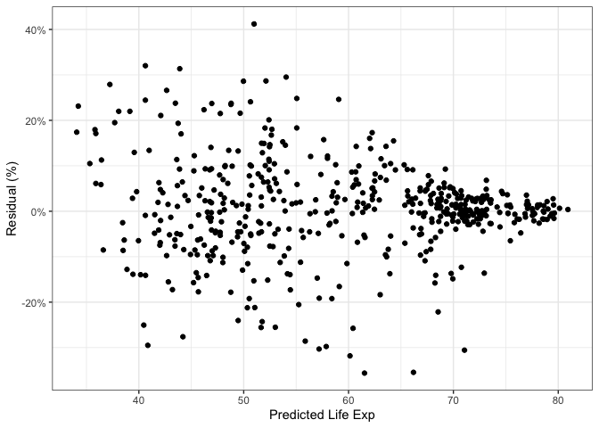<!-- -->
