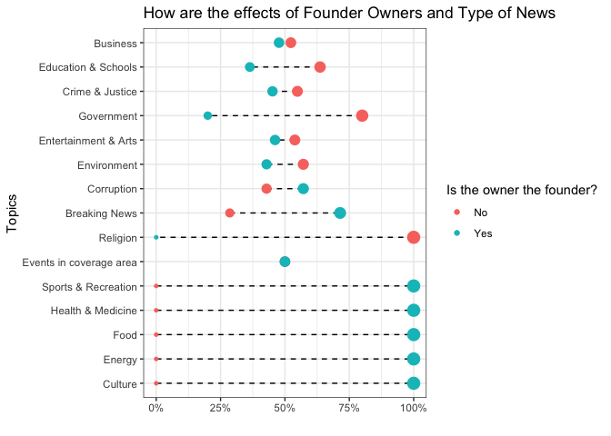
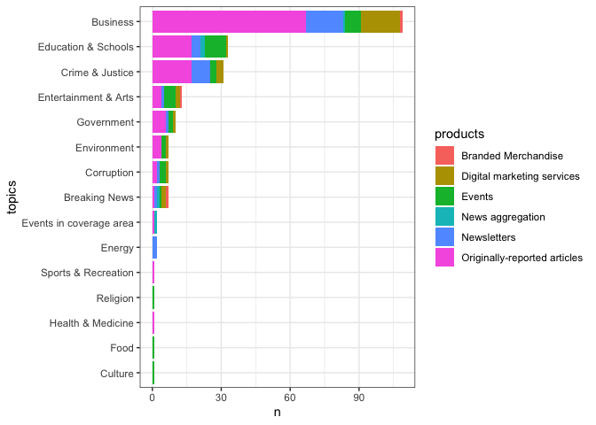

Digital Publications
================

## Digital Publication

``` r
library(tidyverse)
library(tidymodels)
library(tidytext)
library(scales)
library(tidylo)
library(hardhat)
library(themis)
library(textrecipes)
theme_set(theme_bw())
```

``` r
publications <- read_csv('https://raw.githubusercontent.com/rfordatascience/tidytuesday/master/data/2022/2022-04-05/news_orgs.csv')
```

### Exploratory Data Analysis

Feature Engineering and cleaning datasets

``` r
publications %>%
  group_by(owner,is_owner_founder) %>%
  count(sort = TRUE) %>%
  drop_na(.) %>%
  head()
```

    ## # A tibble: 6 × 3
    ## # Groups:   owner, is_owner_founder [6]
    ##   owner         is_owner_founder     n
    ##   <chr>         <chr>            <int>
    ## 1 Non Profit    No                   9
    ## 2 Stephen Witt  Yes                  4
    ## 3 Non Profit    Yes                  2
    ## 4 Nonprofit     No                   2
    ## 5 Thomas Palmer Yes                  2
    ## 6 Adam Gaffin   Yes                  1

``` r
# Feature Engineering 
publications %>%
  mutate(owner = str_trim(owner),
         owner = str_replace(owner,'Nonprofit','Non Profit')) %>%
  separate(owner,c('First_Owner','Second_Owner'),sep = ',|;',fill = 'right',extra = 'merge') %>%
  count(First_Owner, sort = TRUE)%>%
  drop_na(.) %>%
  head()
```

    ## # A tibble: 6 × 2
    ##   First_Owner                      n
    ##   <chr>                        <int>
    ## 1 Non Profit                      15
    ## 2 Stephen Witt                     4
    ## 3 Thomas Palmer                    2
    ## 4 Adam Gaffin                      1
    ## 5 Albion-Holley Pennysaver Inc     1
    ## 6 Alec Meeker                      1

``` r
publications %>%
  separate(coverage_topics,c('topics','other_topics'),sep = ',',fill = 'right', extra = 'merge') %>%
  group_by(topics) %>%
  count(sort = TRUE) %>%
  head()
```

    ## # A tibble: 6 × 2
    ## # Groups:   topics [6]
    ##   topics                   n
    ##   <chr>                <int>
    ## 1 <NA>                   456
    ## 2 Business               126
    ## 3 Education & Schools     41
    ## 4 Crime & Justice         40
    ## 5 Breaking News           20
    ## 6 Entertainment & Arts    16

``` r
publications %>%
  separate(distribution,c('distribution','other_distribution'),sep = ',',fill = 'right', extra = 'merge') %>%
  group_by(distribution) %>%
  count(sort = TRUE)
```

    ## # A tibble: 10 × 2
    ## # Groups:   distribution [10]
    ##    distribution                                n
    ##    <chr>                                   <int>
    ##  1 <NA>                                      455
    ##  2 Website                                   117
    ##  3 Social media                               89
    ##  4 Email                                      47
    ##  5 Owned and operated mobile app(s)           12
    ##  6 Aggregation                                 9
    ##  7 Print                                       8
    ##  8 Radio                                       2
    ##  9 Events                                      1
    ## 10 Syndicated feed or content partnerships     1

``` r
publications %>%
  separate(products,c('products','other_products'),sep = ',',fill = 'right', extra = 'merge') %>%
  group_by(products) %>%
  count(sort = TRUE)
```

    ## # A tibble: 7 × 2
    ## # Groups:   products [7]
    ##   products                         n
    ##   <chr>                        <int>
    ## 1 <NA>                           456
    ## 2 Originally-reported articles   139
    ## 3 Newsletters                     53
    ## 4 Events                          42
    ## 5 Digital marketing services      36
    ## 6 News aggregation                 9
    ## 7 Branded Merchandise              6

``` r
publications %>%
  mutate(total_employees= case_when(
    total_employees=='0' ~'0-2',
    total_employees=='1' ~'0-2',
    total_employees=='2' ~'0-2',
    TRUE~total_employees
  )) %>%
  group_by(total_employees) %>%
  count(sort=TRUE)
```

    ## # A tibble: 7 × 2
    ## # Groups:   total_employees [7]
    ##   total_employees     n
    ##   <chr>           <int>
    ## 1 <NA>              444
    ## 2 0-2               191
    ## 3 3-5                54
    ## 4 6-10               19
    ## 5 21 or more         14
    ## 6 11-15              13
    ## 7 16-20               6

``` r
publications %>%
  mutate(country=str_replace(country,'U.S. Virgin Islands','United States')) %>%
  group_by(country) %>%
  count(sort=TRUE)
```

    ## # A tibble: 2 × 2
    ## # Groups:   country [2]
    ##   country           n
    ##   <chr>         <int>
    ## 1 United States   678
    ## 2 Canada           63

``` r
publications %>%
  separate(city,c('Principal_city','Other'),sep = ',',fill = 'right', extra = 'merge') %>%
  count(Principal_city, sort=TRUE) %>%
  head()
```

    ## # A tibble: 6 × 2
    ##   Principal_city     n
    ##   <chr>          <int>
    ## 1 <NA>              43
    ## 2 New York          17
    ## 3 Chicago           12
    ## 4 Seattle           11
    ## 5 Washington        11
    ## 6 Los Angeles       10

``` r
publications %>%
  mutate(owner = str_trim(owner),
         owner = str_replace(owner,'Nonprofit','Non Profit')) %>%
  separate(owner,c('First_Owner','Second_Owner'),sep = ',|;',fill = 'right',extra = 'merge')  %>%
  group_by(First_Owner) %>%
  count(sort = TRUE) %>%
  head()
```

    ## # A tibble: 6 × 2
    ## # Groups:   First_Owner [6]
    ##   First_Owner                      n
    ##   <chr>                        <int>
    ## 1 <NA>                           482
    ## 2 Non Profit                      15
    ## 3 Stephen Witt                     4
    ## 4 Thomas Palmer                    2
    ## 5 Adam Gaffin                      1
    ## 6 Albion-Holley Pennysaver Inc     1

``` r
publications<-publications %>%
  mutate(owner = str_trim(owner),
         owner = str_replace(owner,'Nonprofit','Non Profit')) %>%
  separate(owner,c('First_Owner','Second_Owner'),sep = ',|;',fill = 'right',extra = 'merge') %>%
  separate(coverage_topics,c('topics','other_topics'),sep = ',',fill = 'right', extra = 'merge') %>%
  separate(distribution,c('distribution','other_distribution'),sep = ',',fill = 'right', extra = 'merge') %>%
   mutate(total_employees= case_when(
    total_employees=='0' ~'0-2',
    total_employees=='1' ~'0-2',
    total_employees=='2' ~'0-2',
    TRUE~total_employees
  )) %>%
  separate(products,c('products','other_products'),sep = ',',fill = 'right', extra = 'merge') %>%
  mutate(country=str_replace(country,'U.S. Virgin Islands','United States')) %>%
  select(publication_name,country,First_Owner,is_owner_founder,year_founded,total_employees,products,distribution,topics,summary) %>%
  drop_na(.)
```

``` r
publications %>%
  group_by(topics,is_owner_founder) %>%
  count(sort = TRUE)%>%
  pivot_wider(names_from = is_owner_founder , values_from = n) %>%
  mutate(Yes=str_replace_na(Yes,0),
         No=str_replace_na(No,0),
         Yes=as.numeric(Yes),
         No=as.numeric(No),
         total=Yes+No,
         pct_yes=Yes/total,
         pct_no=No/total)%>%
  ungroup() %>%
  mutate(topics= fct_reorder(topics,No)) %>%
  ggplot(aes(topics,y=(pct_yes+pct_no)))+
  geom_segment(aes(x=topics,
                   xend=topics,
                   y=pct_no,
                   yend=pct_yes),
               linetype='dashed',
               show.legend = FALSE)+
   geom_point(aes(y = pct_no,
                  colour = 'No',
                  size=pct_no),
                  shape = 20,
                  fill = 'white',
                  stroke = 1)+
  geom_point(aes(y = pct_yes,
                  colour = 'Yes',
                  size=pct_yes), 
                  shape = 20,
                  fill = 'white',
                  stroke = 1)+
  guides(size=FALSE)+
  labs(color = 'Is the owner the founder?',
       y='',
       x='Topics',
       title = 'How are the effects of Founder Owners and Type of News')+
  scale_y_continuous(labels = percent)+
  coord_flip()
```

<!-- -->

``` r
publications %>%
  group_by(topics,country,year_founded) %>%
  count(sort=TRUE) %>%
  group_by(country,year_founded) %>%
  mutate(pct = n/sum(n))%>%
  mutate(topics = fct_reorder(topics,n,sum)) %>%
  ggplot(aes(year_founded,pct,fill=topics)) +
  geom_area()+
  scale_y_continuous(labels = percent) +
  facet_wrap(~country, scales = 'free_x')
```

<!-- -->

``` r
publications%>%
  group_by(topics,products) %>%
  count(sort=TRUE) %>%
  ungroup() %>%
  mutate(topics=fct_reorder(topics,n,sum)) %>%
  ggplot(aes(n,topics,fill=products))+
  geom_col()
```

<!-- -->

``` r
publications%>%
  group_by(topics,distribution,total_employees) %>%
  count(sort=TRUE)%>%
  ungroup() %>%
  #filter(n>1)%>%
  #filter(total_employees=='21 or more')%>%
  mutate(topics=reorder_within(topics,n,distribution)) %>%
  ggplot(aes(n,topics))+
  geom_point(aes(color=total_employees, size=n),alpha=0.4)+
  scale_y_reordered()+
  guides(size='none')+
  facet_wrap(~distribution, scales = 'free_y')
```

<!-- -->

``` r
publications %>%
  group_by(distribution) %>%
  count(sort=TRUE)%>%
  ungroup() %>%
  mutate(distribution=fct_reorder(distribution,n),
         intercept_med_std=median(n) ) %>%
  ggplot(aes(n,distribution, color=n>15))+
  geom_vline(xintercept = 15, linetype='dashed')+
  geom_point(aes(size=n), show.legend = FALSE)
```

<!-- -->

``` r
distribution_class <- publications %>%
    group_by(distribution) %>%
    count(sort=TRUE)%>%
    head(2) %>%
    select(distribution) %>%
    pull()
```

### Modelling

Modelling distribution

``` r
topics_log_odds <-
  publications %>%
  filter(distribution %in% c("Website","Social media", "Email"  )) %>%
  group_by(topics) %>%
  unnest_tokens(word, summary) %>%
  count(topics, word, sort = TRUE) %>%
  filter(!word %in% tm::stopwords(),
         !str_detect(word,'[0-9]'),
         !word %in% c('news','benito','sanm','it’s','daily')) %>%
  bind_log_odds(topics, word, n)

topics_log_odds %>%
  group_by(topics) %>%
  slice_max(log_odds_weighted, n = 10) %>%
  ungroup() %>%
  ggplot(aes(log_odds_weighted,
    reorder_within(word, log_odds_weighted,topics),
    fill = topics
  )) +
  scale_y_reordered()+
  geom_col(show.legend = FALSE) +
  facet_wrap(vars(topics), scales = "free") 
```

<!-- -->

``` r
distribution_log_odds <-
  publications %>%
  filter(distribution %in% c("Website","Social media" )) %>%
  group_by(distribution) %>%
  unnest_tokens(word, summary) %>%
  count(distribution, word, sort = TRUE) %>%
  filter(!word %in% tm::stopwords(),
         !str_detect(word,'[0-9]'),
         !word %in% c('news','benito','sanm','it’s','daily')) %>%
  bind_log_odds(distribution, word, n)

distribution_log_odds %>%
  group_by(distribution) %>%
  slice_max(log_odds_weighted, n = 10) %>%
  ungroup() %>%
  ggplot(aes(log_odds_weighted,
    reorder_within(word, log_odds_weighted,distribution),
    fill = distribution
  )) +
  scale_y_reordered()+
  geom_col(show.legend = FALSE) +
  facet_wrap(vars(distribution), scales = "free") 
```

<!-- -->

``` r
set.seed(1234)

topics_filters<-publications %>%
  group_by(topics) %>%
  count(sort = T) %>%
  filter(n>=8)
  

publication_data_model<-publications%>%
  filter(distribution %in% distribution_class,
         topics %in% topics_filters$topics)%>%
  ungroup() %>%
  select(distribution,summary,topics)

publications_split <- initial_split(publication_data_model,strata = distribution)

publication_train <- publications_split %>%
  training()
publication_test <- publications_split %>%
  testing()

set.seed(345)
distributions_folds <- vfold_cv(publication_train, strata = distribution,v = 20)
```

``` r
set.seed(1234)
library(textfeatures)
publications_rec <-
  recipe(distribution ~  . , data = publication_train) %>%
  step_textfeature(topics) %>%
  step_tokenize(summary) %>%
  step_stopwords(summary) %>%
  step_tokenfilter(summary, max_tokens =200) %>%
  step_tfidf(summary)%>%
  step_upsample(distribution)
  #step_downsample(distribution) 
  
multi_spec <-
  multinom_reg(penalty = tune(), mixture = 1) %>%
  set_mode("classification") %>%
  set_engine("glmnet")

publication_wf <- workflow(publications_rec, multi_spec)

publication_grid <- grid_regular(penalty(range = c(-25, 0)), levels = 90)

doParallel::registerDoParallel()
set.seed(2022)
publication_rs <-
  tune_grid(
    publication_wf,
    distributions_folds,
    grid = publication_grid)

autoplot(publication_rs)
```

<!-- -->

``` r
show_best(publication_rs)
```

    ## # A tibble: 5 × 7
    ##   penalty .metric .estimator  mean     n std_err .config              
    ##     <dbl> <chr>   <chr>      <dbl> <int>   <dbl> <chr>                
    ## 1 0.0206  roc_auc binary     0.603    20  0.0681 Preprocessor1_Model84
    ## 2 0.0394  roc_auc binary     0.6      20  0.0738 Preprocessor1_Model85
    ## 3 0.0108  roc_auc binary     0.588    20  0.0652 Preprocessor1_Model83
    ## 4 0.0752  roc_auc binary     0.573    20  0.0596 Preprocessor1_Model86
    ## 5 0.00566 roc_auc binary     0.571    20  0.0663 Preprocessor1_Model82

``` r
final_penalty <-publication_rs %>%
  select_by_one_std_err(metric = "roc_auc", desc(penalty))
```

``` r
distribution_final <-  publication_wf%>%
  finalize_workflow(final_penalty) %>%
  last_fit(publications_split)


collect_metrics(distribution_final)
```

    ## # A tibble: 2 × 4
    ##   .metric  .estimator .estimate .config             
    ##   <chr>    <chr>          <dbl> <chr>               
    ## 1 accuracy binary         0.667 Preprocessor1_Model1
    ## 2 roc_auc  binary         0.548 Preprocessor1_Model1

``` r
collect_predictions(distribution_final) %>%
  conf_mat(distribution, .pred_class) %>%
  autoplot()
```

<!-- -->
