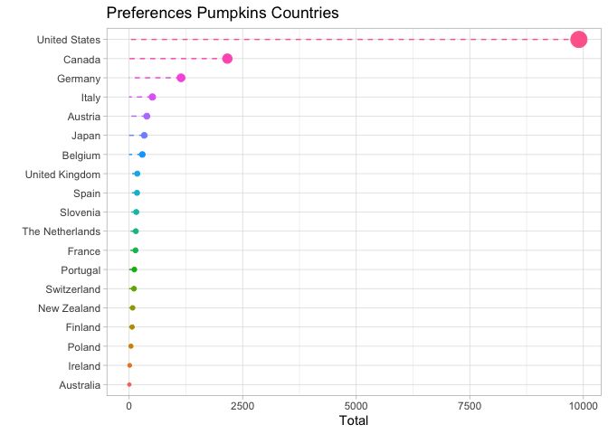
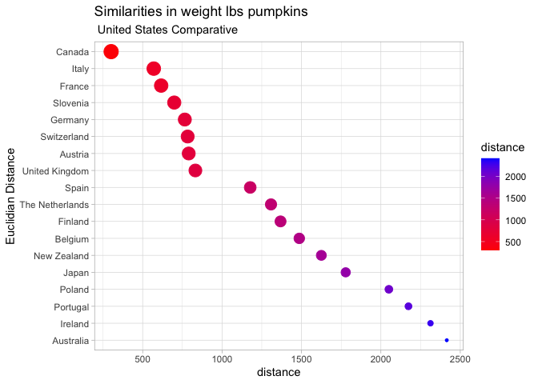
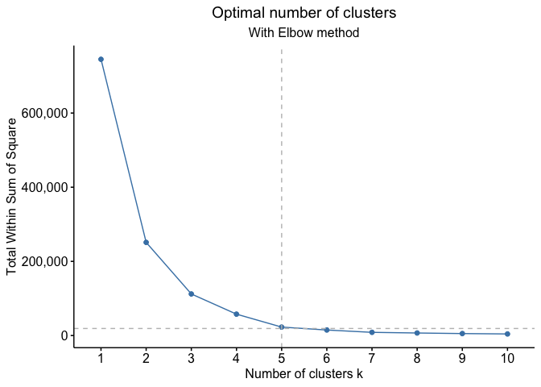
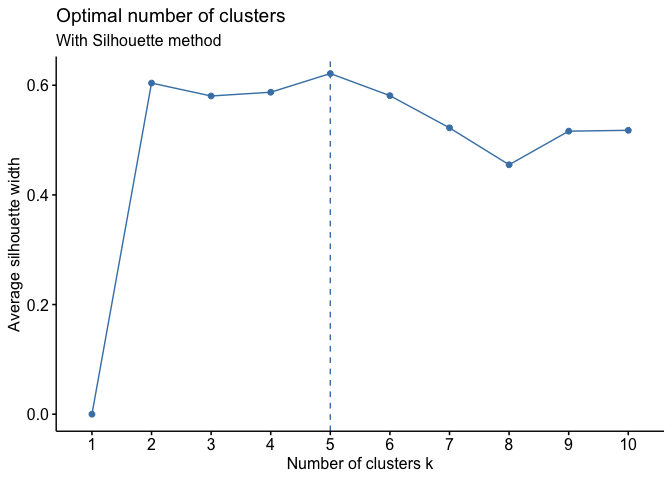
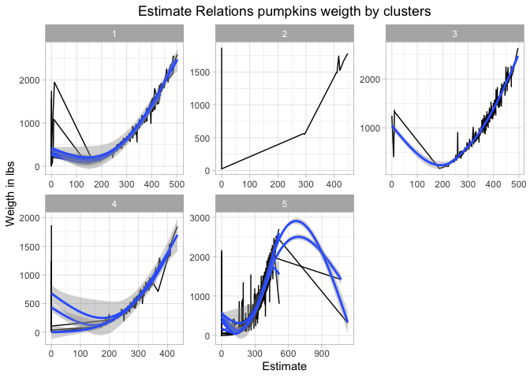
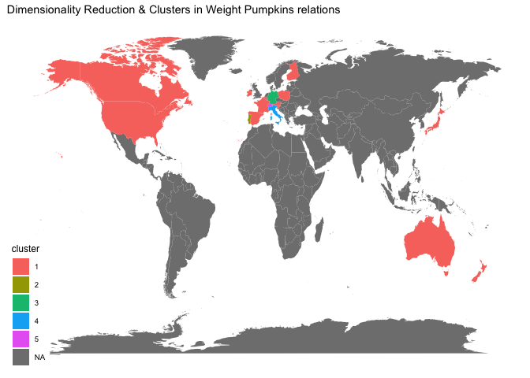

Pumpkins
================

``` r
library(tidyverse)
library(tidytext)
library(scales)
library(widyr)
library(factoextra)
library(NbClust)
library(maps)
library(fuzzyjoin)
theme_set(theme_light())
pumpkins <- readr::read_csv('https://raw.githubusercontent.com/rfordatascience/tidytuesday/master/data/2021/2021-10-19/pumpkins.csv')
```

## Exploratory Data Analysis

``` r
countries <- pumpkins %>%
    group_by(country) %>%
    count(sort = T) %>%
    ungroup() %>%
    filter(n>=5) %>%
    select(country)%>%
    pull()


pumpkins<-pumpkins %>%
  separate(id,c('year','type')) %>%
  mutate(across(c(year, weight_lbs, ott, place), parse_number)) %>%
  filter(type == "P",
         country %in% c(countries)) %>%
  select(weight_lbs, year, place, ott, gpc_site, country)

pumpkins %>%
  group_by(country) %>%
  count(sort = T) %>%
  ungroup() %>%
  mutate(country = fct_reorder(country,n)) %>%
  ggplot(aes(n,country,color=country))+
  geom_errorbarh(aes(xmin=0,xmax=n),height=0,show.legend = F, linetype='dashed')+
  geom_point(aes(size=n),show.legend = FALSE)+
  labs(title = 'Preferences Pumpkins Countries',
       x= 'Total',
       y= '')
```

<!-- -->

``` r
pumpkins %>%
  group_by(country,year) %>%
  summarize(weight_lbs = mean(weight_lbs)) %>%
  ungroup() %>%
  pairwise_dist(country,year,weight_lbs,upper=TRUE) %>%
  filter(item2=='United States') %>%
  arrange(desc(distance)) %>%
  mutate(item1=fct_reorder(item1,-distance)) %>%
  ggplot(aes(distance,item1,color=distance))+
  geom_point(aes(size=-distance))+
  scale_color_gradient(low = 'red',high = 'blue')+
  labs(title = 'Similarities in weight lbs pumpkins',
       subtitle = ' United States Comparative',
       y='Euclidian Distance')+
  guides(size='none')
```

<!-- -->

## Build a Model (Dimensionality reduction)

### Find the optimal numbers of clusters

The most popular technique is : Elbow Method !!!

``` r
pumpkins %>%
  group_by(country) %>%
  summarize(weight_lbs = mean(weight_lbs))%>%
  select(weight_lbs) %>%
  fviz_nbclust(kmeans, method = "wss")+
  geom_vline(xintercept = 5, linetype = 2,col='gray')+
  geom_hline(yintercept = 19000,linetype = 2,col='gray')+
  labs(subtitle = "With Elbow method")+
  scale_y_continuous(labels = comma)+
  theme(plot.title = element_text(hjust = .5),
        plot.subtitle = element_text(hjust = .5))
```

<!-- -->

And validate with

``` r
pumpkins %>%
  group_by(country) %>%
  summarize(weight_lbs = mean(weight_lbs))%>%
  ungroup() %>%
  select(weight_lbs) %>%
fviz_nbclust( kmeans, method = "silhouette")+
  labs(subtitle = "With Silhouette method")
```

<!-- --> The optimal
K is 5

## Evaluations

``` r
clusters<-pumpkins %>%
  group_by(country,year) %>%
  summarize(weight_lbs = mean(weight_lbs)) %>%
  widely_kmeans(country,year,weight_lbs,k = 5)

pumpkins %>%
  inner_join(clusters, by = 'country')%>%
  ggplot(aes(ott,weight_lbs,group=country))+
  geom_line()+
  geom_smooth()+
  facet_wrap(~cluster, scales = 'free')+
  labs(y = 'Weigth in lbs',
       x = 'Estimate',
       title = 'Estimate Relations pumpkins weigth by clusters')+
  theme(plot.title = element_text(hjust = .5))
```

<!-- -->

``` r
maps_clustes<-pumpkins %>%
  group_by(country) %>%
  summarize(weight_lbs = mean(weight_lbs),
            ott = mean(ott)) %>%
  widely_svd(country,ott,weight_lbs,nv = 15) %>%
  widely_kmeans(country,dimension,value,k = 5) %>%
  inner_join(iso3166, by = c('country'='ISOname'))

map_data('world')%>%
  regex_left_join(maps_clustes, by = c(region='mapname'))%>%
  ggplot(aes(long,lat,group=group,fill=cluster))+
  geom_polygon()+
  labs(title = 'Dimensionality Reduction & Clusters in Weight Pumpkins relations')+
  ggthemes::theme_map()
```

<!-- -->
